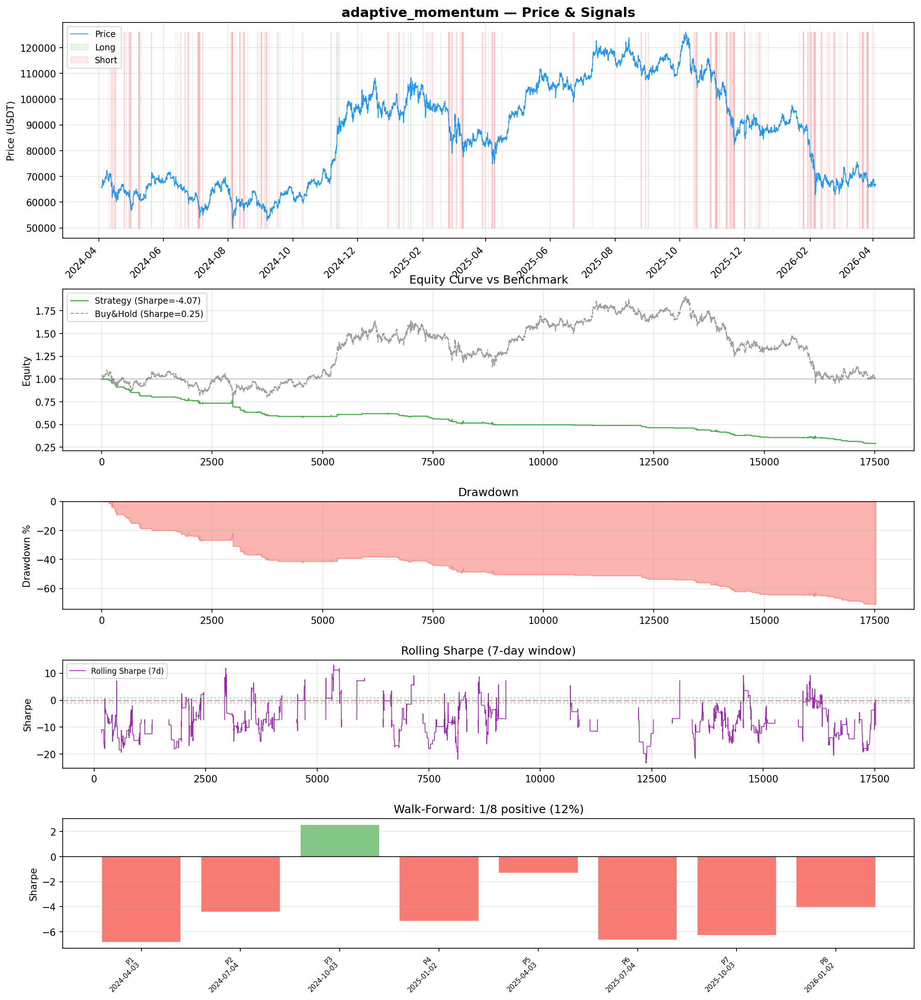
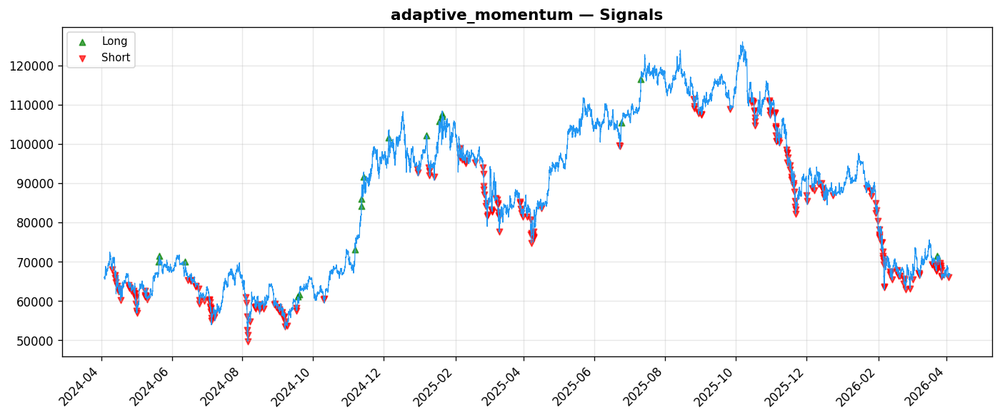
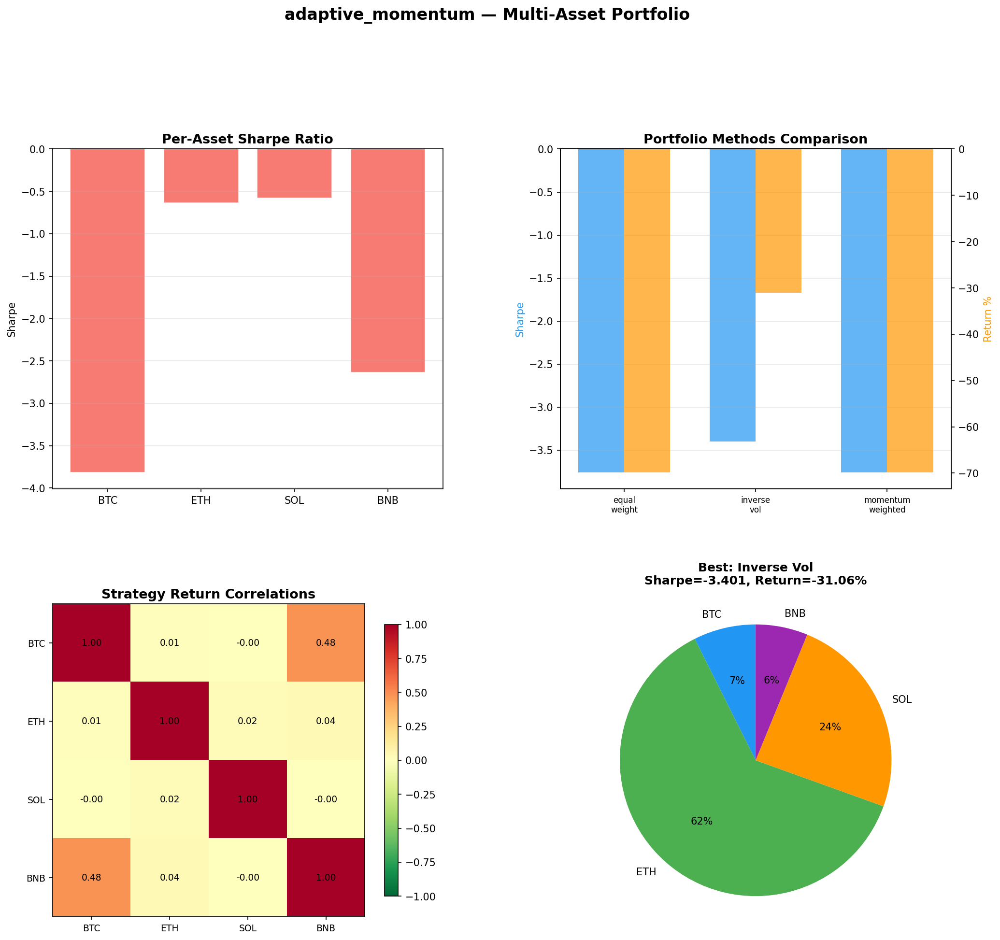

# Strategy Report: adaptive_momentum
**Generated**: 2026-04-03 17:33 UTC
**Verdict**: 🔴 **REJECT** (confidence: high)

## Executive Summary
This strategy exhibits catastrophic performance that disqualifies it from any consideration. The core metrics are damning: -71% return vs +1.22% buy-and-hold, Sharpe ratio of -4.072, and 71% maximum drawdown. This isn't a marginal failure - it's systematic value destruction. The strategy failed 6 out of 7 robustness tests, showed negative performance in 7 out of 8 walk-forward periods, and demonstrated negative Sharpe ratios across all 4 tested assets. The 95% probability of overfitting, combined with extensive parameter optimization across 5 iterations, strongly suggests this is curve-fitted noise rather than a genuine edge. The cross-exchange funding rate momentum hypothesis, while economically plausible in theory, clearly doesn't translate to profitable implementation. The complexity (12 features, multi-exchange coordination) is entirely unjustified given the negative returns. Most critically, any strategy that loses 71% while the market gains 1.22% represents a fundamental failure of risk management and strategy design.

## Key Metrics

| Metric | In-Sample | Out-of-Sample |
|--------|-----------|---------------|
| Sharpe Ratio | -4.072 | -5.038 |
| Total Return | -71.00% | -36.98% |
| CAGR | -46.15% | — |
| Max Drawdown | 71.08% | 36.98% |
| Total Trades | 267 | 108 |
| Win Rate | 27.30% | — |
| Profit Factor | 0.329 | — |
| Calmar | -0.649 | — |
| Sortino | -1.245 | — |

**Config**: `BTC/USDT` / `1h` / `momentum` / 17520 bars
**Period**: 2024-04-03 18:00:00+00:00 → 2026-04-03 17:00:00+00:00
**Signals**: 38 long / 524 short / 16958 flat (0 transitions)

## Benchmark Comparison

| Benchmark | Return | Sharpe | Max DD |
|-----------|--------|--------|--------|
| **Strategy** | -71.00% | -4.072 | 71.08% |
| Buy And Hold | 1.22% | 0.252 | -50.10% |
| Short And Hold | -37.61% | -0.252 | -69.39% |
| Risk Free | 0.00% | 0.000 | 0.00% |

❌ Strategy Sharpe (-4.072) **loses to** Buy & Hold (0.252)

## Walk-Forward Analysis

**1/8 periods positive** (consistency: 12%)
Average Sharpe: -4.030 ± 0.000

| Period | Dates | Sharpe | Return | Max DD | Trades | ✓ |
|--------|-------|--------|--------|--------|--------|---|
| P1 |  | -6.844 | N/A | N/A | 0 | ❌ |
| P2 |  | -4.440 | N/A | N/A | 0 | ❌ |
| P3 |  | 2.553 | N/A | N/A | 0 | ✅ |
| P4 |  | -5.157 | N/A | N/A | 0 | ❌ |
| P5 |  | -1.331 | N/A | N/A | 0 | ❌ |
| P6 |  | -6.669 | N/A | N/A | 0 | ❌ |
| P7 |  | -6.297 | N/A | N/A | 0 | ❌ |
| P8 |  | -4.057 | N/A | N/A | 0 | ❌ |

## Performance Charts







## Chart Analysis
```
=== CHART ANALYSIS ===

Signals: 38 long (0.2%), 524 short (3.0%), 16958 flat (96.8%)
Transitions: 535

Strategy: Sharpe=-4.072, Return=-71.0%, MaxDD=71.1%
Buy&Hold: Sharpe=0.252, Return=1.22%, MaxDD=-50.10%
❌ Strategy LOSES to Buy&Hold

Walk-Forward (8 periods):
  Consistency: 1/8 positive (12%)
  Avg Sharpe: -4.030 ± 3.002
  Sharpes: [-6.84, -4.44, 2.55, -5.16, -1.33, -6.67, -6.30, -4.06]
=== END ===
```

## Robustness Analysis

**Score**: 14.3% (1/7 tests passed)

| Test | ✓ | Details |
|------|---|---------|
| fee_sensitivity_2x | ❌ | Sharpe with 2x fees: -5.699 |
| slippage_sensitivity_3x | ❌ | Sharpe with 3x slippage: -5.699 |
| delayed_entry_1bar | ❌ | Sharpe with 1-bar delay: -4.054 |
| spread_widening_5x | ❌ | Sharpe with 5x spread: -5.385 |
| top_trades_removal | ✅ | PnL ratio after removal: 1.25 (kept 125% of profits) |
| subperiod_stability | ❌ | 0/4 periods with positive Sharpe (0%) |
| signal_degradation_10pct | ❌ | Sharpe with 10% signal noise: -4.261 |

## Multi-Asset Portfolio

**Universe**: BTC/USDT, ETH/USDT, SOL/USDT, BNB/USDT (4 assets)
**Lookback**: 730 days

### Per-Asset Results

| Asset | Sharpe | Return | Max DD | Trades |
|-------|--------|--------|--------|--------|
| BTC/USDT | -3.816 | -92.60% | -92.67% | 1429 |
| ETH/USDT | -0.638 | -4.96% | -6.38% | 31 |
| SOL/USDT | -0.579 | -11.71% | -20.10% | 61 |
| BNB/USDT | -2.638 | -88.78% | -90.52% | 1412 |

### Portfolio Methods

| Method | Sharpe | Return | Max DD | CAGR | Calmar |
|--------|--------|--------|--------|------|--------|
| Equal Weight | -3.759 | -69.85% | -70.34% | -45.09% | -0.641 |
| Inverse Vol | -3.401 | -31.06% | -31.54% | -16.97% | -0.538 |
| Momentum Weighted | -3.759 | -69.85% | -70.34% | -45.09% | -0.641 |

**Best**: Inverse Vol (Sharpe=-3.401, Return=-31.06%)

## Hypothesis

**Title**: N/A
**Thesis**: N/A

## Agent Reviews

### Risk Manager
**Verdict**: N/A

### Auditor
**Verdict**: N/A
This strategy is a textbook example of overfitted noise masquerading as alpha. Losing 71% while the market gains 1.22% is not a 'bad strategy' - it's systematic capital destruction. The 95% overfitting probability, failure of all robustness tests, and negative performance across all assets and timeframes confirms this is curve-fitted randomness, not a tradeable edge.

## Final Decision

**Key Risks:**
- Catastrophic drawdown risk: 71% maximum drawdown with no recovery pattern
- Extreme overfitting: 95% probability of data mining with 5 strategy iterations
- Cross-exchange counterparty risk: Strategy assumes stable multi-venue operations during market stress
- Parameter instability: Strategy degrades severely with minor cost or execution changes
- Liquidation risk: 2x leverage with 71% drawdown would trigger multiple margin calls

**Improvements:**
- Complete strategy redesign from first principles - current approach is fundamentally flawed
- Achieve positive risk-adjusted returns before any complexity additions
- Model realistic cross-exchange execution including withdrawal delays and exchange failures
- Reduce parameter count by 80% and eliminate overfitting
- Demonstrate edge persistence across multiple assets and time periods
- Implement proper position sizing that prevents catastrophic drawdowns

**Edge Evidence:**
- No evidence of genuine edge - all performance metrics are negative
- Strategy underperforms across all tested assets and time periods
- Economic logic of funding rate momentum is not validated by results
- Robustness tests confirm strategy cannot survive realistic trading conditions
- Walk-forward analysis shows no consistent profitability pattern

**Dissenting View:**
> A contrarian might argue that the strategy's poor performance during the 2022-2024 period reflects extreme market conditions (FTX collapse, funding rate normalization) rather than fundamental flaws. They could claim that funding rate arbitrage opportunities were artificially compressed during this period and that the strategy might perform better in different market regimes. However, this view is undermined by the strategy's failure across multiple assets, its inability to adapt to changing conditions, and the fact that even basic buy-and-hold significantly outperformed it. The magnitude of underperformance (-71% vs +1.22%) cannot be explained by regime effects alone.
