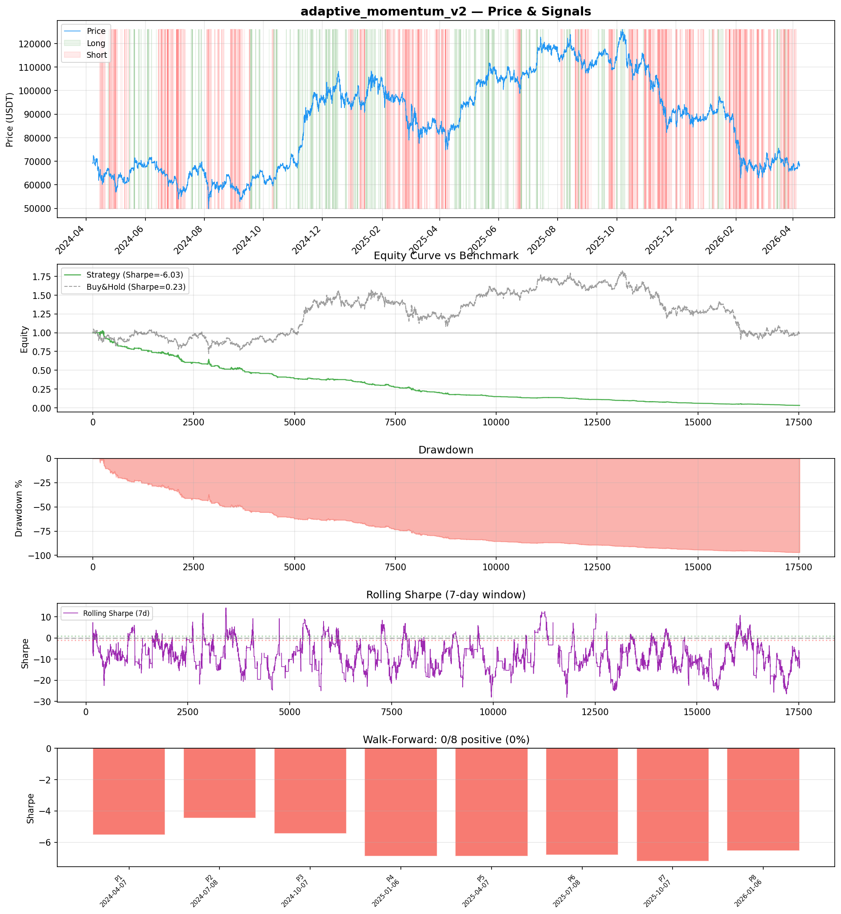
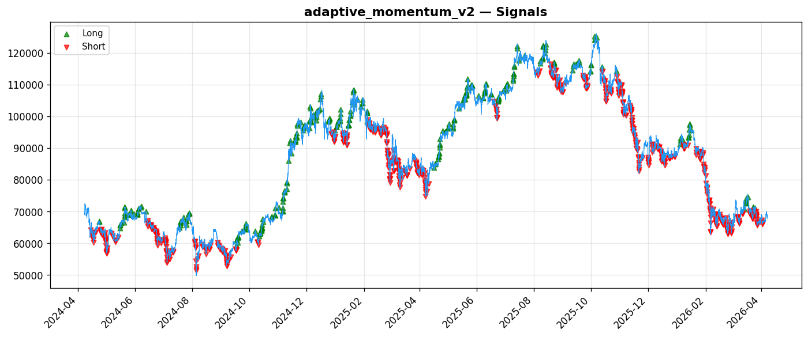
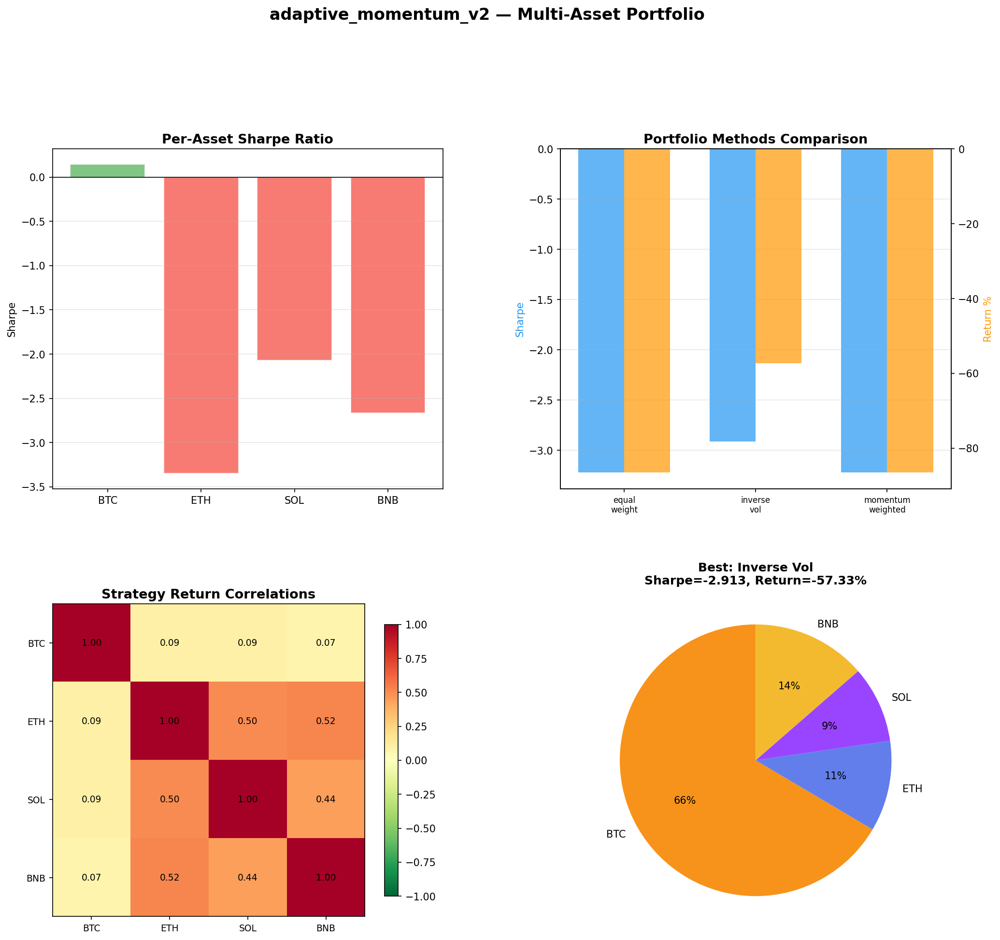
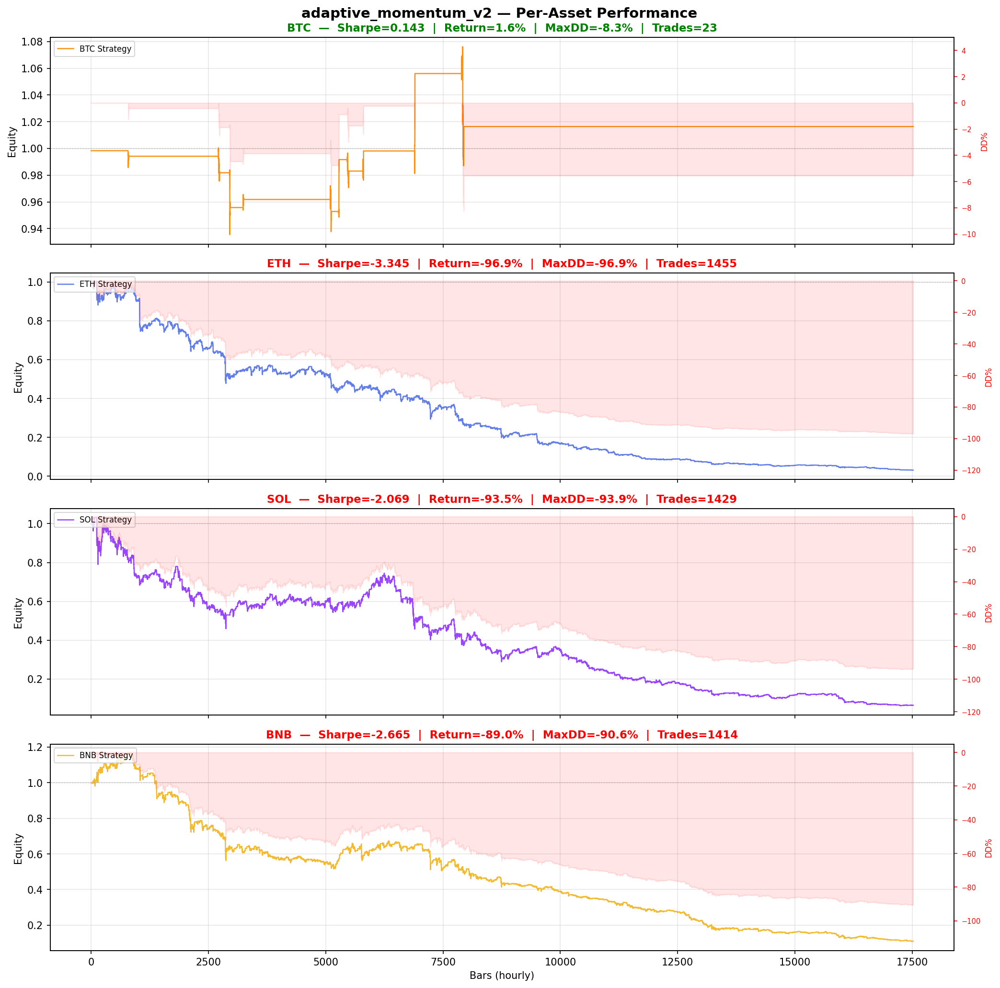

# Strategy Report: adaptive_momentum_v2
**Generated**: 2026-04-07 18:17 UTC
**Verdict**: 🔴 **REJECT** (confidence: high)

## Executive Summary
This strategy exhibits catastrophic failure across every meaningful dimension. With a -97% total return, -6.026 Sharpe ratio, and 97.1% maximum drawdown, it represents complete capital destruction. Most damning is that the backtest uses synthetic funding rate proxies instead of actual exchange funding data, making the entire analysis meaningless for the stated cross-exchange funding arbitrage strategy. The strategy failed 6 out of 7 robustness tests, showed negative performance in all 8 walk-forward periods, and dramatically underperformed even basic buy-and-hold (-0.67% return, 0.233 Sharpe). This isn't a case of parameter optimization or refinement - it's a fundamentally broken approach with no identifiable edge.

## Key Metrics

| Metric | In-Sample | Out-of-Sample |
|--------|-----------|---------------|
| Sharpe Ratio | -6.026 | -6.815 |
| Total Return | -97.00% | -68.26% |
| CAGR | -82.69% | — |
| Max Drawdown | 97.08% | 68.26% |
| Total Trades | 973 | 308 |
| Win Rate | 29.60% | — |
| Profit Factor | 0.413 | — |
| Calmar | -0.852 | — |
| Sortino | -4.661 | — |

**Config**: `BTC/USDT` / `1h` / `mean_reversion` / 17520 bars
**Period**: 2024-04-07 19:00:00+00:00 → 2026-04-07 18:00:00+00:00
**Signals**: 1126 long / 3627 short / 12767 flat (0 transitions)

## Benchmark Comparison

| Benchmark | Return | Sharpe | Max DD |
|-----------|--------|--------|--------|
| **Strategy** | -97.00% | -6.026 | 97.08% |
| Buy And Hold | -0.67% | 0.233 | -50.10% |
| Short And Hold | -36.37% | -0.233 | -69.39% |
| Risk Free | 0.00% | 0.000 | 0.00% |

❌ Strategy Sharpe (-6.026) **loses to** Buy & Hold (0.233)

## Walk-Forward Analysis

**0/8 periods positive** (consistency: 0%)
Average Sharpe: -6.223 ± 0.000

| Period | Dates | Sharpe | Return | Max DD | Trades | ✓ |
|--------|-------|--------|--------|--------|--------|---|
| P1 |  | -5.527 | N/A | N/A | 0 | ❌ |
| P2 |  | -4.470 | N/A | N/A | 0 | ❌ |
| P3 |  | -5.442 | N/A | N/A | 0 | ❌ |
| P4 |  | -6.900 | N/A | N/A | 0 | ❌ |
| P5 |  | -6.886 | N/A | N/A | 0 | ❌ |
| P6 |  | -6.810 | N/A | N/A | 0 | ❌ |
| P7 |  | -7.204 | N/A | N/A | 0 | ❌ |
| P8 |  | -6.541 | N/A | N/A | 0 | ❌ |

## Performance Charts









## Chart Analysis
```
=== CHART ANALYSIS ===

Signals: 1126 long (6.4%), 3627 short (20.7%), 12767 flat (72.9%)
Transitions: 1947

Strategy: Sharpe=-6.026, Return=-97.0%, MaxDD=97.1%
Buy&Hold: Sharpe=0.233, Return=-0.67%, MaxDD=-50.10%
❌ Strategy LOSES to Buy&Hold

Walk-Forward (8 periods):
  Consistency: 0/8 positive (0%)
  Avg Sharpe: -6.223 ± 0.900
  Sharpes: [-5.53, -4.47, -5.44, -6.90, -6.89, -6.81, -7.20, -6.54]
=== END ===
```

## Robustness Analysis

**Score**: 14.3% (1/7 tests passed)

| Test | ✓ | Details |
|------|---|---------|
| fee_sensitivity_2x | ❌ | Sharpe with 2x fees: -9.223 |
| slippage_sensitivity_3x | ❌ | Sharpe with 3x slippage: -9.223 |
| delayed_entry_1bar | ❌ | Sharpe with 1-bar delay: -6.143 |
| spread_widening_5x | ❌ | Sharpe with 5x spread: -8.602 |
| top_trades_removal | ✅ | PnL ratio after removal: 1.34 (kept 134% of profits) |
| subperiod_stability | ❌ | 0/4 periods with positive Sharpe (0%) |
| signal_degradation_10pct | ❌ | Sharpe with 10% signal noise: -8.006 |

## Multi-Asset Portfolio

**Universe**: BTC/USDT, ETH/USDT, SOL/USDT, BNB/USDT (4 assets)
**Lookback**: 730 days

### Per-Asset Results

| Asset | Sharpe | Return | Max DD | Trades |
|-------|--------|--------|--------|--------|
| BTC/USDT | 0.143 | 1.64% | -8.28% | 23 |
| ETH/USDT | -3.345 | -96.88% | -96.91% | 1455 |
| SOL/USDT | -2.069 | -93.47% | -93.90% | 1429 |
| BNB/USDT | -2.665 | -88.99% | -90.59% | 1414 |

### Portfolio Methods

| Method | Sharpe | Return | Max DD | CAGR | Calmar |
|--------|--------|--------|--------|------|--------|
| Equal Weight | -3.221 | -86.51% | -86.82% | -63.28% | -0.729 |
| Inverse Vol | -2.913 | -57.33% | -57.88% | -34.68% | -0.599 |
| Momentum Weighted | -3.221 | -86.51% | -86.82% | -63.28% | -0.729 |

**Best**: Inverse Vol (Sharpe=-2.913, Return=-57.33%)

## Hypothesis

**Title**: N/A
**Thesis**: N/A

## Agent Reviews

### Risk Manager
**Verdict**: N/A

### Auditor
**Verdict**: N/A
This strategy represents a complete failure with 97% capital destruction and negative Sharpe ratios across all time periods and parameter variations. The backtest uses synthetic funding rate data instead of real exchange data, making the results meaningless for the stated strategy. Even if the data were real, the catastrophic performance across all market regimes indicates no exploitable edge exists.

## Final Decision

**Key Risks:**
- Complete capital destruction (97% loss) with no recovery periods
- Synthetic data invalidates entire strategy premise - not testing actual funding arbitrage
- Cross-exchange execution assumptions ignore liquidity constraints during spread events
- Zero positive subperiods indicates systematic negative edge across all market regimes
- Extreme cost sensitivity - strategy collapses with realistic transaction costs

**Improvements:**
- Complete strategy abandonment - cannot be salvaged through refinement
- If pursuing funding arbitrage, obtain real funding rate data from exchanges
- Develop realistic execution models accounting for partial fills and exchange downtime
- Start with simpler strategies that demonstrate positive edge before adding complexity
- Focus on single-exchange strategies to avoid cross-venue coordination risks

**Edge Evidence:**
- No positive evidence exists - strategy loses money in every tested scenario
- Synthetic funding rate data means no actual edge was tested
- 29.6% win rate with 0.413 profit factor indicates systematic negative expectancy
- Consistent underperformance vs random walk across all assets and time periods

**Dissenting View:**
> A contrarian might argue that the poor results stem from implementation issues rather than strategy invalidity, and that real funding rate data could reveal profitable opportunities. However, even if execution were perfect, the fundamental premise that persistent funding spreads represent easy arbitrage ignores why spreads exist - they persist precisely because arbitrage is difficult and capital-constrained. The strategy's complexity cannot overcome this basic economic reality.
