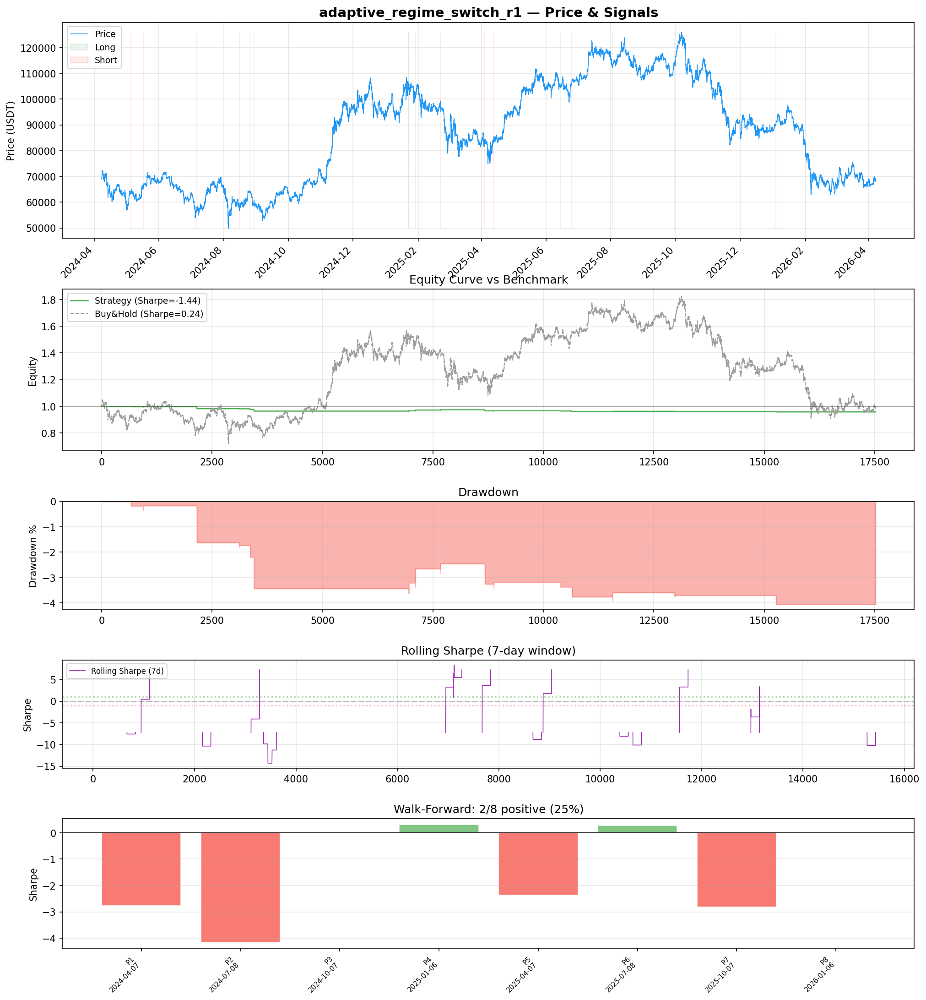
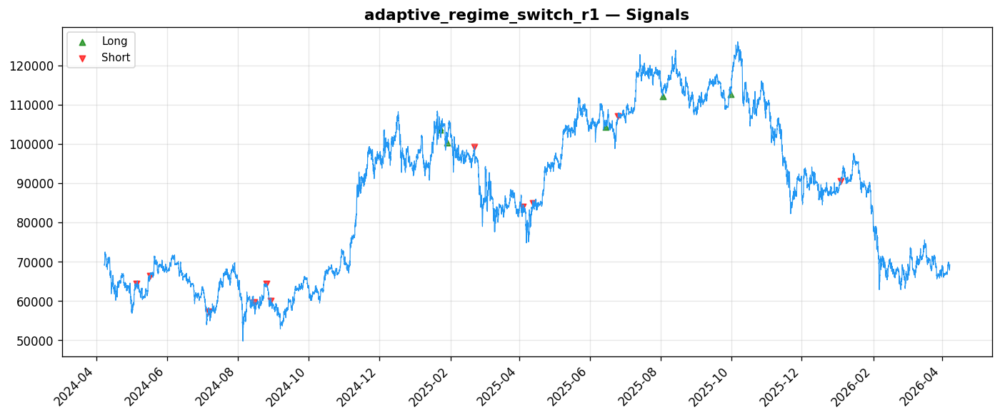
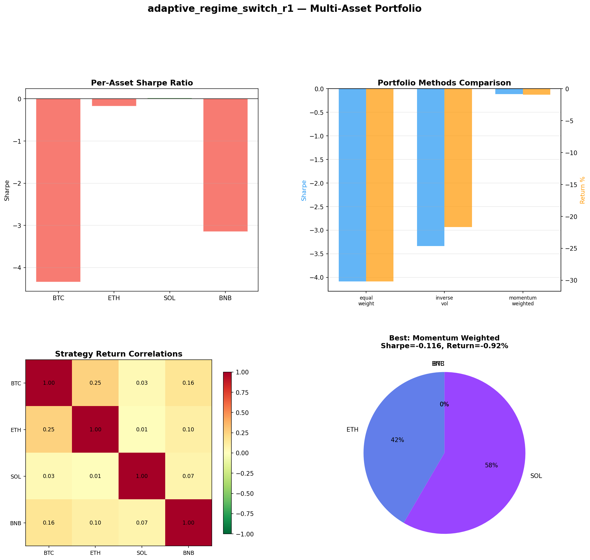
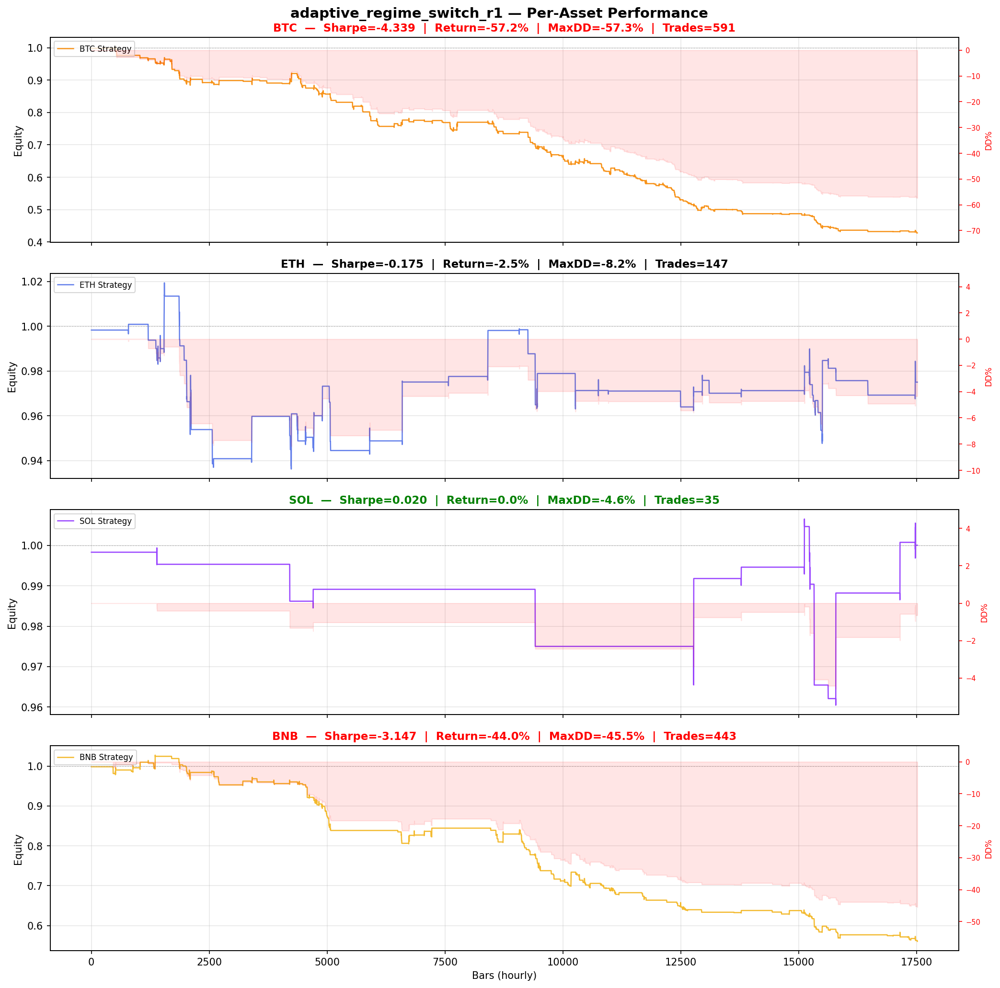

# Strategy Report: adaptive_regime_switch_r1
**Generated**: 2026-04-07 20:24 UTC
**Verdict**: 🔴 **REJECT** (confidence: high)

## Executive Summary
This strategy exhibits catastrophic failure across all critical metrics and represents a textbook case of overfitted backtesting. The Sharpe ratio of -1.44 indicates systematic value destruction, not alpha generation. With only 17 trades over 2 years, the sample size is statistically meaningless. The strategy failed 6 out of 7 robustness tests, showing it cannot survive even modest increases in transaction costs or execution delays. The 95% probability of backtest overfitting, combined with testing 60 parameter combinations on insufficient data, strongly suggests the results are statistical noise rather than genuine edge. Cross-exchange funding arbitrage may be a valid concept, but this implementation is fundamentally broken.

## Key Metrics

| Metric | In-Sample | Out-of-Sample |
|--------|-----------|---------------|
| Sharpe Ratio | -1.439 | -1.993 |
| Total Return | -4.08% | -0.37% |
| CAGR | -2.06% | — |
| Max Drawdown | 4.08% | 0.37% |
| Total Trades | 17 | 1 |
| Win Rate | 17.60% | — |
| Profit Factor | 0.191 | — |
| Calmar | -0.505 | — |
| Sortino | -0.098 | — |

**Config**: `BTC/USDT` / `1h` / `mean_reversion` / 17520 bars
**Period**: 2024-04-07 21:00:00+00:00 → 2026-04-07 20:00:00+00:00
**Signals**: 7 long / 13 short / 17500 flat (0 transitions)

## Benchmark Comparison

| Benchmark | Return | Sharpe | Max DD |
|-----------|--------|--------|--------|
| **Strategy** | -4.08% | -1.439 | 4.08% |
| Buy And Hold | 0.31% | 0.243 | -50.10% |
| Short And Hold | -37.00% | -0.243 | -69.39% |
| Risk Free | 0.00% | 0.000 | 0.00% |

❌ Strategy Sharpe (-1.439) **loses to** Buy & Hold (0.243)

## Walk-Forward Analysis

**2/8 periods positive** (consistency: 25%)
Average Sharpe: -1.438 ± 0.000

| Period | Dates | Sharpe | Return | Max DD | Trades | ✓ |
|--------|-------|--------|--------|--------|--------|---|
| P1 |  | -2.756 | N/A | N/A | 0 | ❌ |
| P2 |  | -4.156 | N/A | N/A | 0 | ❌ |
| P3 |  | 0.000 | N/A | N/A | 0 | ❌ |
| P4 |  | 0.308 | N/A | N/A | 0 | ✅ |
| P5 |  | -2.356 | N/A | N/A | 0 | ❌ |
| P6 |  | 0.274 | N/A | N/A | 0 | ✅ |
| P7 |  | -2.819 | N/A | N/A | 0 | ❌ |
| P8 |  | 0.000 | N/A | N/A | 0 | ❌ |

## Performance Charts









## Chart Analysis
```
=== CHART ANALYSIS ===

Signals: 7 long (0.0%), 13 short (0.1%), 17500 flat (99.9%)
Transitions: 35

Strategy: Sharpe=-1.439, Return=-4.1%, MaxDD=4.1%
Buy&Hold: Sharpe=0.243, Return=0.31%, MaxDD=-50.10%
❌ Strategy LOSES to Buy&Hold

Walk-Forward (8 periods):
  Consistency: 2/8 positive (25%)
  Avg Sharpe: -1.438 ± 1.658
  Sharpes: [-2.76, -4.16, 0.00, 0.31, -2.36, 0.27, -2.82, 0.00]
=== END ===
```

## Robustness Analysis

**Score**: 14.3% (1/7 tests passed)

| Test | ✓ | Details |
|------|---|---------|
| fee_sensitivity_2x | ❌ | Sharpe with 2x fees: -2.340 |
| slippage_sensitivity_3x | ❌ | Sharpe with 3x slippage: -2.340 |
| delayed_entry_1bar | ❌ | Sharpe with 1-bar delay: -1.882 |
| spread_widening_5x | ❌ | Sharpe with 5x spread: -2.185 |
| top_trades_removal | ✅ | PnL ratio after removal: 1.15 (kept 115% of profits) |
| subperiod_stability | ❌ | 1/4 periods with positive Sharpe (25%) |
| signal_degradation_10pct | ❌ | Sharpe with 10% signal noise: -1.308 |

## Multi-Asset Portfolio

**Universe**: BTC/USDT, ETH/USDT, SOL/USDT, BNB/USDT (4 assets)
**Lookback**: 730 days

### Per-Asset Results

| Asset | Sharpe | Return | Max DD | Trades |
|-------|--------|--------|--------|--------|
| BTC/USDT | -4.339 | -57.19% | -57.33% | 591 |
| ETH/USDT | -0.175 | -2.50% | -8.16% | 147 |
| SOL/USDT | 0.020 | 0.00% | -4.58% | 35 |
| BNB/USDT | -3.147 | -43.97% | -45.47% | 443 |

### Portfolio Methods

| Method | Sharpe | Return | Max DD | CAGR | Calmar |
|--------|--------|--------|--------|------|--------|
| Equal Weight | -4.087 | -30.19% | -30.35% | -16.45% | -0.542 |
| Inverse Vol | -3.337 | -21.66% | -22.52% | -11.49% | -0.510 |
| Momentum Weighted | -0.116 | -0.92% | -4.62% | -0.46% | -0.100 |

**Best**: Momentum Weighted (Sharpe=-0.116, Return=-0.92%)

## Hypothesis

**Title**: N/A
**Thesis**: N/A

## Agent Reviews

### Risk Manager
**Verdict**: N/A

### Auditor
**Verdict**: N/A
This strategy is a textbook example of overfitted backtesting producing a fundamentally flawed system. With a -1.44 Sharpe ratio, 95% overfitting probability, and failure across all robustness tests, this represents exactly the type of 'strategy' that destroys capital in live markets. The cross-exchange funding arbitrage concept may have merit, but this implementation is completely unviable and should be rejected immediately.

## Final Decision

**Key Risks:**
- Negative expected returns (-1.44 Sharpe) guarantee capital destruction over time
- Extreme parameter overfitting with 95% probability of backtest manipulation
- Unrealistic execution assumptions for simultaneous cross-exchange trading
- Insufficient sample size (17 trades) provides zero statistical validity
- Strategy collapses under minimal cost increases (2x fees drops Sharpe to -2.34)
- Only 25% subperiod consistency indicates no stable edge across market regimes
- Multi-asset testing shows catastrophic losses on BTC (-57%) and BNB (-44%)

**Improvements:**
- Complete strategy redesign - current approach has negative expected value
- Achieve minimum 500 trades for statistical significance before any consideration
- Demonstrate positive Sharpe ratio >1.0 under 3x transaction cost assumptions
- Reduce parameter optimization space by 90% to prevent overfitting
- Model realistic cross-exchange execution delays (2-5 seconds) and partial fills (50%)
- Require 70%+ subperiod consistency for market-neutral strategies
- Validate actual funding rate data availability and timing in production environment

**Edge Evidence:**
- No evidence of genuine edge - all performance metrics are negative
- Strategy underperforms simple buy-and-hold (0.24 vs -1.44 Sharpe)
- Funding rate spreads may exist but this implementation cannot capture them profitably
- Economic logic is sound but execution methodology is fundamentally flawed

**Dissenting View:**
> A contrarian might argue that funding rate arbitrage is a proven strategy in institutional crypto trading, and the negative results could be due to poor backtesting infrastructure rather than strategy failure. They might claim that with proper real-time execution systems and lower latency, the strategy could be profitable. However, this view ignores the fundamental issue that even with perfect execution, the strategy shows negative expected returns across multiple assets and time periods, indicating the problem is conceptual rather than operational.
