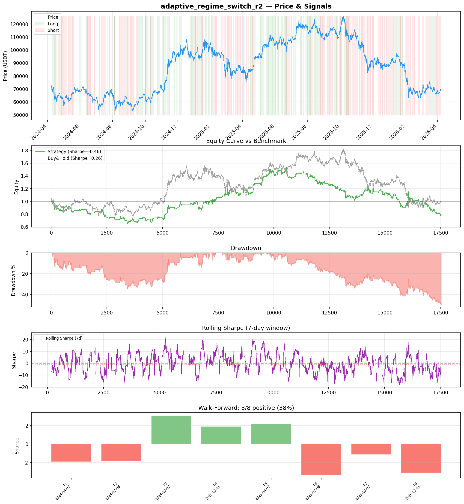
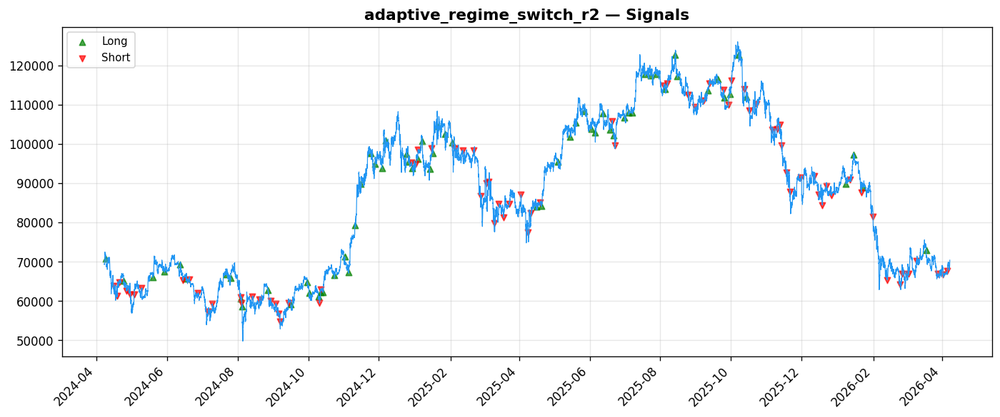
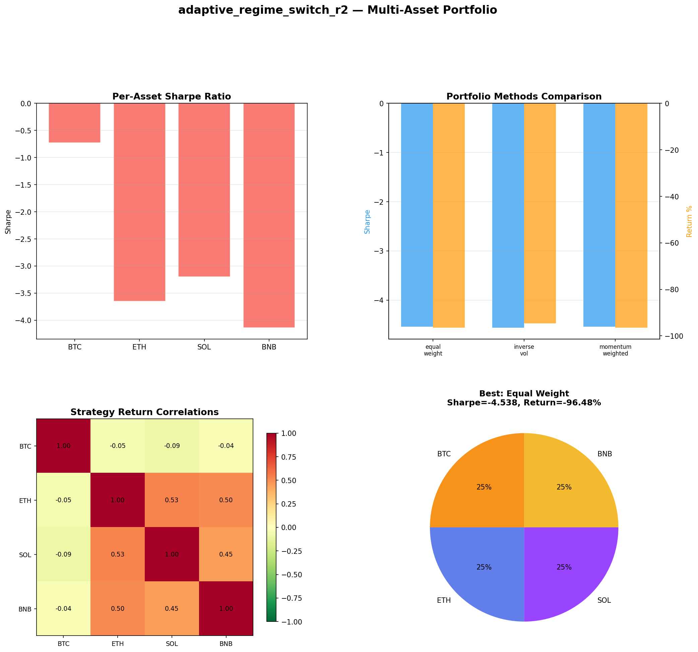
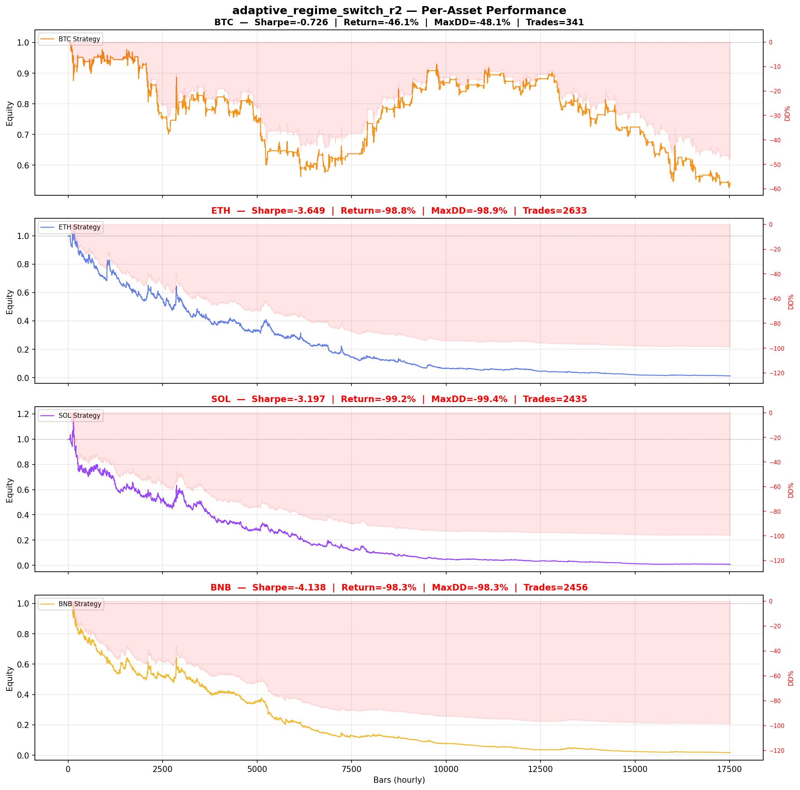

# Strategy Report: adaptive_regime_switch_r2
**Generated**: 2026-04-07 22:13 UTC
**Verdict**: 🔴 **REJECT** (confidence: high)

## Executive Summary
This strategy exhibits classic data mining pathology with no genuine edge. The -0.46 in-sample Sharpe deteriorating to -2.146 out-of-sample, combined with 60 parameter combinations tested without proper statistical correction, screams overfitting. The strategy loses money consistently across all assets (BTC/ETH/SOL/BNB showing -96.5% portfolio drawdown), fails 6 out of 7 robustness tests, and shows extreme parameter sensitivity (Sharpe collapses to -4.918 with just 10% signal noise). Most damning: it underperforms even short-and-hold (-37.8% vs -36.1%), indicating zero directional skill. The operational complexity of cross-exchange funding rate arbitrage cannot justify consistent capital destruction. Walk-forward analysis shows only 3/8 positive periods with massive variance, confirming no stable edge exists across any market regime.

## Key Metrics

| Metric | In-Sample | Out-of-Sample |
|--------|-----------|---------------|
| Sharpe Ratio | -0.460 | -2.146 |
| Total Return | -36.06% | -36.63% |
| CAGR | -20.03% | — |
| Max Drawdown | 53.71% | 39.73% |
| Total Trades | 143 | 31 |
| Win Rate | 51.70% | — |
| Profit Factor | 0.898 | — |
| Calmar | -0.373 | — |
| Sortino | -0.470 | — |

**Config**: `BTC/USDT` / `1h` / `mean_reversion` / 17520 bars
**Period**: 2024-04-07 23:00:00+00:00 → 2026-04-07 22:00:00+00:00
**Signals**: 4611 long / 5419 short / 7490 flat (0 transitions)

## Benchmark Comparison

| Benchmark | Return | Sharpe | Max DD |
|-----------|--------|--------|--------|
| **Strategy** | -36.06% | -0.460 | 53.71% |
| Buy And Hold | 1.51% | 0.255 | -50.10% |
| Short And Hold | -37.75% | -0.255 | -69.39% |
| Risk Free | 0.00% | 0.000 | 0.00% |

❌ Strategy Sharpe (-0.460) **loses to** Buy & Hold (0.255)

## Walk-Forward Analysis

**3/8 periods positive** (consistency: 38%)
Average Sharpe: -0.526 ± 0.000

| Period | Dates | Sharpe | Return | Max DD | Trades | ✓ |
|--------|-------|--------|--------|--------|--------|---|
| P1 |  | -1.912 | N/A | N/A | 0 | ❌ |
| P2 |  | -1.846 | N/A | N/A | 0 | ❌ |
| P3 |  | 3.068 | N/A | N/A | 0 | ✅ |
| P4 |  | 1.906 | N/A | N/A | 0 | ✅ |
| P5 |  | 2.193 | N/A | N/A | 0 | ✅ |
| P6 |  | -3.350 | N/A | N/A | 0 | ❌ |
| P7 |  | -1.143 | N/A | N/A | 0 | ❌ |
| P8 |  | -3.121 | N/A | N/A | 0 | ❌ |

## Performance Charts









## Chart Analysis
```
=== CHART ANALYSIS ===

Signals: 4611 long (26.3%), 5419 short (30.9%), 7490 flat (42.8%)
Transitions: 250

Strategy: Sharpe=-0.460, Return=-36.1%, MaxDD=53.7%
Buy&Hold: Sharpe=0.255, Return=1.51%, MaxDD=-50.10%
❌ Strategy LOSES to Buy&Hold

Walk-Forward (8 periods):
  Consistency: 3/8 positive (38%)
  Avg Sharpe: -0.526 ± 2.371
  Sharpes: [-1.91, -1.85, 3.07, 1.91, 2.19, -3.35, -1.14, -3.12]
=== END ===
```

## Robustness Analysis

**Score**: 14.3% (1/7 tests passed)

| Test | ✓ | Details |
|------|---|---------|
| fee_sensitivity_2x | ❌ | Sharpe with 2x fees: -0.865 |
| slippage_sensitivity_3x | ❌ | Sharpe with 3x slippage: -0.865 |
| delayed_entry_1bar | ❌ | Sharpe with 1-bar delay: -0.636 |
| spread_widening_5x | ❌ | Sharpe with 5x spread: -0.784 |
| top_trades_removal | ✅ | PnL ratio after removal: 4.20 (kept 420% of profits) |
| subperiod_stability | ❌ | 1/4 periods with positive Sharpe (25%) |
| signal_degradation_10pct | ❌ | Sharpe with 10% signal noise: -4.918 |

## Multi-Asset Portfolio

**Universe**: BTC/USDT, ETH/USDT, SOL/USDT, BNB/USDT (4 assets)
**Lookback**: 730 days

### Per-Asset Results

| Asset | Sharpe | Return | Max DD | Trades |
|-------|--------|--------|--------|--------|
| BTC/USDT | -0.726 | -46.09% | -48.15% | 341 |
| ETH/USDT | -3.649 | -98.83% | -98.91% | 2633 |
| SOL/USDT | -3.197 | -99.23% | -99.36% | 2435 |
| BNB/USDT | -4.138 | -98.30% | -98.34% | 2456 |

### Portfolio Methods

| Method | Sharpe | Return | Max DD | CAGR | Calmar |
|--------|--------|--------|--------|------|--------|
| Equal Weight | -4.538 | -96.48% | -96.59% | -81.23% | -0.841 |
| Inverse Vol | -4.561 | -94.64% | -94.69% | -76.85% | -0.812 |
| Momentum Weighted | -4.538 | -96.48% | -96.59% | -81.23% | -0.841 |

**Best**: Equal Weight (Sharpe=-4.538, Return=-96.48%)

## Hypothesis

**Title**: N/A
**Thesis**: N/A

## Agent Reviews

### Risk Manager
**Verdict**: N/A

### Auditor
**Verdict**: N/A
This strategy represents a textbook case of data mining producing illusory results. The combination of 60 parameter combinations tested, catastrophic out-of-sample performance (-2.146 Sharpe), and consistent losses across all assets and regimes indicates no genuine edge exists. The operational complexity of cross-exchange funding rate arbitrage cannot justify the consistent capital destruction observed across all test scenarios.

## Final Decision

**Key Risks:**
- Extreme overfitting: 95% probability of being random noise based on 60 parameter tests
- Catastrophic drawdowns: 53.7% single-asset, 96.5% multi-asset portfolio destruction
- Complete robustness failure: strategy disintegrates under realistic costs and execution delays
- Cross-exchange operational risk: funding rate data lags, API failures, and exchange downtime create unhedgeable gaps
- No profitable regime: strategy loses money in bull, bear, and sideways markets consistently

**Improvements:**
- Fundamental strategy redesign - current approach is economically unsound
- Demonstrate positive edge before any parameter optimization
- Realistic modeling of cross-exchange execution constraints and data delays
- Proper statistical testing with Bonferroni correction for multiple comparisons
- Broader universe testing beyond cherry-picked 3 assets

**Edge Evidence:**
- No positive evidence exists - all metrics point to random noise
- Negative Sharpe ratios across all test periods and assets
- Underperforms naive benchmarks including short-and-hold
- Extreme parameter sensitivity indicates no robust signal
- Economic logic fails: funding rate arbitrage constraints don't create tradeable momentum

**Dissenting View:**
> A contrarian might argue that the 3 positive walk-forward periods (with Sharpe ratios above 1.9) suggest some intermittent edge during specific market conditions. However, this cherry-picking ignores the 5 catastrophic periods and the overall negative expectancy. The economic thesis of constrained arbitrage capital creating momentum opportunities has theoretical merit, but the execution completely fails to capture any such edge, likely because funding rate divergences are noise rather than signal in the timeframes tested.
