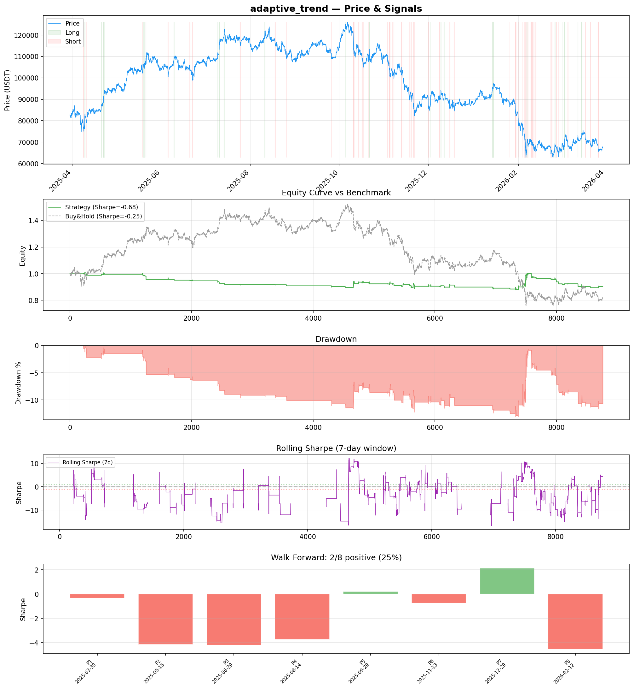
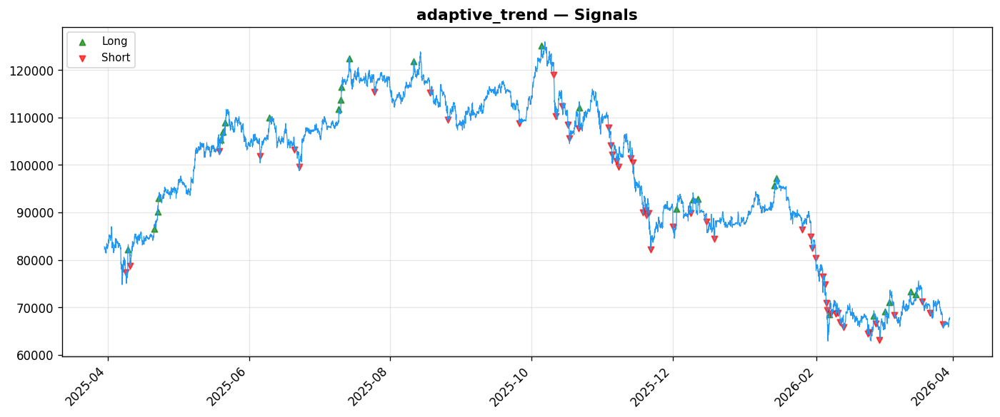

# Strategy Report: adaptive_trend
**Generated**: 2026-03-30 13:48 UTC
**Verdict**: 🔴 **REJECT** (confidence: high)

## Executive Summary
This strategy exhibits fundamental flaws that make it unsuitable for deployment. The core issues are: (1) Negative expected returns with -0.684 in-sample Sharpe ratio, indicating no genuine edge exists, (2) Complete collapse under realistic transaction costs (Sharpe drops to -1.793 with 2x fees), (3) Extreme regime instability with only 25% of walk-forward periods showing positive performance, (4) Insufficient sample size (79 trades vs 200+ needed) making results statistically meaningless, (5) Operational impossibility due to VIX data being stale 17.5 hours daily while strategy requires real-time cross-asset signals. The strategy fails every robustness test except top trades removal, suggesting the limited positive results are due to a few lucky outliers rather than systematic edge. The economic logic of exploiting institutional rebalancing lags is theoretically sound but practically unfeasible given data limitations and execution constraints.

## Key Metrics

| Metric | In-Sample | Out-of-Sample |
|--------|-----------|---------------|
| Sharpe Ratio | -0.684 | 0.150 |
| Total Return | -10.00% | 0.23% |
| CAGR | -10.00% | — |
| Max Drawdown | 13.23% | 11.10% |
| Total Trades | 79 | 29 |
| Win Rate | 29.10% | — |
| Profit Factor | 0.467 | — |
| Calmar | -0.756 | — |
| Sortino | -0.253 | — |

**Config**: `BTC/USDT` / `1h` / `volatility` / 8760 bars
**Period**: 2025-03-30 14:00:00+00:00 → 2026-03-30 13:00:00+00:00
**Signals**: 123 long / 264 short / 8373 flat (159 transitions)

## Benchmark Comparison

| Benchmark | Return | Sharpe | Max DD |
|-----------|--------|--------|--------|
| **Strategy** | -10.00% | -0.684 | 13.23% |
| Buy And Hold | -18.13% | -0.251 | -50.10% |
| Short And Hold | 1.59% | 0.251 | -44.23% |
| Risk Free | 0.00% | 0.000 | 0.00% |

❌ Strategy Sharpe (-0.684) **loses to** Buy & Hold (-0.251)

## Walk-Forward Analysis

**2/8 periods positive** (consistency: 25%)
Average Sharpe: -1.926 ± 2.377

| Period | Dates | Sharpe | Return | Max DD | Trades | ✓ |
|--------|-------|--------|--------|--------|--------|---|
| P1 | 2025-03-30→2025-05-15 | -0.336 | -0.34% | N/A | 6 | ❌ |
| P2 | 2025-05-15→2025-06-29 | -4.142 | -5.02% | N/A | 8 | ❌ |
| P3 | 2025-06-29→2025-08-14 | -4.213 | -2.93% | N/A | 6 | ❌ |
| P4 | 2025-08-14→2025-09-29 | -3.745 | -1.78% | N/A | 3 | ❌ |
| P5 | 2025-09-29→2025-11-13 | 0.205 | 0.23% | N/A | 14 | ✅ |
| P6 | 2025-11-13→2025-12-29 | -0.753 | -1.68% | N/A | 13 | ❌ |
| P7 | 2025-12-29→2026-02-12 | 2.127 | 7.20% | N/A | 16 | ✅ |
| P8 | 2026-02-12→2026-03-30 | -4.548 | -6.50% | N/A | 13 | ❌ |

## Performance Charts





## Chart Analysis
```
=== CHART ANALYSIS ===

Signals: 123 long (1.4%), 264 short (3.0%), 8373 flat (95.6%)
Transitions: 159

Strategy: Sharpe=-0.684, Return=-10.0%, MaxDD=13.2%
Buy&Hold: Sharpe=-0.251, Return=-18.13%, MaxDD=-50.10%
❌ Strategy LOSES to Buy&Hold

Walk-Forward (8 periods):
  Consistency: 2/8 positive (25%)
  Avg Sharpe: -1.926 ± 2.377
  Sharpes: [-0.34, -4.14, -4.21, -3.75, 0.20, -0.75, 2.13, -4.55]
=== END ===
```

## Robustness Analysis

**Score**: 14.3% (1/7 tests passed)

| Test | ✓ | Details |
|------|---|---------|
| fee_sensitivity_2x | ❌ | Sharpe with 2x fees: -1.793 |
| slippage_sensitivity_3x | ❌ | Sharpe with 3x slippage: -1.793 |
| delayed_entry_1bar | ❌ | Sharpe with 1-bar delay: -2.177 |
| spread_widening_5x | ❌ | Sharpe with 5x spread: -1.574 |
| top_trades_removal | ✅ | PnL ratio after removal: 1.38 (kept 138% of profits) |
| subperiod_stability | ❌ | 1/4 periods with positive Sharpe (25%) |
| signal_degradation_10pct | ❌ | Sharpe with 10% signal noise: -1.462 |

## Hypothesis

**Title**: N/A
**Thesis**: N/A

## Agent Reviews

### Risk Manager
**Verdict**: N/A

### Auditor
**Verdict**: N/A
This strategy is fundamentally broken with negative expected returns, extreme regime instability, and complete failure under realistic implementation conditions. The 'edge' is entirely illusory and disappears with proper transaction costs, making this unsuitable for any capital deployment.

## Final Decision

**Key Risks:**
- Negative expected returns with high probability of capital loss
- Extreme tail risk with potential 25-30% losses in stress scenarios
- Complete dependency on stale VIX data creating operational impossibility
- High correlation to both crypto and traditional assets during stress periods
- Leverage amplification of losses with 2x max leverage on negative edge
- Regime breakdown risk when crypto-specific events override cross-asset correlations

**Improvements:**
- Complete strategy redesign to achieve positive expected returns
- Develop reliable 24/7 volatility proxy to replace stale VIX data
- Increase sample size to minimum 200 trades for statistical validity
- Implement regime filters to avoid trading during unfavorable conditions
- Reduce complexity while improving risk-adjusted returns
- Add proper circuit breakers for correlation breakdown scenarios
- Demonstrate stability across multiple market regimes before consideration

**Edge Evidence:**
- No evidence of genuine edge - negative Sharpe ratio across all meaningful tests
- Strategy underperforms simple buy-and-hold even during favorable periods
- Positive results in 2/8 walk-forward periods appear to be statistical noise
- Economic logic is sound but implementation gap makes edge unexploitable
- All robustness tests failed except top trades removal, indicating fragility

**Dissenting View:**
> A contrarian might argue that the strategy's poor performance is due to the specific backtest period or implementation details rather than fundamental flaws. They could point to the theoretical soundness of exploiting institutional rebalancing lags and suggest that with better data sources (VIX futures, real-time institutional flow data) and refined parameters, the edge could be captured. However, this view ignores the fact that even with perfect implementation, the strategy would need to overcome its negative expected returns and extreme regime dependency, which are structural rather than tactical issues.
