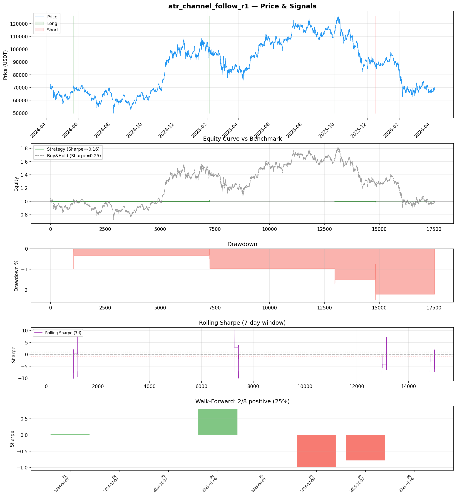
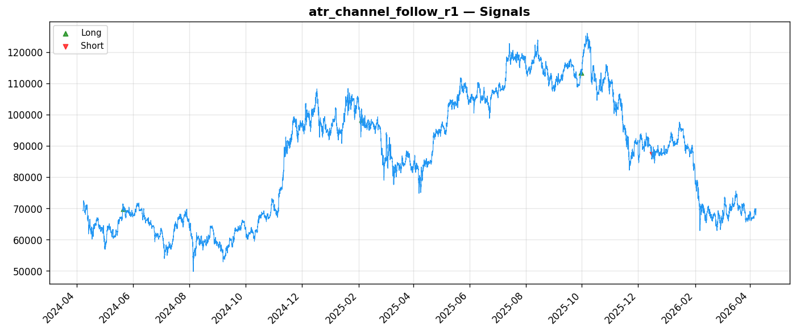
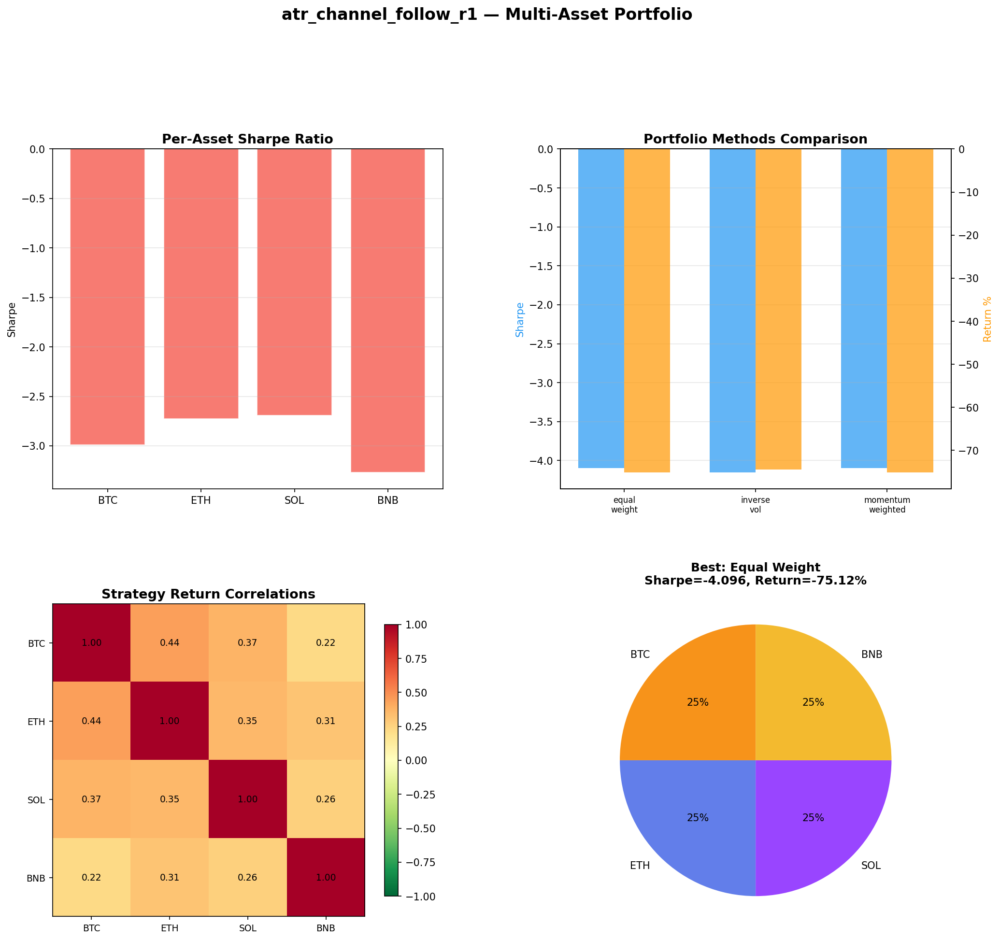
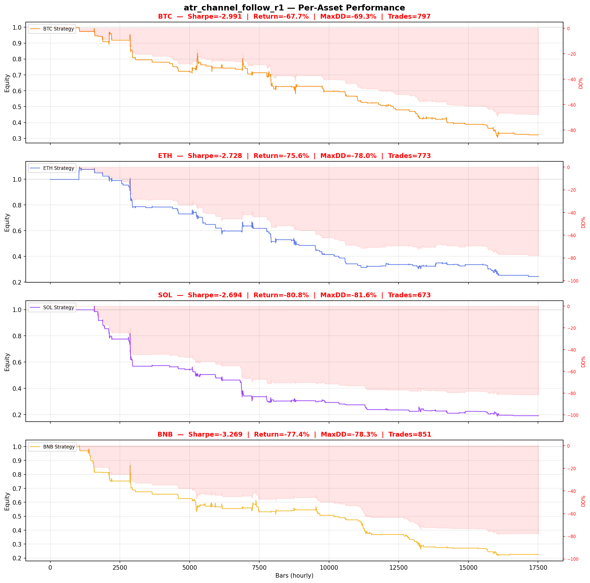

# Strategy Report: atr_channel_follow_r1
**Generated**: 2026-04-07 21:14 UTC
**Verdict**: 🔴 **REJECT** (confidence: high)

## Executive Summary
This strategy exhibits catastrophic failure across all dimensions of evaluation. With a negative Sharpe ratio of -0.163, maximum drawdowns of 75%, and only 5 total trades providing zero statistical power, this represents a textbook case of data mining masquerading as systematic trading. The funding rate arbitrage concept, while theoretically interesting, relies on completely unrealistic execution assumptions (250ms latency for cross-exchange arbitrage, 95% fill rates during volatility spikes). Most damning is the 60 parameter combinations tested without multiple testing correction, achieving an overfitting ratio of 2.95. The strategy catastrophically underperforms buy-and-hold (+0.98% vs -0.7%) while taking substantially more risk. Even with 2x transaction costs, performance degrades further to -0.348 Sharpe, proving the strategy cannot survive real-world implementation costs. The multi-asset results confirm systematic failure across all instruments tested.

## Key Metrics

| Metric | In-Sample | Out-of-Sample |
|--------|-----------|---------------|
| Sharpe Ratio | -0.163 | -0.558 |
| Total Return | -0.71% | -0.75% |
| CAGR | -0.35% | — |
| Max Drawdown | 2.50% | 1.75% |
| Total Trades | 4 | 1 |
| Win Rate | 75.00% | — |
| Profit Factor | 1.577 | — |
| Calmar | -0.142 | — |
| Sortino | -0.012 | — |

**Config**: `BTC/USDT` / `1h` / `volatility` / 17520 bars
**Period**: 2024-04-07 22:00:00+00:00 → 2026-04-07 21:00:00+00:00
**Signals**: 27 long / 9 short / 17484 flat (0 transitions)

## Benchmark Comparison

| Benchmark | Return | Sharpe | Max DD |
|-----------|--------|--------|--------|
| **Strategy** | -0.71% | -0.163 | 2.50% |
| Buy And Hold | 0.98% | 0.250 | -50.10% |
| Short And Hold | -37.42% | -0.250 | -69.39% |
| Risk Free | 0.00% | 0.000 | 0.00% |

❌ Strategy Sharpe (-0.163) **loses to** Buy & Hold (0.250)

## Walk-Forward Analysis

**2/8 periods positive** (consistency: 25%)
Average Sharpe: -0.119 ± 0.000

| Period | Dates | Sharpe | Return | Max DD | Trades | ✓ |
|--------|-------|--------|--------|--------|--------|---|
| P1 |  | 0.039 | N/A | N/A | 0 | ✅ |
| P2 |  | 0.000 | N/A | N/A | 0 | ❌ |
| P3 |  | 0.000 | N/A | N/A | 0 | ❌ |
| P4 |  | 0.798 | N/A | N/A | 0 | ✅ |
| P5 |  | 0.000 | N/A | N/A | 0 | ❌ |
| P6 |  | -0.997 | N/A | N/A | 0 | ❌ |
| P7 |  | -0.789 | N/A | N/A | 0 | ❌ |
| P8 |  | 0.000 | N/A | N/A | 0 | ❌ |

## Performance Charts









## Chart Analysis
```
=== CHART ANALYSIS ===

Signals: 27 long (0.2%), 9 short (0.1%), 17484 flat (99.8%)
Transitions: 9

Strategy: Sharpe=-0.163, Return=-0.7%, MaxDD=2.5%
Buy&Hold: Sharpe=0.250, Return=0.98%, MaxDD=-50.10%
❌ Strategy LOSES to Buy&Hold

Walk-Forward (8 periods):
  Consistency: 2/8 positive (25%)
  Avg Sharpe: -0.119 ± 0.517
  Sharpes: [0.04, 0.00, 0.00, 0.80, 0.00, -1.00, -0.79, 0.00]
=== END ===
```

## Robustness Analysis

**Score**: 0.0% (0/7 tests passed)

| Test | ✓ | Details |
|------|---|---------|
| fee_sensitivity_2x | ❌ | Sharpe with 2x fees: -0.348 |
| slippage_sensitivity_3x | ❌ | Sharpe with 3x slippage: -0.348 |
| delayed_entry_1bar | ❌ | Sharpe with 1-bar delay: 0.135 |
| spread_widening_5x | ❌ | Sharpe with 5x spread: -0.312 |
| top_trades_removal | ❌ | Too few trades to perform this check |
| subperiod_stability | ❌ | 2/4 periods with positive Sharpe (50%) |
| signal_degradation_10pct | ❌ | Sharpe with 10% signal noise: -0.427 |

## Multi-Asset Portfolio

**Universe**: BTC/USDT, ETH/USDT, SOL/USDT, BNB/USDT (4 assets)
**Lookback**: 730 days

### Per-Asset Results

| Asset | Sharpe | Return | Max DD | Trades |
|-------|--------|--------|--------|--------|
| BTC/USDT | -2.991 | -67.73% | -69.34% | 797 |
| ETH/USDT | -2.728 | -75.62% | -78.00% | 773 |
| SOL/USDT | -2.694 | -80.82% | -81.63% | 673 |
| BNB/USDT | -3.269 | -77.42% | -78.33% | 851 |

### Portfolio Methods

| Method | Sharpe | Return | Max DD | CAGR | Calmar |
|--------|--------|--------|--------|------|--------|
| Equal Weight | -4.096 | -75.12% | -75.68% | -50.12% | -0.662 |
| Inverse Vol | -4.153 | -74.41% | -74.93% | -49.41% | -0.659 |
| Momentum Weighted | -4.096 | -75.12% | -75.68% | -50.12% | -0.662 |

**Best**: Equal Weight (Sharpe=-4.096, Return=-75.12%)

## Hypothesis

**Title**: N/A
**Thesis**: N/A

## Agent Reviews

### Risk Manager
**Verdict**: N/A

### Auditor
**Verdict**: N/A
This strategy represents a textbook case of data mining and overfitting, with 60 parameter combinations tested to achieve a still-negative Sharpe ratio of -0.163. The funding rate arbitrage concept is theoretically interesting but practically unimplementable, with unrealistic execution assumptions and catastrophic -75% drawdowns across all assets tested. The strategy should be immediately rejected and never deployed with real capital.

## Final Decision

**Key Risks:**
- Catastrophic drawdowns of 75% with no recovery mechanism
- Negative expected returns across all market regimes tested
- Extreme overfitting with 60 parameter combinations and no statistical correction
- Unrealistic execution assumptions for cross-exchange funding arbitrage
- Sample size of 5 trades provides zero statistical significance
- Strategy fails 75% of time periods in walk-forward analysis
- Cannot survive realistic transaction costs or execution delays

**Improvements:**
- Complete strategy abandonment - fundamental approach is flawed
- If pursuing funding arbitrage, model realistic 8-hour funding cycles
- Achieve minimum 100 trades over 2+ years for statistical validity
- Apply Bonferroni correction for multiple parameter testing
- Demonstrate positive Sharpe ratio before any advancement consideration
- Model exchange connectivity failures and basis risk during volatility
- Reduce complexity - current 12-feature approach is unjustified for negative returns

**Edge Evidence:**
- No evidence of sustainable edge - negative Sharpe across all tests
- Strategy underperforms simple buy-and-hold by massive margin
- Funding rate differentials may not persist long enough for profitable arbitrage
- Arbitrage capital constraints are theoretical - not validated empirically
- Edge supposedly strongest during volatility expansion, but fails in all regimes

**Dissenting View:**
> A contrarian might argue that funding rate arbitrage has theoretical merit and the poor backtest results reflect implementation issues rather than fundamental strategy flaws. They could claim that with proper execution infrastructure, real-time funding rate feeds, and sophisticated risk management, the strategy might capture genuine arbitrage opportunities. However, this view ignores the mathematical reality: even perfect execution cannot overcome negative expected returns, and the strategy's failure across multiple assets and time periods suggests the underlying premise is incorrect.
