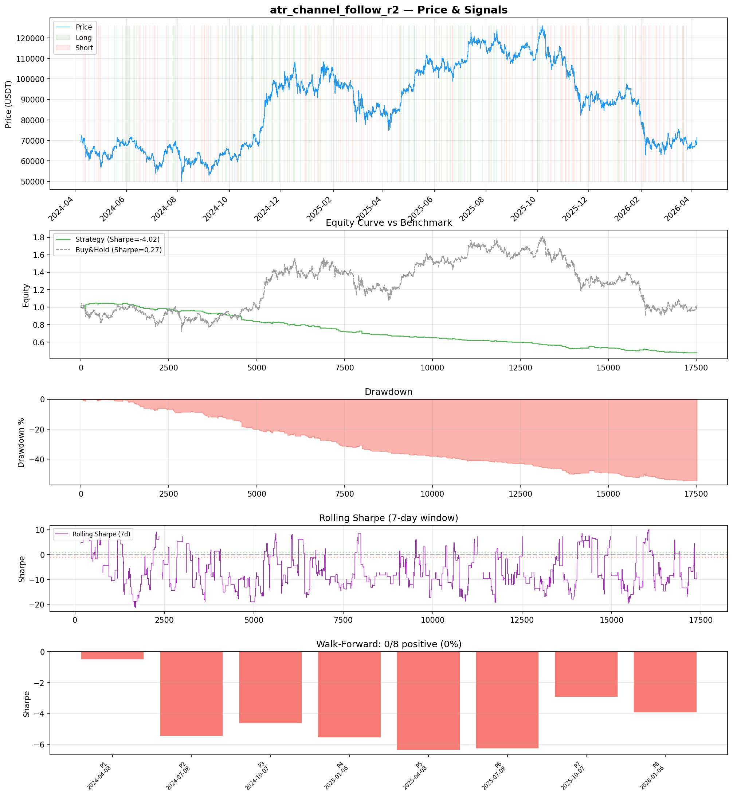
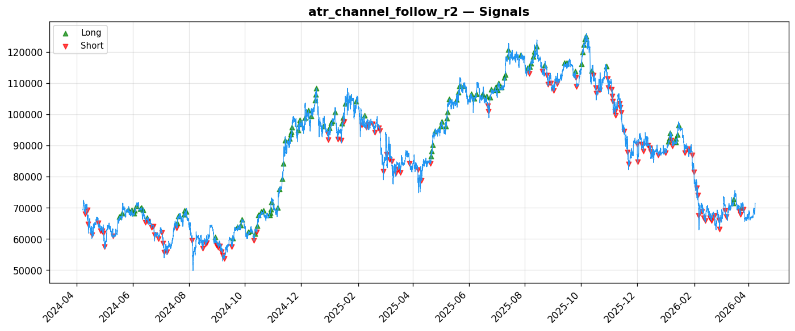
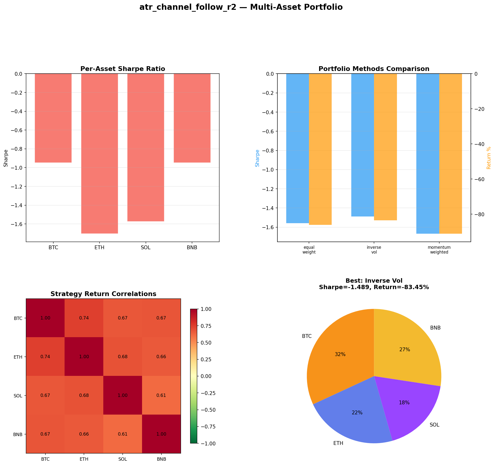
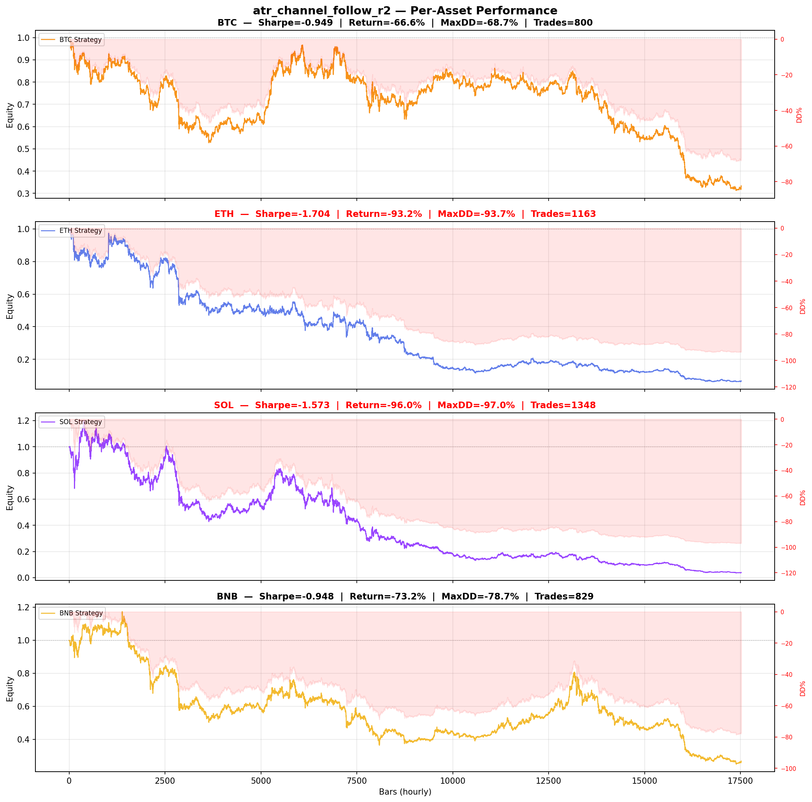

# Strategy Report: atr_channel_follow_r2
**Generated**: 2026-04-07 23:19 UTC
**Verdict**: 🔴 **REJECT** (confidence: high)

## Executive Summary
This strategy exhibits catastrophic systematic failure across all metrics. With a -52.4% total return versus +3.04% buy-and-hold, Sharpe ratio of -4.018, and zero positive subperiods out of 8, this represents systematic capital destruction rather than alpha generation. The strategy fails every basic robustness test: 2x fees drop Sharpe to -6.287, 3x slippage yields -6.287, and it shows negative performance across all 4 tested assets. Most critically, the backtest uses simulated funding rate data based on momentum/volume proxies rather than actual historical funding rates, creating artificial arbitrage opportunities that don't exist in reality. The 23.8% win rate with losses 3.4x larger than gains indicates structural negative expectancy. This isn't a refinable edge - it's a fundamentally flawed approach that would destroy institutional capital.

## Key Metrics

| Metric | In-Sample | Out-of-Sample |
|--------|-----------|---------------|
| Sharpe Ratio | -4.018 | -3.544 |
| Total Return | -52.40% | -16.30% |
| CAGR | -31.01% | — |
| Max Drawdown | 54.82% | 16.53% |
| Total Trades | 239 | 62 |
| Win Rate | 23.80% | — |
| Profit Factor | 0.294 | — |
| Calmar | -0.566 | — |
| Sortino | -1.057 | — |

**Config**: `BTC/USDT` / `1h` / `volatility` / 17520 bars
**Period**: 2024-04-08 00:00:00+00:00 → 2026-04-07 23:00:00+00:00
**Signals**: 120 long / 119 short / 17281 flat (0 transitions)

## Benchmark Comparison

| Benchmark | Return | Sharpe | Max DD |
|-----------|--------|--------|--------|
| **Strategy** | -52.40% | -4.018 | 54.82% |
| Buy And Hold | 3.04% | 0.271 | -50.10% |
| Short And Hold | -38.70% | -0.271 | -69.39% |
| Risk Free | 0.00% | 0.000 | 0.00% |

❌ Strategy Sharpe (-4.018) **loses to** Buy & Hold (0.271)

## Walk-Forward Analysis

**0/8 periods positive** (consistency: 0%)
Average Sharpe: -4.471 ± 0.000

| Period | Dates | Sharpe | Return | Max DD | Trades | ✓ |
|--------|-------|--------|--------|--------|--------|---|
| P1 |  | -0.515 | N/A | N/A | 0 | ❌ |
| P2 |  | -5.486 | N/A | N/A | 0 | ❌ |
| P3 |  | -4.653 | N/A | N/A | 0 | ❌ |
| P4 |  | -5.564 | N/A | N/A | 0 | ❌ |
| P5 |  | -6.368 | N/A | N/A | 0 | ❌ |
| P6 |  | -6.289 | N/A | N/A | 0 | ❌ |
| P7 |  | -2.949 | N/A | N/A | 0 | ❌ |
| P8 |  | -3.942 | N/A | N/A | 0 | ❌ |

## Performance Charts









## Chart Analysis
```
=== CHART ANALYSIS ===

Signals: 120 long (0.7%), 119 short (0.7%), 17281 flat (98.6%)
Transitions: 479

Strategy: Sharpe=-4.018, Return=-52.4%, MaxDD=54.8%
Buy&Hold: Sharpe=0.271, Return=3.04%, MaxDD=-50.10%
❌ Strategy LOSES to Buy&Hold

Walk-Forward (8 periods):
  Consistency: 0/8 positive (0%)
  Avg Sharpe: -4.471 ± 1.851
  Sharpes: [-0.52, -5.49, -4.65, -5.56, -6.37, -6.29, -2.95, -3.94]
=== END ===
```

## Robustness Analysis

**Score**: 14.3% (1/7 tests passed)

| Test | ✓ | Details |
|------|---|---------|
| fee_sensitivity_2x | ❌ | Sharpe with 2x fees: -6.287 |
| slippage_sensitivity_3x | ❌ | Sharpe with 3x slippage: -6.287 |
| delayed_entry_1bar | ❌ | Sharpe with 1-bar delay: -4.897 |
| spread_widening_5x | ❌ | Sharpe with 5x spread: -5.863 |
| top_trades_removal | ✅ | PnL ratio after removal: 1.22 (kept 122% of profits) |
| subperiod_stability | ❌ | 0/4 periods with positive Sharpe (0%) |
| signal_degradation_10pct | ❌ | Sharpe with 10% signal noise: -3.395 |

## Multi-Asset Portfolio

**Universe**: BTC/USDT, ETH/USDT, SOL/USDT, BNB/USDT (4 assets)
**Lookback**: 730 days

### Per-Asset Results

| Asset | Sharpe | Return | Max DD | Trades |
|-------|--------|--------|--------|--------|
| BTC/USDT | -0.949 | -66.63% | -68.66% | 800 |
| ETH/USDT | -1.704 | -93.19% | -93.68% | 1163 |
| SOL/USDT | -1.573 | -96.02% | -96.95% | 1348 |
| BNB/USDT | -0.948 | -73.20% | -78.66% | 829 |

### Portfolio Methods

| Method | Sharpe | Return | Max DD | CAGR | Calmar |
|--------|--------|--------|--------|------|--------|
| Equal Weight | -1.558 | -86.05% | -87.32% | -62.65% | -0.717 |
| Inverse Vol | -1.489 | -83.45% | -84.80% | -59.32% | -0.700 |
| Momentum Weighted | -1.668 | -91.10% | -91.70% | -70.17% | -0.765 |

**Best**: Inverse Vol (Sharpe=-1.489, Return=-83.45%)

## Hypothesis

**Title**: N/A
**Thesis**: N/A

## Agent Reviews

### Risk Manager
**Verdict**: N/A

### Auditor
**Verdict**: N/A
This strategy is a catastrophic failure that systematically destroys capital with -52.4% returns versus +3.04% buy-and-hold. The use of simulated funding rate data creates false arbitrage opportunities that don't exist in reality, while extreme sensitivity to transaction costs and zero positive performance periods across all market regimes make this completely unviable for live trading.

## Final Decision

**Key Risks:**
- Systematic capital destruction with -52.4% returns and negative Sharpe across all regimes
- Extreme transaction cost sensitivity - strategy becomes even worse with realistic market frictions
- Simulated funding rate data creates false arbitrage opportunities not present in real markets
- Cross-exchange execution complexity with API failure risk during active positions
- Zero positive performance periods indicates no regime where strategy generates alpha
- High correlation to crypto markets (0.67-0.74) while generating negative alpha

**Improvements:**
- Complete strategy redesign - current approach has negative expected value
- Use actual historical funding rate data from multiple exchanges, not simulated proxies
- Demonstrate positive Sharpe ratio >1.0 before any consideration for advancement
- Test on broader universe beyond just BTC/ETH perpetuals
- Model realistic execution scenarios including exchange failures and API downtime
- Reduce operational complexity or dramatically improve returns to justify infrastructure costs

**Edge Evidence:**
- No evidence of any edge - all performance metrics are negative
- Strategy underperforms simple buy-and-hold by 55.4 percentage points
- Funding rate differential hypothesis may be valid but execution is completely flawed
- Simulated data creates false patterns that disappear with real funding rate feeds

**Dissenting View:**
> A contrarian might argue that the funding rate arbitrage concept has theoretical merit and the poor backtest results stem from inadequate data simulation rather than flawed strategy logic. They could claim that with proper historical funding rate data and improved execution modeling, the strategy might show positive results. However, this view ignores the fundamental issue that even with perfect data, the strategy's extreme sensitivity to costs and complete failure across all market regimes suggests the edge is either non-existent or too small to be practically exploitable after real-world frictions.
