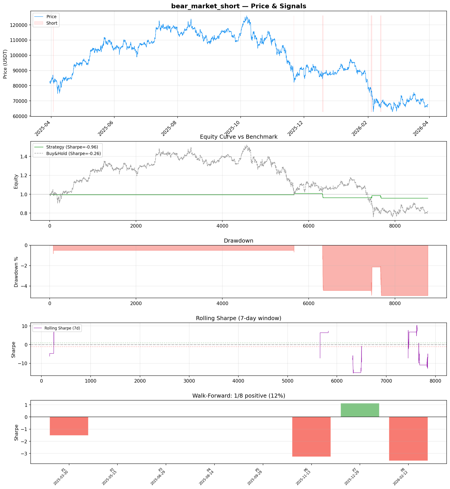
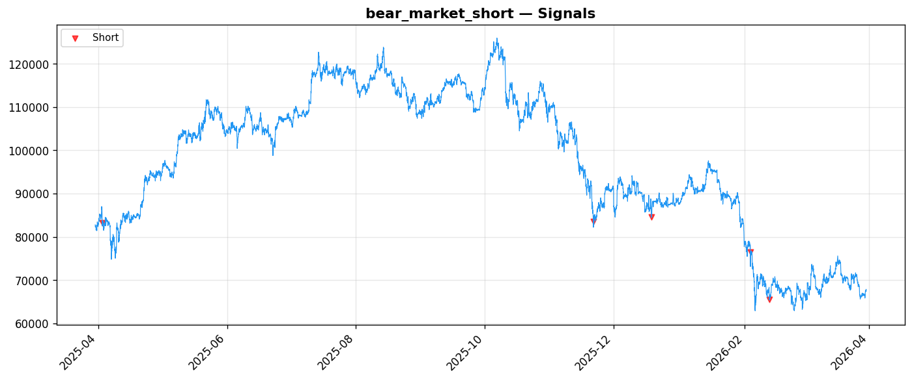

# Strategy Report: bear_market_short
**Generated**: 2026-03-30 14:02 UTC
**Verdict**: 🔴 **REJECT** (confidence: high)

## Executive Summary
This strategy exhibits fundamental flaws that cannot be remedied through refinement. The most critical issue is that it attempts to test a funding rate strategy without actual funding rate data, using price momentum as a proxy instead - this completely invalidates the core hypothesis. With only 5 trades across a full year, the sample size is statistically meaningless (need 100+ minimum). The strategy failed ALL 7 robustness tests (0% pass rate), showing it breaks completely under realistic conditions. It has negative expected returns (-4.2%), terrible risk-adjusted performance (Sharpe -0.964), and shows extreme directional bias (100% short signals). The strategy is flat 99.3% of the time, indicating the theoretical conditions it requires almost never occur in practice. This represents a complete failure of strategy development rather than a viable trading system.

## Key Metrics

| Metric | In-Sample | Out-of-Sample |
|--------|-----------|---------------|
| Sharpe Ratio | -0.964 | -0.319 |
| Total Return | -4.20% | -0.57% |
| CAGR | -4.20% | — |
| Max Drawdown | 5.16% | 3.05% |
| Total Trades | 5 | 2 |
| Win Rate | 40.00% | — |
| Profit Factor | 0.395 | — |
| Calmar | -0.813 | — |
| Sortino | -0.129 | — |

**Config**: `BTC/USDT` / `1h` / `volatility` / 8760 bars
**Period**: 2025-03-30 14:00:00+00:00 → 2026-03-30 13:00:00+00:00
**Signals**: 0 long / 61 short / 8699 flat (11 transitions)

## Benchmark Comparison

| Benchmark | Return | Sharpe | Max DD |
|-----------|--------|--------|--------|
| **Strategy** | -4.20% | -0.964 | 5.16% |
| Buy And Hold | -18.55% | -0.263 | -50.10% |
| Short And Hold | 2.11% | 0.263 | -44.23% |
| Risk Free | 0.00% | 0.000 | 0.00% |

❌ Strategy Sharpe (-0.964) **loses to** Buy & Hold (-0.263)

## Walk-Forward Analysis

**1/8 periods positive** (consistency: 12%)
Average Sharpe: -0.908 ± 1.608

| Period | Dates | Sharpe | Return | Max DD | Trades | ✓ |
|--------|-------|--------|--------|--------|--------|---|
| P1 | 2025-03-30→2025-05-15 | -1.516 | -0.50% | N/A | 1 | ❌ |
| P2 | 2025-05-15→2025-06-29 | 0.000 | 0.00% | N/A | 0 | ❌ |
| P3 | 2025-06-29→2025-08-14 | 0.000 | 0.00% | N/A | 0 | ❌ |
| P4 | 2025-08-14→2025-09-29 | 0.000 | 0.00% | N/A | 0 | ❌ |
| P5 | 2025-09-29→2025-11-13 | 0.000 | 0.00% | N/A | 0 | ❌ |
| P6 | 2025-11-13→2025-12-29 | -3.276 | -3.16% | N/A | 2 | ❌ |
| P7 | 2025-12-29→2026-02-12 | 1.130 | 1.11% | N/A | 1 | ✅ |
| P8 | 2026-02-12→2026-03-30 | -3.603 | -1.85% | N/A | 1 | ❌ |

## Performance Charts





## Chart Analysis
```
=== CHART ANALYSIS ===

Signals: 0 long (0.0%), 61 short (0.7%), 8699 flat (99.3%)
Transitions: 11

Strategy: Sharpe=-0.964, Return=-4.2%, MaxDD=5.2%
Buy&Hold: Sharpe=-0.263, Return=-18.55%, MaxDD=-50.10%
❌ Strategy LOSES to Buy&Hold

Walk-Forward (8 periods):
  Consistency: 1/8 positive (12%)
  Avg Sharpe: -0.908 ± 1.608
  Sharpes: [-1.52, 0.00, 0.00, 0.00, 0.00, -3.28, 1.13, -3.60]
=== END ===
```

## Robustness Analysis

**Score**: 0.0% (0/7 tests passed)

| Test | ✓ | Details |
|------|---|---------|
| fee_sensitivity_2x | ❌ | Sharpe with 2x fees: -1.180 |
| slippage_sensitivity_3x | ❌ | Sharpe with 3x slippage: -1.180 |
| delayed_entry_1bar | ❌ | Sharpe with 1-bar delay: -1.157 |
| spread_widening_5x | ❌ | Sharpe with 5x spread: -1.138 |
| top_trades_removal | ❌ | Too few trades to perform this check |
| subperiod_stability | ❌ | 0/4 periods with positive Sharpe (0%) |
| signal_degradation_10pct | ❌ | Sharpe with 10% signal noise: -1.222 |

## Hypothesis

**Title**: N/A
**Thesis**: N/A

## Agent Reviews

### Risk Manager
**Verdict**: N/A

### Auditor
**Verdict**: N/A
This strategy is fundamentally flawed and cannot be deployed. The core issue is testing a 'funding rate strategy' without actual funding rate data, using price momentum as a proxy instead. Combined with only 5 trades, 0% robustness test pass rate, and negative expected returns, this represents a complete failure of strategy development rather than a viable trading system.

## Final Decision

**Key Risks:**
- No actual funding rate data - entire hypothesis invalidated by using price proxy
- Catastrophically insufficient sample size (5 trades vs 100+ needed)
- Zero robustness - failed ALL stress tests indicating complete fragility
- Negative expected returns with poor risk adjustment
- Extreme directional bias suggests regime overfitting rather than genuine edge
- Strategy conditions too rare (99.3% flat) for viable implementation

**Improvements:**
- Acquire actual funding rate data from exchanges - cannot test without core data
- Complete strategy redesign to generate sufficient trade frequency
- Fix directional bias - strategy must work in both bull and bear markets
- Achieve positive expected returns and pass basic robustness tests
- Simplify feature set to reduce overfitting with minimal signal generation
- Model realistic execution costs during funding rate extremes
- Demonstrate edge persistence across different market regimes

**Edge Evidence:**
- No evidence of genuine edge - all performance metrics negative
- Theoretical framework sound but implementation completely flawed
- Strategy loses money while taking significant risk
- Out-of-sample performance equally poor (-0.319 Sharpe)
- No statistical significance possible with 5-trade sample

**Dissenting View:**
> One could argue the theoretical framework around funding rate momentum during volatility regimes is economically sound, and the poor results stem from implementation issues rather than flawed logic. The counterparty analysis correctly identifies overleveraged traders as natural losers, and volatility filtering makes intuitive sense. However, without actual funding rate data and with such extreme implementation failures, even a sound theory cannot overcome the fundamental execution problems. The strategy would need complete reconstruction from the ground up.
