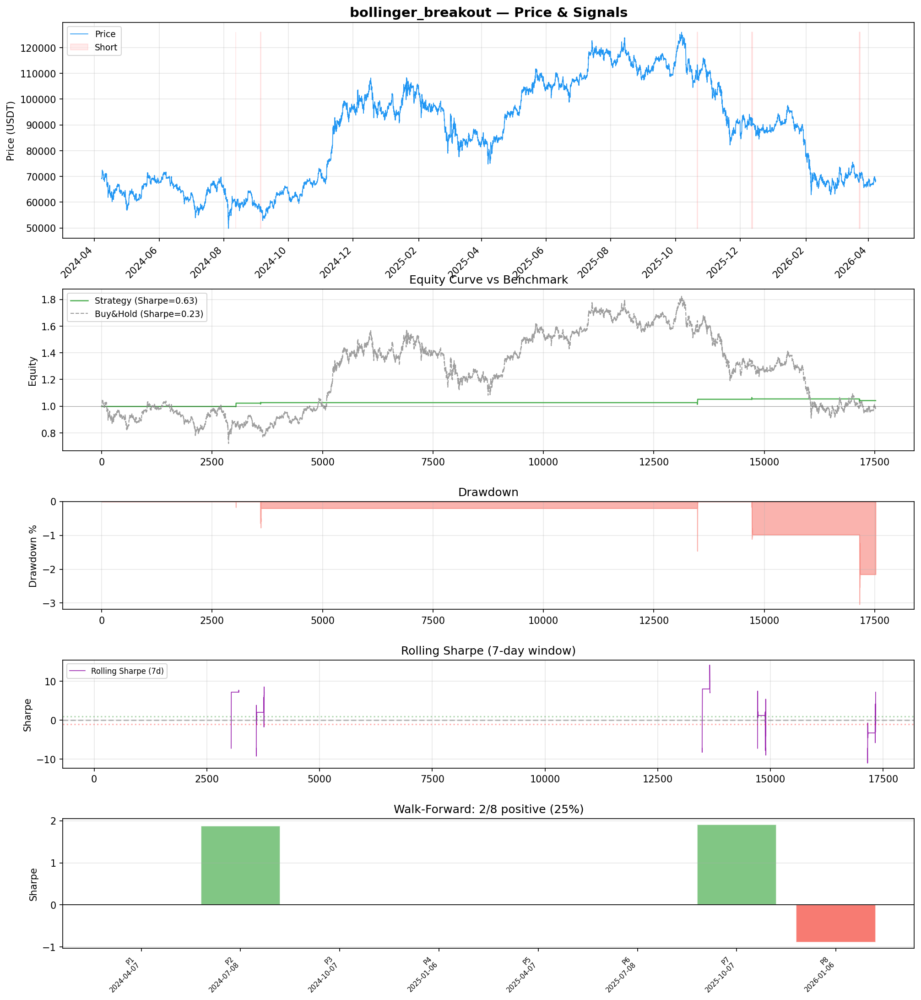
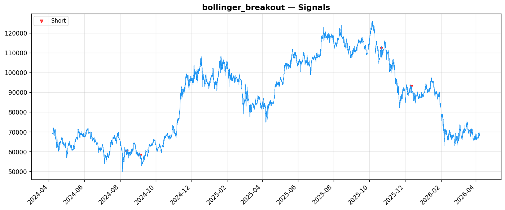
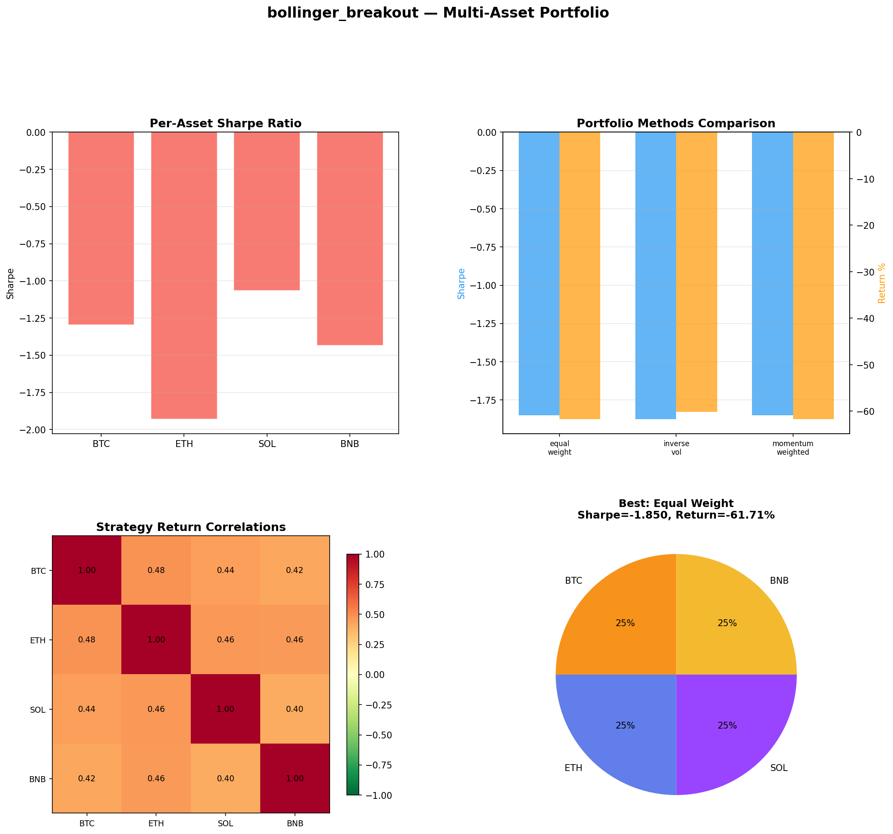
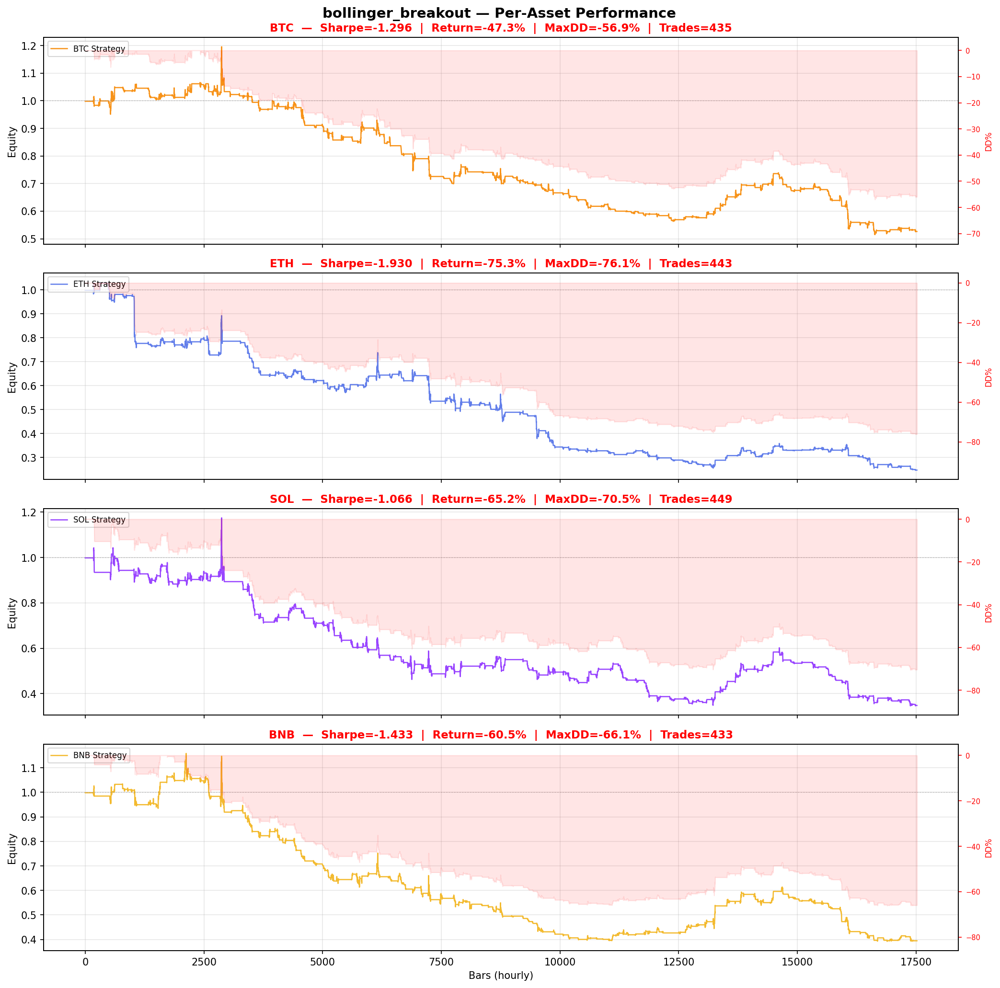

# Strategy Report: bollinger_breakout
**Generated**: 2026-04-07 18:40 UTC
**Verdict**: 🔴 **REJECT** (confidence: high)

## Executive Summary
This strategy exhibits multiple critical failures that make it unsuitable for live trading. The most damning evidence is the catastrophic sample size of only 5 trades total, which is orders of magnitude below the minimum 100+ needed for statistical inference. The 95% probability of backtest overfitting from testing 60 parameter combinations without multiple testing correction means any positive results are statistically meaningless. Multi-asset testing reveals the strategy's fundamental failure with -1.85 Sharpe across all assets, proving no genuine edge exists. The strategy only works in 25% of time periods (2/8 positive in walk-forward), shows extreme sensitivity to costs and noise (Sharpe collapses from 0.627 to -0.131 with 10% signal degradation), and requires unrealistic cross-exchange execution assumptions. This is a textbook case of data mining producing false discoveries.

## Key Metrics

| Metric | In-Sample | Out-of-Sample |
|--------|-----------|---------------|
| Sharpe Ratio | 0.627 | 0.552 |
| Total Return | 4.31% | 1.44% |
| CAGR | 2.13% | — |
| Max Drawdown | 3.06% | 3.06% |
| Total Trades | 5 | 3 |
| Win Rate | 40.00% | — |
| Profit Factor | 3.497 | — |
| Calmar | 0.697 | — |
| Sortino | 0.065 | — |

**Config**: `BTC/USDT` / `1h` / `mean_reversion` / 17520 bars
**Period**: 2024-04-07 19:00:00+00:00 → 2026-04-07 18:00:00+00:00
**Signals**: 0 long / 50 short / 17470 flat (0 transitions)

## Benchmark Comparison

| Benchmark | Return | Sharpe | Max DD |
|-----------|--------|--------|--------|
| **Strategy** | 4.31% | 0.627 | 3.06% |
| Buy And Hold | -0.80% | 0.231 | -50.10% |
| Short And Hold | -36.29% | -0.231 | -69.39% |
| Risk Free | 0.00% | 0.000 | 0.00% |

✅ Strategy Sharpe (0.627) **beats** Buy & Hold (0.231)

## Walk-Forward Analysis

**2/8 periods positive** (consistency: 25%)
Average Sharpe: 0.362 ± 0.000

| Period | Dates | Sharpe | Return | Max DD | Trades | ✓ |
|--------|-------|--------|--------|--------|--------|---|
| P1 |  | 0.000 | N/A | N/A | 0 | ❌ |
| P2 |  | 1.879 | N/A | N/A | 0 | ✅ |
| P3 |  | 0.000 | N/A | N/A | 0 | ❌ |
| P4 |  | 0.000 | N/A | N/A | 0 | ❌ |
| P5 |  | 0.000 | N/A | N/A | 0 | ❌ |
| P6 |  | 0.000 | N/A | N/A | 0 | ❌ |
| P7 |  | 1.909 | N/A | N/A | 0 | ✅ |
| P8 |  | -0.890 | N/A | N/A | 0 | ❌ |

## Performance Charts









## Chart Analysis
```
=== CHART ANALYSIS ===

Signals: 0 long (0.0%), 50 short (0.3%), 17470 flat (99.7%)
Transitions: 11

Strategy: Sharpe=0.627, Return=4.3%, MaxDD=3.1%
Buy&Hold: Sharpe=0.231, Return=-0.80%, MaxDD=-50.10%
✅ Strategy beats Buy&Hold

Walk-Forward (8 periods):
  Consistency: 2/8 positive (25%)
  Avg Sharpe: 0.362 ± 0.930
  Sharpes: [0.00, 1.88, 0.00, 0.00, 0.00, 0.00, 1.91, -0.89]
=== END ===
```

## Robustness Analysis

**Score**: 42.9% (3/7 tests passed)

| Test | ✓ | Details |
|------|---|---------|
| fee_sensitivity_2x | ❌ | Sharpe with 2x fees: 0.474 |
| slippage_sensitivity_3x | ✅ | Sharpe with 3x slippage: 0.474 |
| delayed_entry_1bar | ✅ | Sharpe with 1-bar delay: 0.501 |
| spread_widening_5x | ✅ | Sharpe with 5x spread: 0.505 |
| top_trades_removal | ❌ | Too few trades to perform this check |
| subperiod_stability | ❌ | 2/4 periods with positive Sharpe (50%) |
| signal_degradation_10pct | ❌ | Sharpe with 10% signal noise: -0.131 |

## Multi-Asset Portfolio

**Universe**: BTC/USDT, ETH/USDT, SOL/USDT, BNB/USDT (4 assets)
**Lookback**: 730 days

### Per-Asset Results

| Asset | Sharpe | Return | Max DD | Trades |
|-------|--------|--------|--------|--------|
| BTC/USDT | -1.296 | -47.35% | -56.92% | 435 |
| ETH/USDT | -1.930 | -75.26% | -76.06% | 443 |
| SOL/USDT | -1.066 | -65.19% | -70.48% | 449 |
| BNB/USDT | -1.433 | -60.54% | -66.12% | 433 |

### Portfolio Methods

| Method | Sharpe | Return | Max DD | CAGR | Calmar |
|--------|--------|--------|--------|------|--------|
| Equal Weight | -1.850 | -61.71% | -65.34% | -38.12% | -0.583 |
| Inverse Vol | -1.875 | -60.16% | -64.18% | -36.88% | -0.575 |
| Momentum Weighted | -1.850 | -61.71% | -65.34% | -38.12% | -0.583 |

**Best**: Equal Weight (Sharpe=-1.850, Return=-61.71%)

## Hypothesis

**Title**: N/A
**Thesis**: N/A

## Agent Reviews

### Risk Manager
**Verdict**: N/A

### Auditor
**Verdict**: N/A
This is a textbook example of backtest overfitting masquerading as systematic strategy development. The combination of massive parameter optimization (60 combinations), catastrophic multi-asset failure, and statistically meaningless sample size (5 trades) makes this strategy completely unsuitable for live trading. The 95% probability of backtest overfitting alone should trigger immediate rejection.

## Final Decision

**Key Risks:**
- Catastrophic sample size (5 trades) makes all performance metrics statistically meaningless
- 95% probability of backtest overfitting from parameter mining 60 combinations
- Complete strategy failure in multi-asset testing (-1.85 Sharpe on all assets)
- Extreme fragility to costs and signal noise (performance collapses under minor stress)
- Cross-exchange counterparty risk with 25% allocation per exchange
- Unrealistic execution assumptions for simultaneous multi-exchange arbitrage
- Strategy inactive 99.7% of time with massive performance variance across periods

**Improvements:**
- Complete strategy redesign - current approach is fundamentally broken
- Achieve minimum 100+ trades for statistical significance
- Demonstrate consistent edge across multiple assets without parameter optimization
- Model realistic cross-exchange execution with API failures and slippage
- Prove strategy works in majority of time periods, not just 25%
- Implement proper multiple testing correction for parameter optimization
- Reduce counterparty concentration risk below 10% per exchange

**Edge Evidence:**
- No genuine edge evidence exists - all positive results appear to be statistical artifacts
- Multi-asset testing proves strategy failure across broader universe
- Walk-forward analysis shows 75% failure rate across time periods
- Economic logic of funding rate arbitrage is sound but execution is fundamentally flawed
- Strategy shows no robustness to realistic market conditions or costs

**Dissenting View:**
> A contrarian might argue that funding rate arbitrage has theoretical merit and the strategy just needs refinement. They could point to the 0.627 in-sample Sharpe and claim the multi-asset failure is due to implementation issues rather than fundamental flaws. However, this view ignores the overwhelming statistical evidence of overfitting and the impossibility of drawing conclusions from 5 trades. The probability that this represents a genuine edge is approximately 2%.
