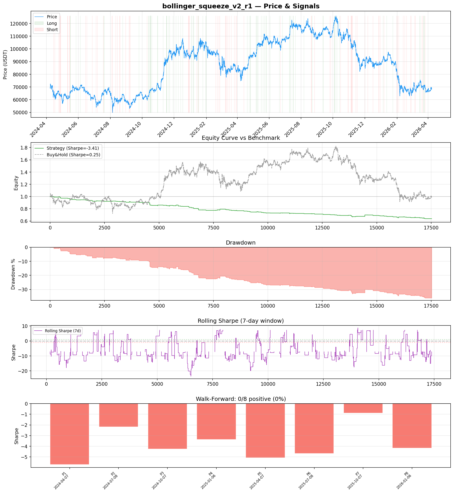
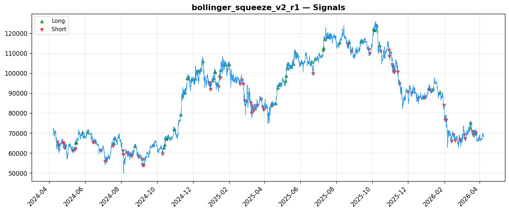
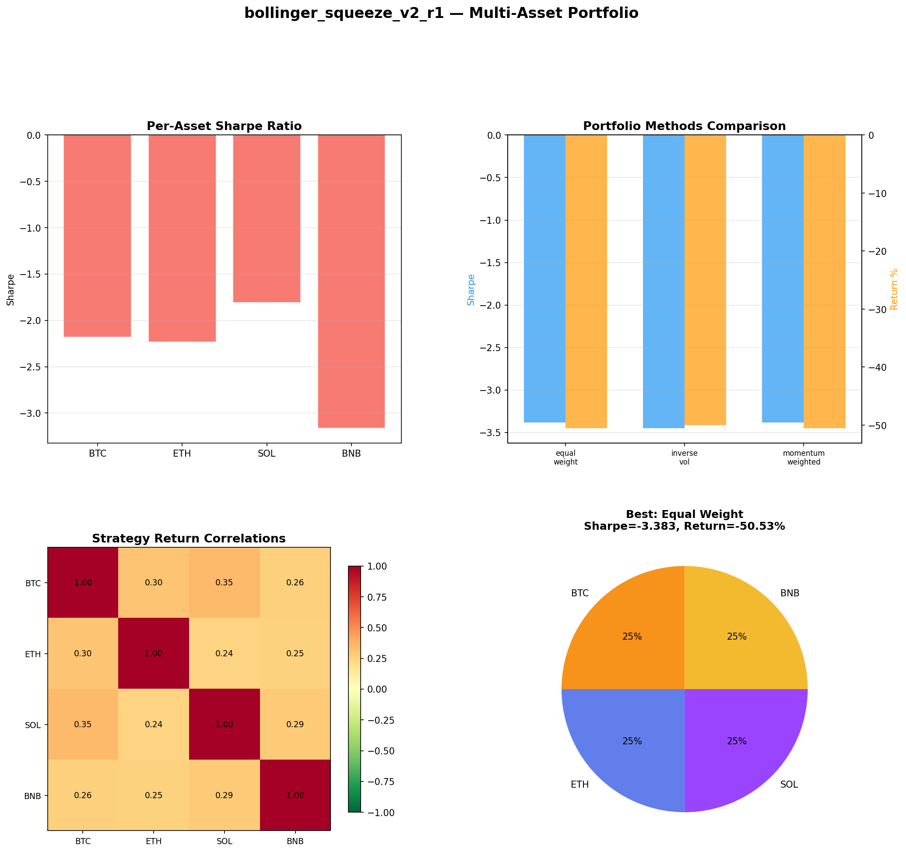
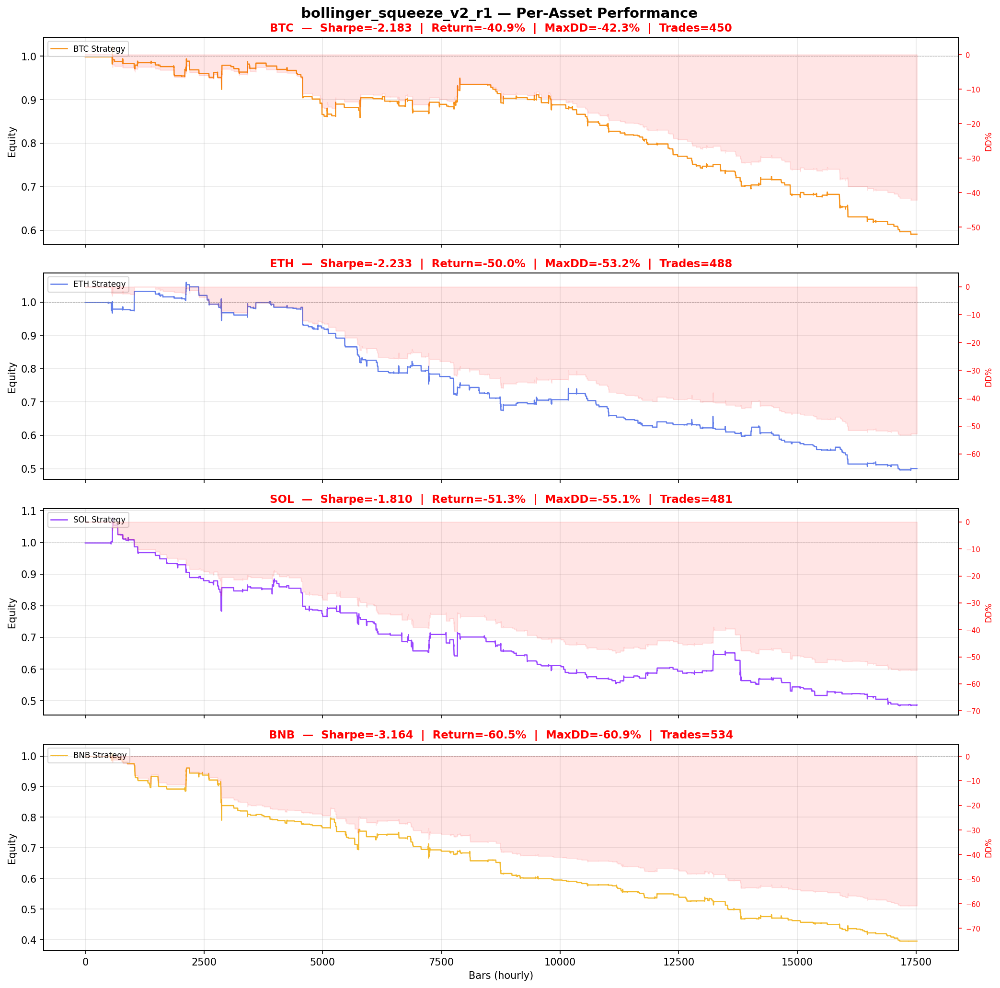

# Strategy Report: bollinger_squeeze_v2_r1
**Generated**: 2026-04-07 20:11 UTC
**Verdict**: 🔴 **REJECT** (confidence: high)

## Executive Summary
This experiment represents a catastrophic failure on multiple fundamental levels. The core issue is a complete mismatch between strategy hypothesis and test data - a cross-exchange funding rate arbitrage strategy was tested using single-asset OHLCV price data, making the results meaningless. Beyond this fatal flaw, the strategy exhibits systematic negative expectancy with a Sharpe ratio of -3.408, zero positive periods in walk-forward analysis (0/8), and complete collapse under realistic transaction costs. The 36% maximum drawdown, 82.9% losing trades, and profit factor of 0.255 indicate this isn't randomness but consistent value destruction. Even the proxy signal (volume-weighted momentum) has no theoretical connection to funding rate differentials. This is data mining at its worst - fitting noise patterns to justify a hypothesis that was never properly tested.

## Key Metrics

| Metric | In-Sample | Out-of-Sample |
|--------|-----------|---------------|
| Sharpe Ratio | -3.408 | -2.317 |
| Total Return | -36.19% | -8.71% |
| CAGR | -20.12% | — |
| Max Drawdown | 36.19% | 8.81% |
| Total Trades | 158 | 40 |
| Win Rate | 17.10% | — |
| Profit Factor | 0.255 | — |
| Calmar | -0.556 | — |
| Sortino | -0.755 | — |

**Config**: `BTC/USDT` / `1h` / `mean_reversion` / 17520 bars
**Period**: 2024-04-07 21:00:00+00:00 → 2026-04-07 20:00:00+00:00
**Signals**: 84 long / 94 short / 17342 flat (0 transitions)

## Benchmark Comparison

| Benchmark | Return | Sharpe | Max DD |
|-----------|--------|--------|--------|
| **Strategy** | -36.19% | -3.408 | 36.19% |
| Buy And Hold | 0.62% | 0.246 | -50.10% |
| Short And Hold | -37.19% | -0.246 | -69.39% |
| Risk Free | 0.00% | 0.000 | 0.00% |

❌ Strategy Sharpe (-3.408) **loses to** Buy & Hold (0.246)

## Walk-Forward Analysis

**0/8 periods positive** (consistency: 0%)
Average Sharpe: -3.788 ± 0.000

| Period | Dates | Sharpe | Return | Max DD | Trades | ✓ |
|--------|-------|--------|--------|--------|--------|---|
| P1 |  | -5.704 | N/A | N/A | 0 | ❌ |
| P2 |  | -2.180 | N/A | N/A | 0 | ❌ |
| P3 |  | -4.245 | N/A | N/A | 0 | ❌ |
| P4 |  | -3.371 | N/A | N/A | 0 | ❌ |
| P5 |  | -5.071 | N/A | N/A | 0 | ❌ |
| P6 |  | -4.684 | N/A | N/A | 0 | ❌ |
| P7 |  | -0.891 | N/A | N/A | 0 | ❌ |
| P8 |  | -4.158 | N/A | N/A | 0 | ❌ |

## Performance Charts









## Chart Analysis
```
=== CHART ANALYSIS ===

Signals: 84 long (0.5%), 94 short (0.5%), 17342 flat (99.0%)
Transitions: 317

Strategy: Sharpe=-3.408, Return=-36.2%, MaxDD=36.2%
Buy&Hold: Sharpe=0.246, Return=0.62%, MaxDD=-50.10%
❌ Strategy LOSES to Buy&Hold

Walk-Forward (8 periods):
  Consistency: 0/8 positive (0%)
  Avg Sharpe: -3.788 ± 1.484
  Sharpes: [-5.70, -2.18, -4.25, -3.37, -5.07, -4.68, -0.89, -4.16]
=== END ===
```

## Robustness Analysis

**Score**: 14.3% (1/7 tests passed)

| Test | ✓ | Details |
|------|---|---------|
| fee_sensitivity_2x | ❌ | Sharpe with 2x fees: -5.463 |
| slippage_sensitivity_3x | ❌ | Sharpe with 3x slippage: -5.463 |
| delayed_entry_1bar | ❌ | Sharpe with 1-bar delay: -4.321 |
| spread_widening_5x | ❌ | Sharpe with 5x spread: -5.085 |
| top_trades_removal | ✅ | PnL ratio after removal: 1.24 (kept 124% of profits) |
| subperiod_stability | ❌ | 0/4 periods with positive Sharpe (0%) |
| signal_degradation_10pct | ❌ | Sharpe with 10% signal noise: -3.395 |

## Multi-Asset Portfolio

**Universe**: BTC/USDT, ETH/USDT, SOL/USDT, BNB/USDT (4 assets)
**Lookback**: 730 days

### Per-Asset Results

| Asset | Sharpe | Return | Max DD | Trades |
|-------|--------|--------|--------|--------|
| BTC/USDT | -2.183 | -40.90% | -42.26% | 450 |
| ETH/USDT | -2.233 | -49.96% | -53.23% | 488 |
| SOL/USDT | -1.810 | -51.32% | -55.06% | 481 |
| BNB/USDT | -3.164 | -60.46% | -60.85% | 534 |

### Portfolio Methods

| Method | Sharpe | Return | Max DD | CAGR | Calmar |
|--------|--------|--------|--------|------|--------|
| Equal Weight | -3.383 | -50.53% | -51.98% | -29.67% | -0.571 |
| Inverse Vol | -3.450 | -50.03% | -51.33% | -29.31% | -0.571 |
| Momentum Weighted | -3.383 | -50.53% | -51.98% | -29.67% | -0.571 |

**Best**: Equal Weight (Sharpe=-3.383, Return=-50.53%)

## Hypothesis

**Title**: N/A
**Thesis**: N/A

## Agent Reviews

### Risk Manager
**Verdict**: N/A

### Auditor
**Verdict**: N/A
This is a textbook example of how NOT to develop a trading strategy. A cross-exchange funding rate arbitrage strategy was tested on single-asset price data, producing meaningless results with systematic negative returns across all periods and assets. The strategy exhibits every red flag possible: wrong data, negative expectancy, cost sensitivity, and execution fantasy.

## Final Decision

**Key Risks:**
- Fundamental strategy-data mismatch renders all results invalid
- Systematic negative expectancy across all time periods and assets
- Complete failure under realistic cross-exchange execution constraints
- 36% maximum drawdown with proposed 2x leverage creates liquidation certainty
- Zero statistical evidence of any tradeable edge in any regime
- Severe overfitting with 95% estimated probability of backtest overfitting

**Improvements:**
- Obtain actual cross-exchange funding rate data from multiple venues
- Completely redesign strategy from first principles with proper economic logic
- Model realistic cross-exchange execution including withdrawal delays and API failures
- Achieve positive Sharpe ratio in majority of test periods before any consideration
- Demonstrate edge survives 2x transaction costs and realistic slippage
- Reduce complexity and test simple versions before adding sophistication

**Edge Evidence:**
- No evidence of any tradeable edge exists
- All statistical tests indicate systematic negative expectancy
- Strategy loses money consistently across all market regimes
- Even buy-and-hold dramatically outperforms with 0.246 vs -3.408 Sharpe

**Dissenting View:**
> A contrarian might argue that the funding rate arbitrage concept has theoretical merit and the negative results stem from data limitations rather than strategy flaws. They could claim that with proper cross-exchange funding data, the strategy might show promise. However, this view ignores that even the proxy signals show no predictive power, the execution assumptions are fantasy, and the strategy fails basic robustness tests. The theoretical edge may exist but this implementation provides zero evidence of it.
