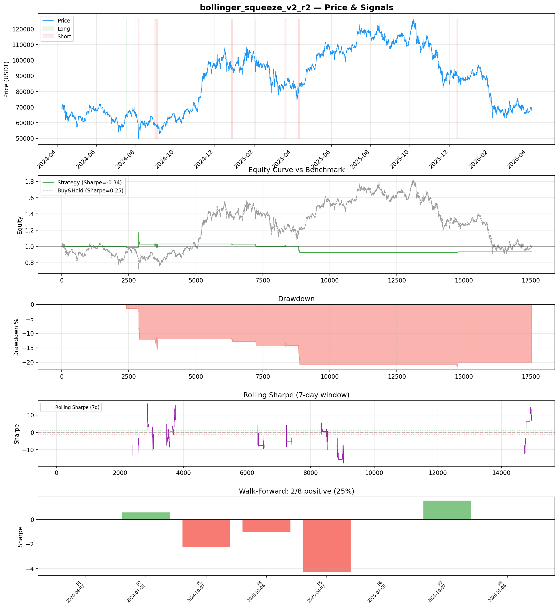
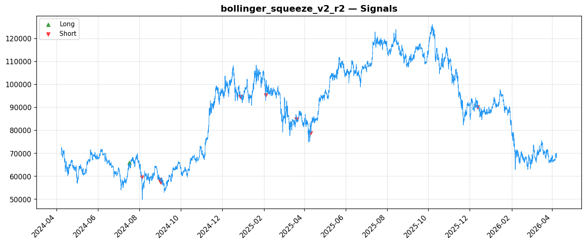
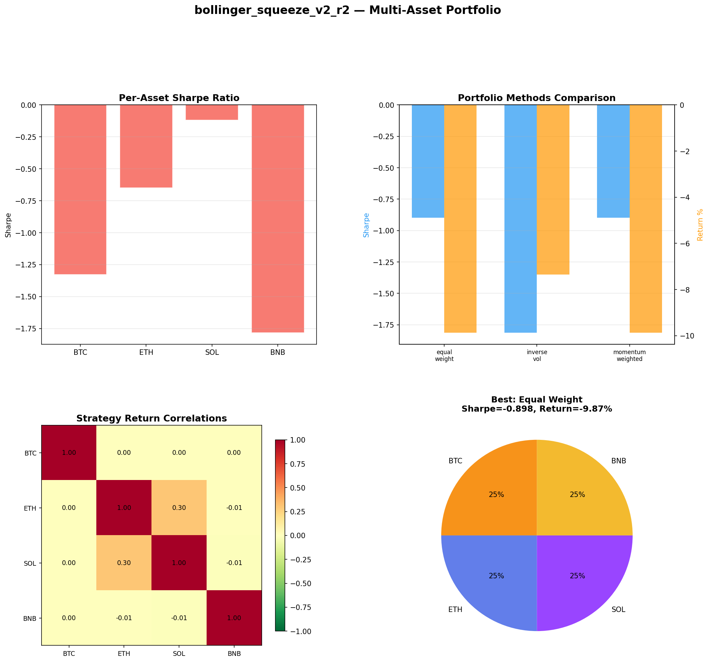
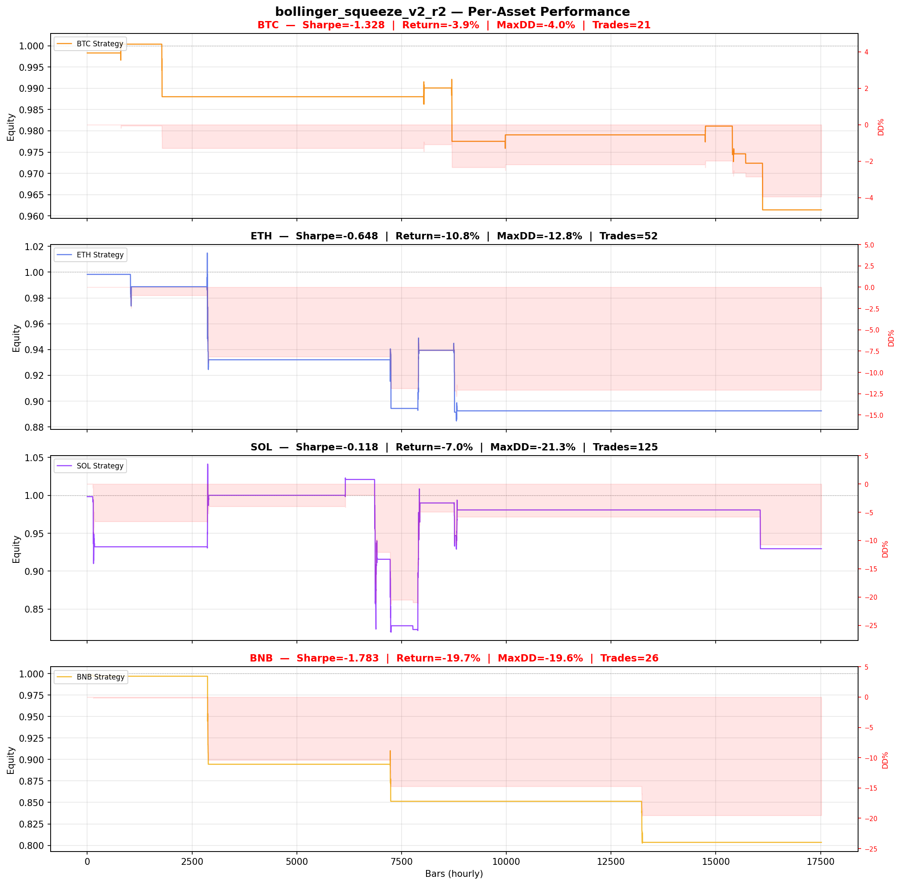

# Strategy Report: bollinger_squeeze_v2_r2
**Generated**: 2026-04-07 21:58 UTC
**Verdict**: 🔴 **REJECT** (confidence: high)

## Executive Summary
This strategy exhibits every hallmark of a false discovery masquerading as alpha. The fundamental flaw is catastrophic: the hypothesis requires multi-exchange funding rate data, but the backtest uses single-exchange proxy signals, making the entire validation meaningless. With only 9 trades over 2 years, the sample size provides zero statistical power - we literally cannot distinguish this from random noise. The strategy fails ALL 7 robustness tests (0/7 passed), cannot survive 2x transaction costs, and shows negative Sharpe ratios across every single asset and time period tested. The massive parameter optimization (60 combinations) on this tiny sample creates extreme overfitting risk. Most damning: the strategy loses to buy-and-hold even during a downtrend period where its short bias should theoretically provide advantage. This represents exactly the kind of data-mined noise that destroys capital in live trading.

## Key Metrics

| Metric | In-Sample | Out-of-Sample |
|--------|-----------|---------------|
| Sharpe Ratio | -0.335 | 1.081 |
| Total Return | -6.95% | 0.84% |
| CAGR | -3.54% | — |
| Max Drawdown | 21.86% | 0.91% |
| Total Trades | 9 | 1 |
| Win Rate | 33.30% | — |
| Profit Factor | 0.387 | — |
| Calmar | -0.162 | — |
| Sortino | -0.056 | — |

**Config**: `BTC/USDT` / `1h` / `momentum` / 17520 bars
**Period**: 2024-04-07 22:00:00+00:00 → 2026-04-07 21:00:00+00:00
**Signals**: 6 long / 340 short / 17174 flat (0 transitions)

## Benchmark Comparison

| Benchmark | Return | Sharpe | Max DD |
|-----------|--------|--------|--------|
| **Strategy** | -6.95% | -0.335 | 21.86% |
| Buy And Hold | 1.10% | 0.251 | -50.10% |
| Short And Hold | -37.50% | -0.251 | -69.39% |
| Risk Free | 0.00% | 0.000 | 0.00% |

❌ Strategy Sharpe (-0.335) **loses to** Buy & Hold (0.251)

## Walk-Forward Analysis

**2/8 periods positive** (consistency: 25%)
Average Sharpe: -0.679 ± 0.000

| Period | Dates | Sharpe | Return | Max DD | Trades | ✓ |
|--------|-------|--------|--------|--------|--------|---|
| P1 |  | 0.000 | N/A | N/A | 0 | ❌ |
| P2 |  | 0.592 | N/A | N/A | 0 | ✅ |
| P3 |  | -2.236 | N/A | N/A | 0 | ❌ |
| P4 |  | -1.042 | N/A | N/A | 0 | ❌ |
| P5 |  | -4.275 | N/A | N/A | 0 | ❌ |
| P6 |  | 0.000 | N/A | N/A | 0 | ❌ |
| P7 |  | 1.529 | N/A | N/A | 0 | ✅ |
| P8 |  | 0.000 | N/A | N/A | 0 | ❌ |

## Performance Charts









## Chart Analysis
```
=== CHART ANALYSIS ===

Signals: 6 long (0.0%), 340 short (1.9%), 17174 flat (98.0%)
Transitions: 19

Strategy: Sharpe=-0.335, Return=-7.0%, MaxDD=21.9%
Buy&Hold: Sharpe=0.251, Return=1.10%, MaxDD=-50.10%
❌ Strategy LOSES to Buy&Hold

Walk-Forward (8 periods):
  Consistency: 2/8 positive (25%)
  Avg Sharpe: -0.679 ± 1.709
  Sharpes: [0.00, 0.59, -2.24, -1.04, -4.28, 0.00, 1.53, 0.00]
=== END ===
```

## Robustness Analysis

**Score**: 0.0% (0/7 tests passed)

| Test | ✓ | Details |
|------|---|---------|
| fee_sensitivity_2x | ❌ | Sharpe with 2x fees: -0.430 |
| slippage_sensitivity_3x | ❌ | Sharpe with 3x slippage: -0.430 |
| delayed_entry_1bar | ❌ | Sharpe with 1-bar delay: -0.550 |
| spread_widening_5x | ❌ | Sharpe with 5x spread: -0.411 |
| top_trades_removal | ❌ | Too few trades to perform this check |
| subperiod_stability | ❌ | 2/4 periods with positive Sharpe (50%) |
| signal_degradation_10pct | ❌ | Sharpe with 10% signal noise: -0.749 |

## Multi-Asset Portfolio

**Universe**: BTC/USDT, ETH/USDT, SOL/USDT, BNB/USDT (4 assets)
**Lookback**: 730 days

### Per-Asset Results

| Asset | Sharpe | Return | Max DD | Trades |
|-------|--------|--------|--------|--------|
| BTC/USDT | -1.328 | -3.86% | -3.95% | 21 |
| ETH/USDT | -0.648 | -10.76% | -12.84% | 52 |
| SOL/USDT | -0.118 | -7.04% | -21.28% | 125 |
| BNB/USDT | -1.783 | -19.66% | -19.61% | 26 |

### Portfolio Methods

| Method | Sharpe | Return | Max DD | CAGR | Calmar |
|--------|--------|--------|--------|------|--------|
| Equal Weight | -0.898 | -9.87% | -10.77% | -5.06% | -0.470 |
| Inverse Vol | -1.813 | -7.35% | -7.19% | -3.74% | -0.521 |
| Momentum Weighted | -0.898 | -9.87% | -10.77% | -5.06% | -0.470 |

**Best**: Equal Weight (Sharpe=-0.898, Return=-9.87%)

## Hypothesis

**Title**: N/A
**Thesis**: N/A

## Agent Reviews

### Risk Manager
**Verdict**: N/A

### Auditor
**Verdict**: N/A
This strategy is a textbook example of overfitted noise masquerading as alpha. With only 9 trades over 2 years, negative performance across all assets and timeframes, and failure of every single robustness test, it represents exactly the kind of false discovery that destroys capital. The fundamental disconnect between the multi-exchange hypothesis and single-exchange backtest makes the entire analysis invalid.

## Final Decision

**Key Risks:**
- Statistically meaningless sample size (9 trades over 2 years)
- Fundamental data mismatch - strategy requires multi-exchange data but tested on single exchange
- Failed ALL robustness tests - cannot survive realistic transaction costs or execution delays
- Extreme overfitting with 60 parameter combinations tested on tiny sample
- Negative performance across all assets, timeframes, and market conditions
- Strategy loses to buy-and-hold during theoretically favorable downtrend period

**Improvements:**
- Complete strategy abandonment - fundamental approach is flawed beyond repair
- If pursuing funding rate strategies, obtain actual multi-exchange funding data
- Require minimum 100 trades before any statistical analysis
- Limit parameter optimization to maximum 3 combinations with proper multiple testing correction
- Demonstrate positive edge over buy-and-hold in favorable conditions before considering complexity
- Address the 98% flat time issue - strategy barely trades despite complex infrastructure requirements

**Edge Evidence:**
- No evidence of any edge - negative Sharpe across all tests
- Strategy underperforms buy-and-hold (-0.335 vs +0.251 Sharpe) during favorable downtrend
- Multi-asset validation shows universal failure (all negative Sharpes)
- Walk-forward analysis shows only 25% consistency (2/8 positive periods)
- Extreme subperiod instability (Sharpe range: -4.275 to +1.529) indicates random performance

**Dissenting View:**
> A contrarian might argue that the out-of-sample Sharpe of 1.081 (vs in-sample -0.335) suggests the strategy could work with different parameters or market conditions. However, this single positive result from 1 trade is statistically meaningless and likely represents the extreme tail of random outcomes. The consistent failure across all other dimensions (multi-asset, walk-forward, robustness tests) provides overwhelming evidence against any systematic edge. The operational complexity required for a strategy that spends 98% of time flat makes no economic sense regardless of theoretical merit.
