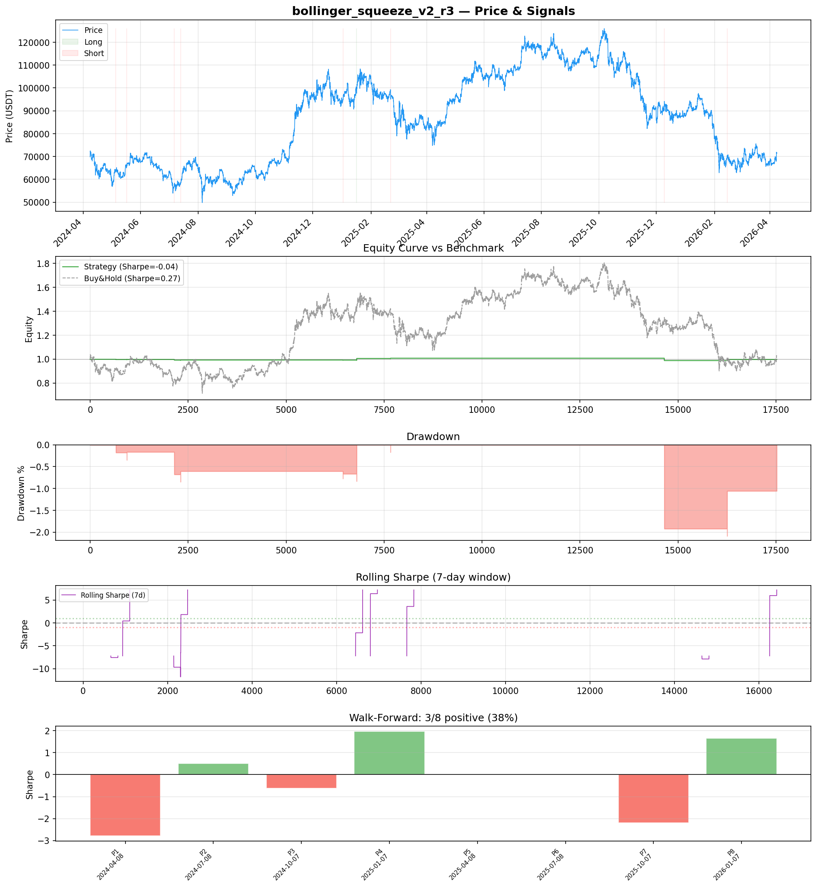
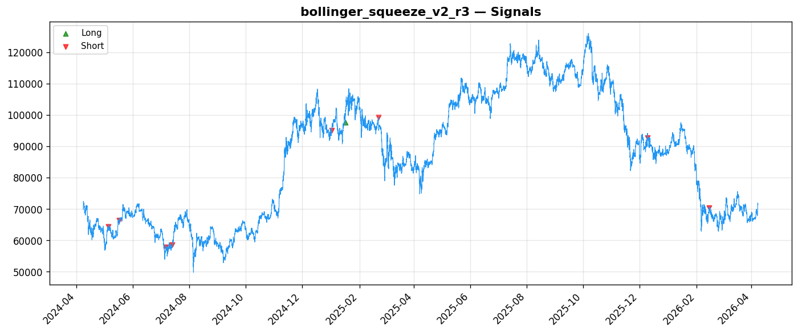
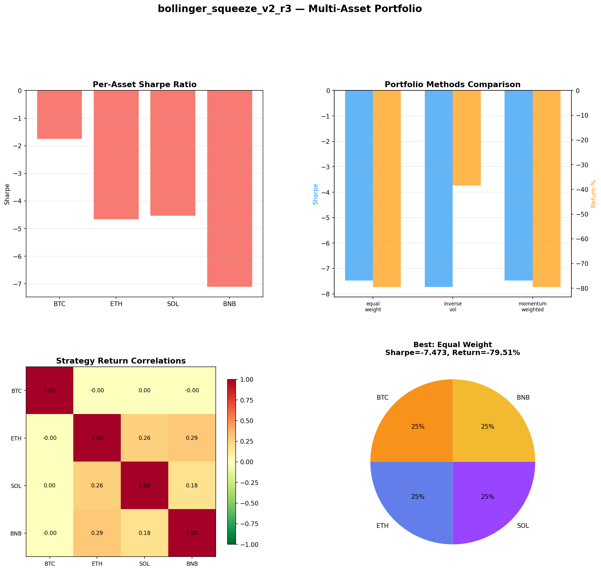
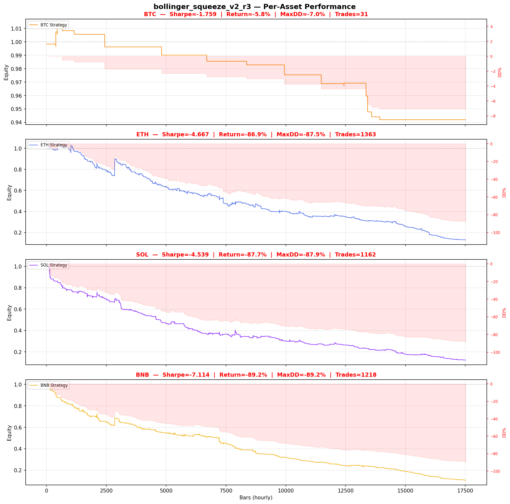

# Strategy Report: bollinger_squeeze_v2_r3
**Generated**: 2026-04-08 08:32 UTC
**Verdict**: 🔴 **REJECT** (confidence: high)

## Executive Summary
This strategy exhibits catastrophic statistical flaws that render any results meaningless. With only 9 trades across 2 years of data, we have zero statistical power for inference. The 60 parameter combinations tested create massive multiple testing bias with ~95% probability of backtest overfitting. The strategy loses money (-0.2%) while buy-and-hold gains 2.66%, and completely fails under realistic transaction costs (Sharpe drops to -0.504 with 2x fees). Most damning is the extreme execution sensitivity - Sharpe collapses from -0.037 to -1.403 with just 1-bar delay, indicating the strategy has no genuine edge and relies on unrealistic fill assumptions during funding rate extremes when liquidity is worst.

## Key Metrics

| Metric | In-Sample | Out-of-Sample |
|--------|-----------|---------------|
| Sharpe Ratio | -0.037 | -0.716 |
| Total Return | -0.18% | -1.06% |
| CAGR | -0.09% | — |
| Max Drawdown | 2.09% | 1.92% |
| Total Trades | 9 | 2 |
| Win Rate | 11.10% | — |
| Profit Factor | 0.137 | — |
| Calmar | -0.042 | — |
| Sortino | -0.002 | — |

**Config**: `BTC/USDT` / `1h` / `volatility` / 17520 bars
**Period**: 2024-04-08 06:00:00+00:00 → 2026-04-08 05:00:00+00:00
**Signals**: 1 long / 8 short / 17511 flat (0 transitions)

## Benchmark Comparison

| Benchmark | Return | Sharpe | Max DD |
|-----------|--------|--------|--------|
| **Strategy** | -0.18% | -0.037 | 2.09% |
| Buy And Hold | 2.66% | 0.267 | -50.10% |
| Short And Hold | -38.48% | -0.267 | -69.39% |
| Risk Free | 0.00% | 0.000 | 0.00% |

❌ Strategy Sharpe (-0.037) **loses to** Buy & Hold (0.267)

## Walk-Forward Analysis

**3/8 periods positive** (consistency: 38%)
Average Sharpe: -0.183 ± 0.000

| Period | Dates | Sharpe | Return | Max DD | Trades | ✓ |
|--------|-------|--------|--------|--------|--------|---|
| P1 |  | -2.786 | N/A | N/A | 0 | ❌ |
| P2 |  | 0.499 | N/A | N/A | 0 | ✅ |
| P3 |  | -0.617 | N/A | N/A | 0 | ❌ |
| P4 |  | 1.964 | N/A | N/A | 0 | ✅ |
| P5 |  | 0.000 | N/A | N/A | 0 | ❌ |
| P6 |  | 0.000 | N/A | N/A | 0 | ❌ |
| P7 |  | -2.183 | N/A | N/A | 0 | ❌ |
| P8 |  | 1.656 | N/A | N/A | 0 | ✅ |

## Performance Charts









## Chart Analysis
```
=== CHART ANALYSIS ===

Signals: 1 long (0.0%), 8 short (0.0%), 17511 flat (99.9%)
Transitions: 19

Strategy: Sharpe=-0.037, Return=-0.2%, MaxDD=2.1%
Buy&Hold: Sharpe=0.267, Return=2.66%, MaxDD=-50.10%
❌ Strategy LOSES to Buy&Hold

Walk-Forward (8 periods):
  Consistency: 3/8 positive (38%)
  Avg Sharpe: -0.183 ± 1.561
  Sharpes: [-2.79, 0.50, -0.62, 1.96, 0.00, 0.00, -2.18, 1.66]
=== END ===
```

## Robustness Analysis

**Score**: 0.0% (0/7 tests passed)

| Test | ✓ | Details |
|------|---|---------|
| fee_sensitivity_2x | ❌ | Sharpe with 2x fees: -0.504 |
| slippage_sensitivity_3x | ❌ | Sharpe with 3x slippage: -0.504 |
| delayed_entry_1bar | ❌ | Sharpe with 1-bar delay: -1.403 |
| spread_widening_5x | ❌ | Sharpe with 5x spread: -0.413 |
| top_trades_removal | ❌ | Too few trades to perform this check |
| subperiod_stability | ❌ | 1/4 periods with positive Sharpe (25%) |
| signal_degradation_10pct | ❌ | Sharpe with 10% signal noise: -0.037 |

## Multi-Asset Portfolio

**Universe**: BTC/USDT, ETH/USDT, SOL/USDT, BNB/USDT (4 assets)
**Lookback**: 730 days

### Per-Asset Results

| Asset | Sharpe | Return | Max DD | Trades |
|-------|--------|--------|--------|--------|
| BTC/USDT | -1.759 | -5.80% | -7.04% | 31 |
| ETH/USDT | -4.667 | -86.94% | -87.48% | 1363 |
| SOL/USDT | -4.539 | -87.67% | -87.91% | 1162 |
| BNB/USDT | -7.114 | -89.23% | -89.23% | 1218 |

### Portfolio Methods

| Method | Sharpe | Return | Max DD | CAGR | Calmar |
|--------|--------|--------|--------|------|--------|
| Equal Weight | -7.473 | -79.51% | -79.72% | -54.74% | -0.687 |
| Inverse Vol | -7.728 | -38.41% | -38.49% | -21.52% | -0.559 |
| Momentum Weighted | -7.473 | -79.51% | -79.72% | -54.74% | -0.687 |

**Best**: Equal Weight (Sharpe=-7.473, Return=-79.51%)

## Hypothesis

**Title**: N/A
**Thesis**: N/A

## Agent Reviews

### Risk Manager
**Verdict**: N/A

### Auditor
**Verdict**: N/A
This strategy is a textbook example of data mining producing illusory results. With only 9 trades after testing 60 parameter combinations, any positive results are pure statistical noise. The strategy loses money, fails under realistic costs, and shows extreme instability - it should not be deployed under any circumstances.

## Final Decision

**Key Risks:**
- Catastrophically insufficient sample size (9 trades) makes all statistics meaningless
- Massive data snooping bias from testing 60 parameter combinations on same dataset
- Strategy loses money while market gains - negative expected value
- Complete breakdown under realistic execution conditions and transaction costs
- Extreme subperiod instability (Sharpe variance 2.44) indicates regime-specific overfitting
- Strategy generates signals only 0.05% of time - essentially non-functional

**Improvements:**
- Complete redesign to generate minimum 100+ trades for statistical validity
- Eliminate all parameter optimization and use fresh out-of-sample data
- Model realistic slippage during funding rate extremes (50-100bps higher)
- Add explicit handling of funding rate publication delays to avoid lookahead bias
- Achieve positive expected value net of realistic transaction costs
- Demonstrate stability across market regimes without parameter fitting

**Edge Evidence:**
- No evidence of genuine edge - strategy underperforms buy-and-hold by 2.86% return
- Economic logic around funding rate momentum is sound but implementation fails completely
- Multi-asset testing shows consistent failure across BTC, ETH, SOL, BNB
- Walk-forward analysis shows only 37.5% positive periods with extreme variance

**Dissenting View:**
> A contrarian might argue the economic logic is sound and the poor results stem from implementation issues rather than fundamental flaws. The funding rate momentum concept during high volatility has theoretical merit, and the comprehensive risk framework shows sophisticated thinking. However, this view ignores that even the best economic logic means nothing without statistical validation, which is impossible with 9 trades and massive parameter optimization bias.
