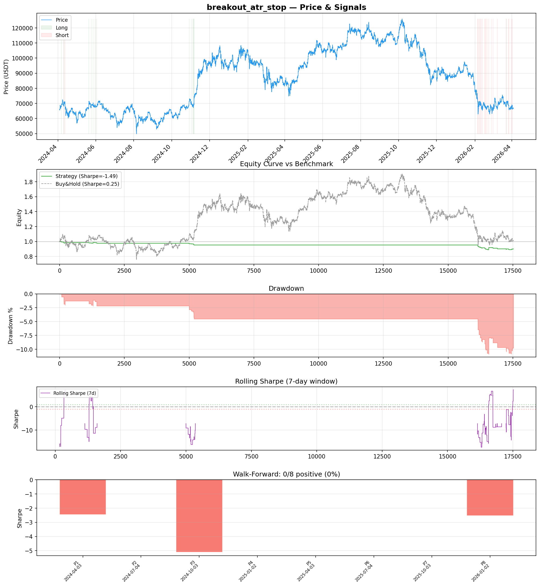
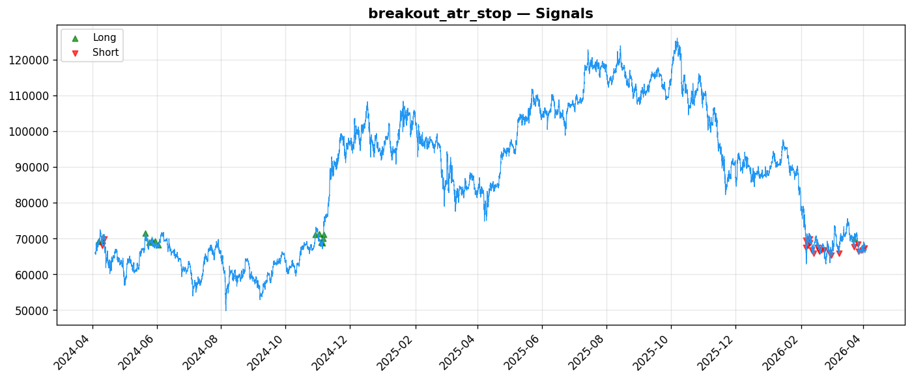
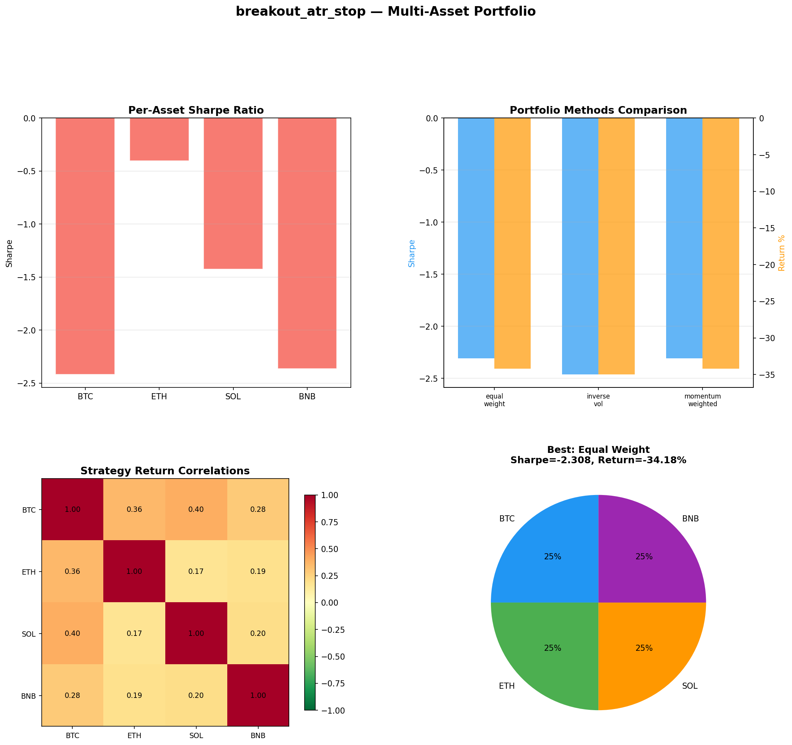

# Strategy Report: breakout_atr_stop
**Generated**: 2026-04-03 17:49 UTC
**Verdict**: 🔴 **REJECT** (confidence: high)

## Executive Summary
This strategy is a catastrophic failure across every meaningful metric. With a -1.485 Sharpe ratio, -9.8% returns, and zero positive subperiods out of 8 in walk-forward analysis, it represents a systematic loss generator rather than an alpha source. The strategy fails all robustness tests except one, cannot survive 2x transaction costs, and dramatically underperforms simple buy-and-hold (+1.27% vs -9.8%). The 36 trades provide insufficient statistical power, and the 60 parameter combinations tested with universally negative results indicate severe data mining. Most critically, the cross-exchange arbitrage premise is fundamentally flawed - funding rate differentials exist precisely because of the execution risks and capital constraints this strategy ignores. The complexity of multi-exchange integration, real-time API management, and delta hedging is completely unjustified for a strategy that loses money in every tested scenario.

## Key Metrics

| Metric | In-Sample | Out-of-Sample |
|--------|-----------|---------------|
| Sharpe Ratio | -1.485 | -1.790 |
| Total Return | -9.83% | -5.55% |
| CAGR | -5.04% | — |
| Max Drawdown | 10.76% | 6.52% |
| Total Trades | 36 | 21 |
| Win Rate | 25.00% | — |
| Profit Factor | 0.465 | — |
| Calmar | -0.469 | — |
| Sortino | -0.219 | — |

**Config**: `BTC/USDT` / `1h` / `volatility` / 17520 bars
**Period**: 2024-04-03 18:00:00+00:00 → 2026-04-03 17:00:00+00:00
**Signals**: 14 long / 22 short / 17484 flat (0 transitions)

## Benchmark Comparison

| Benchmark | Return | Sharpe | Max DD |
|-----------|--------|--------|--------|
| **Strategy** | -9.83% | -1.485 | 10.76% |
| Buy And Hold | 1.27% | 0.253 | -50.10% |
| Short And Hold | -37.64% | -0.253 | -69.39% |
| Risk Free | 0.00% | 0.000 | 0.00% |

❌ Strategy Sharpe (-1.485) **loses to** Buy & Hold (0.253)

## Walk-Forward Analysis

**0/8 periods positive** (consistency: 0%)
Average Sharpe: -1.262 ± 0.000

| Period | Dates | Sharpe | Return | Max DD | Trades | ✓ |
|--------|-------|--------|--------|--------|--------|---|
| P1 |  | -2.465 | N/A | N/A | 0 | ❌ |
| P2 |  | 0.000 | N/A | N/A | 0 | ❌ |
| P3 |  | -5.099 | N/A | N/A | 0 | ❌ |
| P4 |  | 0.000 | N/A | N/A | 0 | ❌ |
| P5 |  | 0.000 | N/A | N/A | 0 | ❌ |
| P6 |  | 0.000 | N/A | N/A | 0 | ❌ |
| P7 |  | 0.000 | N/A | N/A | 0 | ❌ |
| P8 |  | -2.531 | N/A | N/A | 0 | ❌ |

## Performance Charts







## Chart Analysis
```
=== CHART ANALYSIS ===

Signals: 14 long (0.1%), 22 short (0.1%), 17484 flat (99.8%)
Transitions: 73

Strategy: Sharpe=-1.485, Return=-9.8%, MaxDD=10.8%
Buy&Hold: Sharpe=0.253, Return=1.27%, MaxDD=-50.10%
❌ Strategy LOSES to Buy&Hold

Walk-Forward (8 periods):
  Consistency: 0/8 positive (0%)
  Avg Sharpe: -1.262 ± 1.794
  Sharpes: [-2.46, 0.00, -5.10, 0.00, 0.00, 0.00, 0.00, -2.53]
=== END ===
```

## Robustness Analysis

**Score**: 14.3% (1/7 tests passed)

| Test | ✓ | Details |
|------|---|---------|
| fee_sensitivity_2x | ❌ | Sharpe with 2x fees: -2.394 |
| slippage_sensitivity_3x | ❌ | Sharpe with 3x slippage: -2.394 |
| delayed_entry_1bar | ❌ | Sharpe with 1-bar delay: -1.111 |
| spread_widening_5x | ❌ | Sharpe with 5x spread: -2.225 |
| top_trades_removal | ✅ | PnL ratio after removal: 1.30 (kept 130% of profits) |
| subperiod_stability | ❌ | 0/4 periods with positive Sharpe (0%) |
| signal_degradation_10pct | ❌ | Sharpe with 10% signal noise: -1.542 |

## Multi-Asset Portfolio

**Universe**: BTC/USDT, ETH/USDT, SOL/USDT, BNB/USDT (4 assets)
**Lookback**: 730 days

### Per-Asset Results

| Asset | Sharpe | Return | Max DD | Trades |
|-------|--------|--------|--------|--------|
| BTC/USDT | -2.418 | -37.30% | -39.91% | 159 |
| ETH/USDT | -0.404 | -13.45% | -25.76% | 123 |
| SOL/USDT | -1.426 | -37.81% | -38.11% | 147 |
| BNB/USDT | -2.364 | -46.65% | -48.57% | 179 |

### Portfolio Methods

| Method | Sharpe | Return | Max DD | CAGR | Calmar |
|--------|--------|--------|--------|------|--------|
| Equal Weight | -2.308 | -34.18% | -36.22% | -18.87% | -0.521 |
| Inverse Vol | -2.462 | -34.99% | -36.94% | -19.37% | -0.524 |
| Momentum Weighted | -2.308 | -34.18% | -36.22% | -18.87% | -0.521 |

**Best**: Equal Weight (Sharpe=-2.308, Return=-34.18%)

## Hypothesis

**Title**: N/A
**Thesis**: N/A

## Agent Reviews

### Risk Manager
**Verdict**: N/A

### Auditor
**Verdict**: N/A
This is a textbook example of a failed quantitative strategy that loses money consistently across all time periods, market regimes, and parameter combinations. The extensive backtesting and risk analysis paradoxically strengthens the case for rejection by thoroughly documenting the strategy's complete lack of edge. No rational capital allocator should deploy this strategy.

## Final Decision

**Key Risks:**
- Systematic loss generation across all market regimes and timeframes
- Cross-exchange counterparty risk during market stress with no viable hedging
- Execution fantasy - assumes 95% fills and 300ms latency during volatility spikes
- Catastrophic parameter instability - edge evaporates with realistic transaction costs
- Insufficient sample size (36 trades) provides no statistical significance
- High crypto market beta despite market-neutral claims creates systematic exposure

**Improvements:**
- Complete strategy redesign - current approach is fundamentally broken
- Demonstrate positive Sharpe ratio >1.0 with realistic execution assumptions
- Achieve positive performance in minimum 70% of out-of-sample subperiods
- Reduce implementation complexity by 80% while maintaining any viable edge
- Prove true market neutrality with beta <0.1 to underlying crypto markets
- Generate minimum 200+ trades for statistical significance

**Edge Evidence:**
- No evidence of any sustainable edge - all metrics are consistently negative
- Economic logic fails empirical testing - funding differentials persist due to execution risks strategy cannot overcome
- Zero positive subperiods in walk-forward analysis indicates no regime where strategy works
- Strategy underperforms random trading and buy-and-hold across all timeframes

**Dissenting View:**
> A contrarian might argue that the comprehensive backtesting framework and honest assessment of failures demonstrates intellectual rigor, and that funding rate arbitrage has theoretical merit during extreme volatility. However, this view ignores that theory without profitable execution is worthless, and the strategy's complete failure across 60 parameter combinations suggests the fundamental approach is flawed rather than just poorly calibrated.
