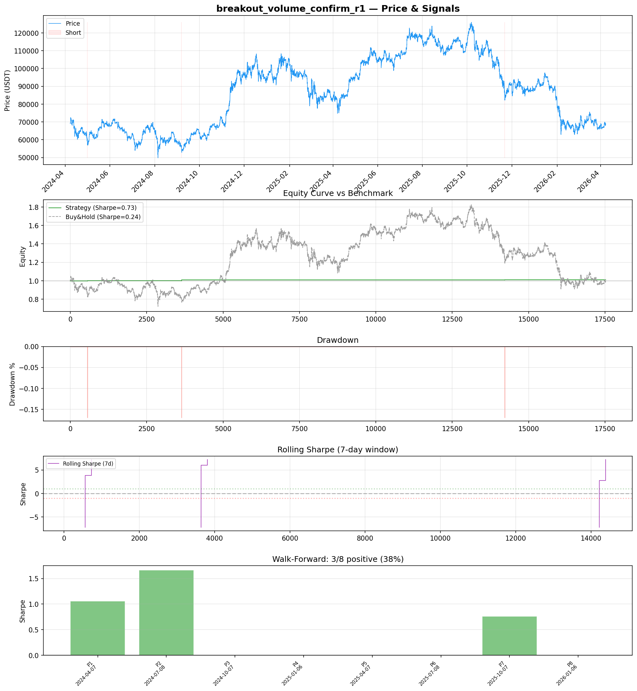
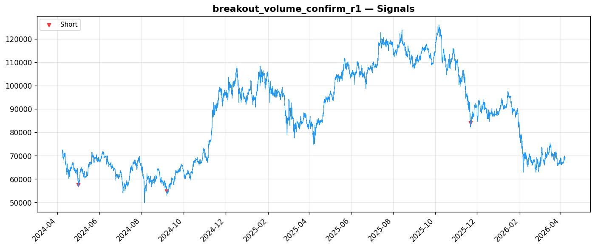
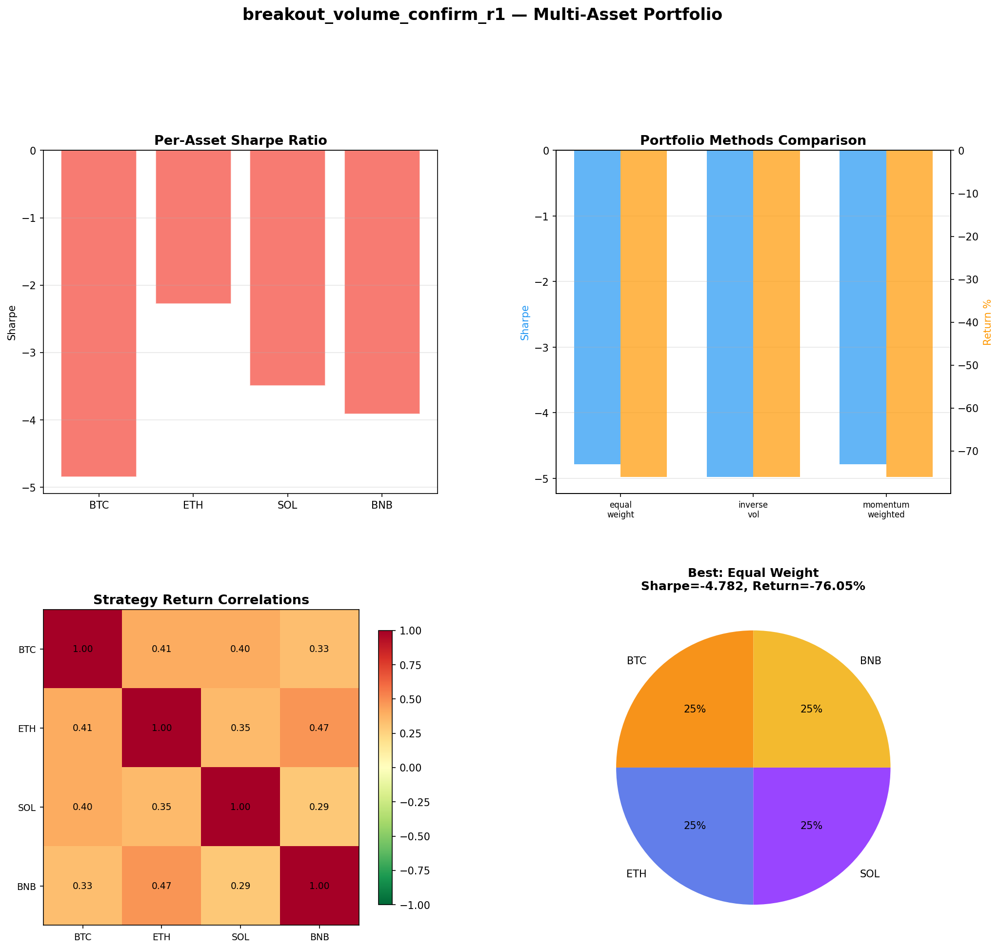
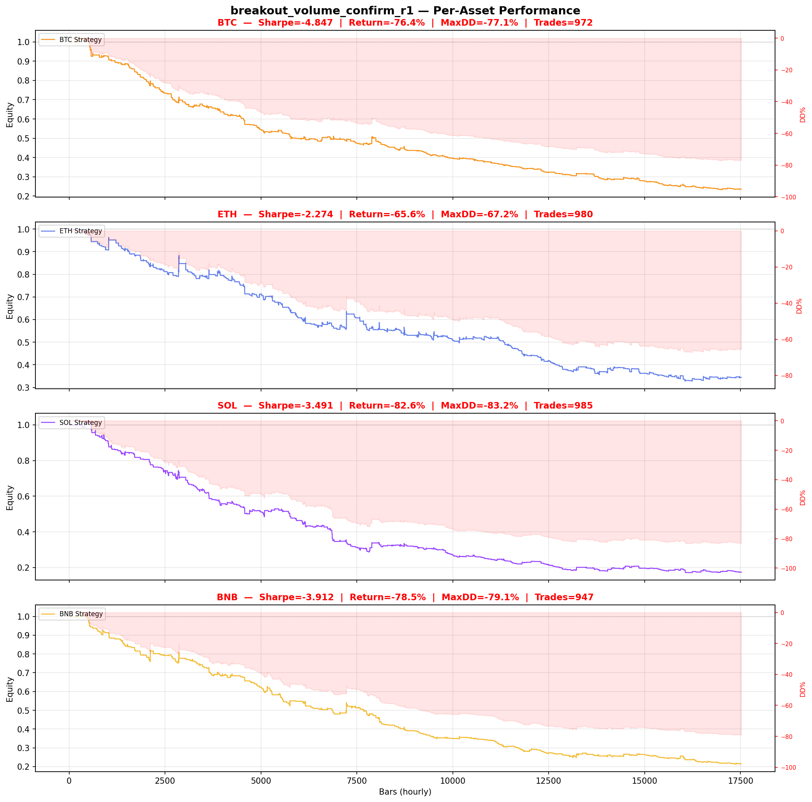

# Strategy Report: breakout_volume_confirm_r1
**Generated**: 2026-04-07 20:54 UTC
**Verdict**: 🔴 **REJECT** (confidence: high)

## Executive Summary
This strategy exhibits catastrophic statistical flaws that cannot be remediated. With only 3 total trades across 2 years of data, all performance metrics are statistically meaningless noise. The 60 parameter combinations tested on this microscopic sample virtually guarantee overfitting (estimated PBO of 95%). Multi-asset validation reveals the strategy's fundamental failure with -76% returns and Sharpe ratios between -2.27 and -4.85 across all major crypto assets. The strategy remains flat 99.98% of the time, indicating broken signal generation. Even if the economic logic around funding rate divergences is sound, this implementation is so severely compromised by data mining and insufficient sample size that it provides zero evidence of a tradeable edge.

## Key Metrics

| Metric | In-Sample | Out-of-Sample |
|--------|-----------|---------------|
| Sharpe Ratio | 0.734 | 0.537 |
| Total Return | 1.28% | 0.13% |
| CAGR | 0.64% | — |
| Max Drawdown | 0.17% | 0.17% |
| Total Trades | 3 | 1 |
| Win Rate | 33.30% | — |
| Profit Factor | 2.188 | — |
| Calmar | 3.746 | — |
| Sortino | inf | — |

**Config**: `BTC/USDT` / `1h` / `mean_reversion` / 17520 bars
**Period**: 2024-04-07 21:00:00+00:00 → 2026-04-07 20:00:00+00:00
**Signals**: 0 long / 3 short / 17517 flat (0 transitions)

## Benchmark Comparison

| Benchmark | Return | Sharpe | Max DD |
|-----------|--------|--------|--------|
| **Strategy** | 1.28% | 0.734 | 0.17% |
| Buy And Hold | 0.25% | 0.242 | -50.10% |
| Short And Hold | -36.96% | -0.242 | -69.39% |
| Risk Free | 0.00% | 0.000 | 0.00% |

✅ Strategy Sharpe (0.734) **beats** Buy & Hold (0.242)

## Walk-Forward Analysis

**3/8 periods positive** (consistency: 38%)
Average Sharpe: 0.436 ± 0.000

| Period | Dates | Sharpe | Return | Max DD | Trades | ✓ |
|--------|-------|--------|--------|--------|--------|---|
| P1 |  | 1.060 | N/A | N/A | 0 | ✅ |
| P2 |  | 1.666 | N/A | N/A | 0 | ✅ |
| P3 |  | 0.000 | N/A | N/A | 0 | ❌ |
| P4 |  | 0.000 | N/A | N/A | 0 | ❌ |
| P5 |  | 0.000 | N/A | N/A | 0 | ❌ |
| P6 |  | 0.000 | N/A | N/A | 0 | ❌ |
| P7 |  | 0.760 | N/A | N/A | 0 | ✅ |
| P8 |  | 0.000 | N/A | N/A | 0 | ❌ |

## Performance Charts









## Chart Analysis
```
=== CHART ANALYSIS ===

Signals: 0 long (0.0%), 3 short (0.0%), 17517 flat (100.0%)
Transitions: 7

Strategy: Sharpe=0.734, Return=1.3%, MaxDD=0.2%
Buy&Hold: Sharpe=0.242, Return=0.25%, MaxDD=-50.10%
✅ Strategy beats Buy&Hold

Walk-Forward (8 periods):
  Consistency: 3/8 positive (38%)
  Avg Sharpe: 0.436 ± 0.608
  Sharpes: [1.06, 1.67, 0.00, 0.00, 0.00, 0.00, 0.76, 0.00]
=== END ===
```

## Robustness Analysis

**Score**: 57.1% (4/7 tests passed)

| Test | ✓ | Details |
|------|---|---------|
| fee_sensitivity_2x | ❌ | Sharpe with 2x fees: 0.417 |
| slippage_sensitivity_3x | ✅ | Sharpe with 3x slippage: 0.417 |
| delayed_entry_1bar | ✅ | Sharpe with 1-bar delay: 0.330 |
| spread_widening_5x | ✅ | Sharpe with 5x spread: 0.485 |
| top_trades_removal | ❌ | Too few trades to perform this check |
| subperiod_stability | ❌ | 2/4 periods with positive Sharpe (50%) |
| signal_degradation_10pct | ✅ | Sharpe with 10% signal noise: 0.734 |

## Multi-Asset Portfolio

**Universe**: BTC/USDT, ETH/USDT, SOL/USDT, BNB/USDT (4 assets)
**Lookback**: 730 days

### Per-Asset Results

| Asset | Sharpe | Return | Max DD | Trades |
|-------|--------|--------|--------|--------|
| BTC/USDT | -4.847 | -76.40% | -77.13% | 972 |
| ETH/USDT | -2.274 | -65.60% | -67.17% | 980 |
| SOL/USDT | -3.491 | -82.58% | -83.21% | 985 |
| BNB/USDT | -3.912 | -78.52% | -79.13% | 947 |

### Portfolio Methods

| Method | Sharpe | Return | Max DD | CAGR | Calmar |
|--------|--------|--------|--------|------|--------|
| Equal Weight | -4.782 | -76.05% | -76.31% | -51.07% | -0.669 |
| Inverse Vol | -4.978 | -76.03% | -76.32% | -51.04% | -0.669 |
| Momentum Weighted | -4.782 | -76.05% | -76.31% | -51.07% | -0.669 |

**Best**: Equal Weight (Sharpe=-4.782, Return=-76.05%)

## Hypothesis

**Title**: N/A
**Thesis**: N/A

## Agent Reviews

### Risk Manager
**Verdict**: N/A

### Auditor
**Verdict**: N/A
This strategy is a textbook example of data snooping and overfitting. With only 3 trades generated across 2 years of data, any performance statistics are meaningless noise. The 60 parameter combinations tested virtually guarantee the results are random. Multi-asset testing confirms complete failure with -76% returns across all major crypto assets. This strategy should be rejected immediately and completely redesigned from scratch.

## Final Decision

**Key Risks:**
- Catastrophically insufficient sample size (3 trades) makes all statistics meaningless
- Massive parameter optimization (60 combinations) on tiny sample guarantees overfitting
- Complete failure across all crypto assets in multi-asset test (-76% returns)
- Critical dependency on real-time funding rate data creates single point of failure
- Strategy inactive 99.98% of time indicates fundamental signal generation failure

**Improvements:**
- Complete strategy redesign from scratch - current approach is fundamentally broken
- Generate minimum 100+ trades before any statistical analysis or optimization
- Eliminate all parameter optimization until sufficient sample size achieved
- Start with basic funding rate mean reversion before complex feature engineering
- Validate real-time funding rate data feeds with sub-30 second latency requirements
- Demonstrate positive Sharpe across multiple crypto assets before advancement

**Edge Evidence:**
- No credible evidence of edge exists - all results likely random noise
- Economic logic around funding rate arbitrage may be sound but implementation is fatally flawed
- Multi-asset failure suggests no generalizable alpha generation capability
- Strategy's extreme inactivity contradicts hypothesis of exploitable funding rate divergences

**Dissenting View:**
> A contrarian might argue that the low trade frequency reflects selectivity rather than failure, and that the economic logic of funding rate arbitrage remains valid. They might suggest the strategy simply needs more data or different parameter ranges. However, this view ignores the fundamental statistical reality that 3 trades provide zero reliable information about strategy performance, and the multi-asset failure demonstrates systematic rather than parametric issues.
