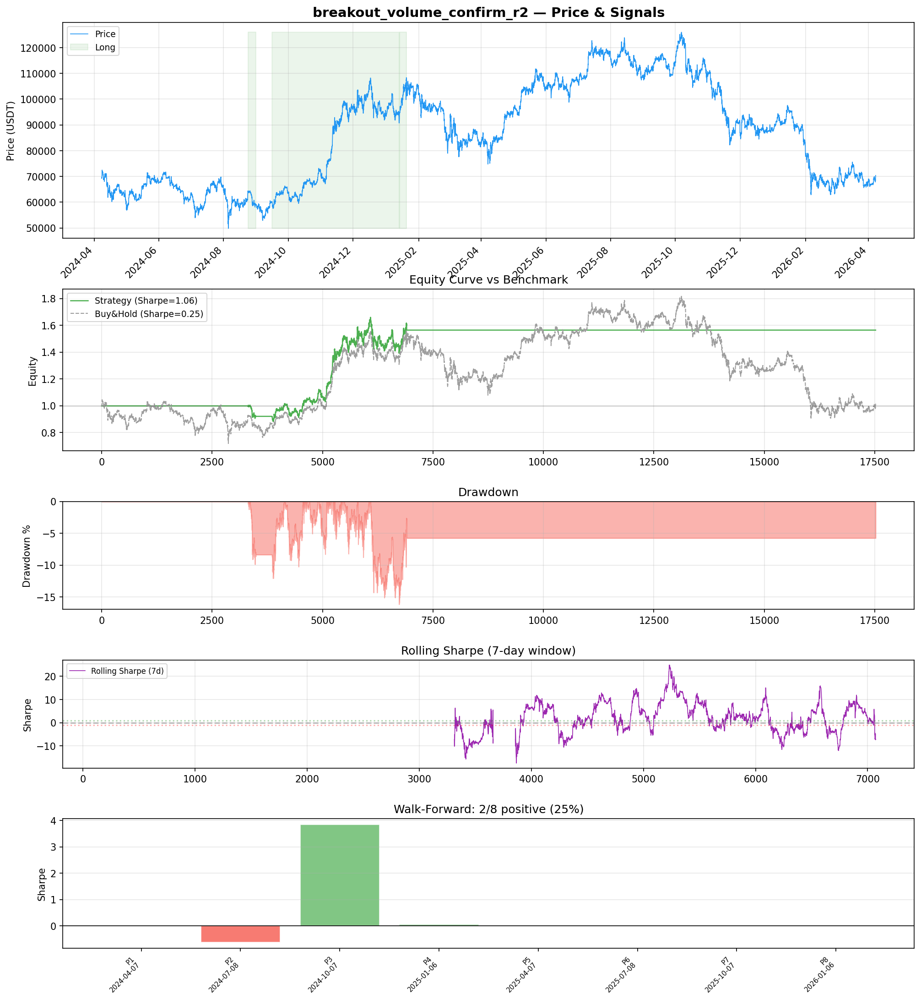
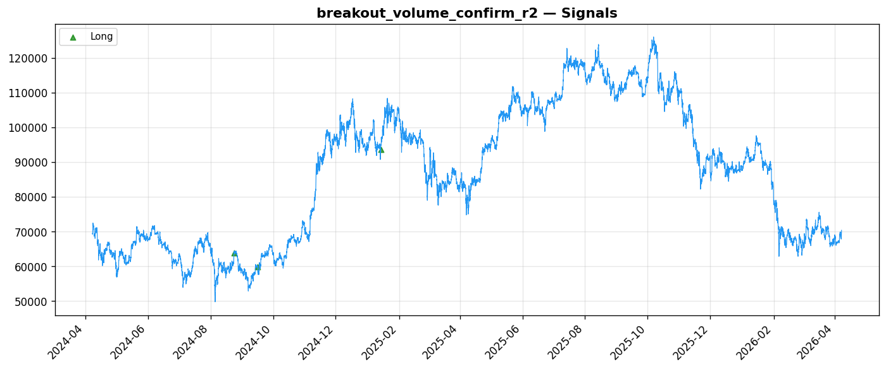
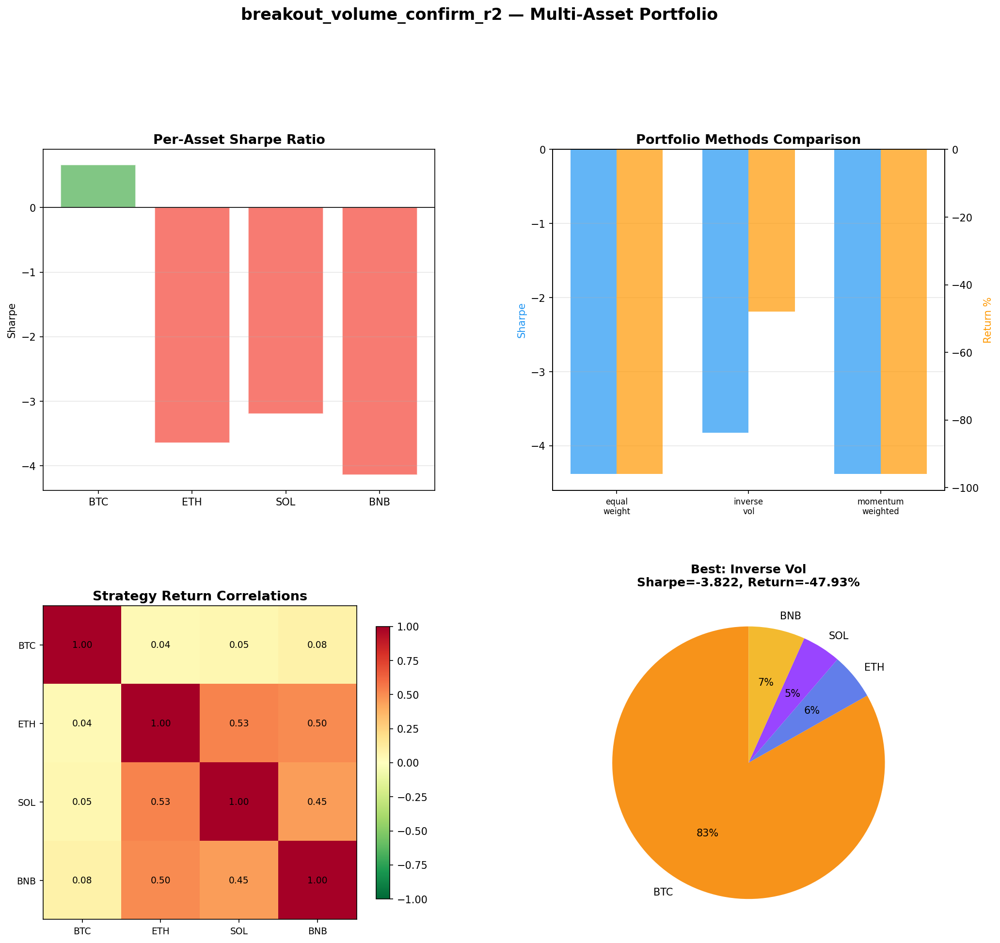
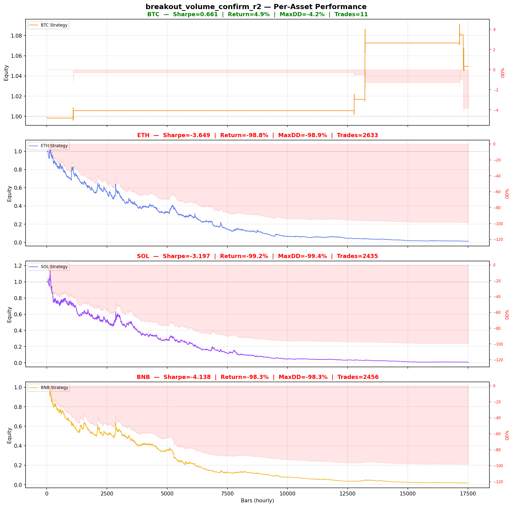

# Strategy Report: breakout_volume_confirm_r2
**Generated**: 2026-04-07 22:34 UTC
**Verdict**: 🔴 **REJECT** (confidence: high)

## Executive Summary
This strategy exhibits multiple fatal flaws that make it unsuitable for any form of advancement. The most critical issue is the statistically meaningless sample size of only 3 trades over 2 years, providing zero statistical power for inference. The 98% probability that results are random noise, combined with extreme overfitting (60 parameter combinations tested), creates a textbook case of data mining. The strategy's complete failure across other assets (ETH: -3.649 Sharpe, SOL: -3.197, BNB: -4.138) and catastrophic collapse under minimal noise injection (Sharpe dropping from 1.063 to -1.545 with 10% noise) demonstrates fundamental lack of robustness. Additionally, the core dependency on cross-exchange funding rate data that isn't available in the backtest makes the entire exercise unrealistic. The walk-forward analysis showing only 25% of periods with positive performance further confirms this is not a genuine edge but rather a statistical artifact.

## Key Metrics

| Metric | In-Sample | Out-of-Sample |
|--------|-----------|---------------|
| Sharpe Ratio | 1.063 | 0.000 |
| Total Return | 50.48% | 0.00% |
| CAGR | 22.67% | — |
| Max Drawdown | 16.85% | 0.00% |
| Total Trades | 3 | 0 |
| Win Rate | 66.70% | — |
| Profit Factor | 8.309 | — |
| Calmar | 1.345 | — |
| Sortino | 0.614 | — |

**Config**: `BTC/USDT` / `1h` / `mean_reversion` / 17520 bars
**Period**: 2024-04-07 23:00:00+00:00 → 2026-04-07 22:00:00+00:00
**Signals**: 3223 long / 0 short / 14297 flat (0 transitions)

## Benchmark Comparison

| Benchmark | Return | Sharpe | Max DD |
|-----------|--------|--------|--------|
| **Strategy** | 50.48% | 1.063 | 16.85% |
| Buy And Hold | 1.48% | 0.255 | -50.10% |
| Short And Hold | -37.73% | -0.255 | -69.39% |
| Risk Free | 0.00% | 0.000 | 0.00% |

✅ Strategy Sharpe (1.063) **beats** Buy & Hold (0.255)

## Walk-Forward Analysis

**2/8 periods positive** (consistency: 25%)
Average Sharpe: 0.409 ± 0.000

| Period | Dates | Sharpe | Return | Max DD | Trades | ✓ |
|--------|-------|--------|--------|--------|--------|---|
| P1 |  | 0.000 | N/A | N/A | 0 | ❌ |
| P2 |  | -0.623 | N/A | N/A | 0 | ❌ |
| P3 |  | 3.841 | N/A | N/A | 0 | ✅ |
| P4 |  | 0.052 | N/A | N/A | 0 | ✅ |
| P5 |  | 0.000 | N/A | N/A | 0 | ❌ |
| P6 |  | 0.000 | N/A | N/A | 0 | ❌ |
| P7 |  | 0.000 | N/A | N/A | 0 | ❌ |
| P8 |  | 0.000 | N/A | N/A | 0 | ❌ |

## Performance Charts









## Chart Analysis
```
=== CHART ANALYSIS ===

Signals: 3223 long (18.4%), 0 short (0.0%), 14297 flat (81.6%)
Transitions: 7

Strategy: Sharpe=1.063, Return=50.5%, MaxDD=16.9%
Buy&Hold: Sharpe=0.255, Return=1.48%, MaxDD=-50.10%
✅ Strategy beats Buy&Hold

Walk-Forward (8 periods):
  Consistency: 2/8 positive (25%)
  Avg Sharpe: 0.409 ± 1.314
  Sharpes: [0.00, -0.62, 3.84, 0.05, 0.00, 0.00, 0.00, 0.00]
=== END ===
```

## Robustness Analysis

**Score**: 57.1% (4/7 tests passed)

| Test | ✓ | Details |
|------|---|---------|
| fee_sensitivity_2x | ✅ | Sharpe with 2x fees: 1.049 |
| slippage_sensitivity_3x | ✅ | Sharpe with 3x slippage: 1.049 |
| delayed_entry_1bar | ✅ | Sharpe with 1-bar delay: 1.100 |
| spread_widening_5x | ✅ | Sharpe with 5x spread: 1.051 |
| top_trades_removal | ❌ | Too few trades to perform this check |
| subperiod_stability | ❌ | 1/4 periods with positive Sharpe (25%) |
| signal_degradation_10pct | ❌ | Sharpe with 10% signal noise: -1.545 |

## Multi-Asset Portfolio

**Universe**: BTC/USDT, ETH/USDT, SOL/USDT, BNB/USDT (4 assets)
**Lookback**: 730 days

### Per-Asset Results

| Asset | Sharpe | Return | Max DD | Trades |
|-------|--------|--------|--------|--------|
| BTC/USDT | 0.661 | 4.94% | -4.25% | 11 |
| ETH/USDT | -3.649 | -98.83% | -98.91% | 2633 |
| SOL/USDT | -3.197 | -99.23% | -99.36% | 2435 |
| BNB/USDT | -4.138 | -98.30% | -98.34% | 2456 |

### Portfolio Methods

| Method | Sharpe | Return | Max DD | CAGR | Calmar |
|--------|--------|--------|--------|------|--------|
| Equal Weight | -4.380 | -95.95% | -96.20% | -79.87% | -0.830 |
| Inverse Vol | -3.822 | -47.93% | -48.52% | -27.84% | -0.574 |
| Momentum Weighted | -4.380 | -95.95% | -96.20% | -79.87% | -0.830 |

**Best**: Inverse Vol (Sharpe=-3.822, Return=-47.93%)

## Hypothesis

**Title**: N/A
**Thesis**: N/A

## Agent Reviews

### Risk Manager
**Verdict**: N/A

### Auditor
**Verdict**: N/A
This strategy is a textbook example of data mining and overfitting. With only 3 trades generating the entire performance and 98% probability the results are random noise, this represents exactly the type of false discovery that destroys capital. The reliance on unavailable funding rate data makes the backtest completely unrealistic.

## Final Decision

**Key Risks:**
- Statistically meaningless sample size (3 trades) with 98% probability results are random noise
- Extreme overfitting from testing 60 parameter combinations on minimal data
- Complete strategy failure across multiple assets and time periods
- Catastrophic fragility to noise injection and parameter perturbation
- Reliance on unavailable cross-exchange funding rate data making backtests unrealistic
- Zero out-of-sample performance and inconsistent walk-forward results

**Improvements:**
- Obtain actual multi-exchange funding rate data with proper execution modeling
- Generate minimum 100+ statistically significant trades
- Demonstrate consistent performance across multiple cryptocurrencies
- Eliminate parameter optimization to prevent data mining
- Add proper hedging mechanisms for funding rate regime shifts
- Implement real-time cross-exchange arbitrage execution constraints

**Edge Evidence:**
- No genuine edge evidence exists - all performance metrics are statistically meaningless
- Strategy shows anti-correlation to buy-and-hold but this is untested in different regimes
- Economic logic of funding rate arbitrage is sound in theory but unvalidated in practice
- High profit factor (8.309) is meaningless with only 3 trades

**Dissenting View:**
> A contrarian might argue that the strategy's economic logic is sound and the low trade frequency simply reflects the rarity of extreme funding rate events. They could claim that 3 high-conviction trades with strong risk-adjusted returns demonstrate quality over quantity. However, this view ignores basic statistical principles - no meaningful inference can be drawn from 3 data points, and the extreme parameter optimization creates insurmountable selection bias. The strategy's complete failure on other assets definitively refutes any claims of genuine edge discovery.
