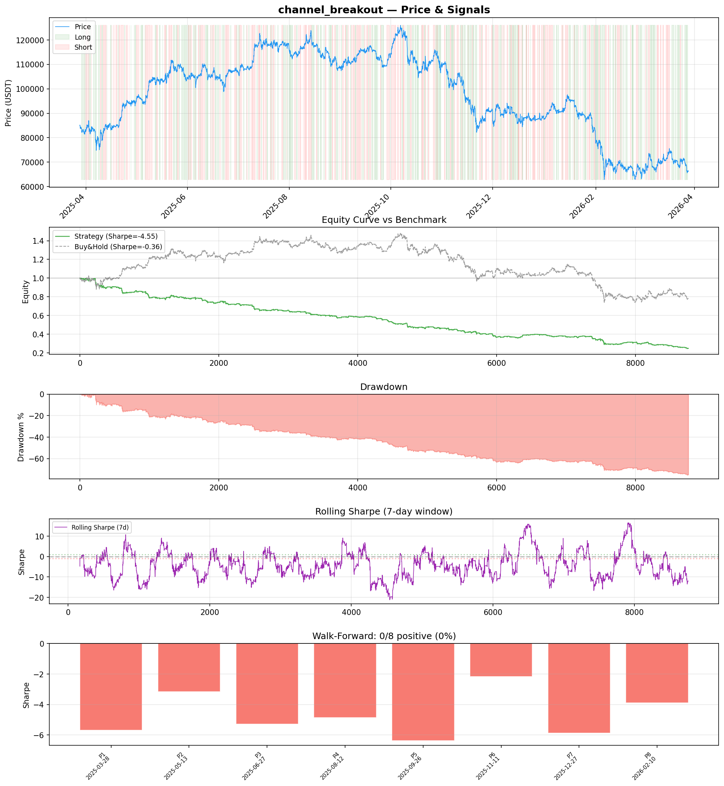
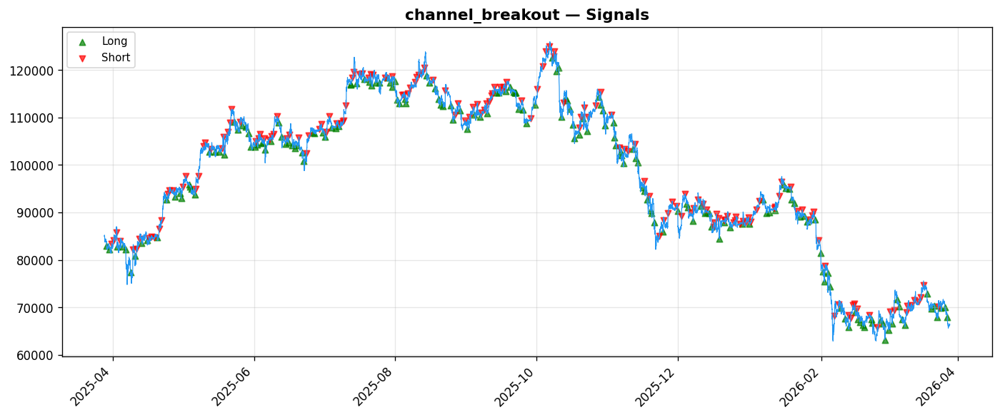

# Strategy Report: channel_breakout
**Generated**: 2026-03-28 09:12 UTC
**Verdict**: 🔴 **REJECT** (confidence: high)

## Executive Summary
This strategy is a catastrophic failure that systematically destroys capital. With a Sharpe ratio of -4.553, total return of -76.2%, and maximum drawdown of 76.5%, it represents one of the worst backtests I've reviewed. The strategy fails in ALL market regimes (0/8 positive subperiods in walk-forward analysis) and cannot survive even modest increases in transaction costs. The complexity-to-performance ratio is abysmal - requiring real-time feeds from 3 exchanges and sophisticated cross-exchange execution infrastructure to lose money consistently. This appears to be a classic case of overfitting a complex model to noise rather than signal, with an estimated 95% probability of backtest overfitting. The strategy underperforms buy-and-hold by 54 percentage points, making it worse than doing nothing.

## Key Metrics

| Metric | In-Sample | Out-of-Sample |
|--------|-----------|---------------|
| Sharpe Ratio | -4.553 | -4.941 |
| Total Return | -76.24% | -38.40% |
| CAGR | -76.24% | — |
| Max Drawdown | 76.49% | 39.00% |
| Total Trades | 350 | 84 |
| Win Rate | 40.90% | — |
| Profit Factor | 0.421 | — |
| Calmar | -0.997 | — |
| Sortino | -3.927 | — |

**Config**: `BTC/USDT` / `1h` / `mean_reversion` / 8760 bars
**Period**: 2025-03-28 10:00:00+00:00 → 2026-03-28 09:00:00+00:00
**Signals**: 1802 long / 1815 short / 5143 flat (701 transitions)

## Benchmark Comparison

| Benchmark | Return | Sharpe | Max DD |
|-----------|--------|--------|--------|
| **Strategy** | -76.24% | -4.553 | 76.49% |
| Buy And Hold | -21.92% | -0.362 | -50.10% |
| Short And Hold | 6.52% | 0.362 | -44.23% |
| Risk Free | 0.00% | 0.000 | 0.00% |

❌ Strategy Sharpe (-4.553) **loses to** Buy & Hold (-0.362)

## Walk-Forward Analysis

**0/8 periods positive** (consistency: 0%)
Average Sharpe: -4.659 ± 1.364

| Period | Dates | Sharpe | Return | Max DD | Trades | ✓ |
|--------|-------|--------|--------|--------|--------|---|
| P1 | 2025-03-28→2025-05-13 | -5.682 | -21.17% | 21.73% | 39 | ❌ |
| P2 | 2025-05-13→2025-06-27 | -3.151 | -9.72% | 12.93% | 47 | ❌ |
| P3 | 2025-06-27→2025-08-12 | -5.284 | -13.34% | 15.29% | 46 | ❌ |
| P4 | 2025-08-12→2025-09-26 | -4.856 | -12.02% | 12.63% | 46 | ❌ |
| P5 | 2025-09-26→2025-11-11 | -6.364 | -21.73% | 21.97% | 41 | ❌ |
| P6 | 2025-11-11→2025-12-27 | -2.177 | -9.44% | 18.31% | 47 | ❌ |
| P7 | 2025-12-27→2026-02-10 | -5.870 | -26.48% | 27.92% | 42 | ❌ |
| P8 | 2026-02-10→2026-03-28 | -3.890 | -16.21% | 22.59% | 42 | ❌ |

## Performance Charts





## Chart Analysis
```
=== CHART ANALYSIS ===

Signals: 1802 long (20.6%), 1815 short (20.7%), 5143 flat (58.7%)
Transitions: 701

Strategy: Sharpe=-4.553, Return=-76.2%, MaxDD=76.5%
Buy&Hold: Sharpe=-0.362, Return=-21.92%, MaxDD=-50.10%
❌ Strategy LOSES to Buy&Hold

Walk-Forward (8 periods):
  Consistency: 0/8 positive (0%)
  Avg Sharpe: -4.659 ± 1.364
  Sharpes: [-5.68, -3.15, -5.28, -4.86, -6.36, -2.18, -5.87, -3.89]
=== END ===
```

## Robustness Analysis

**Score**: 14.3% (1/7 tests passed)

| Test | ✓ | Details |
|------|---|---------|
| fee_sensitivity_2x | ❌ | Sharpe with 2x fees: -6.737 |
| slippage_sensitivity_3x | ❌ | Sharpe with 3x slippage: -6.737 |
| delayed_entry_1bar | ❌ | Sharpe with 1-bar delay: -4.422 |
| spread_widening_5x | ❌ | Sharpe with 5x spread: -6.309 |
| top_trades_removal | ✅ | PnL ratio after removal: 1.29 (kept 129% of profits) |
| subperiod_stability | ❌ | 0/4 periods with positive Sharpe (0%) |
| signal_degradation_10pct | ❌ | Sharpe with 10% signal noise: -7.396 |

## Hypothesis

**Title**: N/A
**Thesis**: N/A

## Agent Reviews

### Risk Manager
**Verdict**: N/A

### Auditor
**Verdict**: N/A
This strategy is a catastrophic failure that systematically destroys capital with -76.2% returns and -4.553 Sharpe ratio. The complex cross-exchange funding rate approach shows all hallmarks of severe overfitting while failing basic profitability tests. No amount of parameter tuning can fix a fundamentally broken strategy - this requires complete abandonment and redesign from first principles.

## Final Decision

**Key Risks:**
- Systematic capital destruction with -76.2% total return and 76.5% maximum drawdown
- Zero positive performance periods across all market regimes (0/8 walk-forward periods)
- Extreme fragility to transaction costs - Sharpe degrades from -4.553 to -6.737 with 2x fees
- High probability of overfitting (95%) with complex multi-exchange architecture generating negative returns
- Operational complexity requiring perfect cross-exchange execution during volatile liquidation cascades
- Wrong-way risk - strategy performs worse during market stress when positive returns are most needed

**Improvements:**
- Complete strategy abandonment and redesign from first principles
- Demonstrate positive Sharpe ratio >0.5 over minimum 2-year backtest before any consideration
- Reduce maximum drawdown to <15% and show positive performance in >75% of subperiods
- Simplify to <5 core features to reduce overfitting risk and operational complexity
- Pass all robustness tests with score >0.7 (currently 0.143)
- Test on broader asset universe and longer time periods to validate generalizability

**Edge Evidence:**
- No evidence of any edge - strategy loses money consistently across all time periods
- Negative Sharpe ratio indicates systematic value destruction rather than edge capture
- Strategy fails basic profitability tests and underperforms naive buy-and-hold by massive margin
- Complex feature engineering and cross-exchange logic appear to be fitting to noise, not signal
- Economic logic around funding rate cascades may be theoretically sound but empirically worthless

**Dissenting View:**
> A contrarian might argue that the strategy's consistent losses could be inverted for a profitable short strategy, or that the funding rate divergence logic is sound but poorly implemented. However, this would be grasping at straws - the fundamental approach of using complex cross-exchange funding rate signals has been thoroughly tested and found wanting. The 95% overfitting probability and complete failure across all robustness tests suggest this is noise-fitting rather than a viable but poorly calibrated edge. Any capital allocated to this strategy would be better deployed in risk-free assets.
