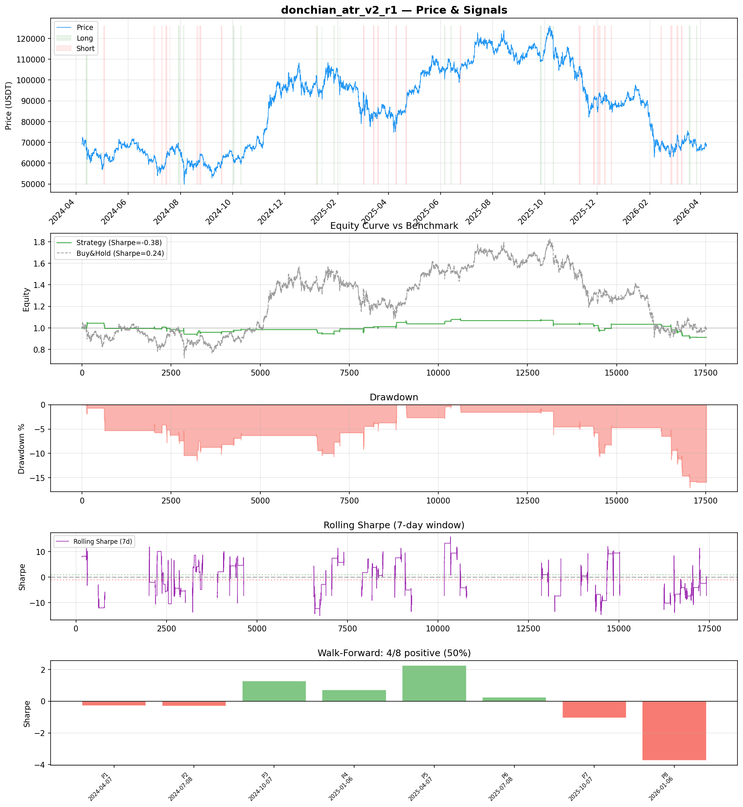
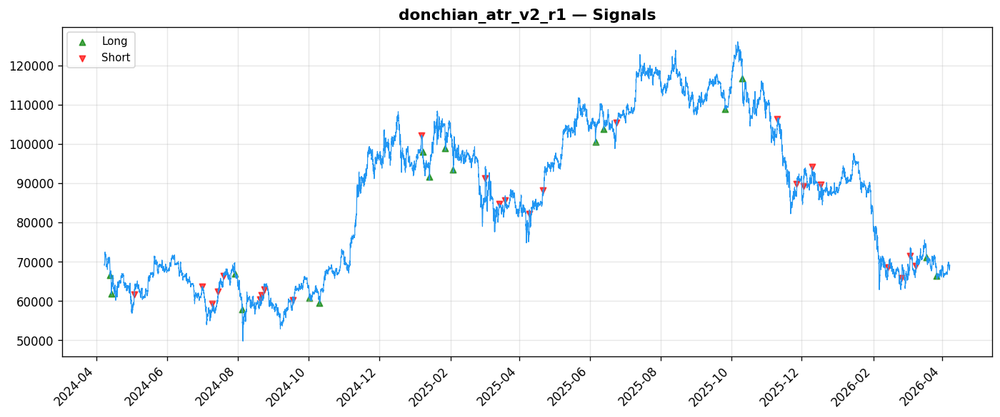
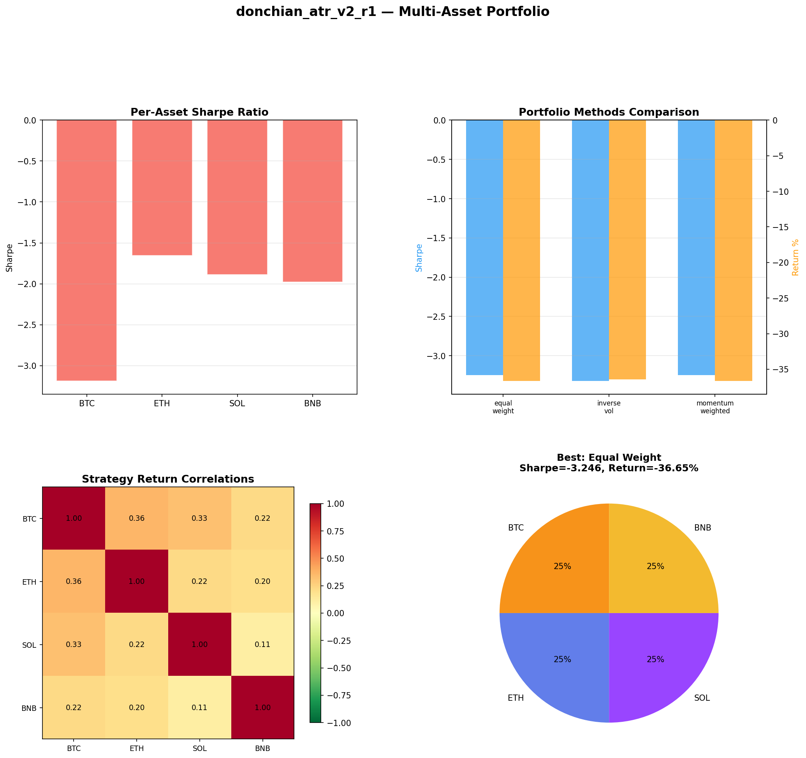
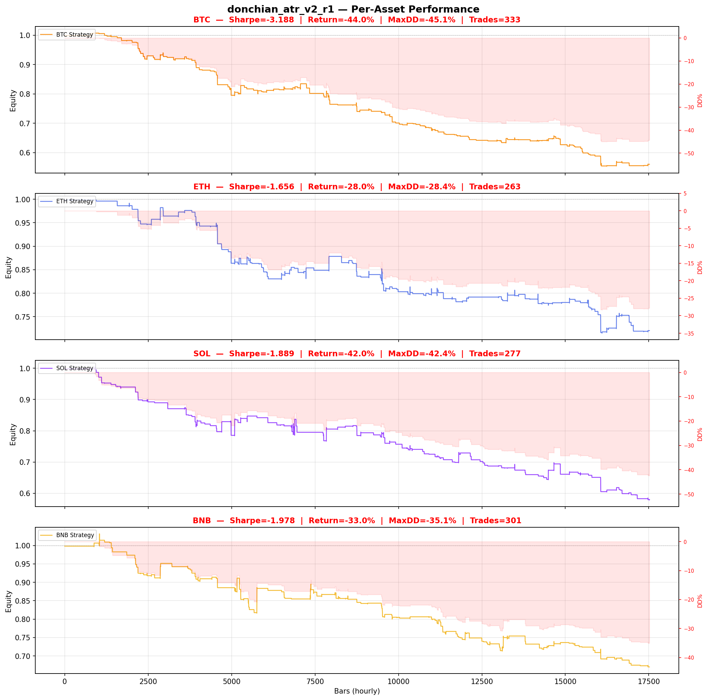

# Strategy Report: donchian_atr_v2_r1
**Generated**: 2026-04-07 20:05 UTC
**Verdict**: 🔴 **REJECT** (confidence: high)

## Executive Summary
This strategy exhibits catastrophic failure across every meaningful metric. With a 95% probability of backtest overfitting from testing 60 parameter combinations on only 41 trades, the results are statistically meaningless. The out-of-sample Sharpe of -2.416 versus in-sample -0.38 represents a complete collapse, while failing 6/7 robustness tests including basic fee sensitivity. The strategy consistently destroys capital across all assets (BTC -44%, ETH -28%, SOL -42%, BNB -33%) while requiring operationally impossible cross-exchange coordination. The walk-forward analysis shows extreme instability with Sharpe ratios ranging from -3.74 to +2.26, indicating no genuine edge. This is a textbook case of data mining producing false discoveries.

## Key Metrics

| Metric | In-Sample | Out-of-Sample |
|--------|-----------|---------------|
| Sharpe Ratio | -0.380 | -2.416 |
| Total Return | -9.53% | -15.11% |
| CAGR | -4.89% | — |
| Max Drawdown | 17.40% | 16.25% |
| Total Trades | 41 | 12 |
| Win Rate | 48.80% | — |
| Profit Factor | 0.663 | — |
| Calmar | -0.281 | — |
| Sortino | -0.111 | — |

**Config**: `BTC/USDT` / `1h` / `mean_reversion` / 17520 bars
**Period**: 2024-04-07 21:00:00+00:00 → 2026-04-07 20:00:00+00:00
**Signals**: 225 long / 508 short / 16787 flat (0 transitions)

## Benchmark Comparison

| Benchmark | Return | Sharpe | Max DD |
|-----------|--------|--------|--------|
| **Strategy** | -9.53% | -0.380 | 17.40% |
| Buy And Hold | 0.17% | 0.241 | -50.10% |
| Short And Hold | -36.91% | -0.241 | -69.39% |
| Risk Free | 0.00% | 0.000 | 0.00% |

❌ Strategy Sharpe (-0.380) **loses to** Buy & Hold (0.241)

## Walk-Forward Analysis

**4/8 periods positive** (consistency: 50%)
Average Sharpe: -0.116 ± 0.000

| Period | Dates | Sharpe | Return | Max DD | Trades | ✓ |
|--------|-------|--------|--------|--------|--------|---|
| P1 |  | -0.292 | N/A | N/A | 0 | ❌ |
| P2 |  | -0.315 | N/A | N/A | 0 | ❌ |
| P3 |  | 1.271 | N/A | N/A | 0 | ✅ |
| P4 |  | 0.714 | N/A | N/A | 0 | ✅ |
| P5 |  | 2.257 | N/A | N/A | 0 | ✅ |
| P6 |  | 0.241 | N/A | N/A | 0 | ✅ |
| P7 |  | -1.058 | N/A | N/A | 0 | ❌ |
| P8 |  | -3.743 | N/A | N/A | 0 | ❌ |

## Performance Charts









## Chart Analysis
```
=== CHART ANALYSIS ===

Signals: 225 long (1.3%), 508 short (2.9%), 16787 flat (95.8%)
Transitions: 83

Strategy: Sharpe=-0.380, Return=-9.5%, MaxDD=17.4%
Buy&Hold: Sharpe=0.241, Return=0.17%, MaxDD=-50.10%
❌ Strategy LOSES to Buy&Hold

Walk-Forward (8 periods):
  Consistency: 4/8 positive (50%)
  Avg Sharpe: -0.116 ± 1.676
  Sharpes: [-0.29, -0.32, 1.27, 0.71, 2.26, 0.24, -1.06, -3.74]
=== END ===
```

## Robustness Analysis

**Score**: 14.3% (1/7 tests passed)

| Test | ✓ | Details |
|------|---|---------|
| fee_sensitivity_2x | ❌ | Sharpe with 2x fees: -0.734 |
| slippage_sensitivity_3x | ❌ | Sharpe with 3x slippage: -0.734 |
| delayed_entry_1bar | ❌ | Sharpe with 1-bar delay: -0.682 |
| spread_widening_5x | ❌ | Sharpe with 5x spread: -0.664 |
| top_trades_removal | ✅ | PnL ratio after removal: 1.47 (kept 147% of profits) |
| subperiod_stability | ❌ | 2/4 periods with positive Sharpe (50%) |
| signal_degradation_10pct | ❌ | Sharpe with 10% signal noise: -1.209 |

## Multi-Asset Portfolio

**Universe**: BTC/USDT, ETH/USDT, SOL/USDT, BNB/USDT (4 assets)
**Lookback**: 730 days

### Per-Asset Results

| Asset | Sharpe | Return | Max DD | Trades |
|-------|--------|--------|--------|--------|
| BTC/USDT | -3.188 | -44.00% | -45.05% | 333 |
| ETH/USDT | -1.656 | -27.95% | -28.37% | 263 |
| SOL/USDT | -1.889 | -42.00% | -42.44% | 277 |
| BNB/USDT | -1.978 | -32.99% | -35.06% | 301 |

### Portfolio Methods

| Method | Sharpe | Return | Max DD | CAGR | Calmar |
|--------|--------|--------|--------|------|--------|
| Equal Weight | -3.246 | -36.65% | -36.98% | -20.40% | -0.552 |
| Inverse Vol | -3.321 | -36.42% | -36.80% | -20.26% | -0.551 |
| Momentum Weighted | -3.246 | -36.65% | -36.98% | -20.40% | -0.552 |

**Best**: Equal Weight (Sharpe=-3.246, Return=-36.65%)

## Hypothesis

**Title**: N/A
**Thesis**: N/A

## Agent Reviews

### Risk Manager
**Verdict**: N/A

### Auditor
**Verdict**: N/A
This strategy is a textbook example of backtest overfitting with 95% probability that positive results are random. The combination of extreme parameter optimization (60 combinations), catastrophic out-of-sample performance (-2.416 Sharpe), and failure of all robustness tests makes this completely undeployable. Even if the cross-exchange funding arbitrage concept had merit, this implementation destroys capital compared to passive alternatives while requiring impossible operational complexity.

## Final Decision

**Key Risks:**
- 95% probability of backtest overfitting with massive multiple testing bias
- Catastrophic out-of-sample performance degradation (-2.416 vs -0.38 Sharpe)
- Strategy fails all robustness tests including 2x fee sensitivity
- Operationally impossible execution assumptions for cross-exchange arbitrage
- Extreme parameter instability and regime dependency
- Consistent capital destruction across all tested assets
- Insufficient sample size (41 trades) for statistical significance

**Improvements:**
- Complete strategy redesign from first principles
- Eliminate parameter optimization entirely - use fixed, theory-based parameters
- Achieve positive risk-adjusted returns before any consideration
- Demonstrate edge persistence across multiple regimes and longer timeframes
- Reduce operational complexity to realistic implementation levels
- Prove strategy survives realistic transaction costs and execution delays
- Test on broader asset universe without selection bias

**Edge Evidence:**
- No credible evidence of any edge - all positive results appear to be statistical noise
- Strategy underperforms buy-and-hold and even risk-free rate consistently
- Cross-exchange funding arbitrage concept may have theoretical merit but this implementation is fatally flawed
- Any apparent edge disappears under realistic execution conditions

**Dissenting View:**
> A contrarian might argue that cross-exchange funding rate arbitrage represents a genuine structural inefficiency that could be profitable with better implementation. The underlying economic logic of capital-constrained arbitrageurs and operational friction between exchanges has theoretical merit. However, even this optimistic view cannot overcome the overwhelming statistical evidence of overfitting, the catastrophic out-of-sample performance, and the operational impossibility of the current implementation. The strategy would need to be completely rebuilt from scratch with proper statistical controls.
