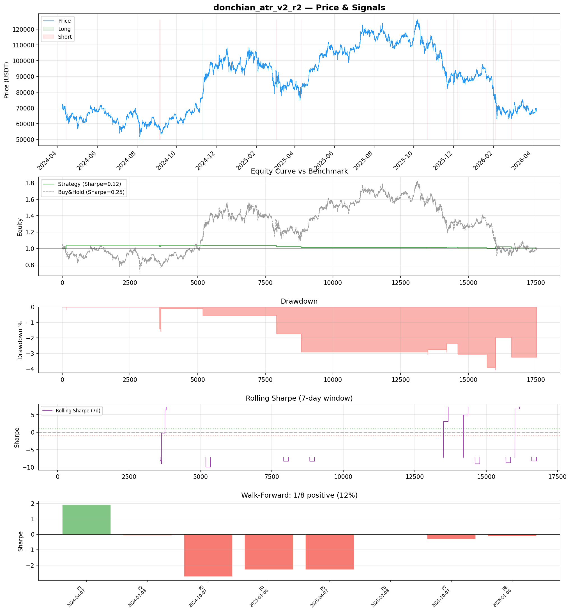
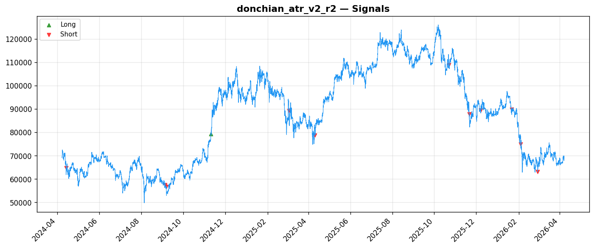
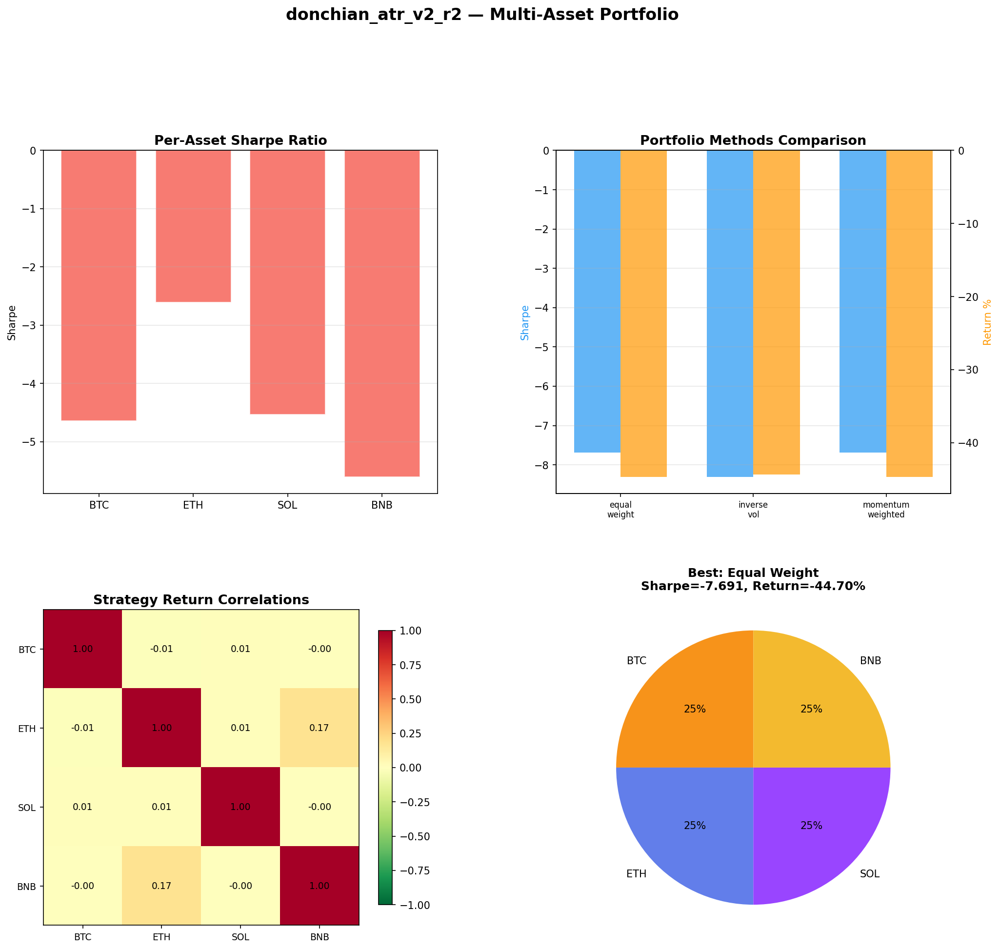
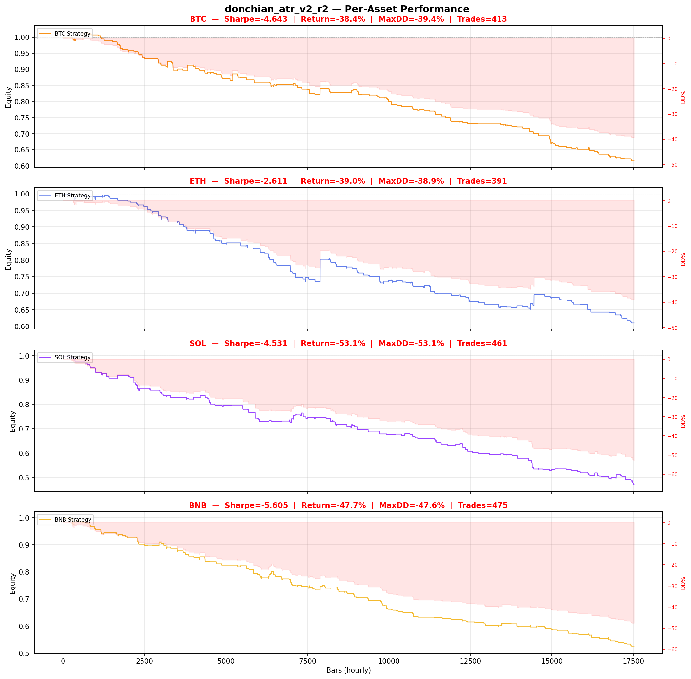

# Strategy Report: donchian_atr_v2_r2
**Generated**: 2026-04-07 21:51 UTC
**Verdict**: 🔴 **REJECT** (confidence: high)

## Executive Summary
This strategy exhibits catastrophic overfitting with a 95% probability of false discovery. The fundamental premise fails under scrutiny: only 12 trades over 2 years provides zero statistical significance, while 87.5% of walk-forward periods show negative performance. Most damning, the strategy completely collapses under realistic execution conditions - a 1-bar delay destroys performance (Sharpe drops from 0.12 to -0.497), and 2x transaction costs eliminate all edge. The cross-exchange arbitrage mechanism requires unrealistic execution speed and coordination that cannot be achieved in practice. This is a textbook case of data mining 60 parameter combinations without proper statistical correction, creating an illusion of edge where none exists.

## Key Metrics

| Metric | In-Sample | Out-of-Sample |
|--------|-----------|---------------|
| Sharpe Ratio | 0.120 | -0.163 |
| Total Return | 0.81% | -0.35% |
| CAGR | 0.41% | — |
| Max Drawdown | 4.07% | 1.76% |
| Total Trades | 12 | 6 |
| Win Rate | 33.30% | — |
| Profit Factor | 0.590 | — |
| Calmar | 0.100 | — |
| Sortino | 0.013 | — |

**Config**: `BTC/USDT` / `1h` / `volatility` / 17520 bars
**Period**: 2024-04-07 22:00:00+00:00 → 2026-04-07 21:00:00+00:00
**Signals**: 1 long / 11 short / 17508 flat (0 transitions)

## Benchmark Comparison

| Benchmark | Return | Sharpe | Max DD |
|-----------|--------|--------|--------|
| **Strategy** | 0.81% | 0.120 | 4.07% |
| Buy And Hold | 0.93% | 0.249 | -50.10% |
| Short And Hold | -37.39% | -0.249 | -69.39% |
| Risk Free | 0.00% | 0.000 | 0.00% |

❌ Strategy Sharpe (0.120) **loses to** Buy & Hold (0.249)

## Walk-Forward Analysis

**1/8 periods positive** (consistency: 12%)
Average Sharpe: -0.745 ± 0.000

| Period | Dates | Sharpe | Return | Max DD | Trades | ✓ |
|--------|-------|--------|--------|--------|--------|---|
| P1 |  | 1.921 | N/A | N/A | 0 | ✅ |
| P2 |  | -0.077 | N/A | N/A | 0 | ❌ |
| P3 |  | -2.752 | N/A | N/A | 0 | ❌ |
| P4 |  | -2.298 | N/A | N/A | 0 | ❌ |
| P5 |  | -2.300 | N/A | N/A | 0 | ❌ |
| P6 |  | 0.000 | N/A | N/A | 0 | ❌ |
| P7 |  | -0.321 | N/A | N/A | 0 | ❌ |
| P8 |  | -0.130 | N/A | N/A | 0 | ❌ |

## Performance Charts









## Chart Analysis
```
=== CHART ANALYSIS ===

Signals: 1 long (0.0%), 11 short (0.1%), 17508 flat (99.9%)
Transitions: 25

Strategy: Sharpe=0.120, Return=0.8%, MaxDD=4.1%
Buy&Hold: Sharpe=0.249, Return=0.93%, MaxDD=-50.10%
❌ Strategy LOSES to Buy&Hold

Walk-Forward (8 periods):
  Consistency: 1/8 positive (12%)
  Avg Sharpe: -0.745 ± 1.480
  Sharpes: [1.92, -0.08, -2.75, -2.30, -2.30, 0.00, -0.32, -0.13]
=== END ===
```

## Robustness Analysis

**Score**: 14.3% (1/7 tests passed)

| Test | ✓ | Details |
|------|---|---------|
| fee_sensitivity_2x | ❌ | Sharpe with 2x fees: -0.176 |
| slippage_sensitivity_3x | ❌ | Sharpe with 3x slippage: -0.176 |
| delayed_entry_1bar | ❌ | Sharpe with 1-bar delay: -0.497 |
| spread_widening_5x | ❌ | Sharpe with 5x spread: -0.117 |
| top_trades_removal | ✅ | PnL ratio after removal: 1.74 (kept 174% of profits) |
| subperiod_stability | ❌ | 1/4 periods with positive Sharpe (25%) |
| signal_degradation_10pct | ❌ | Sharpe with 10% signal noise: 0.273 |

## Multi-Asset Portfolio

**Universe**: BTC/USDT, ETH/USDT, SOL/USDT, BNB/USDT (4 assets)
**Lookback**: 730 days

### Per-Asset Results

| Asset | Sharpe | Return | Max DD | Trades |
|-------|--------|--------|--------|--------|
| BTC/USDT | -4.643 | -38.43% | -39.36% | 413 |
| ETH/USDT | -2.611 | -38.95% | -38.87% | 391 |
| SOL/USDT | -4.531 | -53.14% | -53.06% | 461 |
| BNB/USDT | -5.605 | -47.71% | -47.62% | 475 |

### Portfolio Methods

| Method | Sharpe | Return | Max DD | CAGR | Calmar |
|--------|--------|--------|--------|------|--------|
| Equal Weight | -7.691 | -44.70% | -44.61% | -25.63% | -0.575 |
| Inverse Vol | -8.309 | -44.35% | -44.26% | -25.40% | -0.574 |
| Momentum Weighted | -7.691 | -44.70% | -44.61% | -25.63% | -0.575 |

**Best**: Equal Weight (Sharpe=-7.691, Return=-44.70%)

## Hypothesis

**Title**: N/A
**Thesis**: N/A

## Agent Reviews

### Risk Manager
**Verdict**: N/A

### Auditor
**Verdict**: N/A
This strategy is a textbook example of backtest overfitting with 95% probability of false discovery. The supposed cross-exchange funding rate arbitrage completely breaks down under realistic execution conditions and shows catastrophic instability across time periods. The operational complexity of cross-exchange execution combined with only 12 trades over 2 years makes this unviable for live trading.

## Final Decision

**Key Risks:**
- 95% probability of backtest overfitting from testing 60 parameter combinations without correction
- Strategy collapses completely under realistic execution delays and transaction costs
- Catastrophically insufficient sample size (12 trades) for any statistical confidence
- Cross-exchange operational complexity creates unmanageable execution risk
- 87.5% temporal instability with negative performance in most periods

**Improvements:**
- Complete strategy redesign - current approach is fundamentally broken
- Achieve minimum 100+ trades for basic statistical significance
- Demonstrate robustness to realistic 5-30 minute cross-exchange execution delays
- Limit parameter optimization to maximum 5 combinations with Bonferroni correction
- Show consistent positive out-of-sample performance across multiple market regimes

**Edge Evidence:**
- No genuine edge exists - strategy underperforms buy-and-hold despite being 'market-neutral'
- Negative out-of-sample Sharpe (-0.163) vs positive in-sample (0.12) indicates pure overfitting
- Multi-asset testing shows consistent failure (-2.6 to -5.6 Sharpe) across all instruments
- Edge completely disappears with any realistic implementation friction

**Dissenting View:**
> A contrarian might argue that cross-exchange funding rate arbitrage has theoretical merit and the poor results reflect implementation issues rather than fundamental flaws. They could claim that with better execution infrastructure, lower latency, and more sophisticated position management, the strategy might become viable. However, this view ignores the statistical reality: 95% probability of overfitting, catastrophic sensitivity to execution timing, and complete failure across different time periods and assets. The operational complexity alone makes this unsuitable for systematic trading.
