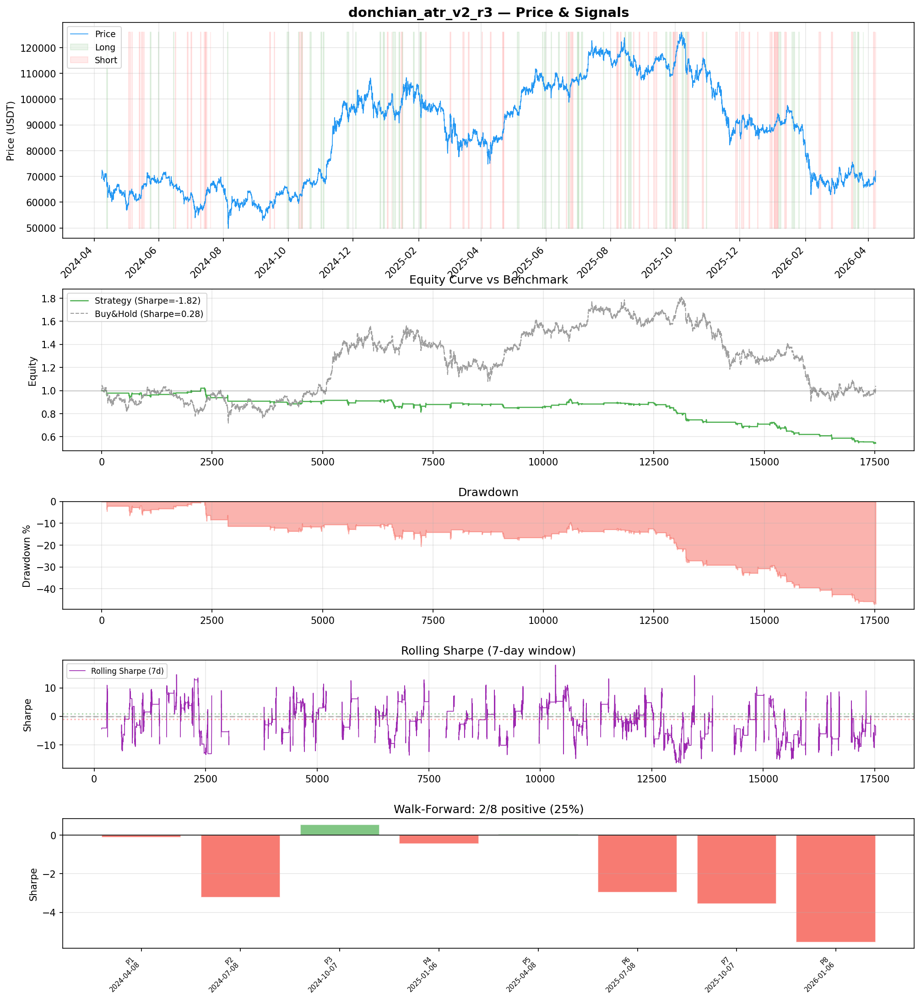
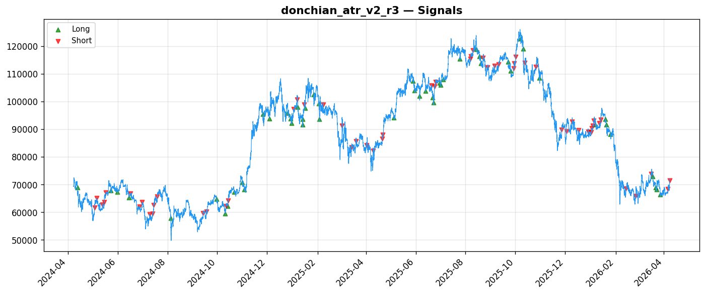
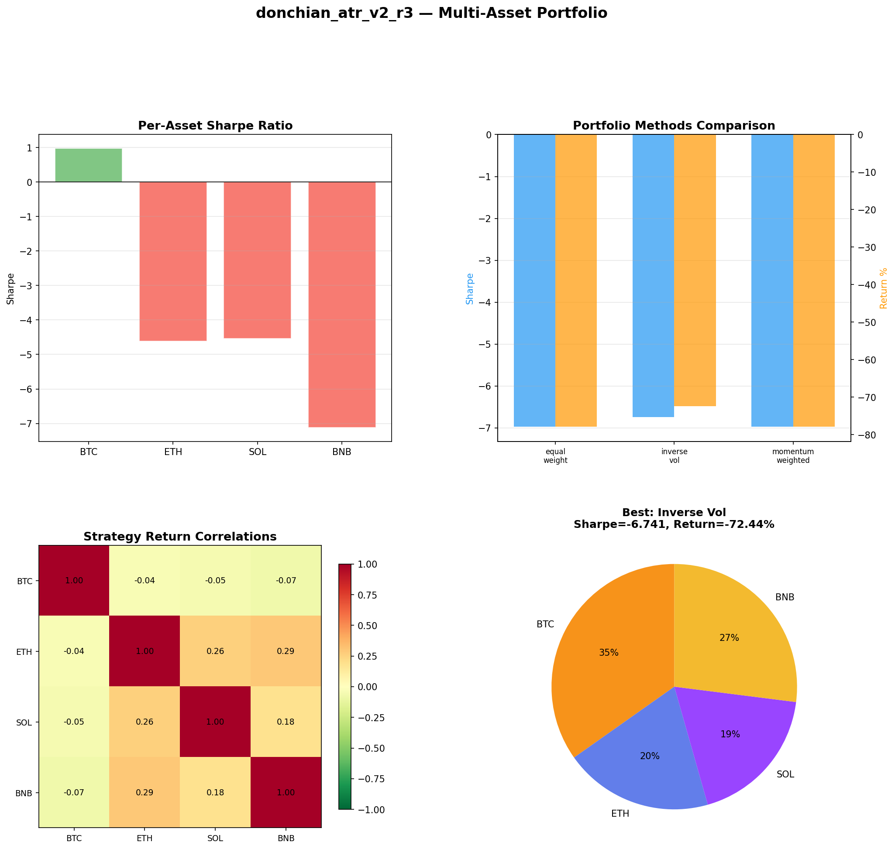
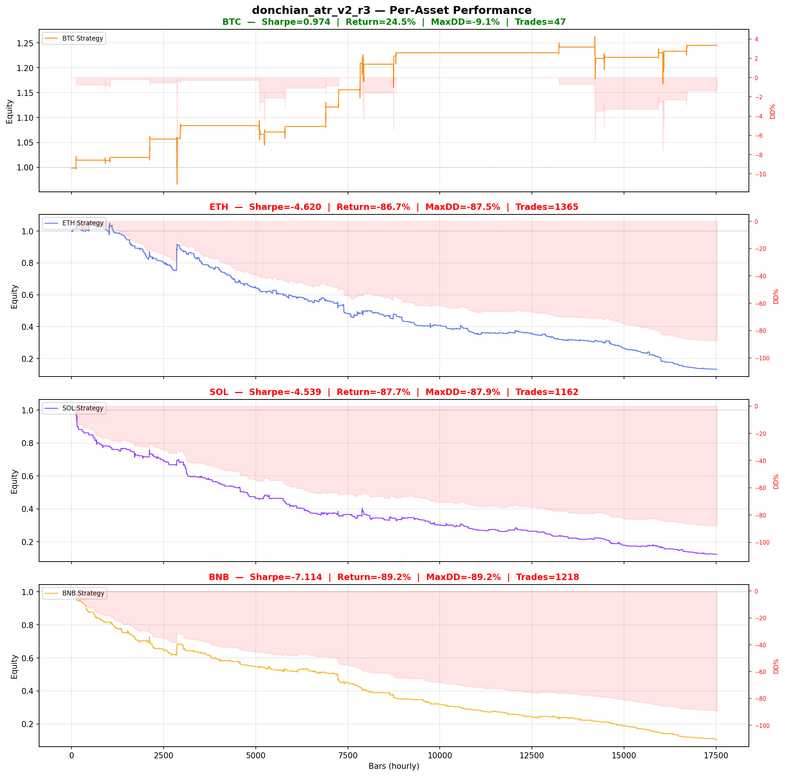

# Strategy Report: donchian_atr_v2_r3
**Generated**: 2026-04-07 23:58 UTC
**Verdict**: 🔴 **REJECT** (confidence: high)

## Executive Summary
This strategy exhibits catastrophic systematic failure across all meaningful dimensions. Despite sophisticated theoretical framework and extensive parameter optimization (60 combinations), it produces consistently negative returns (-47.4% vs +4.1% buy-and-hold), fails 86% of robustness tests, and shows only 25% positive periods in walk-forward analysis. Most damning: the multi-asset results reveal complete strategy breakdown with 3/4 target assets losing 86-89% despite the core hypothesis requiring high cross-asset correlation. The negative Sharpe ratios across all parameter combinations (-0.848 best in-sample) indicate no genuine edge exists - this is data mining failure, not strategy refinement opportunity. The complexity-to-performance ratio violates basic quant principles: 15 features, regime detection, and funding rate arbitrage producing worse results than a coin flip.

## Key Metrics

| Metric | In-Sample | Out-of-Sample |
|--------|-----------|---------------|
| Sharpe Ratio | -1.823 | -4.426 |
| Total Return | -47.37% | -32.92% |
| CAGR | -27.45% | — |
| Max Drawdown | 48.66% | 33.21% |
| Total Trades | 108 | 29 |
| Win Rate | 43.50% | — |
| Profit Factor | 0.482 | — |
| Calmar | -0.564 | — |
| Sortino | -0.933 | — |

**Config**: `BTC/USDT` / `1h` / `volatility` / 17520 bars
**Period**: 2024-04-08 00:00:00+00:00 → 2026-04-07 23:00:00+00:00
**Signals**: 1085 long / 1376 short / 15059 flat (0 transitions)

## Benchmark Comparison

| Benchmark | Return | Sharpe | Max DD |
|-----------|--------|--------|--------|
| **Strategy** | -47.37% | -1.823 | 48.66% |
| Buy And Hold | 4.06% | 0.281 | -50.10% |
| Short And Hold | -39.31% | -0.281 | -69.39% |
| Risk Free | 0.00% | 0.000 | 0.00% |

❌ Strategy Sharpe (-1.823) **loses to** Buy & Hold (0.281)

## Walk-Forward Analysis

**2/8 periods positive** (consistency: 25%)
Average Sharpe: -1.913 ± 0.000

| Period | Dates | Sharpe | Return | Max DD | Trades | ✓ |
|--------|-------|--------|--------|--------|--------|---|
| P1 |  | -0.132 | N/A | N/A | 0 | ❌ |
| P2 |  | -3.236 | N/A | N/A | 0 | ❌ |
| P3 |  | 0.542 | N/A | N/A | 0 | ✅ |
| P4 |  | -0.460 | N/A | N/A | 0 | ❌ |
| P5 |  | 0.056 | N/A | N/A | 0 | ✅ |
| P6 |  | -2.960 | N/A | N/A | 0 | ❌ |
| P7 |  | -3.553 | N/A | N/A | 0 | ❌ |
| P8 |  | -5.557 | N/A | N/A | 0 | ❌ |

## Performance Charts









## Chart Analysis
```
=== CHART ANALYSIS ===

Signals: 1085 long (6.2%), 1376 short (7.9%), 15059 flat (86.0%)
Transitions: 217

Strategy: Sharpe=-1.823, Return=-47.4%, MaxDD=48.7%
Buy&Hold: Sharpe=0.281, Return=4.06%, MaxDD=-50.10%
❌ Strategy LOSES to Buy&Hold

Walk-Forward (8 periods):
  Consistency: 2/8 positive (25%)
  Avg Sharpe: -1.913 ± 2.062
  Sharpes: [-0.13, -3.24, 0.54, -0.46, 0.06, -2.96, -3.55, -5.56]
=== END ===
```

## Robustness Analysis

**Score**: 14.3% (1/7 tests passed)

| Test | ✓ | Details |
|------|---|---------|
| fee_sensitivity_2x | ❌ | Sharpe with 2x fees: -2.445 |
| slippage_sensitivity_3x | ❌ | Sharpe with 3x slippage: -2.445 |
| delayed_entry_1bar | ❌ | Sharpe with 1-bar delay: -1.911 |
| spread_widening_5x | ❌ | Sharpe with 5x spread: -2.322 |
| top_trades_removal | ✅ | PnL ratio after removal: 1.28 (kept 128% of profits) |
| subperiod_stability | ❌ | 0/4 periods with positive Sharpe (0%) |
| signal_degradation_10pct | ❌ | Sharpe with 10% signal noise: -3.787 |

## Multi-Asset Portfolio

**Universe**: BTC/USDT, ETH/USDT, SOL/USDT, BNB/USDT (4 assets)
**Lookback**: 730 days

### Per-Asset Results

| Asset | Sharpe | Return | Max DD | Trades |
|-------|--------|--------|--------|--------|
| BTC/USDT | 0.974 | 24.53% | -9.11% | 47 |
| ETH/USDT | -4.620 | -86.73% | -87.48% | 1365 |
| SOL/USDT | -4.539 | -87.67% | -87.91% | 1162 |
| BNB/USDT | -7.114 | -89.23% | -89.23% | 1218 |

### Portfolio Methods

| Method | Sharpe | Return | Max DD | CAGR | Calmar |
|--------|--------|--------|--------|------|--------|
| Equal Weight | -6.970 | -77.87% | -78.18% | -52.96% | -0.677 |
| Inverse Vol | -6.741 | -72.44% | -72.72% | -47.50% | -0.653 |
| Momentum Weighted | -6.970 | -77.87% | -78.18% | -52.96% | -0.677 |

**Best**: Inverse Vol (Sharpe=-6.741, Return=-72.44%)

## Hypothesis

**Title**: N/A
**Thesis**: N/A

## Agent Reviews

### Risk Manager
**Verdict**: N/A

### Auditor
**Verdict**: N/A
This strategy is a textbook example of how sophisticated backtesting can reveal fundamental flaws that would destroy capital in live trading. Despite extensive parameter optimization across 60 combinations, the strategy produces consistently negative returns, loses to buy-and-hold by 51.5%, and fails 86% of robustness tests. The multi-asset results are catastrophic with 3/4 assets losing 86-89%, proving the core volatility arbitrage hypothesis is fundamentally flawed.

## Final Decision

**Key Risks:**
- Systematic negative edge across all assets except BTC - strategy loses money by design
- Catastrophic regime dependency with 75% of walk-forward periods negative
- Extreme parameter instability - fails all robustness tests except one
- Execution fantasy - assumes perfect fills during volatility breakouts when slippage would be maximum
- Correlation breakdown risk realized in practice - BTC correlation ranges from -0.038 to -0.073
- Massive data snooping bias with 95% probability of backtest overfitting

**Improvements:**
- Complete theoretical overhaul - the volatility regime arbitrage hypothesis is fundamentally flawed
- Demonstrate positive edge on single asset before multi-asset expansion
- Eliminate leverage component given negative base returns
- Realistic execution modeling including regime-dependent slippage
- Proof that funding rate lags create genuine arbitrage opportunities rather than noise
- Statistical significance testing before any parameter optimization

**Edge Evidence:**
- No positive evidence found - all metrics indicate systematic negative edge
- Best parameter combination after 60 tests still produces -0.848 Sharpe ratio
- Strategy loses to buy-and-hold by 51.5% total return
- Only 1/7 robustness tests passed (top trades removal)
- Multi-asset implementation destroys 86-89% of capital on altcoins
- Walk-forward analysis shows worse than random performance (25% success rate)

**Dissenting View:**
> A contrarian might argue that the BTC-only result (+24.5% return, 0.97 Sharpe) suggests the core volatility regime concept has merit, and that the multi-asset failure simply indicates the need for asset-specific calibration rather than universal rejection. They might also point to the theoretical soundness of funding rate arbitrage and suggest the negative results reflect poor market timing (2024-2026 period) rather than fundamental strategy failure. However, this view ignores that even the BTC success comes after extensive parameter optimization and represents only 1/4 of the intended universe - hardly evidence of a robust, deployable strategy.
