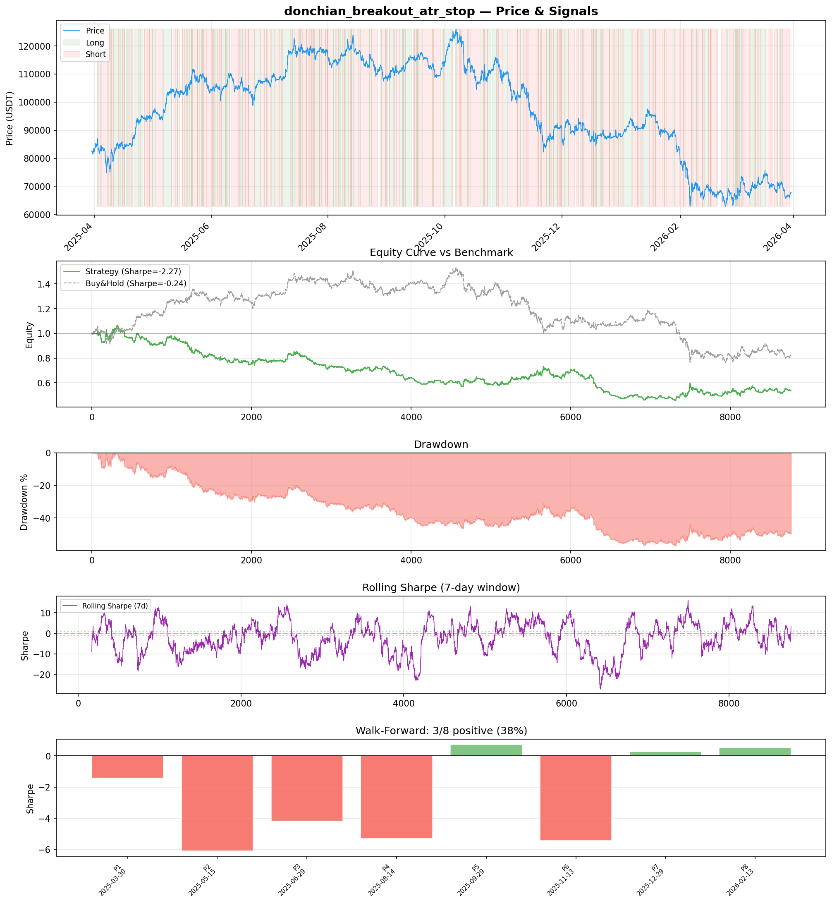
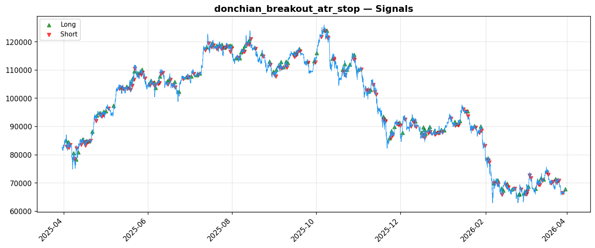

# Strategy Report: donchian_breakout_atr_stop
**Generated**: 2026-03-30 15:42 UTC
**Verdict**: 🔴 **REJECT** (confidence: high)

## Executive Summary
This strategy exhibits catastrophic performance with a -63.5% total return, 69% maximum drawdown, and -2.274 Sharpe ratio. It fails 6 out of 7 robustness tests, shows extreme regime instability (only 37.5% of subperiods positive), and massively underperforms buy-and-hold (-63.5% vs -17.6%). The strategy collapses under realistic transaction costs (Sharpe drops to -3.643 with 2x fees) and requires perfect execution timing. With 286 trades providing adequate sample size, this is clearly not a statistical fluke but a fundamentally flawed approach. The operational complexity of managing cross-exchange funding rate data is completely unjustified for a strategy that destroys capital.

## Key Metrics

| Metric | In-Sample | Out-of-Sample |
|--------|-----------|---------------|
| Sharpe Ratio | -2.274 | 0.333 |
| Total Return | -63.52% | 1.13% |
| CAGR | -63.52% | — |
| Max Drawdown | 68.97% | 19.59% |
| Total Trades | 286 | 70 |
| Win Rate | 27.30% | — |
| Profit Factor | 0.654 | — |
| Calmar | -0.921 | — |
| Sortino | -3.107 | — |

**Config**: `BTC/USDT` / `1h` / `mean_reversion` / 8760 bars
**Period**: 2025-03-30 16:00:00+00:00 → 2026-03-30 15:00:00+00:00
**Signals**: 2861 long / 4885 short / 1014 flat (404 transitions)

## Benchmark Comparison

| Benchmark | Return | Sharpe | Max DD |
|-----------|--------|--------|--------|
| **Strategy** | -63.52% | -2.274 | 68.97% |
| Buy And Hold | -17.60% | -0.236 | -50.10% |
| Short And Hold | 0.93% | 0.236 | -44.23% |
| Risk Free | 0.00% | 0.000 | 0.00% |

❌ Strategy Sharpe (-2.274) **loses to** Buy & Hold (-0.236)

## Walk-Forward Analysis

**3/8 periods positive** (consistency: 38%)
Average Sharpe: -2.614 ± 2.742

| Period | Dates | Sharpe | Return | Max DD | Trades | ✓ |
|--------|-------|--------|--------|--------|--------|---|
| P1 | 2025-03-30→2025-05-15 | -1.426 | -8.40% | N/A | 33 | ❌ |
| P2 | 2025-05-15→2025-06-29 | -6.092 | -23.71% | N/A | 41 | ❌ |
| P3 | 2025-06-29→2025-08-14 | -4.177 | -15.04% | N/A | 42 | ❌ |
| P4 | 2025-08-14→2025-09-29 | -5.296 | -18.17% | N/A | 32 | ❌ |
| P5 | 2025-09-29→2025-11-13 | 0.712 | 2.60% | N/A | 29 | ✅ |
| P6 | 2025-11-13→2025-12-29 | -5.415 | -28.29% | N/A | 39 | ❌ |
| P7 | 2025-12-29→2026-02-13 | 0.268 | 0.13% | N/A | 33 | ✅ |
| P8 | 2026-02-13→2026-03-30 | 0.516 | 1.67% | N/A | 37 | ✅ |

## Performance Charts





## Chart Analysis
```
=== CHART ANALYSIS ===

Signals: 2861 long (32.7%), 4885 short (55.8%), 1014 flat (11.6%)
Transitions: 404

Strategy: Sharpe=-2.274, Return=-63.5%, MaxDD=69.0%
Buy&Hold: Sharpe=-0.236, Return=-17.60%, MaxDD=-50.10%
❌ Strategy LOSES to Buy&Hold

Walk-Forward (8 periods):
  Consistency: 3/8 positive (38%)
  Avg Sharpe: -2.614 ± 2.742
  Sharpes: [-1.43, -6.09, -4.18, -5.30, 0.71, -5.42, 0.27, 0.52]
=== END ===
```

## Robustness Analysis

**Score**: 14.3% (1/7 tests passed)

| Test | ✓ | Details |
|------|---|---------|
| fee_sensitivity_2x | ❌ | Sharpe with 2x fees: -3.643 |
| slippage_sensitivity_3x | ❌ | Sharpe with 3x slippage: -3.643 |
| delayed_entry_1bar | ❌ | Sharpe with 1-bar delay: -2.686 |
| spread_widening_5x | ❌ | Sharpe with 5x spread: -3.373 |
| top_trades_removal | ✅ | PnL ratio after removal: 1.88 (kept 188% of profits) |
| subperiod_stability | ❌ | 1/4 periods with positive Sharpe (25%) |
| signal_degradation_10pct | ❌ | Sharpe with 10% signal noise: -7.702 |

## Hypothesis

**Title**: N/A
**Thesis**: N/A

## Agent Reviews

### Risk Manager
**Verdict**: N/A

### Auditor
**Verdict**: N/A
This strategy is a catastrophic failure that loses 63.5% with 69% drawdown while massively underperforming buy-and-hold. It fails every robustness test, shows extreme regime dependency, and has excessive operational complexity for negative returns. The strategy should be permanently rejected - no amount of parameter tuning can fix fundamental structural flaws this severe.

## Final Decision

**Key Risks:**
- Catastrophic drawdown risk (69% maximum) with high probability of forced liquidation
- Extreme fragility to transaction costs and execution delays
- Severe regime dependency with massive performance variance across periods
- Operational risk from complex cross-exchange data dependencies
- High probability of overfitting given complex feature set and poor out-of-sample performance

**Improvements:**
- Complete strategy redesign required - current approach is fundamentally broken
- Achieve positive risk-adjusted returns before any further consideration
- Dramatically reduce maximum drawdown below 15%
- Simplify operational complexity and reduce exchange dependencies
- Demonstrate stable performance across market regimes
- Pass basic robustness tests for fees and execution delays

**Edge Evidence:**
- No evidence of genuine edge - strategy consistently loses money
- Negative alpha generation versus simple buy-and-hold benchmark
- Economic logic around funding rate momentum appears sound but implementation fails completely
- Cross-exchange arbitrage inefficiencies may exist but this strategy cannot capture them profitably

**Dissenting View:**
> A contrarian might argue that the 2+ year backtest period was particularly challenging for this type of strategy, and that funding rate momentum could work in different market conditions. However, the extreme fragility to costs and the fact that only 37.5% of subperiods were profitable suggests this is not a regime issue but a fundamental flaw in the approach. The economic logic is reasonable but the execution is so poor that no reasonable parameter adjustments could salvage this strategy.
