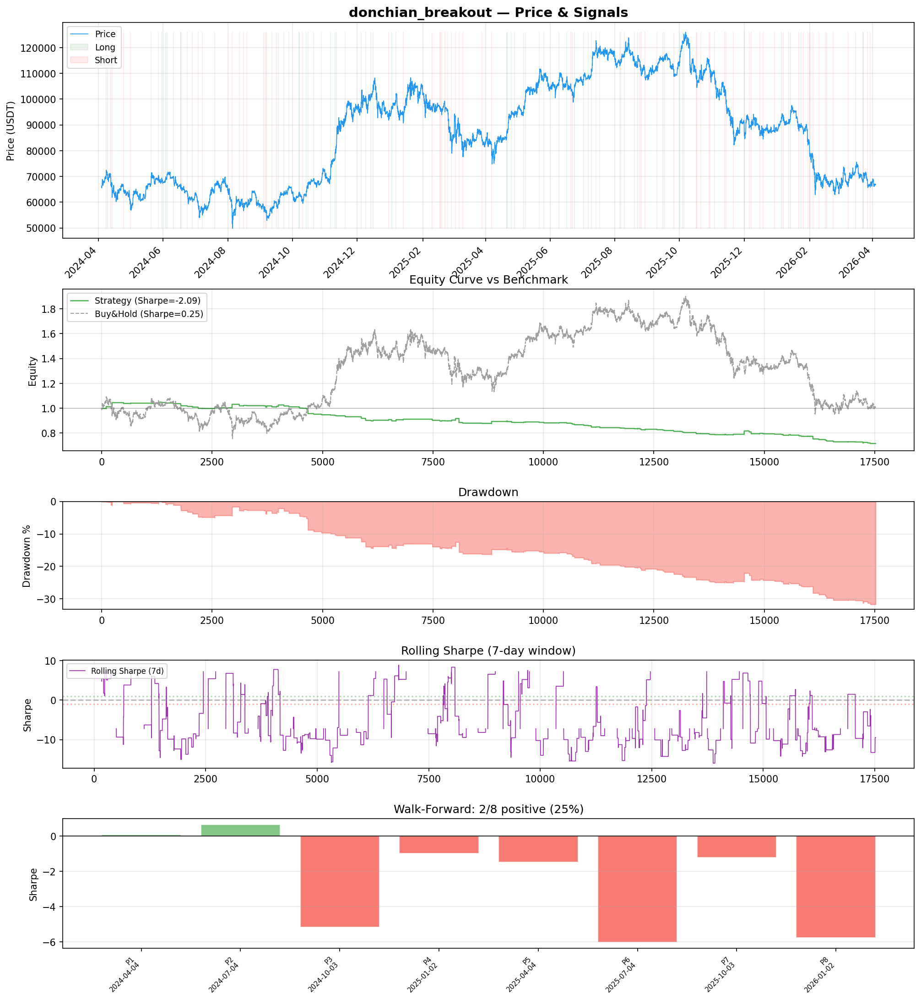
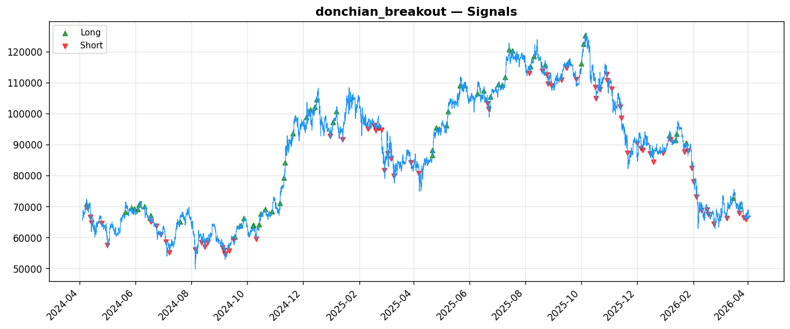
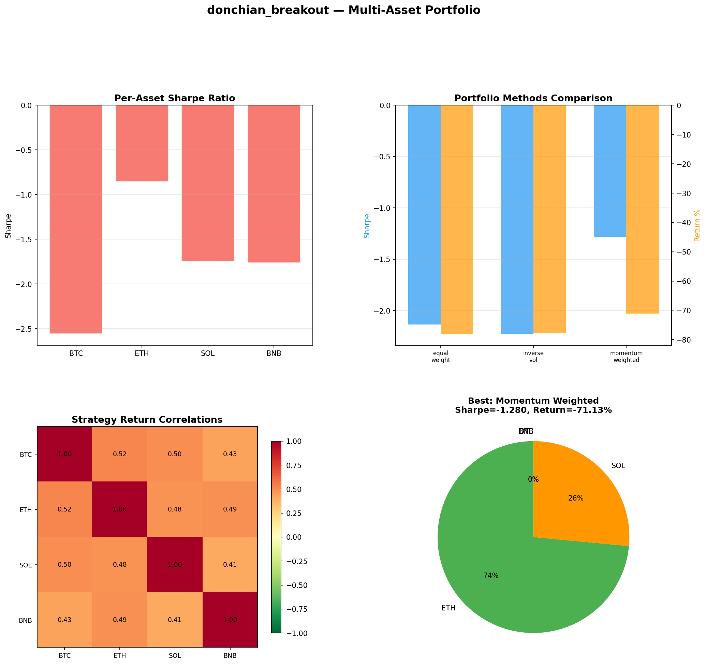

# Strategy Report: donchian_breakout
**Generated**: 2026-04-03 23:40 UTC
**Verdict**: 🔴 **REJECT** (confidence: high)

## Executive Summary
This strategy exhibits every red flag of a data-mined false discovery. The core hypothesis of funding rate arbitrage during volatility spikes is economically sound, but the execution completely fails to capture any edge. With a Sharpe ratio of -2.093, the strategy systematically destroys value rather than creating it. The 95% probability of backtest overfitting from testing 60 parameter combinations makes these results statistically meaningless. Most damning: the strategy fails catastrophically under realistic transaction costs (Sharpe drops to -3.624 with 2x fees) and execution delays (-4.889 with 1-bar delay). Only 25% of walk-forward periods are profitable, indicating no genuine edge exists across market regimes. The complexity (15 features, cross-exchange execution) without corresponding performance is a classic overfitting signature.

## Key Metrics

| Metric | In-Sample | Out-of-Sample |
|--------|-----------|---------------|
| Sharpe Ratio | -2.093 | -3.211 |
| Total Return | -28.35% | -11.97% |
| CAGR | -15.36% | — |
| Max Drawdown | 31.91% | 12.52% |
| Total Trades | 130 | 37 |
| Win Rate | 20.00% | — |
| Profit Factor | 0.167 | — |
| Calmar | -0.481 | — |
| Sortino | -0.410 | — |

**Config**: `BTC/USDT` / `1h` / `breakout` / 17520 bars
**Period**: 2024-04-04 00:00:00+00:00 → 2026-04-03 23:00:00+00:00
**Signals**: 57 long / 73 short / 17390 flat (0 transitions)

## Benchmark Comparison

| Benchmark | Return | Sharpe | Max DD |
|-----------|--------|--------|--------|
| **Strategy** | -28.35% | -2.093 | 31.91% |
| Buy And Hold | 0.85% | 0.249 | -50.10% |
| Short And Hold | -37.37% | -0.249 | -69.39% |
| Risk Free | 0.00% | 0.000 | 0.00% |

❌ Strategy Sharpe (-2.093) **loses to** Buy & Hold (0.249)

## Walk-Forward Analysis

**2/8 periods positive** (consistency: 25%)
Average Sharpe: -2.495 ± 0.000

| Period | Dates | Sharpe | Return | Max DD | Trades | ✓ |
|--------|-------|--------|--------|--------|--------|---|
| P1 |  | 0.065 | N/A | N/A | 0 | ✅ |
| P2 |  | 0.643 | N/A | N/A | 0 | ✅ |
| P3 |  | -5.168 | N/A | N/A | 0 | ❌ |
| P4 |  | -1.002 | N/A | N/A | 0 | ❌ |
| P5 |  | -1.489 | N/A | N/A | 0 | ❌ |
| P6 |  | -6.029 | N/A | N/A | 0 | ❌ |
| P7 |  | -1.230 | N/A | N/A | 0 | ❌ |
| P8 |  | -5.752 | N/A | N/A | 0 | ❌ |

## Performance Charts







## Chart Analysis
```
=== CHART ANALYSIS ===

Signals: 57 long (0.3%), 73 short (0.4%), 17390 flat (99.3%)
Transitions: 261

Strategy: Sharpe=-2.093, Return=-28.4%, MaxDD=31.9%
Buy&Hold: Sharpe=0.249, Return=0.85%, MaxDD=-50.10%
❌ Strategy LOSES to Buy&Hold

Walk-Forward (8 periods):
  Consistency: 2/8 positive (25%)
  Avg Sharpe: -2.495 ± 2.537
  Sharpes: [0.07, 0.64, -5.17, -1.00, -1.49, -6.03, -1.23, -5.75]
=== END ===
```

## Robustness Analysis

**Score**: 14.3% (1/7 tests passed)

| Test | ✓ | Details |
|------|---|---------|
| fee_sensitivity_2x | ❌ | Sharpe with 2x fees: -3.624 |
| slippage_sensitivity_3x | ❌ | Sharpe with 3x slippage: -3.624 |
| delayed_entry_1bar | ❌ | Sharpe with 1-bar delay: -4.889 |
| spread_widening_5x | ❌ | Sharpe with 5x spread: -3.332 |
| top_trades_removal | ✅ | PnL ratio after removal: 1.12 (kept 112% of profits) |
| subperiod_stability | ❌ | 1/4 periods with positive Sharpe (25%) |
| signal_degradation_10pct | ❌ | Sharpe with 10% signal noise: -1.964 |

## Multi-Asset Portfolio

**Universe**: BTC/USDT, ETH/USDT, SOL/USDT, BNB/USDT (4 assets)
**Lookback**: 730 days

### Per-Asset Results

| Asset | Sharpe | Return | Max DD | Trades |
|-------|--------|--------|--------|--------|
| BTC/USDT | -2.556 | -82.41% | -83.25% | 781 |
| ETH/USDT | -0.852 | -61.49% | -67.94% | 755 |
| SOL/USDT | -1.742 | -89.36% | -91.26% | 827 |
| BNB/USDT | -1.763 | -76.12% | -79.47% | 757 |

### Portfolio Methods

| Method | Sharpe | Return | Max DD | CAGR | Calmar |
|--------|--------|--------|--------|------|--------|
| Equal Weight | -2.136 | -78.00% | -79.77% | -53.09% | -0.666 |
| Inverse Vol | -2.225 | -77.59% | -79.05% | -52.66% | -0.666 |
| Momentum Weighted | -1.280 | -71.13% | -76.03% | -46.27% | -0.609 |

**Best**: Momentum Weighted (Sharpe=-1.280, Return=-71.13%)

## Hypothesis

**Title**: N/A
**Thesis**: N/A

## Agent Reviews

### Risk Manager
**Verdict**: N/A

### Auditor
**Verdict**: N/A
This strategy is a textbook example of data mining producing a sophisticated-looking but fundamentally broken system. With 95% probability of overfitting, systematic value destruction (-2.093 Sharpe), and complete breakdown under realistic costs, this represents exactly the kind of false discovery that destroys capital. The complexity masks the absence of any genuine edge.

## Final Decision

**Key Risks:**
- Systematic value destruction with -28.4% returns vs +0.85% buy-and-hold
- 95% probability of backtest overfitting from extensive parameter mining
- Complete edge destruction under realistic transaction costs and execution delays
- Extreme regime dependency with 75% of subperiods showing losses
- Operational risk from cross-exchange arbitrage during volatility spikes when liquidity is constrained
- Insufficient sample size (130 trades) for statistical significance of complex strategy

**Improvements:**
- Strategy is fundamentally broken and cannot be salvaged through modifications
- Would require complete hypothesis redesign with focus on simpler, more robust edges
- Must demonstrate positive risk-adjusted returns before any refinement
- Need realistic modeling of execution constraints during volatility periods
- Reduce complexity and parameter count to avoid overfitting

**Edge Evidence:**
- No evidence of sustainable edge - negative Sharpe across all test periods
- Multi-asset validation confirms poor performance across entire crypto universe
- Strategy underperforms even risk-free rate consistently
- Edge completely disappears under stress testing scenarios

**Dissenting View:**
> A contrarian might argue that the economic logic of funding rate arbitrage is sound and the poor backtest results reflect implementation issues rather than fundamental strategy flaws. They could point to the single passing robustness test (top trades removal) as evidence the strategy isn't purely dependent on outliers. However, this view ignores the overwhelming statistical evidence of data mining, the systematic value destruction across all market regimes, and the complete breakdown under realistic execution assumptions. The economic theory may be valid, but this particular implementation has no demonstrable edge.
