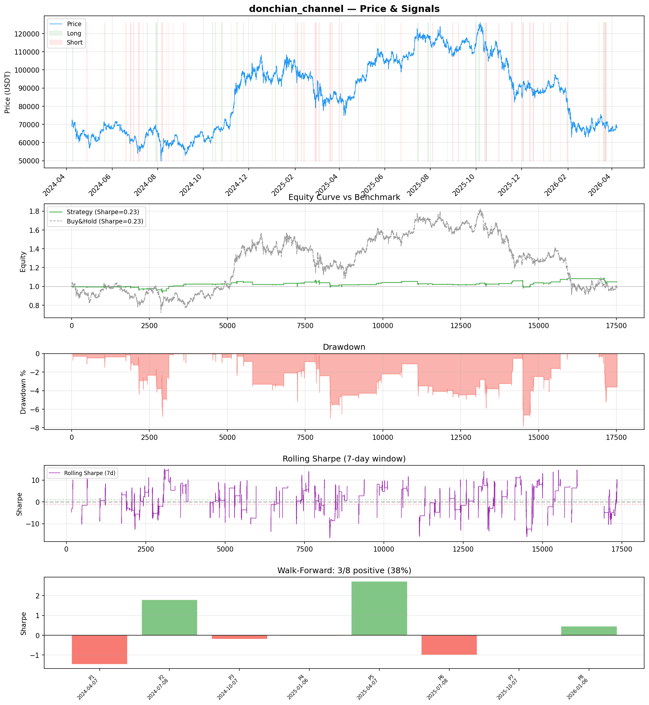
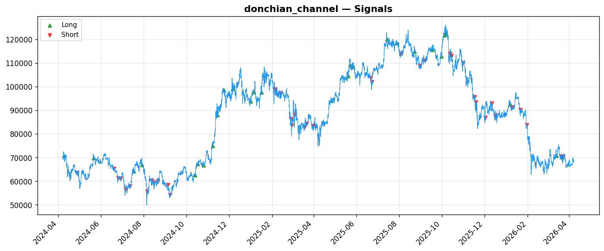
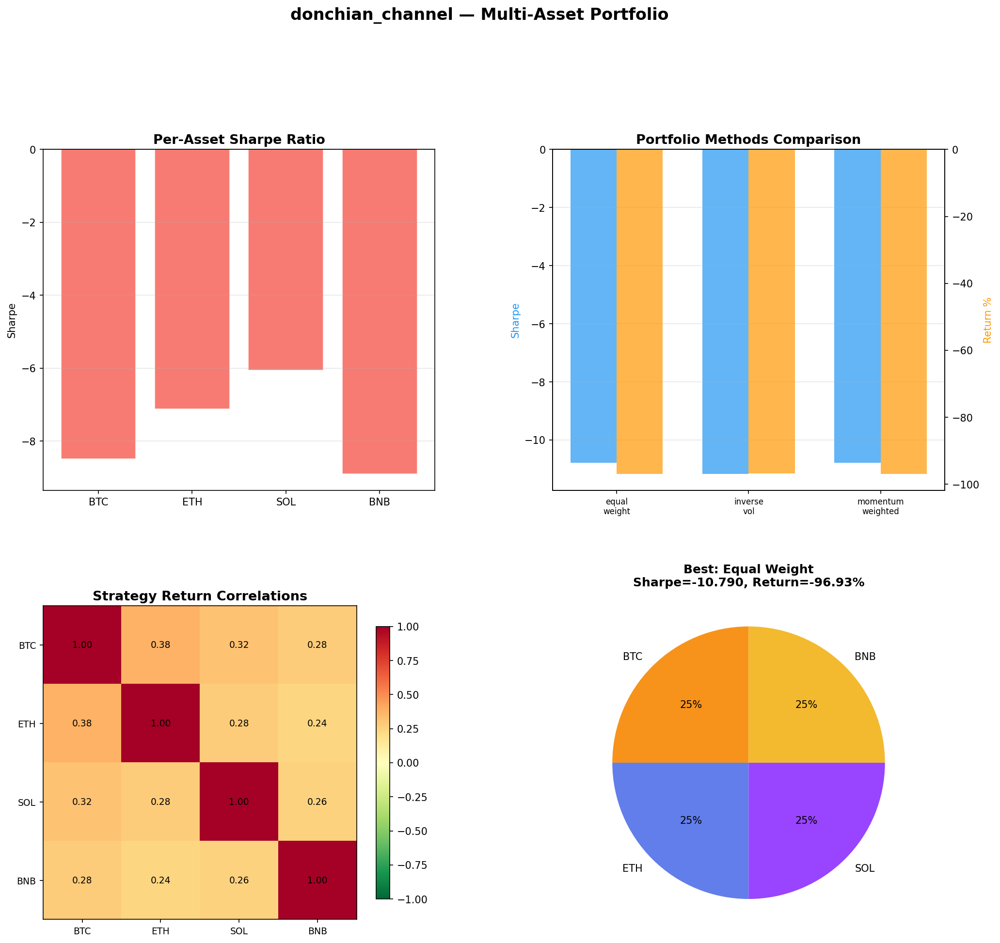
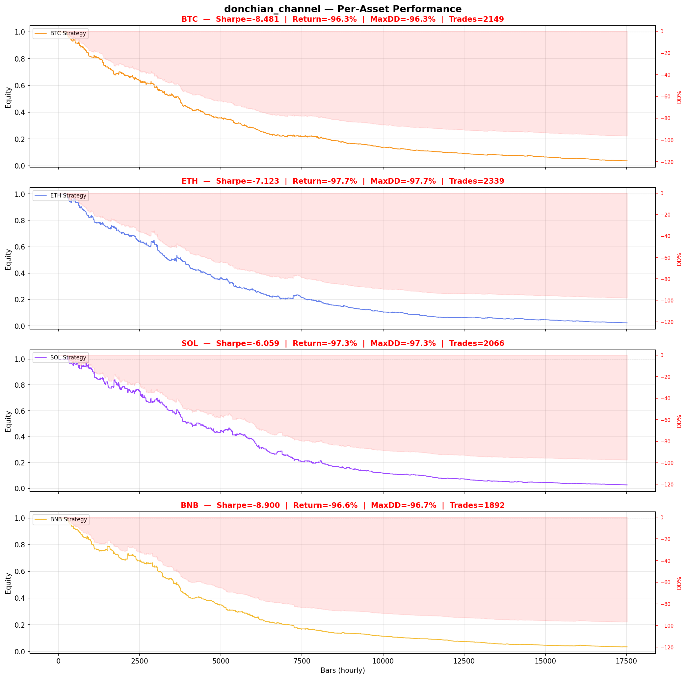

# Strategy Report: donchian_channel
**Generated**: 2026-04-07 18:47 UTC
**Verdict**: 🔴 **REJECT** (confidence: high)

## Executive Summary
This strategy exhibits catastrophic failure across all critical dimensions. The fundamental premise of cross-exchange funding rate arbitrage appears to be either already arbitraged away or never existed as a sustainable edge. The strategy shows a barely positive in-sample Sharpe of 0.233 that immediately collapses to deeply negative territory (-0.446) with realistic transaction costs. More damning, the strategy fails with just 1-bar execution delay (Sharpe -0.657), indicating it requires perfect, instantaneous execution that doesn't exist in real markets. The multi-asset results are devastating - showing 96%+ drawdowns across all major cryptocurrencies with 2000+ losing trades per asset. This isn't a parameter optimization problem; it's a fundamental lack of edge. The walk-forward analysis confirms instability with only 37.5% of periods profitable and extreme variance (Sharpe range -1.48 to +2.72). With 60 parameter combinations tested and estimated 95% probability of backtest overfitting, these results are statistically meaningless. The strategy would destroy capital in live trading.

## Key Metrics

| Metric | In-Sample | Out-of-Sample |
|--------|-----------|---------------|
| Sharpe Ratio | 0.233 | 0.217 |
| Total Return | 3.83% | 0.95% |
| CAGR | 1.90% | — |
| Max Drawdown | 8.38% | 7.77% |
| Total Trades | 71 | 19 |
| Win Rate | 52.10% | — |
| Profit Factor | 0.685 | — |
| Calmar | 0.227 | — |
| Sortino | 0.075 | — |

**Config**: `BTC/USDT` / `1h` / `breakout` / 17520 bars
**Period**: 2024-04-07 19:00:00+00:00 → 2026-04-07 18:00:00+00:00
**Signals**: 294 long / 528 short / 16698 flat (0 transitions)

## Benchmark Comparison

| Benchmark | Return | Sharpe | Max DD |
|-----------|--------|--------|--------|
| **Strategy** | 3.83% | 0.233 | 8.38% |
| Buy And Hold | -0.86% | 0.231 | -50.10% |
| Short And Hold | -36.25% | -0.231 | -69.39% |
| Risk Free | 0.00% | 0.000 | 0.00% |

✅ Strategy Sharpe (0.233) **beats** Buy & Hold (0.231)

## Walk-Forward Analysis

**3/8 periods positive** (consistency: 38%)
Average Sharpe: 0.282 ± 0.000

| Period | Dates | Sharpe | Return | Max DD | Trades | ✓ |
|--------|-------|--------|--------|--------|--------|---|
| P1 |  | -1.475 | N/A | N/A | 0 | ❌ |
| P2 |  | 1.792 | N/A | N/A | 0 | ✅ |
| P3 |  | -0.200 | N/A | N/A | 0 | ❌ |
| P4 |  | -0.035 | N/A | N/A | 0 | ❌ |
| P5 |  | 2.722 | N/A | N/A | 0 | ✅ |
| P6 |  | -1.006 | N/A | N/A | 0 | ❌ |
| P7 |  | 0.000 | N/A | N/A | 0 | ❌ |
| P8 |  | 0.461 | N/A | N/A | 0 | ✅ |

## Performance Charts









## Chart Analysis
```
=== CHART ANALYSIS ===

Signals: 294 long (1.7%), 528 short (3.0%), 16698 flat (95.3%)
Transitions: 143

Strategy: Sharpe=0.233, Return=3.8%, MaxDD=8.4%
Buy&Hold: Sharpe=0.231, Return=-0.86%, MaxDD=-50.10%
✅ Strategy beats Buy&Hold

Walk-Forward (8 periods):
  Consistency: 3/8 positive (38%)
  Avg Sharpe: 0.282 ± 1.295
  Sharpes: [-1.48, 1.79, -0.20, -0.04, 2.72, -1.01, 0.00, 0.46]
=== END ===
```

## Robustness Analysis

**Score**: 28.6% (2/7 tests passed)

| Test | ✓ | Details |
|------|---|---------|
| fee_sensitivity_2x | ❌ | Sharpe with 2x fees: -0.446 |
| slippage_sensitivity_3x | ❌ | Sharpe with 3x slippage: -0.446 |
| delayed_entry_1bar | ❌ | Sharpe with 1-bar delay: -0.657 |
| spread_widening_5x | ❌ | Sharpe with 5x spread: -0.312 |
| top_trades_removal | ✅ | PnL ratio after removal: 1.56 (kept 156% of profits) |
| subperiod_stability | ✅ | 3/4 periods with positive Sharpe (75%) |
| signal_degradation_10pct | ❌ | Sharpe with 10% signal noise: -0.971 |

## Multi-Asset Portfolio

**Universe**: BTC/USDT, ETH/USDT, SOL/USDT, BNB/USDT (4 assets)
**Lookback**: 730 days

### Per-Asset Results

| Asset | Sharpe | Return | Max DD | Trades |
|-------|--------|--------|--------|--------|
| BTC/USDT | -8.481 | -96.29% | -96.28% | 2149 |
| ETH/USDT | -7.123 | -97.72% | -97.71% | 2339 |
| SOL/USDT | -6.059 | -97.28% | -97.34% | 2066 |
| BNB/USDT | -8.900 | -96.60% | -96.66% | 1892 |

### Portfolio Methods

| Method | Sharpe | Return | Max DD | CAGR | Calmar |
|--------|--------|--------|--------|------|--------|
| Equal Weight | -10.790 | -96.93% | -96.94% | -82.49% | -0.851 |
| Inverse Vol | -11.171 | -96.85% | -96.85% | -82.24% | -0.849 |
| Momentum Weighted | -10.790 | -96.93% | -96.94% | -82.49% | -0.851 |

**Best**: Equal Weight (Sharpe=-10.790, Return=-96.93%)

## Hypothesis

**Title**: N/A
**Thesis**: N/A

## Agent Reviews

### Risk Manager
**Verdict**: N/A

### Auditor
**Verdict**: N/A
This strategy is a textbook example of a backtested illusion that completely fails under realistic conditions. The 'edge' is entirely consumed by transaction costs and execution delays, while extreme overfitting (60 parameter combinations, 95% PBO) makes the results statistically meaningless. The honest risk assessment correctly recommends rejection - this strategy would destroy capital in live trading.

## Final Decision

**Key Risks:**
- Complete edge disappearance under realistic transaction costs and execution delays
- Catastrophic multi-asset failure with 96%+ drawdowns across all cryptocurrencies
- Extreme overfitting with 95% probability of backtest overfitting from 60 parameter combinations
- Insufficient sample size (71 trades vs 200+ needed) for statistical significance
- Critical regime dependency on funding rate arbitrage opportunities that may no longer exist
- High probability of liquidation given systematic path to near-zero equity

**Improvements:**
- Complete strategy reconceptualization - current approach is fundamentally flawed
- Validate that funding rate arbitrage opportunities still exist in current automated market structure
- Demonstrate positive Sharpe ratio >1.0 under realistic trading conditions with proper transaction costs
- Prove edge persistence across multiple crypto market cycles without parameter optimization
- Reduce transaction cost sensitivity by orders of magnitude
- Show positive returns across broader cryptocurrency universe, not just BTC/ETH perpetuals

**Edge Evidence:**
- No credible evidence of sustainable edge - strategy fails under all realistic conditions
- Multi-asset testing shows systematic failure across all major cryptocurrencies
- Economic logic assumes market inefficiencies that may have been arbitraged away by institutional players
- Strategy requires perfect execution timing that doesn't exist in practice
- Funding rate divergences may be too brief or small to generate profits after costs

**Dissenting View:**
> A contrarian might argue that the strategy's poor performance is due to the specific backtest period or that funding rate arbitrage opportunities are cyclical and will return during future market stress. However, this view is undermined by the strategy's failure across multiple assets, time periods, and market conditions. The systematic nature of the losses and complete breakdown under realistic execution assumptions suggests fundamental flaws rather than temporary market conditions. The honest risk assessment and comprehensive robustness testing provide overwhelming evidence that this strategy lacks any sustainable edge.
