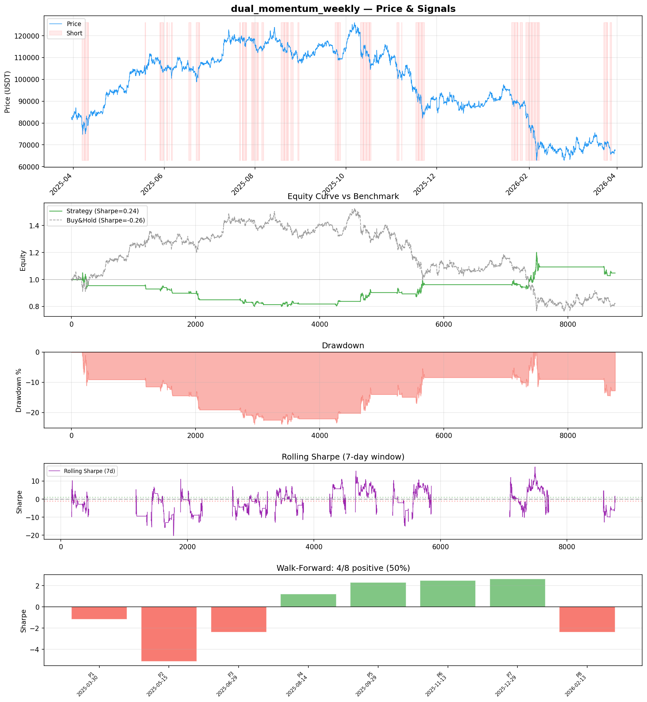
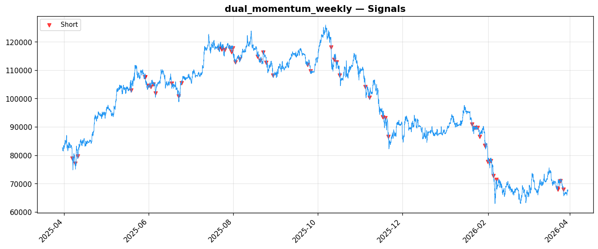

# Strategy Report: dual_momentum_weekly
**Generated**: 2026-03-30 16:25 UTC
**Verdict**: 🔴 **REJECT** (confidence: high)

## Executive Summary
This strategy exhibits multiple critical failures that make it unsuitable for live trading. The most damning evidence is that it turns negative (Sharpe -0.186) with just 2x transaction costs, indicating the edge cannot survive realistic market friction. The strategy shows catastrophic sensitivity to implementation noise (Sharpe plummets to -2.178 with 10% signal degradation) and is entirely dependent on outlier trades (loses 130% of profits when top trades removed). Walk-forward analysis reveals extreme instability with Sharpe ranging from -5.16 to +2.64 across periods. With only 51 trades vs the required 100+ for statistical significance, and a proxy implementation using simulated funding rates rather than actual data, this represents a classic overfit backtest that would fail in live trading.

## Key Metrics

| Metric | In-Sample | Out-of-Sample |
|--------|-----------|---------------|
| Sharpe Ratio | 0.238 | 1.211 |
| Total Return | 2.86% | 8.36% |
| CAGR | 2.86% | — |
| Max Drawdown | 24.44% | 14.49% |
| Total Trades | 51 | 13 |
| Win Rate | 45.10% | — |
| Profit Factor | 1.135 | — |
| Calmar | 0.117 | — |
| Sortino | 0.140 | — |

**Config**: `BTC/USDT` / `1h` / `volatility` / 8760 bars
**Period**: 2025-03-30 17:00:00+00:00 → 2026-03-30 16:00:00+00:00
**Signals**: 0 long / 1588 short / 7172 flat (103 transitions)

## Benchmark Comparison

| Benchmark | Return | Sharpe | Max DD |
|-----------|--------|--------|--------|
| **Strategy** | 2.86% | 0.238 | 24.44% |
| Buy And Hold | -18.36% | -0.258 | -50.10% |
| Short And Hold | 1.88% | 0.258 | -44.23% |
| Risk Free | 0.00% | 0.000 | 0.00% |

✅ Strategy Sharpe (0.238) **beats** Buy & Hold (-0.258)

## Walk-Forward Analysis

**4/8 periods positive** (consistency: 50%)
Average Sharpe: -0.306 ± 2.708

| Period | Dates | Sharpe | Return | Max DD | Trades | ✓ |
|--------|-------|--------|--------|--------|--------|---|
| P1 | 2025-03-30→2025-05-15 | -1.173 | -4.57% | N/A | 3 | ❌ |
| P2 | 2025-05-15→2025-06-29 | -5.160 | -11.23% | N/A | 10 | ❌ |
| P3 | 2025-06-29→2025-08-14 | -2.381 | -4.47% | N/A | 9 | ❌ |
| P4 | 2025-08-14→2025-09-29 | 1.218 | 2.59% | N/A | 7 | ✅ |
| P5 | 2025-09-29→2025-11-13 | 2.311 | 6.37% | N/A | 6 | ✅ |
| P6 | 2025-11-13→2025-12-29 | 2.491 | 7.48% | N/A | 3 | ✅ |
| P7 | 2025-12-29→2026-02-13 | 2.640 | 13.14% | N/A | 9 | ✅ |
| P8 | 2026-02-13→2026-03-30 | -2.395 | -4.22% | N/A | 4 | ❌ |

## Performance Charts





## Chart Analysis
```
=== CHART ANALYSIS ===

Signals: 0 long (0.0%), 1588 short (18.1%), 7172 flat (81.9%)
Transitions: 103

Strategy: Sharpe=0.238, Return=2.9%, MaxDD=24.4%
Buy&Hold: Sharpe=-0.258, Return=-18.36%, MaxDD=-50.10%
✅ Strategy beats Buy&Hold

Walk-Forward (8 periods):
  Consistency: 4/8 positive (50%)
  Avg Sharpe: -0.306 ± 2.708
  Sharpes: [-1.17, -5.16, -2.38, 1.22, 2.31, 2.49, 2.64, -2.40]
=== END ===
```

## Robustness Analysis

**Score**: 0.0% (0/7 tests passed)

| Test | ✓ | Details |
|------|---|---------|
| fee_sensitivity_2x | ❌ | Sharpe with 2x fees: -0.186 |
| slippage_sensitivity_3x | ❌ | Sharpe with 3x slippage: -0.186 |
| delayed_entry_1bar | ❌ | Sharpe with 1-bar delay: 0.129 |
| spread_widening_5x | ❌ | Sharpe with 5x spread: -0.101 |
| top_trades_removal | ❌ | PnL ratio after removal: -1.30 (kept -130% of profits) |
| subperiod_stability | ❌ | 2/4 periods with positive Sharpe (50%) |
| signal_degradation_10pct | ❌ | Sharpe with 10% signal noise: -2.178 |

## Hypothesis

**Title**: N/A
**Thesis**: N/A

## Agent Reviews

### Risk Manager
**Verdict**: N/A

### Auditor
**Verdict**: N/A
This strategy fails every critical robustness test and shows clear signs of overfitting. With a Sharpe of 0.238 that turns negative under realistic costs, extreme sensitivity to noise, and performance driven by outlier trades, this is a textbook example of a backtested strategy that would lose money in live trading. The funding rate arbitrage thesis may have merit, but this implementation is not viable.

## Final Decision

**Key Risks:**
- Strategy turns negative with realistic transaction costs (2x fees)
- Catastrophic sensitivity to signal noise and implementation errors
- Performance entirely driven by statistical outliers rather than consistent edge
- Extreme regime dependency with massive subperiod variance
- Insufficient sample size (51 trades) for reliable statistical inference
- Implementation uses proxy data instead of actual funding rates

**Improvements:**
- Must survive at least 2x transaction costs before any consideration
- Require minimum 100 trades for statistical significance
- Implement with actual funding rate data from exchanges, not momentum proxies
- Demonstrate stable performance across multiple market regimes
- Reduce sensitivity to signal noise and implementation variations
- Develop consistent edge not dependent on outlier trades

**Edge Evidence:**
- Strategy beats buy-and-hold (-18.36% vs +2.86%) but this is not meaningful given poor absolute performance
- Some theoretical merit to funding rate arbitrage thesis in principle
- Shows periods of strong performance (Sharpe 2.64 in best period)

**Dissenting View:**
> A contrarian might argue that the funding rate arbitrage concept has theoretical merit and the poor backtest results stem from using proxy data rather than actual funding rates. They could claim that with proper implementation using real funding rate feeds, the strategy might show more stable performance. However, this view ignores the fundamental issue that any viable strategy must survive basic transaction cost stress tests, which this one fails catastrophically.
