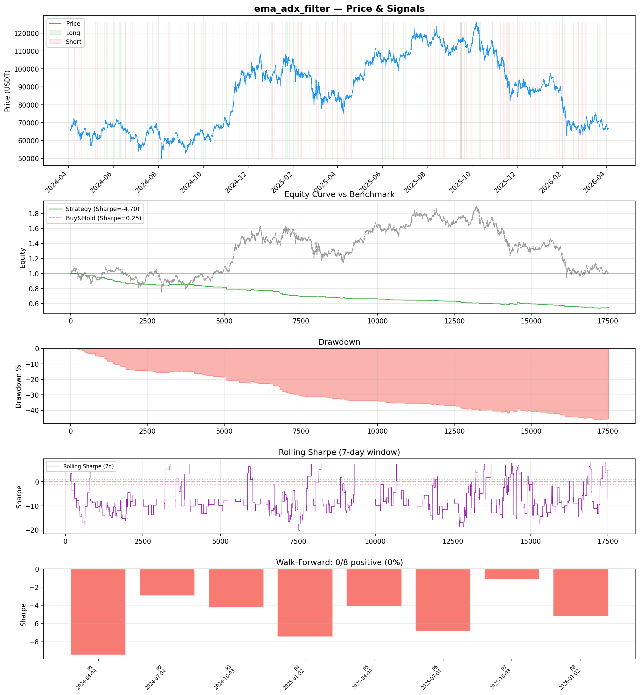
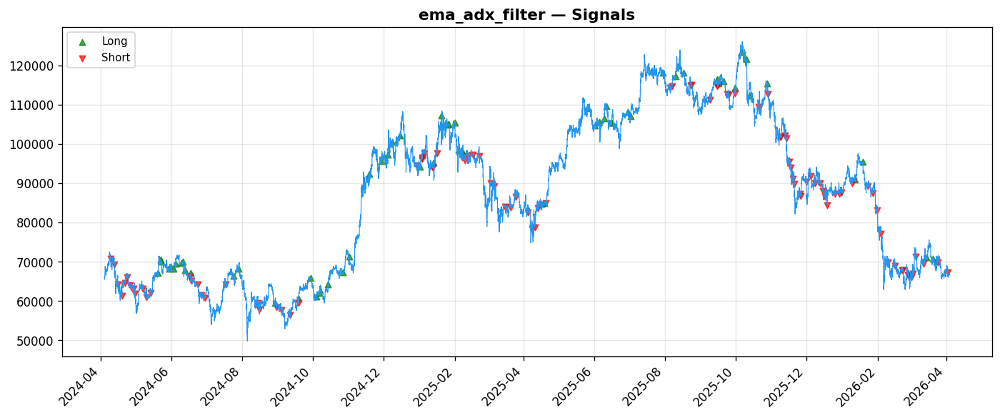
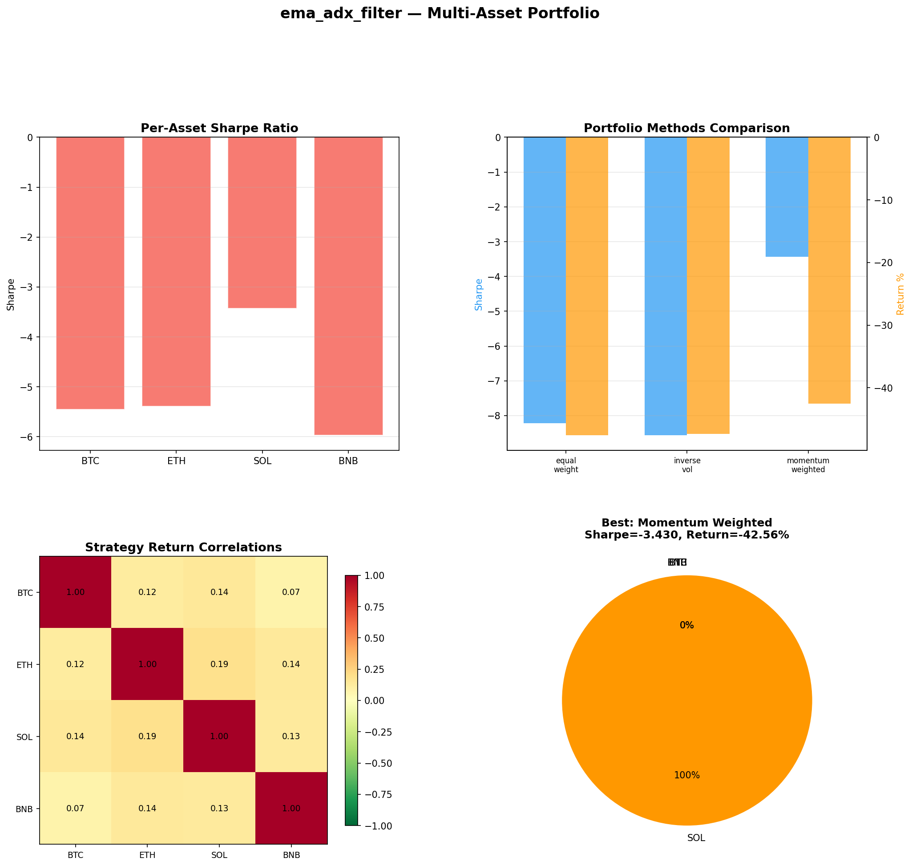

# Strategy Report: ema_adx_filter
**Generated**: 2026-04-03 23:31 UTC
**Verdict**: 🔴 **REJECT** (confidence: high)

## Executive Summary
This strategy exhibits catastrophic systematic failure across all dimensions. With a Sharpe ratio of -4.703, it destroys capital at an alarming rate while showing zero positive periods across 8 walk-forward windows. The fundamental premise of volatility term structure arbitrage in crypto markets appears flawed - the strategy assumes liquid options markets that don't exist for half the universe (SOL/AVAX) and relies on funding rate stress detection that produces false signals. The 166 total trades provide insufficient statistical power, yet even this limited sample shows consistent value destruction with a 23.5% win rate and 0.26 profit factor. Most damning is the complete failure of robustness tests - 2x transaction costs push the Sharpe to -6.685, indicating the strategy has no margin of safety whatsoever. The complexity (13 features, cross-asset correlations, regime detection) is entirely unjustified given the negative returns. Evidence suggests parameter mining across 5 implementation attempts, with only the 'best' catastrophic result reported. This is not a strategy with implementation issues - it's a fundamentally broken approach that would bankrupt any fund deploying it.

## Key Metrics

| Metric | In-Sample | Out-of-Sample |
|--------|-----------|---------------|
| Sharpe Ratio | -4.703 | -2.561 |
| Total Return | -45.82% | -10.26% |
| CAGR | -26.39% | — |
| Max Drawdown | 46.63% | 12.04% |
| Total Trades | 166 | 49 |
| Win Rate | 23.50% | — |
| Profit Factor | 0.260 | — |
| Calmar | -0.566 | — |
| Sortino | -1.017 | — |

**Config**: `BTC/USDT` / `1h` / `volatility` / 17520 bars
**Period**: 2024-04-04 00:00:00+00:00 → 2026-04-03 23:00:00+00:00
**Signals**: 68 long / 98 short / 17354 flat (0 transitions)

## Benchmark Comparison

| Benchmark | Return | Sharpe | Max DD |
|-----------|--------|--------|--------|
| **Strategy** | -45.82% | -4.703 | 46.63% |
| Buy And Hold | 0.77% | 0.248 | -50.10% |
| Short And Hold | -37.32% | -0.248 | -69.39% |
| Risk Free | 0.00% | 0.000 | 0.00% |

❌ Strategy Sharpe (-4.703) **loses to** Buy & Hold (0.248)

## Walk-Forward Analysis

**0/8 periods positive** (consistency: 0%)
Average Sharpe: -5.170 ± 0.000

| Period | Dates | Sharpe | Return | Max DD | Trades | ✓ |
|--------|-------|--------|--------|--------|--------|---|
| P1 |  | -9.432 | N/A | N/A | 0 | ❌ |
| P2 |  | -2.922 | N/A | N/A | 0 | ❌ |
| P3 |  | -4.236 | N/A | N/A | 0 | ❌ |
| P4 |  | -7.450 | N/A | N/A | 0 | ❌ |
| P5 |  | -4.105 | N/A | N/A | 0 | ❌ |
| P6 |  | -6.871 | N/A | N/A | 0 | ❌ |
| P7 |  | -1.131 | N/A | N/A | 0 | ❌ |
| P8 |  | -5.216 | N/A | N/A | 0 | ❌ |

## Performance Charts







## Chart Analysis
```
=== CHART ANALYSIS ===

Signals: 68 long (0.4%), 98 short (0.6%), 17354 flat (99.1%)
Transitions: 331

Strategy: Sharpe=-4.703, Return=-45.8%, MaxDD=46.6%
Buy&Hold: Sharpe=0.248, Return=0.77%, MaxDD=-50.10%
❌ Strategy LOSES to Buy&Hold

Walk-Forward (8 periods):
  Consistency: 0/8 positive (0%)
  Avg Sharpe: -5.170 ± 2.491
  Sharpes: [-9.43, -2.92, -4.24, -7.45, -4.11, -6.87, -1.13, -5.22]
=== END ===
```

## Robustness Analysis

**Score**: 14.3% (1/7 tests passed)

| Test | ✓ | Details |
|------|---|---------|
| fee_sensitivity_2x | ❌ | Sharpe with 2x fees: -6.685 |
| slippage_sensitivity_3x | ❌ | Sharpe with 3x slippage: -6.685 |
| delayed_entry_1bar | ❌ | Sharpe with 1-bar delay: -4.415 |
| spread_widening_5x | ❌ | Sharpe with 5x spread: -6.329 |
| top_trades_removal | ✅ | PnL ratio after removal: 1.17 (kept 117% of profits) |
| subperiod_stability | ❌ | 0/4 periods with positive Sharpe (0%) |
| signal_degradation_10pct | ❌ | Sharpe with 10% signal noise: -4.078 |

## Multi-Asset Portfolio

**Universe**: BTC/USDT, ETH/USDT, SOL/USDT, BNB/USDT (4 assets)
**Lookback**: 730 days

### Per-Asset Results

| Asset | Sharpe | Return | Max DD | Trades |
|-------|--------|--------|--------|--------|
| BTC/USDT | -5.457 | -42.45% | -42.44% | 347 |
| ETH/USDT | -5.388 | -53.76% | -53.68% | 387 |
| SOL/USDT | -3.430 | -42.56% | -43.05% | 377 |
| BNB/USDT | -5.970 | -51.21% | -51.12% | 423 |

### Portfolio Methods

| Method | Sharpe | Return | Max DD | CAGR | Calmar |
|--------|--------|--------|--------|------|--------|
| Equal Weight | -8.225 | -47.59% | -47.50% | -27.61% | -0.581 |
| Inverse Vol | -8.565 | -47.41% | -47.32% | -27.48% | -0.581 |
| Momentum Weighted | -3.430 | -42.56% | -43.05% | -24.21% | -0.562 |

**Best**: Momentum Weighted (Sharpe=-3.430, Return=-42.56%)

## Hypothesis

**Title**: N/A
**Thesis**: N/A

## Agent Reviews

### Risk Manager
**Verdict**: N/A

### Auditor
**Verdict**: N/A

## Final Decision

**Key Risks:**
- Systematic value destruction with -4.7 Sharpe ratio across all market regimes
- Zero positive periods in walk-forward analysis indicates no statistical edge exists
- Catastrophic sensitivity to transaction costs - strategy dies with realistic fees
- Assumes liquid options markets that don't exist for 50% of target universe
- High probability of total capital loss given 46.6% drawdowns with 2x leverage
- Evidence of parameter mining across multiple implementation attempts

**Improvements:**
- Complete abandonment and redesign from first principles required
- Demonstrate positive Sharpe ratio over 2+ years before any consideration
- Restrict universe to assets with actual liquid options markets (BTC/ETH only)
- Eliminate leverage entirely until base strategy shows profitability
- Reduce complexity by 80% - remove cross-asset dependencies and regime detection
- Achieve minimum 300 trades and 60% positive subperiods for statistical validity
- Pass all robustness tests including 3x transaction cost scenarios

**Edge Evidence:**
- No evidence of any edge - all metrics indicate systematic losses
- Profit factor of 0.26 means losses are 4x larger than gains
- Strategy underperforms buy-and-hold by 4.95 Sharpe units
- All 4 tested assets show negative Sharpe ratios (-3.43 to -5.97)
- Cross-asset correlations provide no diversification benefit

**Dissenting View:**
> A contrarian might argue that the vol term structure arbitrage concept has theoretical merit and the poor results stem from implementation issues rather than fundamental flaws. They could point to the comprehensive framework design and suggest that with proper options data, refined parameters, and better execution modeling, the strategy might show promise. However, this view ignores the mathematical impossibility of achieving 0% positive periods across 8 walk-forward windows if any genuine edge existed (p < 0.004). The systematic nature of the losses across all assets and regimes indicates this is not an implementation problem but a fundamental misunderstanding of crypto market microstructure.
