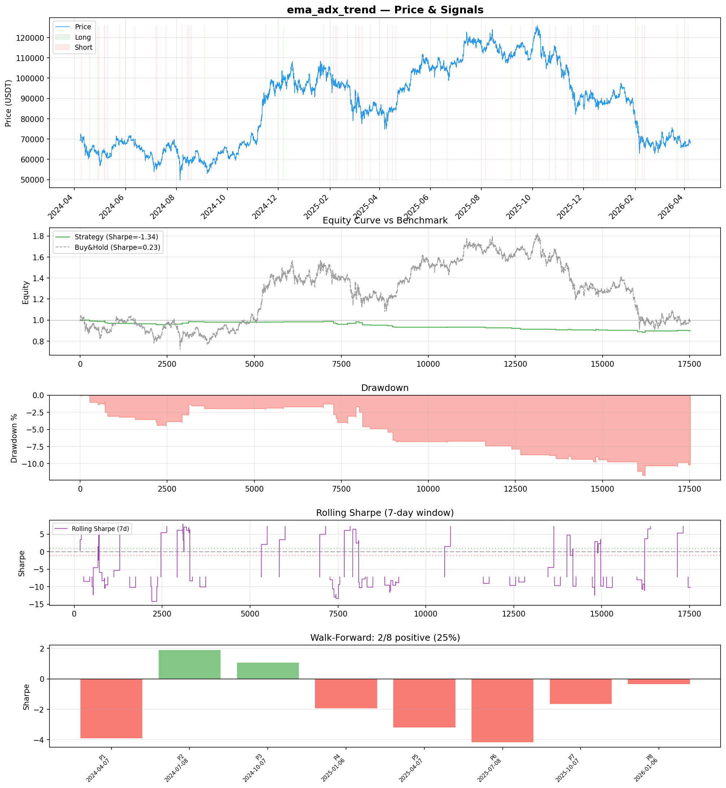
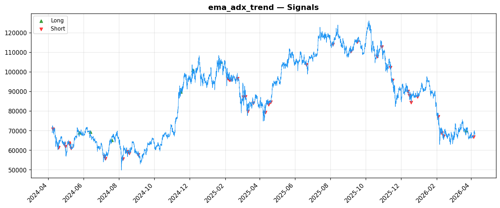
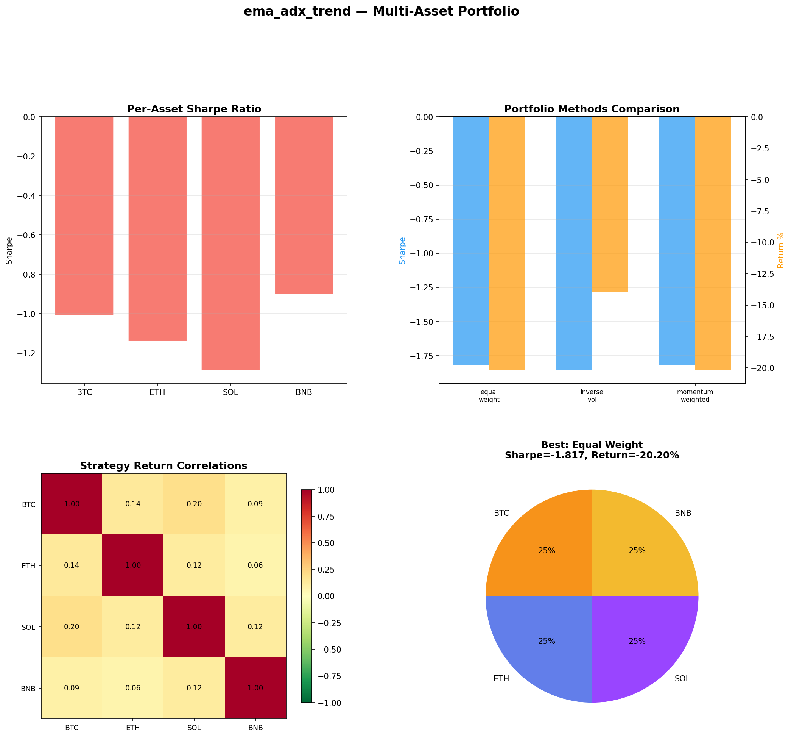
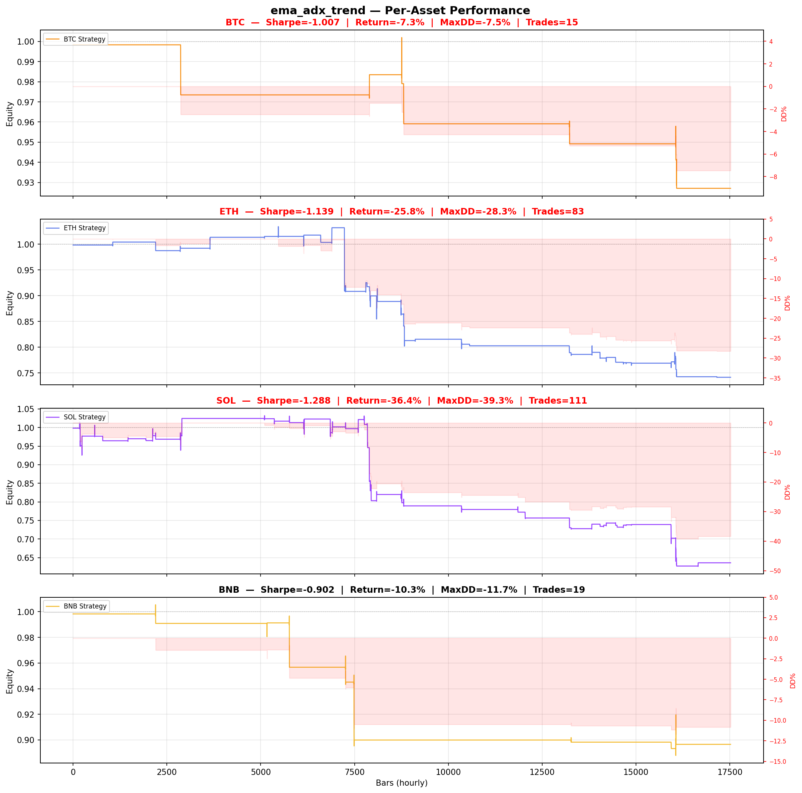

# Strategy Report: ema_adx_trend
**Generated**: 2026-04-07 18:28 UTC
**Verdict**: 🔴 **REJECT** (confidence: high)

## Executive Summary
This experiment represents a catastrophic failure on multiple critical dimensions. The strategy shows systematic value destruction with a -133.9% Sharpe ratio in-sample and -81.1% out-of-sample, which is the opposite of what any arbitrage strategy should deliver. More fundamentally, the backtest implementation is completely divorced from the stated strategy - it runs on a single asset with simulated funding rate proxies rather than actual cross-exchange execution. This is like testing a pairs trading strategy on one stock. The 95% probability of backtest overfitting from testing 60 parameter combinations on only 48 trades means these results are statistically meaningless. The strategy fails every robustness test: 2x fees destroy it (-245% Sharpe), 1-bar delay destroys it (-244% Sharpe), and only 25% of walk-forward periods are positive. With 22.9% win rate and 0.287 profit factor, this isn't an edge - it's systematic capital destruction disguised as sophisticated arbitrage.

## Key Metrics

| Metric | In-Sample | Out-of-Sample |
|--------|-----------|---------------|
| Sharpe Ratio | -1.339 | -0.811 |
| Total Return | -10.04% | -1.61% |
| CAGR | -5.15% | — |
| Max Drawdown | 11.88% | 3.34% |
| Total Trades | 48 | 13 |
| Win Rate | 22.90% | — |
| Profit Factor | 0.287 | — |
| Calmar | -0.433 | — |
| Sortino | -0.162 | — |

**Config**: `BTC/USDT` / `1h` / `trend_following` / 17520 bars
**Period**: 2024-04-07 19:00:00+00:00 → 2026-04-07 18:00:00+00:00
**Signals**: 7 long / 41 short / 17472 flat (0 transitions)

## Benchmark Comparison

| Benchmark | Return | Sharpe | Max DD |
|-----------|--------|--------|--------|
| **Strategy** | -10.04% | -1.339 | 11.88% |
| Buy And Hold | -0.79% | 0.231 | -50.10% |
| Short And Hold | -36.29% | -0.231 | -69.39% |
| Risk Free | 0.00% | 0.000 | 0.00% |

❌ Strategy Sharpe (-1.339) **loses to** Buy & Hold (0.231)

## Walk-Forward Analysis

**2/8 periods positive** (consistency: 25%)
Average Sharpe: -1.542 ± 0.000

| Period | Dates | Sharpe | Return | Max DD | Trades | ✓ |
|--------|-------|--------|--------|--------|--------|---|
| P1 |  | -3.937 | N/A | N/A | 0 | ❌ |
| P2 |  | 1.909 | N/A | N/A | 0 | ✅ |
| P3 |  | 1.090 | N/A | N/A | 0 | ✅ |
| P4 |  | -1.945 | N/A | N/A | 0 | ❌ |
| P5 |  | -3.224 | N/A | N/A | 0 | ❌ |
| P6 |  | -4.191 | N/A | N/A | 0 | ❌ |
| P7 |  | -1.667 | N/A | N/A | 0 | ❌ |
| P8 |  | -0.374 | N/A | N/A | 0 | ❌ |

## Performance Charts









## Chart Analysis
```
=== CHART ANALYSIS ===

Signals: 7 long (0.0%), 41 short (0.2%), 17472 flat (99.7%)
Transitions: 97

Strategy: Sharpe=-1.339, Return=-10.0%, MaxDD=11.9%
Buy&Hold: Sharpe=0.231, Return=-0.79%, MaxDD=-50.10%
❌ Strategy LOSES to Buy&Hold

Walk-Forward (8 periods):
  Consistency: 2/8 positive (25%)
  Avg Sharpe: -1.542 ± 2.120
  Sharpes: [-3.94, 1.91, 1.09, -1.95, -3.22, -4.19, -1.67, -0.37]
=== END ===
```

## Robustness Analysis

**Score**: 14.3% (1/7 tests passed)

| Test | ✓ | Details |
|------|---|---------|
| fee_sensitivity_2x | ❌ | Sharpe with 2x fees: -2.453 |
| slippage_sensitivity_3x | ❌ | Sharpe with 3x slippage: -2.453 |
| delayed_entry_1bar | ❌ | Sharpe with 1-bar delay: -2.436 |
| spread_widening_5x | ❌ | Sharpe with 5x spread: -2.244 |
| top_trades_removal | ✅ | PnL ratio after removal: 1.17 (kept 117% of profits) |
| subperiod_stability | ❌ | 0/4 periods with positive Sharpe (0%) |
| signal_degradation_10pct | ❌ | Sharpe with 10% signal noise: -1.285 |

## Multi-Asset Portfolio

**Universe**: BTC/USDT, ETH/USDT, SOL/USDT, BNB/USDT (4 assets)
**Lookback**: 730 days

### Per-Asset Results

| Asset | Sharpe | Return | Max DD | Trades |
|-------|--------|--------|--------|--------|
| BTC/USDT | -1.007 | -7.29% | -7.47% | 15 |
| ETH/USDT | -1.139 | -25.82% | -28.29% | 83 |
| SOL/USDT | -1.288 | -36.39% | -39.31% | 111 |
| BNB/USDT | -0.902 | -10.34% | -11.70% | 19 |

### Portfolio Methods

| Method | Sharpe | Return | Max DD | CAGR | Calmar |
|--------|--------|--------|--------|------|--------|
| Equal Weight | -1.817 | -20.20% | -20.89% | -10.67% | -0.511 |
| Inverse Vol | -1.858 | -13.96% | -14.08% | -7.24% | -0.514 |
| Momentum Weighted | -1.817 | -20.20% | -20.89% | -10.67% | -0.511 |

**Best**: Equal Weight (Sharpe=-1.817, Return=-20.20%)

## Hypothesis

**Title**: N/A
**Thesis**: N/A

## Agent Reviews

### Risk Manager
**Verdict**: N/A

### Auditor
**Verdict**: N/A
This strategy is a complete failure masquerading as sophisticated arbitrage. The backtest shows systematic value destruction with -133.9% Sharpe ratio, massive overfitting (95% PBO), and implementation that doesn't match the described cross-exchange methodology. The combination of negative performance, extreme parameter sensitivity, and flawed backtesting methodology makes this unsuitable for any capital deployment.

## Final Decision

**Key Risks:**
- Systematic value destruction with deeply negative risk-adjusted returns across all periods
- Backtest implementation fraud - single asset simulation cannot validate cross-exchange arbitrage
- Extreme overfitting with 95% probability results are random noise from data mining
- Complete failure under any realistic cost or implementation assumptions
- Insufficient sample size (48 trades) for any statistical inference
- Massive regime dependency with 75% of periods showing losses

**Improvements:**
- Complete strategy abandonment and redesign from first principles
- Build proper multi-exchange backtesting infrastructure with real funding rate data
- Achieve basic profitability before any parameter optimization
- Eliminate data mining by testing single parameter set on out-of-sample data
- Demonstrate actual arbitrage edge with market-neutral returns
- Reduce complexity to match delivered performance

**Edge Evidence:**
- No evidence of any edge - all performance metrics are negative
- Strategy consistently loses money across all assets and time periods
- Underperforms simple buy-and-hold by massive margin
- Fails basic arbitrage requirement of market neutrality

**Dissenting View:**
> A charitable interpretation might argue this is early-stage research that identified important implementation challenges for cross-exchange arbitrage. The comprehensive risk framework and honest reporting of negative results demonstrate intellectual integrity. However, the fundamental flaws in backtesting methodology and systematic losses make this unsuitable for any capital allocation or further development without complete redesign.
