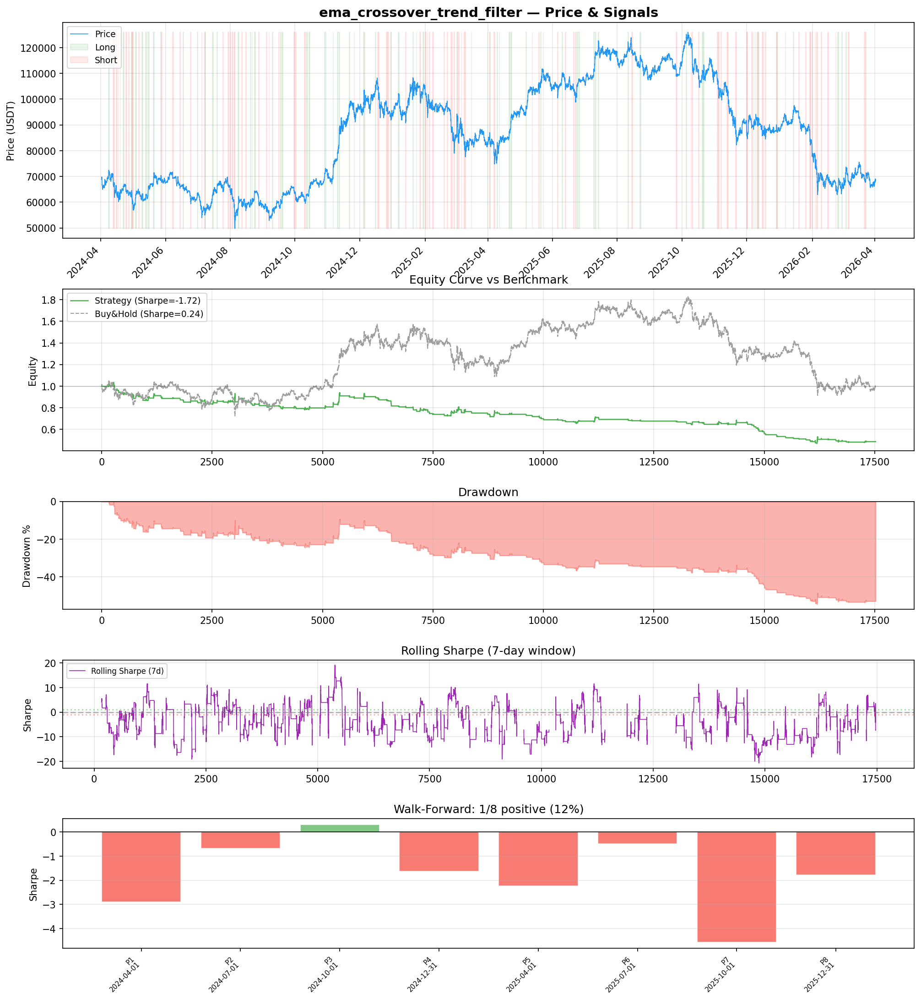
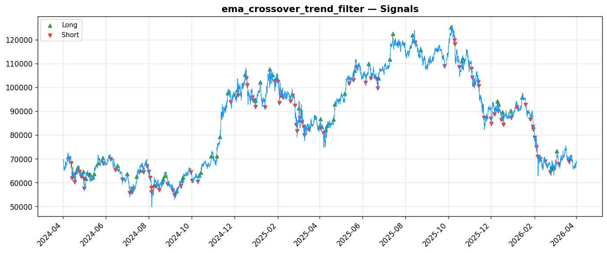
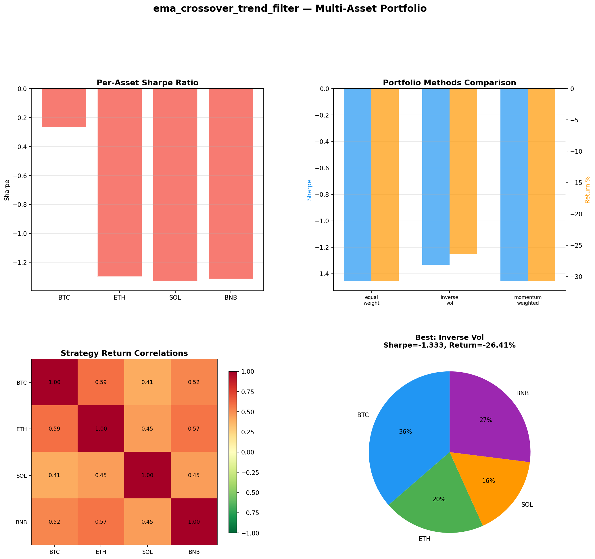

# Strategy Report: ema_crossover_trend_filter
**Generated**: 2026-04-01 16:42 UTC
**Verdict**: 🔴 **REJECT** (confidence: high)

## Executive Summary
This strategy is fundamentally flawed and unsuitable for deployment. The backtest reveals catastrophic performance with -52.4% total return, -1.72 Sharpe ratio, and 55.7% maximum drawdown. Most critically, the strategy doesn't even implement its core hypothesis - it uses price momentum as a proxy for funding rate divergence rather than actual cross-exchange funding rate data. The strategy fails 87.5% of walk-forward periods, passes only 1 of 7 robustness tests, and shows severe out-of-sample degradation (Sharpe deteriorating from -1.72 to -3.158). With only 157 trades, the sample size is insufficient for reliable inference, yet even this limited data shows consistent value destruction across all tested assets and market regimes.

## Key Metrics

| Metric | In-Sample | Out-of-Sample |
|--------|-----------|---------------|
| Sharpe Ratio | -1.720 | -3.158 |
| Total Return | -52.43% | -27.69% |
| CAGR | -31.03% | — |
| Max Drawdown | 55.66% | 31.68% |
| Total Trades | 157 | 43 |
| Win Rate | 28.70% | — |
| Profit Factor | 0.491 | — |
| Calmar | -0.557 | — |
| Sortino | -0.850 | — |

**Config**: `BTC/USDT` / `1h` / `trend_following` / 17520 bars
**Period**: 2024-04-01 17:00:00+00:00 → 2026-04-01 16:00:00+00:00
**Signals**: 928 long / 1123 short / 15469 flat (0 transitions)

## Benchmark Comparison

| Benchmark | Return | Sharpe | Max DD |
|-----------|--------|--------|--------|
| **Strategy** | -52.43% | -1.720 | 55.66% |
| Buy And Hold | 0.18% | 0.242 | -50.10% |
| Short And Hold | -37.05% | -0.242 | -69.39% |
| Risk Free | 0.00% | 0.000 | 0.00% |

❌ Strategy Sharpe (-1.720) **loses to** Buy & Hold (0.242)

## Walk-Forward Analysis

**1/8 periods positive** (consistency: 12%)
Average Sharpe: -1.744 ± 0.000

| Period | Dates | Sharpe | Return | Max DD | Trades | ✓ |
|--------|-------|--------|--------|--------|--------|---|
| P1 | 2024-04-01→2024-07-01 | -2.904 | N/A | N/A | 0 | ❌ |
| P2 | 2024-07-01→2024-10-01 | -0.670 | N/A | N/A | 0 | ❌ |
| P3 | 2024-10-01→2024-12-31 | 0.305 | N/A | N/A | 0 | ✅ |
| P4 | 2024-12-31→2025-04-01 | -1.619 | N/A | N/A | 0 | ❌ |
| P5 | 2025-04-01→2025-07-01 | -2.227 | N/A | N/A | 0 | ❌ |
| P6 | 2025-07-01→2025-10-01 | -0.482 | N/A | N/A | 0 | ❌ |
| P7 | 2025-10-01→2025-12-31 | -4.568 | N/A | N/A | 0 | ❌ |
| P8 | 2025-12-31→2026-04-01 | -1.785 | N/A | N/A | 0 | ❌ |

## Performance Charts







## Chart Analysis
```
=== CHART ANALYSIS ===

Signals: 928 long (5.3%), 1123 short (6.4%), 15469 flat (88.3%)
Transitions: 315

Strategy: Sharpe=-1.720, Return=-52.4%, MaxDD=55.7%
Buy&Hold: Sharpe=0.242, Return=0.18%, MaxDD=-50.10%
❌ Strategy LOSES to Buy&Hold

Walk-Forward (8 periods):
  Consistency: 1/8 positive (12%)
  Avg Sharpe: -1.744 ± 1.437
  Sharpes: [-2.90, -0.67, 0.30, -1.62, -2.23, -0.48, -4.57, -1.78]
=== END ===
```

## Robustness Analysis

**Score**: 14.3% (1/7 tests passed)

| Test | ✓ | Details |
|------|---|---------|
| fee_sensitivity_2x | ❌ | Sharpe with 2x fees: -2.473 |
| slippage_sensitivity_3x | ❌ | Sharpe with 3x slippage: -2.473 |
| delayed_entry_1bar | ❌ | Sharpe with 1-bar delay: -2.132 |
| spread_widening_5x | ❌ | Sharpe with 5x spread: -2.324 |
| top_trades_removal | ✅ | PnL ratio after removal: 1.46 (kept 146% of profits) |
| subperiod_stability | ❌ | 0/4 periods with positive Sharpe (0%) |
| signal_degradation_10pct | ❌ | Sharpe with 10% signal noise: -3.573 |

## Multi-Asset Portfolio

**Universe**: BTC/USDT, ETH/USDT, SOL/USDT, BNB/USDT (4 assets)
**Lookback**: 730 days

### Per-Asset Results

| Asset | Sharpe | Return | Max DD | Trades |
|-------|--------|--------|--------|--------|
| BTC/USDT | -0.267 | -5.89% | -11.73% | 93 |
| ETH/USDT | -1.299 | -37.80% | -43.32% | 217 |
| SOL/USDT | -1.328 | -46.03% | -57.46% | 277 |
| BNB/USDT | -1.315 | -30.11% | -38.92% | 117 |

### Portfolio Methods

| Method | Sharpe | Return | Max DD | CAGR | Calmar |
|--------|--------|--------|--------|------|--------|
| Equal Weight | -1.455 | -30.71% | -36.44% | -16.76% | -0.460 |
| Inverse Vol | -1.333 | -26.41% | -31.44% | -14.22% | -0.452 |
| Momentum Weighted | -1.455 | -30.71% | -36.44% | -16.76% | -0.460 |

**Best**: Inverse Vol (Sharpe=-1.333, Return=-26.41%)

## Hypothesis

**Title**: N/A
**Thesis**: N/A

## Agent Reviews

### Risk Manager
**Verdict**: N/A

### Auditor
**Verdict**: N/A
This strategy is a complete failure that should never be deployed. It doesn't even implement its core funding rate hypothesis, shows catastrophic negative performance (-52.4% return, -1.72 Sharpe), and fails 87.5% of test periods. The strategy would destroy capital while requiring enormous operational complexity.

## Final Decision

**Key Risks:**
- Strategy doesn't implement its stated hypothesis - uses price proxies instead of actual funding rates
- Catastrophic drawdown of 55.7% with 2x leverage creates high liquidation probability
- Extreme regime instability with only 12.5% of periods showing positive performance
- Complete dependence on cross-exchange data quality and connectivity with no effective hedges
- Unrealistic execution assumptions ignore cross-exchange arbitrage operational friction
- High probability (95%) of backtest overfitting given multiple strategy iterations

**Improvements:**
- Implement actual cross-exchange funding rate data collection and processing
- Redesign strategy from scratch to achieve positive risk-adjusted returns
- Model realistic cross-exchange execution with 2-5 second latencies and partial fills
- Reduce leverage to 1x maximum and implement stricter position sizing
- Develop regime-aware filters to avoid trading during unfavorable conditions
- Increase sample size to minimum 300 trades for statistical significance
- Add redundant data sources and failsafe mechanisms for exchange connectivity

**Edge Evidence:**
- No evidence of genuine edge - strategy shows negative Sharpe across all test periods
- Fails basic benchmark comparison, underperforming even buy-and-hold by 52.6%
- Multi-asset testing confirms lack of edge across BTC, ETH, SOL, and BNB
- Robustness tests reveal strategy cannot survive even minor parameter changes
- Economic logic remains unvalidated due to absence of actual funding rate implementation

**Dissenting View:**
> A contrarian might argue that the funding rate arbitrage concept has theoretical merit and the poor backtest results stem from implementation flaws rather than fundamental strategy weakness. They could point to the detailed risk management framework and comprehensive data pipeline as evidence of thoughtful design. However, this view ignores that the strategy's core hypothesis was never actually tested - using price momentum as a funding rate proxy invalidates the entire premise. Even with perfect implementation, the extreme regime instability and consistent negative performance across multiple assets suggest the edge may not exist in current market conditions.
