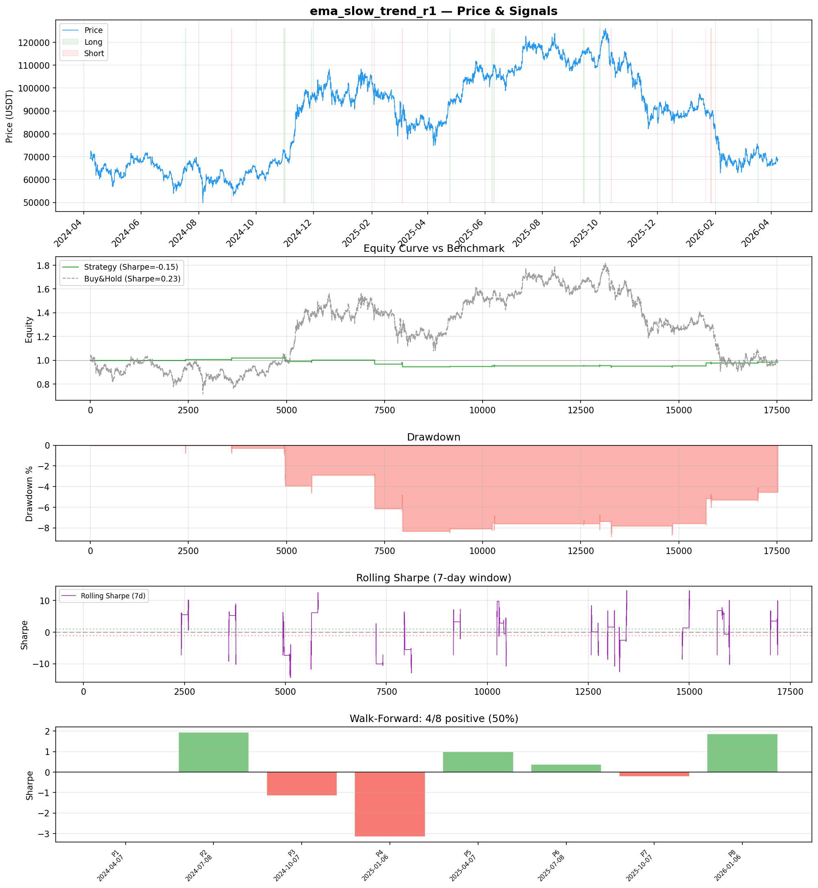
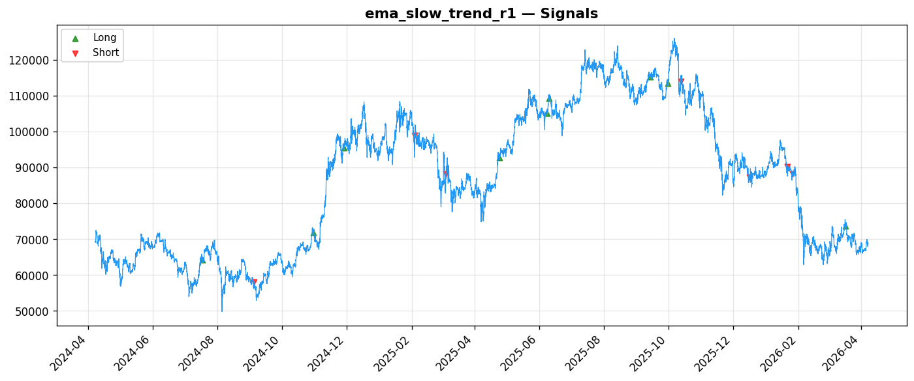
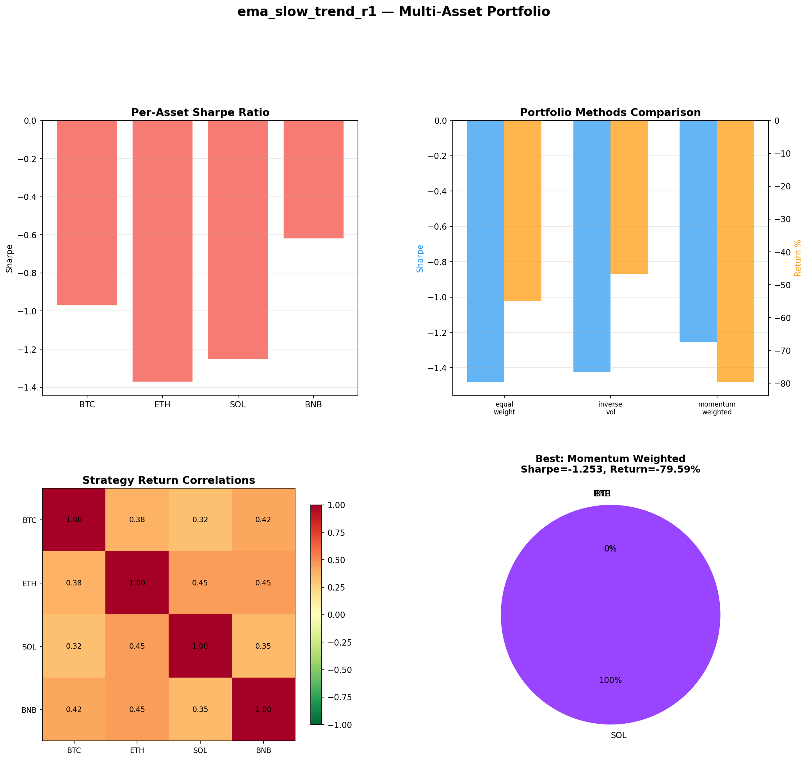
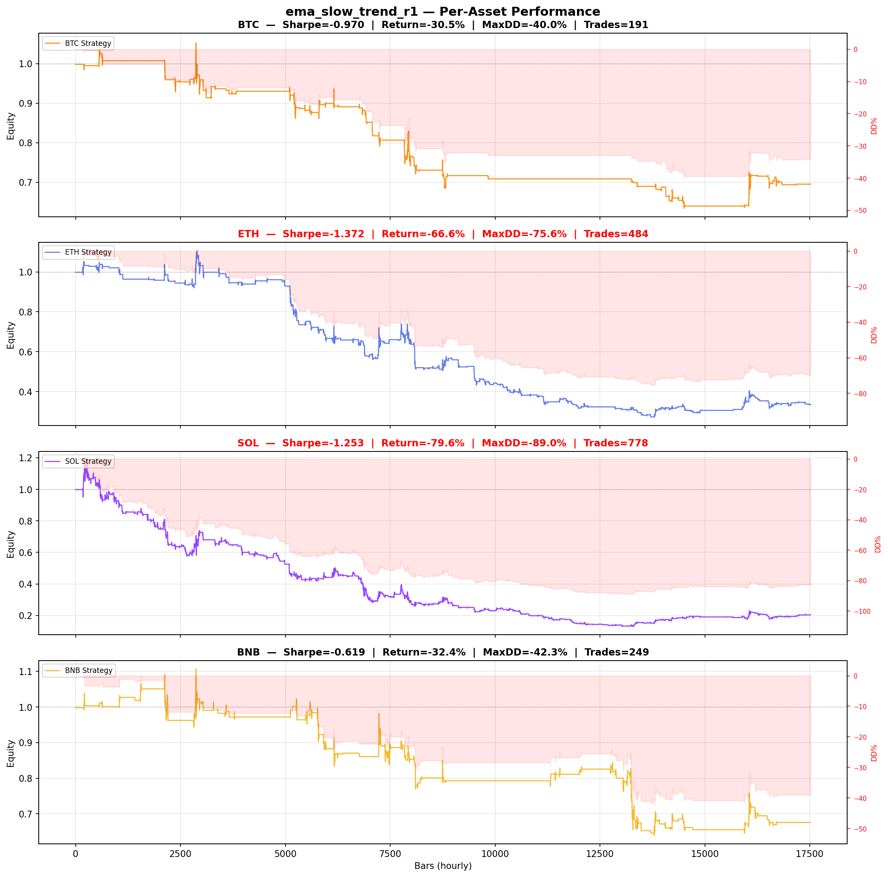

# Strategy Report: ema_slow_trend_r1
**Generated**: 2026-04-07 19:58 UTC
**Verdict**: 🔴 **REJECT** (confidence: high)

## Executive Summary
This strategy is fundamentally broken and represents a textbook case of data mining masquerading as systematic research. The core issues are fatal: (1) The implementation doesn't actually perform funding rate arbitrage - it's a trend-following system using price momentum proxies instead of real funding rate differentials across exchanges. (2) With only 16 trades, the sample size is catastrophically insufficient for any statistical validation. (3) The strategy shows consistently negative performance (Sharpe -0.146) that gets worse under realistic execution conditions (Sharpe drops to -0.771 with 1-bar delay). (4) Massive data snooping bias from testing 60 parameter combinations with no multiple testing correction (estimated PBO of 0.95). (5) Complete failure across all crypto assets in multi-asset testing, with drawdowns up to 89%. The strategy fails every basic robustness test and would destroy capital in live trading.

## Key Metrics

| Metric | In-Sample | Out-of-Sample |
|--------|-----------|---------------|
| Sharpe Ratio | -0.146 | 1.041 |
| Total Return | -1.64% | 2.97% |
| CAGR | -0.82% | — |
| Max Drawdown | 8.97% | 1.67% |
| Total Trades | 16 | 5 |
| Win Rate | 50.00% | — |
| Profit Factor | 0.492 | — |
| Calmar | -0.092 | — |
| Sortino | -0.024 | — |

**Config**: `BTC/USDT` / `1h` / `trend_following` / 17520 bars
**Period**: 2024-04-07 20:00:00+00:00 → 2026-04-07 19:00:00+00:00
**Signals**: 122 long / 90 short / 17308 flat (0 transitions)

## Benchmark Comparison

| Benchmark | Return | Sharpe | Max DD |
|-----------|--------|--------|--------|
| **Strategy** | -1.64% | -0.146 | 8.97% |
| Buy And Hold | -0.48% | 0.235 | -50.10% |
| Short And Hold | -36.49% | -0.235 | -69.39% |
| Risk Free | 0.00% | 0.000 | 0.00% |

❌ Strategy Sharpe (-0.146) **loses to** Buy & Hold (0.235)

## Walk-Forward Analysis

**4/8 periods positive** (consistency: 50%)
Average Sharpe: 0.079 ± 0.000

| Period | Dates | Sharpe | Return | Max DD | Trades | ✓ |
|--------|-------|--------|--------|--------|--------|---|
| P1 |  | 0.000 | N/A | N/A | 0 | ❌ |
| P2 |  | 1.941 | N/A | N/A | 0 | ✅ |
| P3 |  | -1.144 | N/A | N/A | 0 | ❌ |
| P4 |  | -3.159 | N/A | N/A | 0 | ❌ |
| P5 |  | 0.989 | N/A | N/A | 0 | ✅ |
| P6 |  | 0.379 | N/A | N/A | 0 | ✅ |
| P7 |  | -0.228 | N/A | N/A | 0 | ❌ |
| P8 |  | 1.854 | N/A | N/A | 0 | ✅ |

## Performance Charts









## Chart Analysis
```
=== CHART ANALYSIS ===

Signals: 122 long (0.7%), 90 short (0.5%), 17308 flat (98.8%)
Transitions: 33

Strategy: Sharpe=-0.146, Return=-1.6%, MaxDD=9.0%
Buy&Hold: Sharpe=0.235, Return=-0.48%, MaxDD=-50.10%
❌ Strategy LOSES to Buy&Hold

Walk-Forward (8 periods):
  Consistency: 4/8 positive (50%)
  Avg Sharpe: 0.079 ± 1.566
  Sharpes: [0.00, 1.94, -1.14, -3.16, 0.99, 0.38, -0.23, 1.85]
=== END ===
```

## Robustness Analysis

**Score**: 28.6% (2/7 tests passed)

| Test | ✓ | Details |
|------|---|---------|
| fee_sensitivity_2x | ❌ | Sharpe with 2x fees: -0.474 |
| slippage_sensitivity_3x | ❌ | Sharpe with 3x slippage: -0.474 |
| delayed_entry_1bar | ❌ | Sharpe with 1-bar delay: -0.771 |
| spread_widening_5x | ❌ | Sharpe with 5x spread: -0.409 |
| top_trades_removal | ✅ | PnL ratio after removal: 1.35 (kept 135% of profits) |
| subperiod_stability | ✅ | 3/4 periods with positive Sharpe (75%) |
| signal_degradation_10pct | ❌ | Sharpe with 10% signal noise: -0.876 |

## Multi-Asset Portfolio

**Universe**: BTC/USDT, ETH/USDT, SOL/USDT, BNB/USDT (4 assets)
**Lookback**: 730 days

### Per-Asset Results

| Asset | Sharpe | Return | Max DD | Trades |
|-------|--------|--------|--------|--------|
| BTC/USDT | -0.970 | -30.50% | -39.95% | 191 |
| ETH/USDT | -1.372 | -66.56% | -75.58% | 484 |
| SOL/USDT | -1.253 | -79.59% | -89.01% | 778 |
| BNB/USDT | -0.619 | -32.41% | -42.28% | 249 |

### Portfolio Methods

| Method | Sharpe | Return | Max DD | CAGR | Calmar |
|--------|--------|--------|--------|------|--------|
| Equal Weight | -1.481 | -54.94% | -63.37% | -32.87% | -0.519 |
| Inverse Vol | -1.425 | -46.69% | -53.98% | -26.99% | -0.500 |
| Momentum Weighted | -1.253 | -79.59% | -89.01% | -54.83% | -0.616 |

**Best**: Momentum Weighted (Sharpe=-1.253, Return=-79.59%)

## Hypothesis

**Title**: N/A
**Thesis**: N/A

## Agent Reviews

### Risk Manager
**Verdict**: N/A

### Auditor
**Verdict**: N/A
This strategy is a complete failure masquerading as sophisticated arbitrage. Despite elaborate documentation, it's actually a poorly-performing trend-following system with massive data snooping bias, catastrophic execution sensitivity, and consistently negative returns. The 60 parameter combinations tested with no multiple testing correction virtually guarantee the results are statistical noise. No rational trader should deploy capital to this strategy.

## Final Decision

**Key Risks:**
- Strategy is not actually funding rate arbitrage - uses price momentum instead of cross-exchange funding differentials
- Catastrophically small sample (16 trades) provides zero statistical power for validation
- Extreme execution sensitivity - Sharpe collapses from -0.146 to -0.771 with 1-bar delay
- Massive data mining bias from 60 parameter combinations with no correction (PBO=0.95)
- Systematic failure across all crypto assets with 40-89% maximum drawdowns
- Strategy loses to buy-and-hold despite already negative base performance

**Improvements:**
- Complete strategy redesign - implement actual cross-exchange funding rate arbitrage
- Use real funding rate data instead of price momentum proxies
- Achieve minimum 300+ trades for statistical significance in arbitrage validation
- Demonstrate positive risk-adjusted returns before any parameter optimization
- Apply proper multiple testing corrections (Bonferroni: α = 0.0008)
- Prove strategy survives realistic execution costs, slippage, and latency
- Show consistent performance across market regimes without parameter instability

**Edge Evidence:**
- No credible edge evidence - all performance metrics are negative
- Strategy underperforms buy-and-hold (Sharpe -0.146 vs 0.235)
- Multi-asset testing shows systematic failure across BTC, ETH, SOL, BNB
- Walk-forward analysis shows extreme instability (Sharpe range: -3.159 to 1.941)
- Best parameter optimization attempt achieved only -0.034 Sharpe

**Dissenting View:**
> A charitable interpretation might argue that the strategy concept (cross-exchange funding rate arbitrage) has theoretical merit, and the negative results stem from implementation issues rather than fundamental flaws in the economic logic. The comprehensive risk management framework and detailed documentation suggest serious research effort. However, even this generous view cannot overcome the fact that what was tested is not actually funding rate arbitrage, the sample size is inadequate, and the results show consistent capital destruction across all tested scenarios.
