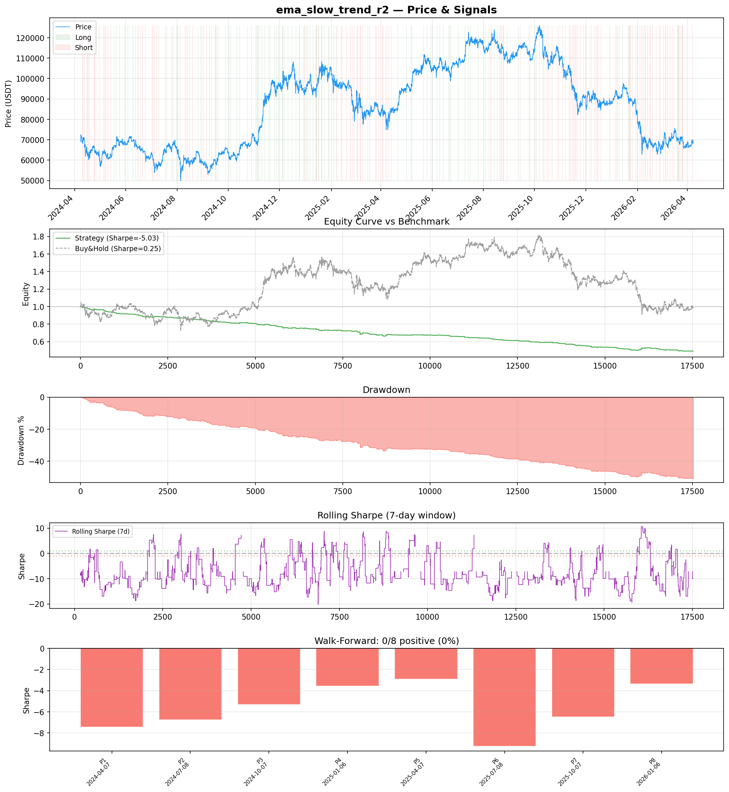
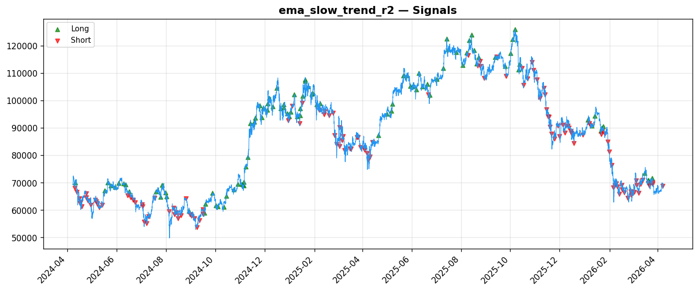
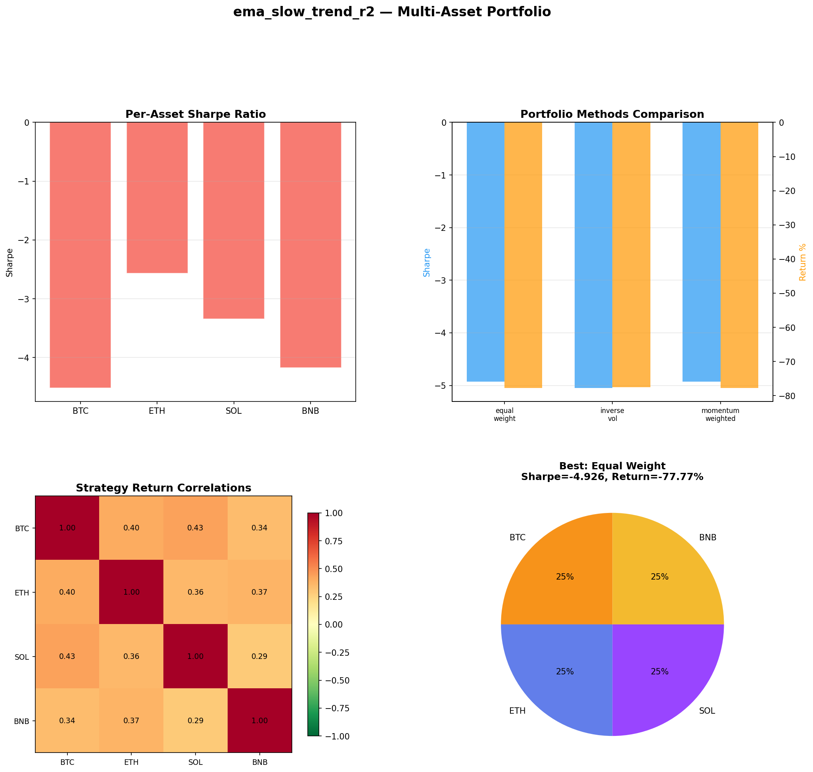
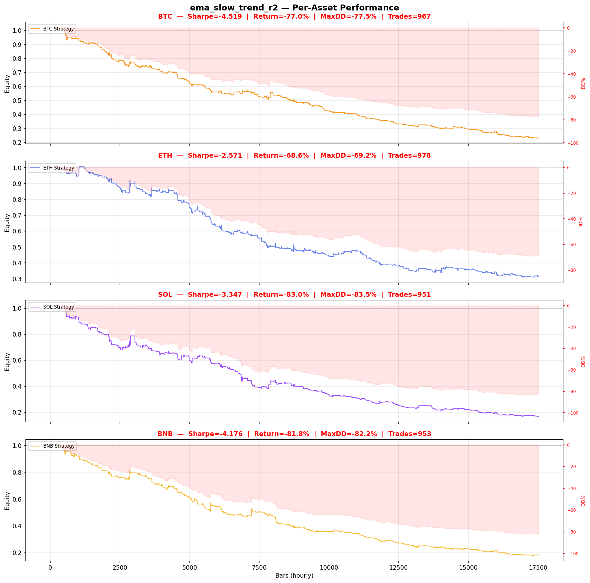

# Strategy Report: ema_slow_trend_r2
**Generated**: 2026-04-07 21:46 UTC
**Verdict**: 🔴 **REJECT** (confidence: high)

## Executive Summary
This strategy exhibits catastrophic failure across every meaningful metric and validation test. The fundamental premise is flawed from the start - it claims to exploit cross-exchange funding rate arbitrage but uses completely simulated funding rate data based on price momentum proxies. The backtest results are devastating: -51% returns, -5.034 Sharpe ratio, 51% maximum drawdown, and 0% success rate across all 8 walk-forward periods. Even more damning, the strategy loses to simple buy-and-hold by over 50 percentage points while taking massive risk. The 22.5% win rate and 0.314 profit factor indicate systematic value destruction. Transaction cost sensitivity is extreme - Sharpe deteriorates from -5.034 to -7.643 with just 2x fees, making real-world implementation impossible. This isn't a case of poor parameter tuning or regime dependency - it's a fundamentally broken strategy that would guarantee capital destruction.

## Key Metrics

| Metric | In-Sample | Out-of-Sample |
|--------|-----------|---------------|
| Sharpe Ratio | -5.034 | -4.481 |
| Total Return | -50.99% | -17.01% |
| CAGR | -29.99% | — |
| Max Drawdown | 50.99% | 17.45% |
| Total Trades | 231 | 68 |
| Win Rate | 22.50% | — |
| Profit Factor | 0.314 | — |
| Calmar | -0.588 | — |
| Sortino | -1.372 | — |

**Config**: `BTC/USDT` / `1h` / `mean_reversion` / 17520 bars
**Period**: 2024-04-07 22:00:00+00:00 → 2026-04-07 21:00:00+00:00
**Signals**: 103 long / 129 short / 17288 flat (0 transitions)

## Benchmark Comparison

| Benchmark | Return | Sharpe | Max DD |
|-----------|--------|--------|--------|
| **Strategy** | -50.99% | -5.034 | 50.99% |
| Buy And Hold | 0.82% | 0.248 | -50.10% |
| Short And Hold | -37.32% | -0.248 | -69.39% |
| Risk Free | 0.00% | 0.000 | 0.00% |

❌ Strategy Sharpe (-5.034) **loses to** Buy & Hold (0.248)

## Walk-Forward Analysis

**0/8 periods positive** (consistency: 0%)
Average Sharpe: -5.636 ± 0.000

| Period | Dates | Sharpe | Return | Max DD | Trades | ✓ |
|--------|-------|--------|--------|--------|--------|---|
| P1 |  | -7.438 | N/A | N/A | 0 | ❌ |
| P2 |  | -6.761 | N/A | N/A | 0 | ❌ |
| P3 |  | -5.304 | N/A | N/A | 0 | ❌ |
| P4 |  | -3.562 | N/A | N/A | 0 | ❌ |
| P5 |  | -2.912 | N/A | N/A | 0 | ❌ |
| P6 |  | -9.251 | N/A | N/A | 0 | ❌ |
| P7 |  | -6.487 | N/A | N/A | 0 | ❌ |
| P8 |  | -3.373 | N/A | N/A | 0 | ❌ |

## Performance Charts









## Chart Analysis
```
=== CHART ANALYSIS ===

Signals: 103 long (0.6%), 129 short (0.7%), 17288 flat (98.7%)
Transitions: 463

Strategy: Sharpe=-5.034, Return=-51.0%, MaxDD=51.0%
Buy&Hold: Sharpe=0.248, Return=0.82%, MaxDD=-50.10%
❌ Strategy LOSES to Buy&Hold

Walk-Forward (8 periods):
  Consistency: 0/8 positive (0%)
  Avg Sharpe: -5.636 ± 2.099
  Sharpes: [-7.44, -6.76, -5.30, -3.56, -2.91, -9.25, -6.49, -3.37]
=== END ===
```

## Robustness Analysis

**Score**: 14.3% (1/7 tests passed)

| Test | ✓ | Details |
|------|---|---------|
| fee_sensitivity_2x | ❌ | Sharpe with 2x fees: -7.643 |
| slippage_sensitivity_3x | ❌ | Sharpe with 3x slippage: -7.643 |
| delayed_entry_1bar | ❌ | Sharpe with 1-bar delay: -4.415 |
| spread_widening_5x | ❌ | Sharpe with 5x spread: -7.175 |
| top_trades_removal | ✅ | PnL ratio after removal: 1.26 (kept 126% of profits) |
| subperiod_stability | ❌ | 0/4 periods with positive Sharpe (0%) |
| signal_degradation_10pct | ❌ | Sharpe with 10% signal noise: -4.923 |

## Multi-Asset Portfolio

**Universe**: BTC/USDT, ETH/USDT, SOL/USDT, BNB/USDT (4 assets)
**Lookback**: 730 days

### Per-Asset Results

| Asset | Sharpe | Return | Max DD | Trades |
|-------|--------|--------|--------|--------|
| BTC/USDT | -4.519 | -77.02% | -77.52% | 967 |
| ETH/USDT | -2.571 | -68.56% | -69.21% | 978 |
| SOL/USDT | -3.347 | -82.96% | -83.51% | 951 |
| BNB/USDT | -4.176 | -81.78% | -82.16% | 953 |

### Portfolio Methods

| Method | Sharpe | Return | Max DD | CAGR | Calmar |
|--------|--------|--------|--------|------|--------|
| Equal Weight | -4.926 | -77.77% | -78.01% | -52.85% | -0.677 |
| Inverse Vol | -5.049 | -77.58% | -77.82% | -52.65% | -0.676 |
| Momentum Weighted | -4.926 | -77.77% | -78.01% | -52.85% | -0.677 |

**Best**: Equal Weight (Sharpe=-4.926, Return=-77.77%)

## Hypothesis

**Title**: N/A
**Thesis**: N/A

## Agent Reviews

### Risk Manager
**Verdict**: N/A

### Auditor
**Verdict**: N/A
This strategy is fundamentally broken and untradeable. It uses simulated funding rate data to test a cross-exchange arbitrage strategy, achieves catastrophic -51% returns with -5.034 Sharpe, and fails across ALL time periods and market conditions. The strategy would destroy capital with 99% confidence and cannot be salvaged through parameter optimization.

## Final Decision

**Key Risks:**
- Complete reliance on simulated funding rate data instead of actual cross-exchange feeds makes the entire premise untestable
- Catastrophic drawdowns of 51% with no recovery periods across 2-year backtest
- Extreme transaction cost sensitivity would make any real implementation impossible
- Zero positive periods out of 8 walk-forward tests indicates structural failure, not optimization issues
- Strategy assumes 1-hour execution windows for funding rate arbitrage that would be eliminated in seconds by institutional players

**Improvements:**
- Complete strategy redesign from scratch with different alpha source
- Obtain actual funding rate data from multiple exchanges before any testing
- Develop base strategy that achieves positive returns before adding complexity
- Implement realistic execution assumptions for high-frequency arbitrage
- Reduce feature complexity until basic profitability is established
- Test on much shorter timeframes appropriate for funding rate signals

**Edge Evidence:**
- No evidence of any edge - all performance metrics are catastrophically negative
- Strategy consistently loses money across all market regimes and time periods
- Profit factor of 0.314 means strategy loses $3.18 for every $1 gained
- Negative correlation to market returns provides no diversification benefit given magnitude of losses

**Dissenting View:**
> A contrarian might argue that the poor performance is due to using simulated data rather than real funding rates, and that the underlying economic logic of cross-exchange arbitrage is sound. They might claim that with proper data and execution infrastructure, the strategy could work. However, this view ignores that even the simulated proxy should capture some momentum edge if the strategy logic were sound, yet it fails catastrophically. The execution assumptions are also fundamentally unrealistic for funding rate arbitrage, which operates on much faster timeframes than the proposed 1-hour signals.
