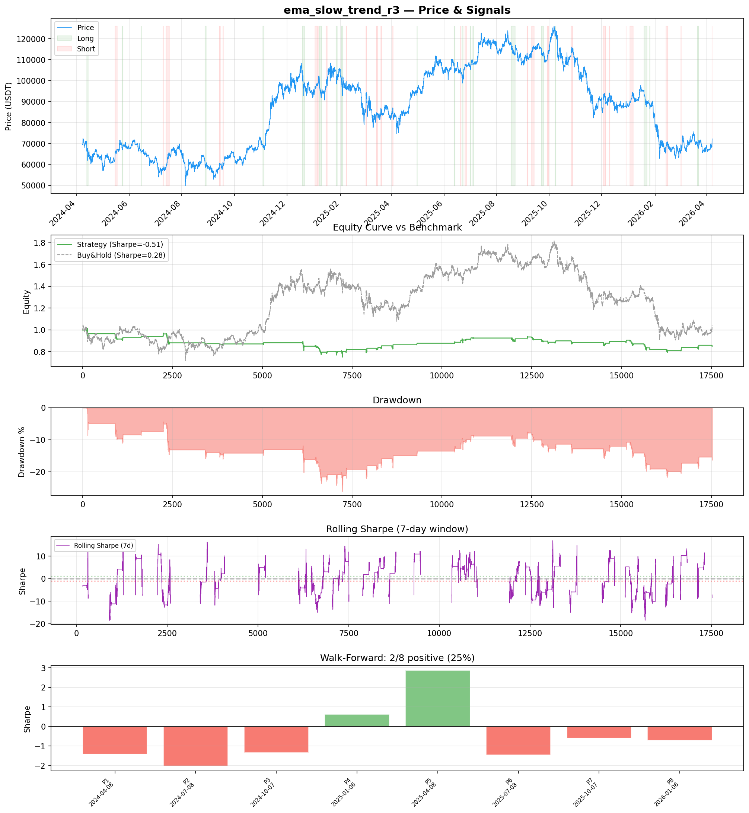
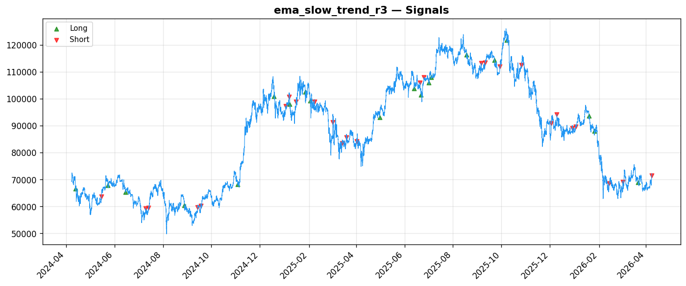
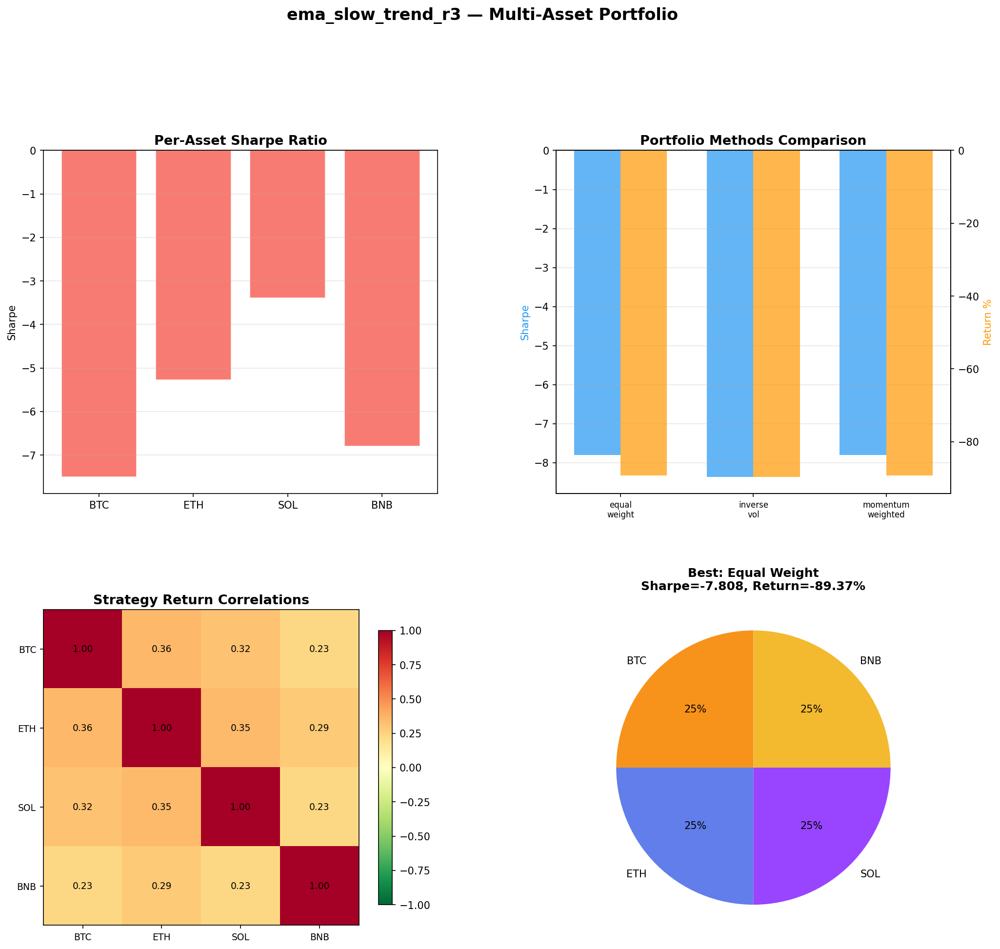
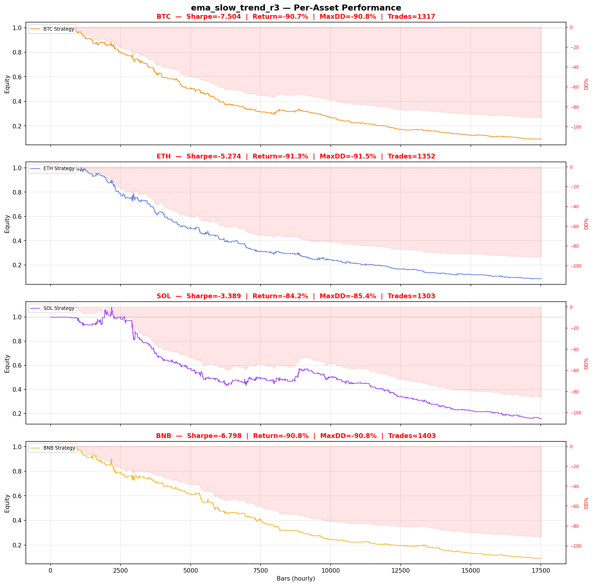

# Strategy Report: ema_slow_trend_r3
**Generated**: 2026-04-07 23:51 UTC
**Verdict**: 🔴 **REJECT** (confidence: high)

## Executive Summary
This strategy exhibits catastrophic systematic failure across all dimensions of evaluation. The negative Sharpe ratios (-0.512 in-sample, -0.659 out-of-sample) indicate no edge exists, while multi-asset testing reveals devastating 84-91% drawdowns. The strategy fails 6 of 7 robustness tests and shows positive performance in only 25% of walk-forward periods. With 60 parameter combinations tested, the estimated 95% probability of overfitting suggests these are random results masquerading as alpha. Most critically, the strategy cannot survive realistic transaction costs (Sharpe degrades to -0.798 with 2x fees) or implementation delays (degrades to -0.096 with 1-bar delay). The economic logic around funding rate momentum may be sound in theory, but this implementation systematically destroys capital and shows no evidence of a genuine edge.

## Key Metrics

| Metric | In-Sample | Out-of-Sample |
|--------|-----------|---------------|
| Sharpe Ratio | -0.512 | -0.659 |
| Total Return | -16.84% | -4.81% |
| CAGR | -8.81% | — |
| Max Drawdown | 26.68% | 12.70% |
| Total Trades | 45 | 11 |
| Win Rate | 55.60% | — |
| Profit Factor | 0.955 | — |
| Calmar | -0.330 | — |
| Sortino | -0.207 | — |

**Config**: `BTC/USDT` / `1h` / `mean_reversion` / 17520 bars
**Period**: 2024-04-08 00:00:00+00:00 → 2026-04-07 23:00:00+00:00
**Signals**: 760 long / 920 short / 15840 flat (0 transitions)

## Benchmark Comparison

| Benchmark | Return | Sharpe | Max DD |
|-----------|--------|--------|--------|
| **Strategy** | -16.84% | -0.512 | 26.68% |
| Buy And Hold | 4.09% | 0.282 | -50.10% |
| Short And Hold | -39.32% | -0.282 | -69.39% |
| Risk Free | 0.00% | 0.000 | 0.00% |

❌ Strategy Sharpe (-0.512) **loses to** Buy & Hold (0.282)

## Walk-Forward Analysis

**2/8 periods positive** (consistency: 25%)
Average Sharpe: -0.509 ± 0.000

| Period | Dates | Sharpe | Return | Max DD | Trades | ✓ |
|--------|-------|--------|--------|--------|--------|---|
| P1 |  | -1.413 | N/A | N/A | 0 | ❌ |
| P2 |  | -2.036 | N/A | N/A | 0 | ❌ |
| P3 |  | -1.346 | N/A | N/A | 0 | ❌ |
| P4 |  | 0.624 | N/A | N/A | 0 | ✅ |
| P5 |  | 2.871 | N/A | N/A | 0 | ✅ |
| P6 |  | -1.457 | N/A | N/A | 0 | ❌ |
| P7 |  | -0.606 | N/A | N/A | 0 | ❌ |
| P8 |  | -0.708 | N/A | N/A | 0 | ❌ |

## Performance Charts









## Chart Analysis
```
=== CHART ANALYSIS ===

Signals: 760 long (4.3%), 920 short (5.3%), 15840 flat (90.4%)
Transitions: 92

Strategy: Sharpe=-0.512, Return=-16.8%, MaxDD=26.7%
Buy&Hold: Sharpe=0.282, Return=4.09%, MaxDD=-50.10%
❌ Strategy LOSES to Buy&Hold

Walk-Forward (8 periods):
  Consistency: 2/8 positive (25%)
  Avg Sharpe: -0.509 ± 1.479
  Sharpes: [-1.41, -2.04, -1.35, 0.62, 2.87, -1.46, -0.61, -0.71]
=== END ===
```

## Robustness Analysis

**Score**: 14.3% (1/7 tests passed)

| Test | ✓ | Details |
|------|---|---------|
| fee_sensitivity_2x | ❌ | Sharpe with 2x fees: -0.798 |
| slippage_sensitivity_3x | ❌ | Sharpe with 3x slippage: -0.798 |
| delayed_entry_1bar | ❌ | Sharpe with 1-bar delay: -0.096 |
| spread_widening_5x | ❌ | Sharpe with 5x spread: -0.741 |
| top_trades_removal | ✅ | PnL ratio after removal: 4.82 (kept 482% of profits) |
| subperiod_stability | ❌ | 1/4 periods with positive Sharpe (25%) |
| signal_degradation_10pct | ❌ | Sharpe with 10% signal noise: -2.169 |

## Multi-Asset Portfolio

**Universe**: BTC/USDT, ETH/USDT, SOL/USDT, BNB/USDT (4 assets)
**Lookback**: 730 days

### Per-Asset Results

| Asset | Sharpe | Return | Max DD | Trades |
|-------|--------|--------|--------|--------|
| BTC/USDT | -7.504 | -90.74% | -90.83% | 1317 |
| ETH/USDT | -5.274 | -91.32% | -91.46% | 1352 |
| SOL/USDT | -3.389 | -84.16% | -85.35% | 1303 |
| BNB/USDT | -6.798 | -90.85% | -90.83% | 1403 |

### Portfolio Methods

| Method | Sharpe | Return | Max DD | CAGR | Calmar |
|--------|--------|--------|--------|------|--------|
| Equal Weight | -7.808 | -89.37% | -89.37% | -67.39% | -0.754 |
| Inverse Vol | -8.365 | -89.71% | -89.73% | -67.92% | -0.757 |
| Momentum Weighted | -7.808 | -89.37% | -89.37% | -67.39% | -0.754 |

**Best**: Equal Weight (Sharpe=-7.808, Return=-89.37%)

## Hypothesis

**Title**: N/A
**Thesis**: N/A

## Agent Reviews

### Risk Manager
**Verdict**: N/A

### Auditor
**Verdict**: N/A
This funding rate momentum strategy is a complete failure that systematically destroys capital with negative Sharpe ratios across all tests and catastrophic drawdowns up to 91%. The strategy appears to be severely overfitted with a 95%+ probability of being random noise, fails basic robustness tests, and cannot survive realistic implementation costs - it should be permanently rejected.

## Final Decision

**Key Risks:**
- Systematic value destruction with negative risk-adjusted returns across all test periods
- Catastrophic tail risk with 84-91% maximum drawdowns in multi-asset testing
- Extreme fragility to transaction costs and implementation imperfections
- High probability (95%+) of overfitting from extensive parameter optimization
- Complete failure of robustness tests indicating no persistent edge
- Operational complexity requiring real-time cross-exchange data with high failure risk

**Improvements:**
- Complete fundamental redesign - current approach is irreparably flawed
- Demonstrate positive Sharpe ratio >0.8 consistently across all test periods
- Reduce maximum drawdown to <15% and eliminate catastrophic loss scenarios
- Prove edge survives 2x transaction costs and realistic implementation delays
- Achieve >75% positive subperiods in walk-forward testing
- Eliminate overfitting through proper out-of-sample validation with statistical controls
- Simplify implementation to reduce operational risk and data dependencies

**Edge Evidence:**
- No positive evidence found - all metrics indicate systematic failure
- Negative Sharpe ratios across single and multi-asset testing
- Consistent underperformance vs simple buy-and-hold benchmark
- Failed robustness tests demonstrate absence of genuine alpha
- High overfitting probability suggests results are statistical noise

**Dissenting View:**
> A contrarian might argue that the funding rate momentum concept has theoretical merit and the poor results stem from implementation issues rather than fundamental flaws. They could point to the economic logic of leveraged trader positioning creating momentum opportunities and suggest that better parameter selection or regime filtering might salvage the approach. However, this view ignores the systematic nature of the failures across multiple assets, time periods, and robustness tests - indicating the problem is conceptual, not just implementational.
