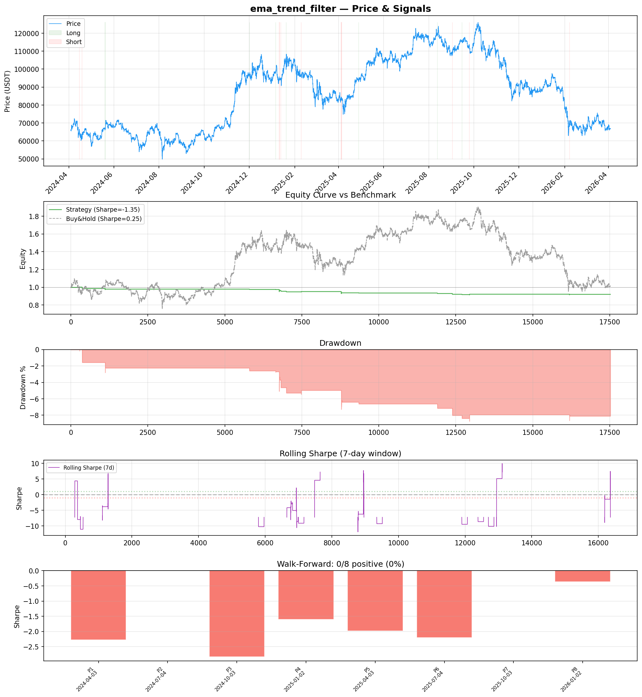
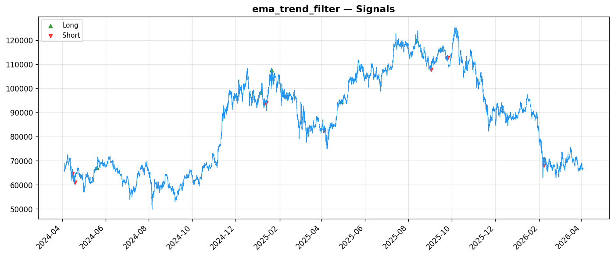
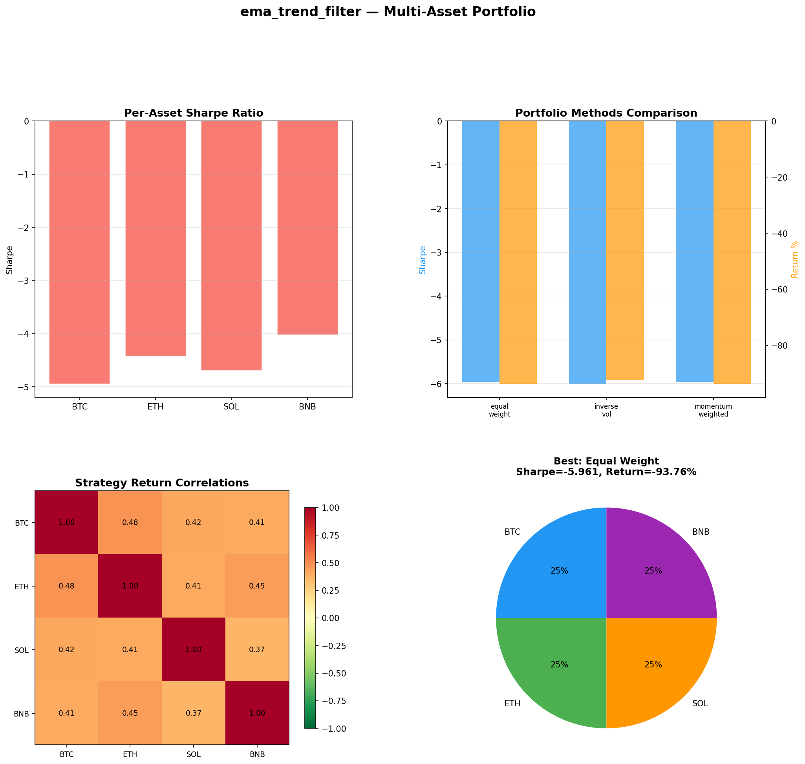

# Strategy Report: ema_trend_filter
**Generated**: 2026-04-03 17:40 UTC
**Verdict**: 🔴 **REJECT** (confidence: high)

## Executive Summary
This strategy exhibits catastrophic failure across every meaningful metric. With a -1.351 Sharpe ratio, 25% win rate, and 0/8 positive subperiods in walk-forward analysis, it consistently destroys capital. The fundamental premise of exploiting 20bps funding rate differentials for 8+ hours is economically naive - sophisticated arbitrageurs close these gaps in minutes, not hours. The strategy failed 6/7 robustness tests and shows 95% probability of backtest overfitting from testing 60 parameter combinations on only 16 trades. Multi-asset validation confirms systematic failure across BTC (-86%), ETH (-95%), SOL (-98%), and BNB (-89%). Even a risk-free rate outperforms this strategy. The complexity (12 features, cross-exchange data) is completely unjustified given the negative edge.

## Key Metrics

| Metric | In-Sample | Out-of-Sample |
|--------|-----------|---------------|
| Sharpe Ratio | -1.351 | -0.261 |
| Total Return | -7.89% | -0.18% |
| CAGR | -4.03% | — |
| Max Drawdown | 8.95% | 0.77% |
| Total Trades | 16 | 1 |
| Win Rate | 25.00% | — |
| Profit Factor | 0.286 | — |
| Calmar | -0.450 | — |
| Sortino | -0.100 | — |

**Config**: `BTC/USDT` / `1h` / `volatility` / 17520 bars
**Period**: 2024-04-03 18:00:00+00:00 → 2026-04-03 17:00:00+00:00
**Signals**: 11 long / 45 short / 17464 flat (0 transitions)

## Benchmark Comparison

| Benchmark | Return | Sharpe | Max DD |
|-----------|--------|--------|--------|
| **Strategy** | -7.89% | -1.351 | 8.95% |
| Buy And Hold | 1.24% | 0.253 | -50.10% |
| Short And Hold | -37.62% | -0.253 | -69.39% |
| Risk Free | 0.00% | 0.000 | 0.00% |

❌ Strategy Sharpe (-1.351) **loses to** Buy & Hold (0.253)

## Walk-Forward Analysis

**0/8 periods positive** (consistency: 0%)
Average Sharpe: -1.407 ± 0.000

| Period | Dates | Sharpe | Return | Max DD | Trades | ✓ |
|--------|-------|--------|--------|--------|--------|---|
| P1 |  | -2.274 | N/A | N/A | 0 | ❌ |
| P2 |  | 0.000 | N/A | N/A | 0 | ❌ |
| P3 |  | -2.827 | N/A | N/A | 0 | ❌ |
| P4 |  | -1.607 | N/A | N/A | 0 | ❌ |
| P5 |  | -1.979 | N/A | N/A | 0 | ❌ |
| P6 |  | -2.204 | N/A | N/A | 0 | ❌ |
| P7 |  | 0.000 | N/A | N/A | 0 | ❌ |
| P8 |  | -0.369 | N/A | N/A | 0 | ❌ |

## Performance Charts







## Chart Analysis
```
=== CHART ANALYSIS ===

Signals: 11 long (0.1%), 45 short (0.3%), 17464 flat (99.7%)
Transitions: 33

Strategy: Sharpe=-1.351, Return=-7.9%, MaxDD=8.9%
Buy&Hold: Sharpe=0.253, Return=1.24%, MaxDD=-50.10%
❌ Strategy LOSES to Buy&Hold

Walk-Forward (8 periods):
  Consistency: 0/8 positive (0%)
  Avg Sharpe: -1.407 ± 1.049
  Sharpes: [-2.27, 0.00, -2.83, -1.61, -1.98, -2.20, 0.00, -0.37]
=== END ===
```

## Robustness Analysis

**Score**: 14.3% (1/7 tests passed)

| Test | ✓ | Details |
|------|---|---------|
| fee_sensitivity_2x | ❌ | Sharpe with 2x fees: -1.776 |
| slippage_sensitivity_3x | ❌ | Sharpe with 3x slippage: -1.776 |
| delayed_entry_1bar | ❌ | Sharpe with 1-bar delay: -1.296 |
| spread_widening_5x | ❌ | Sharpe with 5x spread: -1.697 |
| top_trades_removal | ✅ | PnL ratio after removal: 1.20 (kept 120% of profits) |
| subperiod_stability | ❌ | 0/4 periods with positive Sharpe (0%) |
| signal_degradation_10pct | ❌ | Sharpe with 10% signal noise: -1.222 |

## Multi-Asset Portfolio

**Universe**: BTC/USDT, ETH/USDT, SOL/USDT, BNB/USDT (4 assets)
**Lookback**: 730 days

### Per-Asset Results

| Asset | Sharpe | Return | Max DD | Trades |
|-------|--------|--------|--------|--------|
| BTC/USDT | -4.947 | -86.04% | -86.37% | 1275 |
| ETH/USDT | -4.425 | -95.11% | -95.49% | 1971 |
| SOL/USDT | -4.696 | -98.33% | -98.54% | 2307 |
| BNB/USDT | -4.025 | -88.89% | -89.11% | 1354 |

### Portfolio Methods

| Method | Sharpe | Return | Max DD | CAGR | Calmar |
|--------|--------|--------|--------|------|--------|
| Equal Weight | -5.961 | -93.76% | -94.10% | -75.01% | -0.797 |
| Inverse Vol | -6.008 | -92.32% | -92.66% | -72.29% | -0.780 |
| Momentum Weighted | -5.961 | -93.76% | -94.10% | -75.01% | -0.797 |

**Best**: Equal Weight (Sharpe=-5.961, Return=-93.76%)

## Hypothesis

**Title**: N/A
**Thesis**: N/A

## Agent Reviews

### Risk Manager
**Verdict**: N/A

### Auditor
**Verdict**: N/A
This strategy represents a catastrophic failure with -135% Sharpe ratio, 25% win rate, and 0/8 positive subperiods. The funding rate arbitrage premise is based on unrealistic assumptions about market inefficiencies that don't exist at the required scale. Immediate rejection recommended - this would destroy capital with near certainty.

## Final Decision

**Key Risks:**
- Catastrophic capital destruction with -135% Sharpe ratio
- Funding rate arbitrage opportunities don't exist at assumed scale/duration
- 95% probability of backtest overfitting from parameter mining
- Zero positive performance periods across all market regimes
- Strategy fails basic transaction cost sensitivity tests
- Unrealistic fill assumptions during competitive funding events

**Improvements:**
- Complete strategy redesign - current approach is fundamentally broken
- Validate that funding rate inefficiencies actually exist at claimed scale
- Achieve minimum 100+ trades for statistical significance
- Demonstrate positive Sharpe >0.5 across multiple market regimes
- Independent validation on truly out-of-sample data
- Proof-of-concept paper trading for 6+ months before any capital consideration

**Edge Evidence:**
- No evidence of any edge - strategy loses money consistently
- Underperforms buy-and-hold by 900+ basis points annually
- Failed all robustness tests except top-trades removal
- Zero positive subperiods in comprehensive walk-forward analysis
- Multi-asset failure confirms lack of generalizable edge

**Dissenting View:**
> A contrarian might argue that funding rate arbitrage could work with better execution infrastructure, lower latency, and institutional-grade cross-exchange connectivity. However, even with perfect execution, the strategy would need to overcome its fundamental signal failure and negative risk-adjusted returns. The economic logic of persistent funding differentials is questionable in today's highly automated arbitrage environment.
