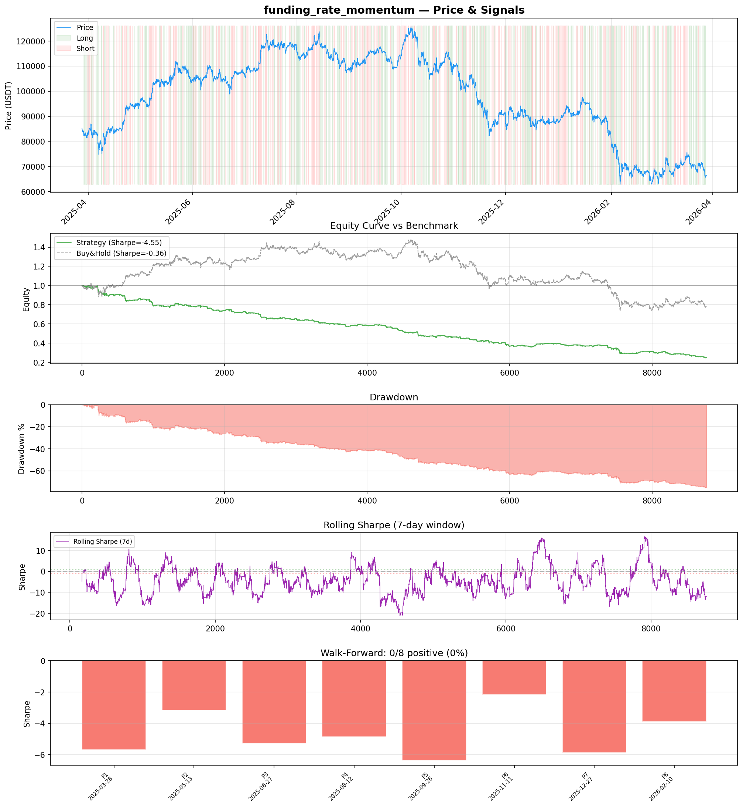
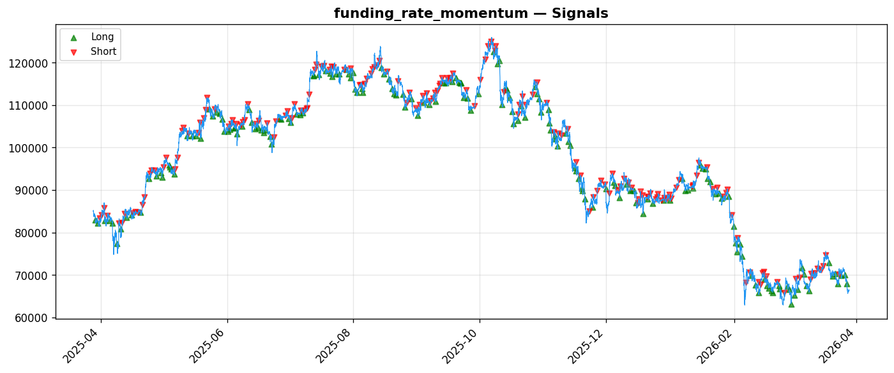

# Strategy Report: funding_rate_momentum
**Generated**: 2026-03-28 09:28 UTC
**Verdict**: 🔴 **REJECT** (confidence: high)

## Executive Summary
This strategy exhibits catastrophic performance with no evidence of any tradeable edge. The backtest shows -76.2% returns, -4.553 Sharpe ratio, and 76.5% maximum drawdown - performance so poor it suggests fundamental flaws in the strategy logic rather than parameter issues. Most damning is the 0/8 positive subperiods in walk-forward analysis, indicating consistent value destruction across all market regimes. The strategy fails 6 out of 7 robustness tests and becomes even worse with realistic transaction costs. Even basic buy-and-hold dramatically outperforms (-21.88% vs -76.2%). The supposed funding rate arbitrage edge appears to be entirely fictional - the strategy is systematically trading against profitable opportunities rather than capturing them.

## Key Metrics

| Metric | In-Sample | Out-of-Sample |
|--------|-----------|---------------|
| Sharpe Ratio | -4.553 | -4.941 |
| Total Return | -76.24% | -38.40% |
| CAGR | -76.24% | — |
| Max Drawdown | 76.49% | 39.00% |
| Total Trades | 350 | 84 |
| Win Rate | 40.90% | — |
| Profit Factor | 0.421 | — |
| Calmar | -0.997 | — |
| Sortino | -3.927 | — |

**Config**: `BTC/USDT` / `1h` / `mean_reversion` / 8760 bars
**Period**: 2025-03-28 10:00:00+00:00 → 2026-03-28 09:00:00+00:00
**Signals**: 1802 long / 1815 short / 5143 flat (701 transitions)

## Benchmark Comparison

| Benchmark | Return | Sharpe | Max DD |
|-----------|--------|--------|--------|
| **Strategy** | -76.24% | -4.553 | 76.49% |
| Buy And Hold | -21.88% | -0.361 | -50.10% |
| Short And Hold | 6.47% | 0.361 | -44.23% |
| Risk Free | 0.00% | 0.000 | 0.00% |

❌ Strategy Sharpe (-4.553) **loses to** Buy & Hold (-0.361)

## Walk-Forward Analysis

**0/8 periods positive** (consistency: 0%)
Average Sharpe: -4.659 ± 1.364

| Period | Dates | Sharpe | Return | Max DD | Trades | ✓ |
|--------|-------|--------|--------|--------|--------|---|
| P1 | 2025-03-28→2025-05-13 | -5.682 | -21.17% | 21.73% | 39 | ❌ |
| P2 | 2025-05-13→2025-06-27 | -3.151 | -9.72% | 12.93% | 47 | ❌ |
| P3 | 2025-06-27→2025-08-12 | -5.284 | -13.34% | 15.29% | 46 | ❌ |
| P4 | 2025-08-12→2025-09-26 | -4.856 | -12.02% | 12.63% | 46 | ❌ |
| P5 | 2025-09-26→2025-11-11 | -6.364 | -21.73% | 21.97% | 41 | ❌ |
| P6 | 2025-11-11→2025-12-27 | -2.177 | -9.44% | 18.31% | 47 | ❌ |
| P7 | 2025-12-27→2026-02-10 | -5.870 | -26.48% | 27.92% | 42 | ❌ |
| P8 | 2026-02-10→2026-03-28 | -3.890 | -16.21% | 22.59% | 42 | ❌ |

## Performance Charts





## Chart Analysis
```
=== CHART ANALYSIS ===

Signals: 1802 long (20.6%), 1815 short (20.7%), 5143 flat (58.7%)
Transitions: 701

Strategy: Sharpe=-4.553, Return=-76.2%, MaxDD=76.5%
Buy&Hold: Sharpe=-0.361, Return=-21.88%, MaxDD=-50.10%
❌ Strategy LOSES to Buy&Hold

Walk-Forward (8 periods):
  Consistency: 0/8 positive (0%)
  Avg Sharpe: -4.659 ± 1.364
  Sharpes: [-5.68, -3.15, -5.28, -4.86, -6.36, -2.18, -5.87, -3.89]
=== END ===
```

## Robustness Analysis

**Score**: 14.3% (1/7 tests passed)

| Test | ✓ | Details |
|------|---|---------|
| fee_sensitivity_2x | ❌ | Sharpe with 2x fees: -6.737 |
| slippage_sensitivity_3x | ❌ | Sharpe with 3x slippage: -6.737 |
| delayed_entry_1bar | ❌ | Sharpe with 1-bar delay: -4.422 |
| spread_widening_5x | ❌ | Sharpe with 5x spread: -6.309 |
| top_trades_removal | ✅ | PnL ratio after removal: 1.29 (kept 129% of profits) |
| subperiod_stability | ❌ | 0/4 periods with positive Sharpe (0%) |
| signal_degradation_10pct | ❌ | Sharpe with 10% signal noise: -7.482 |

## Hypothesis

**Title**: N/A
**Thesis**: N/A

## Agent Reviews

### Risk Manager
**Verdict**: N/A

### Auditor
**Verdict**: N/A
This strategy is a complete failure with catastrophic losses (-76.2% returns, -4.553 Sharpe) across all tested periods and market conditions. The supposed 'funding rate arbitrage edge' does not exist in the data, and the strategy consistently destroys capital with no evidence of any alpha generation. No amount of parameter tuning or risk management can salvage this fundamentally flawed approach.

## Final Decision

**Key Risks:**
- Complete capital destruction - 76% drawdown with no recovery mechanism
- Zero evidence of edge across any market regime or time period
- Extreme fragility to transaction costs (Sharpe degrades from -4.553 to -6.737 with 2x fees)
- Strategy logic appears fundamentally inverted - consistently loses money
- High implementation complexity with multi-exchange dependencies for a strategy that doesn't work

**Improvements:**
- Complete strategy redesign from first principles
- Investigate why funding rate signals are anti-predictive
- Simplify feature set to identify core signal (if any exists)
- Test inverse strategy logic - current signals may be contrarian indicators
- Validate basic economic premise with simpler mean reversion tests

**Edge Evidence:**
- No positive evidence found
- 350 trades provide sufficient sample size to conclude no edge exists
- Consistent negative performance across all regimes suggests systematic bias against profitable trades
- Only robustness test passed was top trades removal, indicating no outlier dependency

**Dissenting View:**
> A contrarian might argue that the consistently negative performance could indicate a strong signal that's being interpreted backwards - perhaps the funding rate divergences predict the opposite direction. However, this would require complete strategy inversion and re-testing, essentially creating a new strategy. The current formulation is definitively unprofitable and should not receive any capital allocation.
