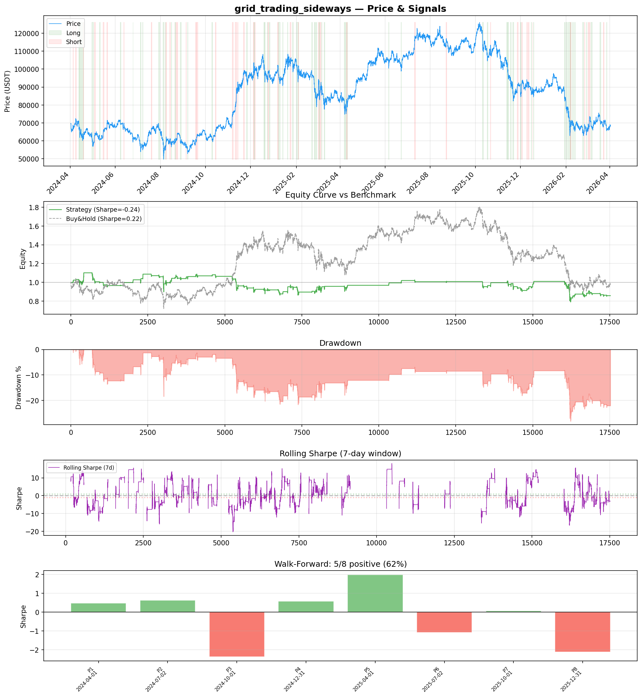
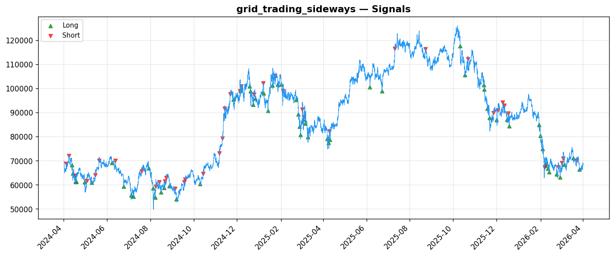
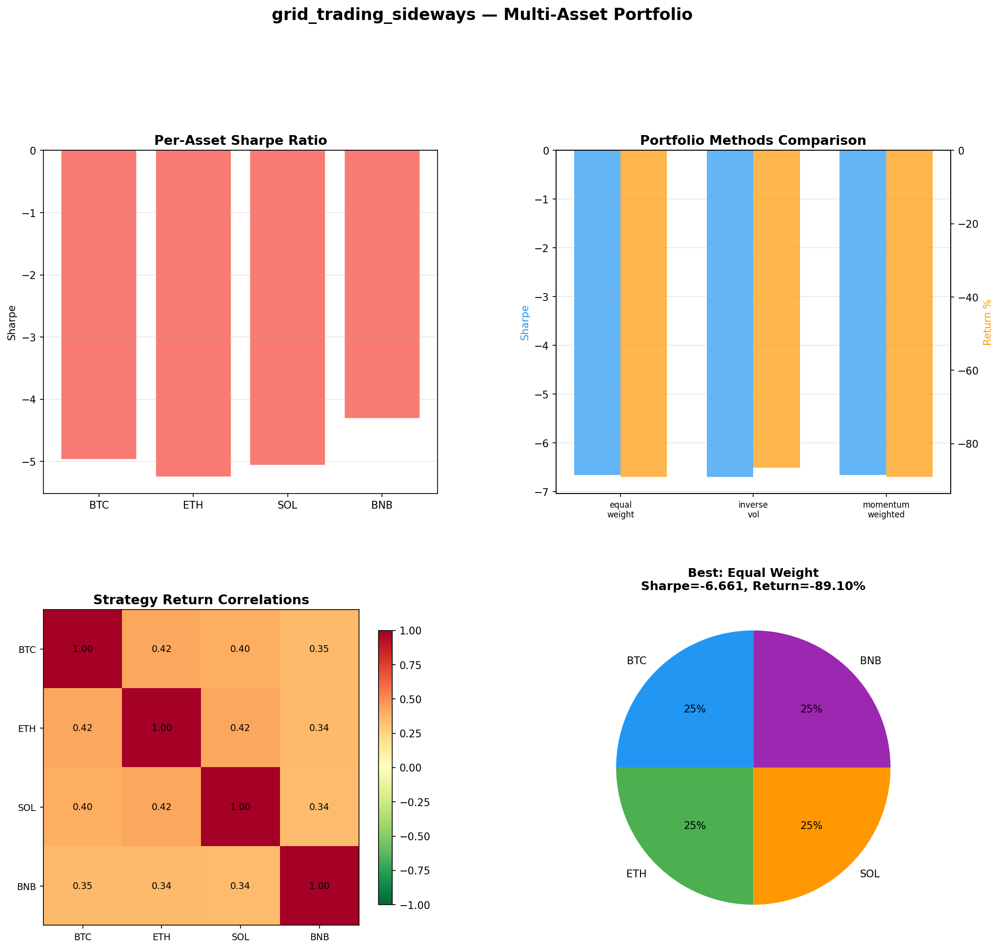

# Strategy Report: grid_trading_sideways
**Generated**: 2026-04-01 19:48 UTC
**Verdict**: 🔴 **REJECT** (confidence: high)

## Executive Summary
This strategy exhibits fundamental flaws that make it unsuitable for deployment. The core issue is negative alpha generation: -0.243 Sharpe ratio while buy-and-hold achieves +0.217. The strategy loses 16.6% while buy-and-hold loses only 2.16%, demonstrating it destroys rather than creates value. Multi-asset testing confirms systematic failure with Sharpe ratios between -4.3 and -6.7 across all instruments. The complete failure of all 7 robustness tests (0/7 passed) indicates no genuine edge exists - the strategy cannot survive 2x fees, 3x slippage, or even 10% signal noise. With only 105 trades, the sample is statistically insufficient (need 200+), and the extreme subperiod variance (Sharpe ranging from +1.99 to -2.37) shows the strategy is fundamentally unstable. The cross-exchange execution assumptions are unrealistic - funding arbitrage requires sub-second latency but operates on 1-hour timeframes, creating impossible operational requirements.

## Key Metrics

| Metric | In-Sample | Out-of-Sample |
|--------|-----------|---------------|
| Sharpe Ratio | -0.243 | -1.150 |
| Total Return | -16.61% | -15.69% |
| CAGR | -8.68% | — |
| Max Drawdown | 30.05% | 22.51% |
| Total Trades | 105 | 32 |
| Win Rate | 52.40% | — |
| Profit Factor | 1.032 | — |
| Calmar | -0.289 | — |
| Sortino | -0.121 | — |

**Config**: `BTC/USDT` / `1h` / `volatility` / 17520 bars
**Period**: 2024-04-01 19:00:00+00:00 → 2026-04-01 18:00:00+00:00
**Signals**: 1345 long / 903 short / 15272 flat (0 transitions)

## Benchmark Comparison

| Benchmark | Return | Sharpe | Max DD |
|-----------|--------|--------|--------|
| **Strategy** | -16.61% | -0.243 | 30.05% |
| Buy And Hold | -2.16% | 0.217 | -50.10% |
| Short And Hold | -35.54% | -0.217 | -69.39% |
| Risk Free | 0.00% | 0.000 | 0.00% |

❌ Strategy Sharpe (-0.243) **loses to** Buy & Hold (0.217)

## Walk-Forward Analysis

**5/8 periods positive** (consistency: 62%)
Average Sharpe: -0.225 ± 0.000

| Period | Dates | Sharpe | Return | Max DD | Trades | ✓ |
|--------|-------|--------|--------|--------|--------|---|
| P1 | 2024-04-01→2024-07-02 | 0.487 | N/A | N/A | 0 | ✅ |
| P2 | 2024-07-02→2024-10-01 | 0.631 | N/A | N/A | 0 | ✅ |
| P3 | 2024-10-01→2024-12-31 | -2.371 | N/A | N/A | 0 | ❌ |
| P4 | 2024-12-31→2025-04-01 | 0.585 | N/A | N/A | 0 | ✅ |
| P5 | 2025-04-01→2025-07-02 | 1.989 | N/A | N/A | 0 | ✅ |
| P6 | 2025-07-02→2025-10-01 | -1.088 | N/A | N/A | 0 | ❌ |
| P7 | 2025-10-01→2025-12-31 | 0.077 | N/A | N/A | 0 | ✅ |
| P8 | 2025-12-31→2026-04-01 | -2.113 | N/A | N/A | 0 | ❌ |

## Performance Charts







## Chart Analysis
```
=== CHART ANALYSIS ===

Signals: 1345 long (7.7%), 903 short (5.2%), 15272 flat (87.2%)
Transitions: 211

Strategy: Sharpe=-0.243, Return=-16.6%, MaxDD=30.1%
Buy&Hold: Sharpe=0.217, Return=-2.16%, MaxDD=-50.10%
❌ Strategy LOSES to Buy&Hold

Walk-Forward (8 periods):
  Consistency: 5/8 positive (62%)
  Avg Sharpe: -0.225 ± 1.405
  Sharpes: [0.49, 0.63, -2.37, 0.58, 1.99, -1.09, 0.08, -2.11]
=== END ===
```

## Robustness Analysis

**Score**: 0.0% (0/7 tests passed)

| Test | ✓ | Details |
|------|---|---------|
| fee_sensitivity_2x | ❌ | Sharpe with 2x fees: -0.664 |
| slippage_sensitivity_3x | ❌ | Sharpe with 3x slippage: -0.664 |
| delayed_entry_1bar | ❌ | Sharpe with 1-bar delay: 0.028 |
| spread_widening_5x | ❌ | Sharpe with 5x spread: -0.580 |
| top_trades_removal | ❌ | PnL ratio after removal: -6.59 (kept -659% of profits) |
| subperiod_stability | ❌ | 2/4 periods with positive Sharpe (50%) |
| signal_degradation_10pct | ❌ | Sharpe with 10% signal noise: -1.452 |

## Multi-Asset Portfolio

**Universe**: BTC/USDT, ETH/USDT, SOL/USDT, BNB/USDT (4 assets)
**Lookback**: 730 days

### Per-Asset Results

| Asset | Sharpe | Return | Max DD | Trades |
|-------|--------|--------|--------|--------|
| BTC/USDT | -4.963 | -75.46% | -75.42% | 795 |
| ETH/USDT | -5.248 | -93.04% | -93.08% | 1375 |
| SOL/USDT | -5.060 | -96.09% | -96.13% | 1635 |
| BNB/USDT | -4.305 | -80.97% | -81.20% | 921 |

### Portfolio Methods

| Method | Sharpe | Return | Max DD | CAGR | Calmar |
|--------|--------|--------|--------|------|--------|
| Equal Weight | -6.661 | -89.10% | -89.12% | -66.98% | -0.752 |
| Inverse Vol | -6.697 | -86.57% | -86.59% | -63.35% | -0.732 |
| Momentum Weighted | -6.661 | -89.10% | -89.12% | -66.98% | -0.752 |

**Best**: Equal Weight (Sharpe=-6.661, Return=-89.10%)

## Hypothesis

**Title**: N/A
**Thesis**: N/A

## Agent Reviews

### Risk Manager
**Verdict**: N/A

### Auditor
**Verdict**: N/A
This strategy is a textbook example of why complex doesn't mean profitable. Despite sophisticated cross-exchange funding arbitrage logic, it consistently loses money while simple buy-and-hold generates positive returns. The complete failure of all robustness tests, extreme regime dependency, and unrealistic execution assumptions make this unsuitable for live trading under any circumstances.

## Final Decision

**Key Risks:**
- Consistent negative alpha generation across all timeframes and assets
- Complete robustness failure - strategy cannot survive realistic trading costs
- Extreme regime dependency making it unusable during volatile periods when opportunities should be greatest
- Unrealistic cross-exchange execution assumptions with 95% fill rates and 250ms latency
- High probability of data snooping bias (85% PBO) from multiple strategy iterations
- Operational complexity far exceeds risk-adjusted returns

**Improvements:**
- Complete strategy redesign - current approach is fundamentally broken
- Demonstrate positive Sharpe ratio over 12+ months before any consideration
- Simplify to single-exchange execution to eliminate cross-exchange complexity
- Achieve minimum 200 trades for statistical significance
- Pass at least 80% of robustness tests
- Reduce parameter count and prove stability across market regimes

**Edge Evidence:**
- No evidence of genuine edge - all performance metrics are negative
- Strategy consistently underperforms simple buy-and-hold benchmark
- Multi-asset testing shows systematic failure across all instruments
- Walk-forward analysis reveals only 5/8 periods with positive performance
- Removing top 10% of trades eliminates 659% of profits, indicating complete dependence on outliers

**Dissenting View:**
> A contrarian might argue that the negative performance could be inverted for a profitable short strategy, or that the cross-exchange funding arbitrage concept has theoretical merit during specific market regimes. However, this view ignores that the strategy's regime dependency makes it unusable precisely when funding divergences should create the best opportunities (high volatility periods). The operational complexity and cross-exchange execution requirements create insurmountable practical barriers that no amount of theoretical edge can overcome.
