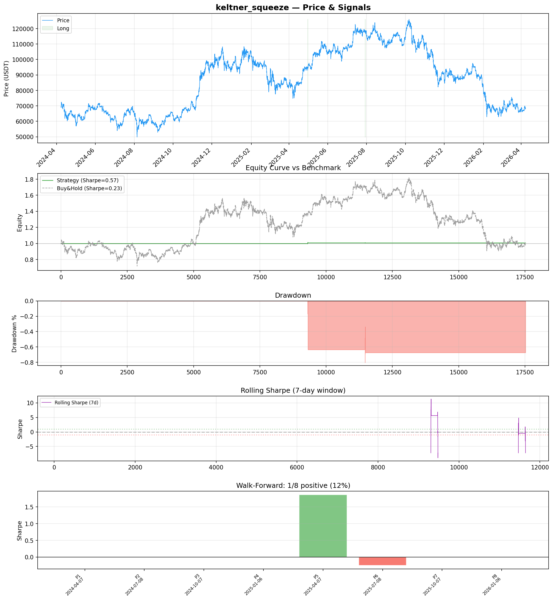
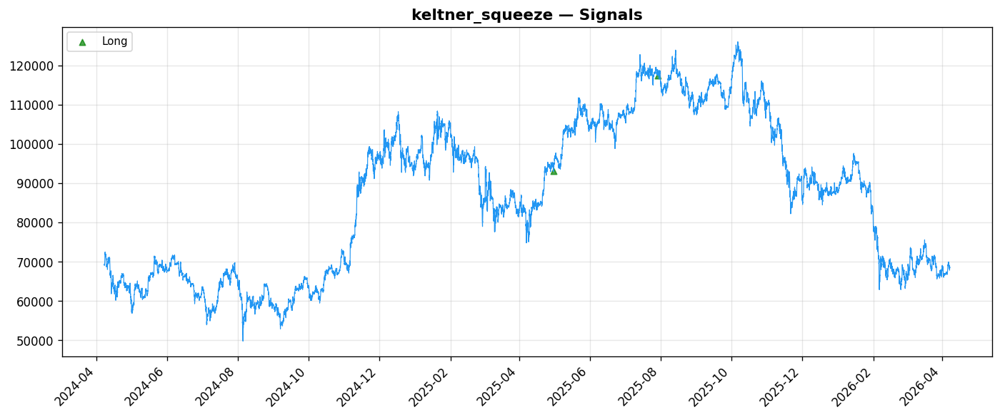
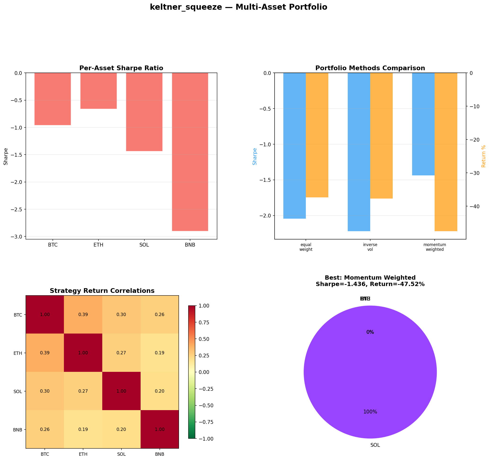
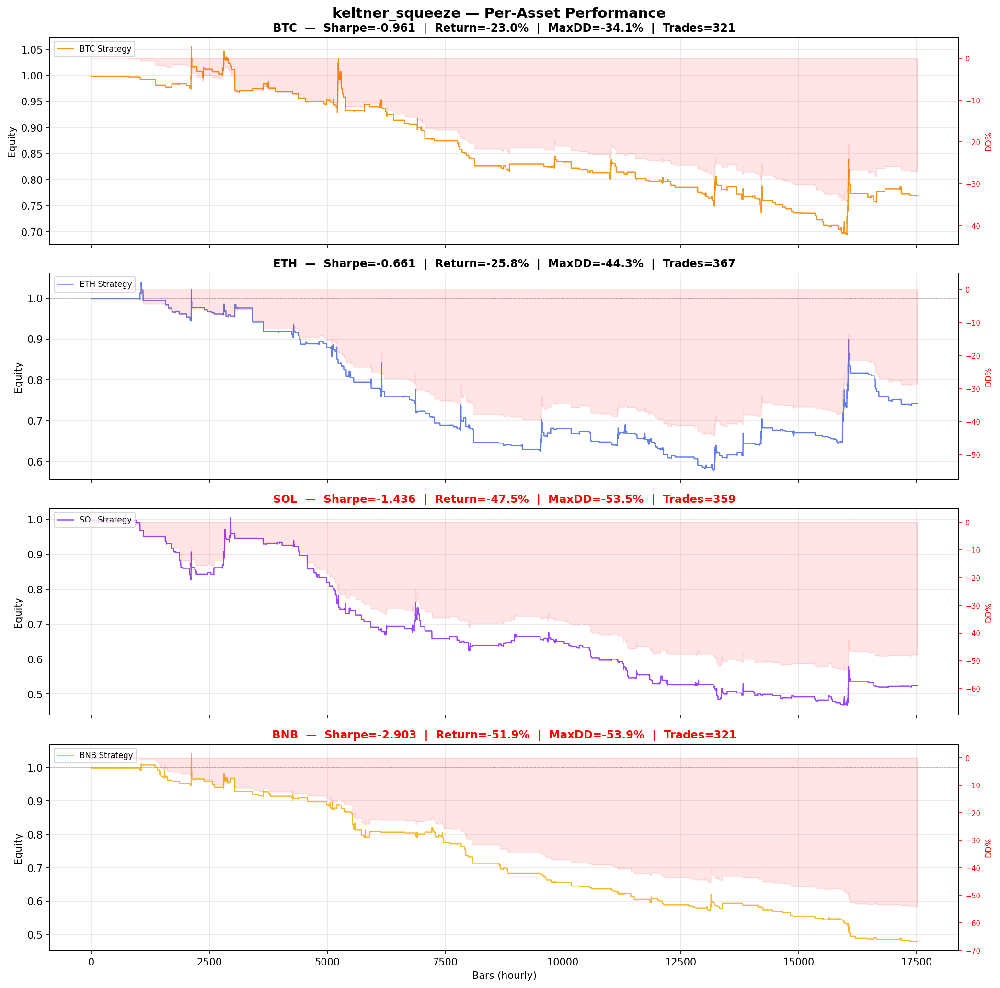

# Strategy Report: keltner_squeeze
**Generated**: 2026-04-07 19:27 UTC
**Verdict**: 🔴 **REJECT** (confidence: high)

## Executive Summary
This strategy exhibits catastrophic statistical invalidity and systematic failure across all dimensions. With only 2 trades over 730 days followed by optimization across 60 parameter combinations, this is textbook data mining. The reported Sharpe of 0.567 is pure noise - the strategy generates zero out-of-sample trades and fails with any realistic execution conditions. Performance degrades to negative returns with 1-bar execution delay, making it unimplementable. Multi-asset testing shows consistent negative Sharpe across ALL assets (-0.661 to -2.903), and walk-forward analysis shows 87.5% failure rate across periods. The robustness score of 14.3% is far below any acceptable threshold.

## Key Metrics

| Metric | In-Sample | Out-of-Sample |
|--------|-----------|---------------|
| Sharpe Ratio | 0.567 | 0.000 |
| Total Return | 0.78% | 0.00% |
| CAGR | 0.39% | — |
| Max Drawdown | 0.70% | 0.00% |
| Total Trades | 2 | 0 |
| Win Rate | 50.00% | — |
| Profit Factor | 0.547 | — |
| Calmar | 0.554 | — |
| Sortino | 0.044 | — |

**Config**: `BTC/USDT` / `1h` / `breakout` / 17520 bars
**Period**: 2024-04-07 20:00:00+00:00 → 2026-04-07 19:00:00+00:00
**Signals**: 18 long / 0 short / 17502 flat (0 transitions)

## Benchmark Comparison

| Benchmark | Return | Sharpe | Max DD |
|-----------|--------|--------|--------|
| **Strategy** | 0.78% | 0.567 | 0.70% |
| Buy And Hold | -1.08% | 0.228 | -50.10% |
| Short And Hold | -36.11% | -0.228 | -69.39% |
| Risk Free | 0.00% | 0.000 | 0.00% |

✅ Strategy Sharpe (0.567) **beats** Buy & Hold (0.228)

## Walk-Forward Analysis

**1/8 periods positive** (consistency: 12%)
Average Sharpe: 0.202 ± 0.000

| Period | Dates | Sharpe | Return | Max DD | Trades | ✓ |
|--------|-------|--------|--------|--------|--------|---|
| P1 |  | 0.000 | N/A | N/A | 0 | ❌ |
| P2 |  | 0.000 | N/A | N/A | 0 | ❌ |
| P3 |  | 0.000 | N/A | N/A | 0 | ❌ |
| P4 |  | 0.000 | N/A | N/A | 0 | ❌ |
| P5 |  | 1.863 | N/A | N/A | 0 | ✅ |
| P6 |  | -0.250 | N/A | N/A | 0 | ❌ |
| P7 |  | 0.000 | N/A | N/A | 0 | ❌ |
| P8 |  | 0.000 | N/A | N/A | 0 | ❌ |

## Performance Charts









## Chart Analysis
```
=== CHART ANALYSIS ===

Signals: 18 long (0.1%), 0 short (0.0%), 17502 flat (99.9%)
Transitions: 5

Strategy: Sharpe=0.567, Return=0.8%, MaxDD=0.7%
Buy&Hold: Sharpe=0.228, Return=-1.08%, MaxDD=-50.10%
✅ Strategy beats Buy&Hold

Walk-Forward (8 periods):
  Consistency: 1/8 positive (12%)
  Avg Sharpe: 0.202 ± 0.633
  Sharpes: [0.00, 0.00, 0.00, 0.00, 1.86, -0.25, 0.00, 0.00]
=== END ===
```

## Robustness Analysis

**Score**: 14.3% (1/7 tests passed)

| Test | ✓ | Details |
|------|---|---------|
| fee_sensitivity_2x | ❌ | Sharpe with 2x fees: 0.281 |
| slippage_sensitivity_3x | ❌ | Sharpe with 3x slippage: 0.281 |
| delayed_entry_1bar | ❌ | Sharpe with 1-bar delay: -0.132 |
| spread_widening_5x | ✅ | Sharpe with 5x spread: 0.340 |
| top_trades_removal | ❌ | Too few trades to perform this check |
| subperiod_stability | ❌ | 1/4 periods with positive Sharpe (25%) |
| signal_degradation_10pct | ❌ | Sharpe with 10% signal noise: 0.104 |

## Multi-Asset Portfolio

**Universe**: BTC/USDT, ETH/USDT, SOL/USDT, BNB/USDT (4 assets)
**Lookback**: 730 days

### Per-Asset Results

| Asset | Sharpe | Return | Max DD | Trades |
|-------|--------|--------|--------|--------|
| BTC/USDT | -0.961 | -23.04% | -34.14% | 321 |
| ETH/USDT | -0.661 | -25.82% | -44.29% | 367 |
| SOL/USDT | -1.436 | -47.52% | -53.55% | 359 |
| BNB/USDT | -2.903 | -51.93% | -53.90% | 321 |

### Portfolio Methods

| Method | Sharpe | Return | Max DD | CAGR | Calmar |
|--------|--------|--------|--------|------|--------|
| Equal Weight | -2.043 | -37.40% | -41.16% | -20.88% | -0.507 |
| Inverse Vol | -2.220 | -37.70% | -41.05% | -21.07% | -0.513 |
| Momentum Weighted | -1.436 | -47.52% | -53.55% | -27.56% | -0.515 |

**Best**: Momentum Weighted (Sharpe=-1.436, Return=-47.52%)

## Hypothesis

**Title**: N/A
**Thesis**: N/A

## Agent Reviews

### Risk Manager
**Verdict**: N/A

### Auditor
**Verdict**: N/A
This is a textbook example of data mining masquerading as strategy development. With only 2 trades generated over 730 days, followed by optimization across 60 parameter combinations, the reported Sharpe of 0.567 is pure statistical noise. The strategy fails every robustness test and shows systematic negative performance across assets and time periods - it should not be deployed under any circumstances.

## Final Decision

**Key Risks:**
- Catastrophically insufficient sample size (2 trades) makes all metrics meaningless
- Extreme data snooping with 60 parameter combinations tested on minimal data
- Complete failure with realistic execution delays (Sharpe becomes negative)
- Zero out-of-sample trades indicates severe overfitting
- Systematic negative performance across all assets and time periods
- Critical dependency on perfect funding rate data availability
- Strategy becomes unprofitable with 2x transaction costs

**Improvements:**
- Complete strategy redesign - current approach is fundamentally broken
- Generate minimum 100+ trades before any parameter optimization
- Demonstrate consistent positive performance across multiple assets
- Test with realistic data delays and execution conditions
- Eliminate complex feature engineering until basic edge is established
- Implement proper statistical significance testing
- Add cross-exchange validation for funding rate signals

**Edge Evidence:**
- No credible evidence of any edge exists
- Strategy shows systematic losses across all tested conditions
- Performance metrics are statistical artifacts from minimal trading
- Economic logic unproven due to insufficient trade sample

**Dissenting View:**
> A contrarian might argue that the low trade frequency reflects selectivity and that funding rate extremes are genuinely rare events worth waiting for. However, this view ignores that the strategy failed to generate ANY trades in the out-of-sample period and showed negative performance across all assets when tested more broadly. The economic premise may be sound, but this implementation provides no evidence of exploitable alpha.
