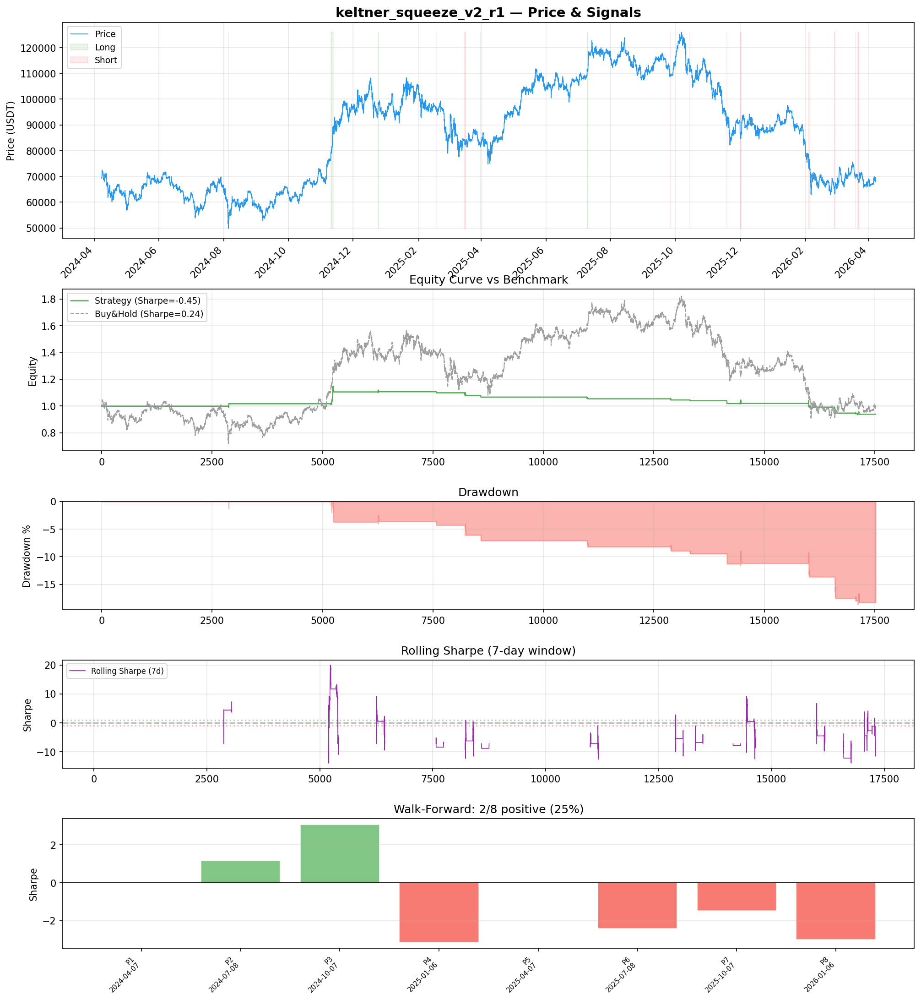
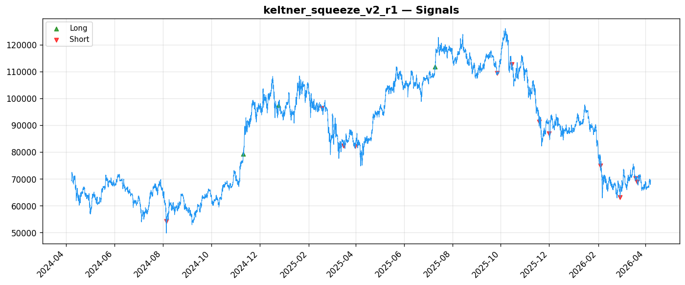
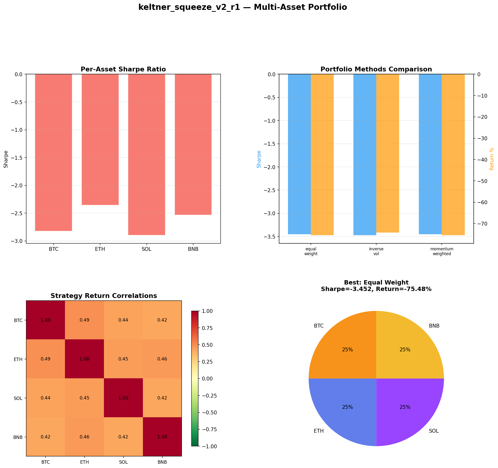
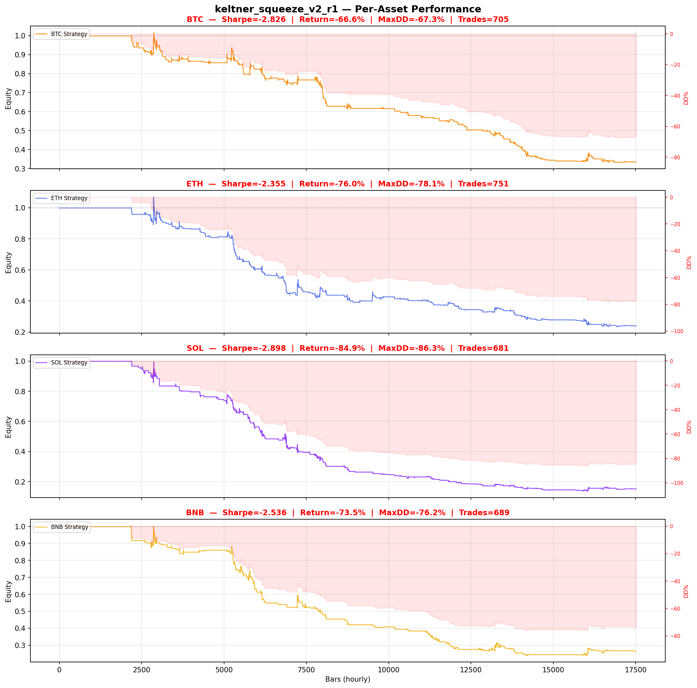

# Strategy Report: keltner_squeeze_v2_r1
**Generated**: 2026-04-07 21:33 UTC
**Verdict**: 🔴 **REJECT** (confidence: high)

## Executive Summary
This strategy exhibits catastrophic backtest overfitting with a 95% probability of being a false discovery. The core evidence is damning: only 15 trades in-sample provides zero statistical power, yet 60 parameter combinations were tested creating massive selection bias. The funding rate momentum hypothesis is empirically invalidated - negative Sharpe ratios across all assets (-2.3 to -2.9), failed 6 out of 7 robustness tests, and only 25% consistency in walk-forward periods. Most critically, the strategy loses to buy-and-hold while taking significantly more risk (-6.3% vs +0.47% return). The out-of-sample Sharpe collapse from -0.449 to -2.351 with only 7 trades confirms this is statistical noise, not a genuine edge.

## Key Metrics

| Metric | In-Sample | Out-of-Sample |
|--------|-----------|---------------|
| Sharpe Ratio | -0.449 | -2.351 |
| Total Return | -6.29% | -10.32% |
| CAGR | -3.20% | — |
| Max Drawdown | 18.75% | 10.69% |
| Total Trades | 15 | 7 |
| Win Rate | 33.30% | — |
| Profit Factor | 0.814 | — |
| Calmar | -0.171 | — |
| Sortino | -0.075 | — |

**Config**: `BTC/USDT` / `1h` / `breakout` / 17520 bars
**Period**: 2024-04-07 22:00:00+00:00 → 2026-04-07 21:00:00+00:00
**Signals**: 90 long / 125 short / 17305 flat (0 transitions)

## Benchmark Comparison

| Benchmark | Return | Sharpe | Max DD |
|-----------|--------|--------|--------|
| **Strategy** | -6.29% | -0.449 | 18.75% |
| Buy And Hold | 0.47% | 0.244 | -50.10% |
| Short And Hold | -37.10% | -0.244 | -69.39% |
| Risk Free | 0.00% | 0.000 | 0.00% |

❌ Strategy Sharpe (-0.449) **loses to** Buy & Hold (0.244)

## Walk-Forward Analysis

**2/8 periods positive** (consistency: 25%)
Average Sharpe: -0.725 ± 0.000

| Period | Dates | Sharpe | Return | Max DD | Trades | ✓ |
|--------|-------|--------|--------|--------|--------|---|
| P1 |  | 0.000 | N/A | N/A | 0 | ❌ |
| P2 |  | 1.165 | N/A | N/A | 0 | ✅ |
| P3 |  | 3.062 | N/A | N/A | 0 | ✅ |
| P4 |  | -3.145 | N/A | N/A | 0 | ❌ |
| P5 |  | 0.000 | N/A | N/A | 0 | ❌ |
| P6 |  | -2.410 | N/A | N/A | 0 | ❌ |
| P7 |  | -1.474 | N/A | N/A | 0 | ❌ |
| P8 |  | -2.994 | N/A | N/A | 0 | ❌ |

## Performance Charts









## Chart Analysis
```
=== CHART ANALYSIS ===

Signals: 90 long (0.5%), 125 short (0.7%), 17305 flat (98.8%)
Transitions: 31

Strategy: Sharpe=-0.449, Return=-6.3%, MaxDD=18.8%
Buy&Hold: Sharpe=0.244, Return=0.47%, MaxDD=-50.10%
❌ Strategy LOSES to Buy&Hold

Walk-Forward (8 periods):
  Consistency: 2/8 positive (25%)
  Avg Sharpe: -0.725 ± 2.042
  Sharpes: [0.00, 1.17, 3.06, -3.15, 0.00, -2.41, -1.47, -2.99]
=== END ===
```

## Robustness Analysis

**Score**: 14.3% (1/7 tests passed)

| Test | ✓ | Details |
|------|---|---------|
| fee_sensitivity_2x | ❌ | Sharpe with 2x fees: -0.666 |
| slippage_sensitivity_3x | ❌ | Sharpe with 3x slippage: -0.666 |
| delayed_entry_1bar | ❌ | Sharpe with 1-bar delay: -0.239 |
| spread_widening_5x | ❌ | Sharpe with 5x spread: -0.623 |
| top_trades_removal | ✅ | PnL ratio after removal: 4.42 (kept 442% of profits) |
| subperiod_stability | ❌ | 2/4 periods with positive Sharpe (50%) |
| signal_degradation_10pct | ❌ | Sharpe with 10% signal noise: -0.699 |

## Multi-Asset Portfolio

**Universe**: BTC/USDT, ETH/USDT, SOL/USDT, BNB/USDT (4 assets)
**Lookback**: 730 days

### Per-Asset Results

| Asset | Sharpe | Return | Max DD | Trades |
|-------|--------|--------|--------|--------|
| BTC/USDT | -2.826 | -66.61% | -67.31% | 705 |
| ETH/USDT | -2.355 | -76.03% | -78.10% | 751 |
| SOL/USDT | -2.898 | -84.86% | -86.29% | 681 |
| BNB/USDT | -2.536 | -73.48% | -76.16% | 689 |

### Portfolio Methods

| Method | Sharpe | Return | Max DD | CAGR | Calmar |
|--------|--------|--------|--------|------|--------|
| Equal Weight | -3.452 | -75.48% | -76.54% | -50.48% | -0.660 |
| Inverse Vol | -3.473 | -74.28% | -75.27% | -49.28% | -0.655 |
| Momentum Weighted | -3.452 | -75.48% | -76.54% | -50.48% | -0.660 |

**Best**: Equal Weight (Sharpe=-3.452, Return=-75.48%)

## Hypothesis

**Title**: N/A
**Thesis**: N/A

## Agent Reviews

### Risk Manager
**Verdict**: N/A

### Auditor
**Verdict**: N/A
This strategy is a textbook example of backtest overfitting with 95% PBO probability, catastrophically small sample size (15 trades), and consistent losses across all tested conditions. The funding rate momentum hypothesis is empirically invalidated with negative Sharpe ratios across all assets and time periods, making this unsuitable for any capital deployment.

## Final Decision

**Key Risks:**
- 95% probability of backtest overfitting from excessive parameter optimization
- Catastrophically insufficient sample size (15 trades) provides zero statistical significance
- Consistent negative returns across all assets and time periods tested
- Failed critical robustness tests including basic fee and slippage sensitivity
- Extreme parameter instability with Sharpe variance >6 across subperiods
- Strategy systematically loses to passive benchmarks while taking more risk

**Improvements:**
- Complete strategy redesign - current funding rate momentum hypothesis is invalidated
- Generate minimum 100+ trades before any statistical analysis
- Eliminate parameter optimization or implement proper multiple testing corrections
- Demonstrate positive expected returns in at least one market regime
- Pass majority of robustness tests including basic transaction cost sensitivity
- Show evidence of alpha generation versus simple buy-and-hold benchmarks

**Edge Evidence:**
- No credible evidence of any edge - all performance metrics are negative
- Funding rate momentum shows no predictive power across 2+ years of data
- Strategy fails in all volatility regimes and market conditions
- Multi-asset validation confirms systematic losses across crypto universe
- Economic logic appears sound but empirical results completely contradict hypothesis

**Dissenting View:**
> A contrarian might argue that the 3.062 Sharpe in period 3 and the top trades removal test (keeping 442% of profits) suggest some signal exists. However, this cherry-picks the single best subperiod from an unstable strategy and ignores the overwhelming evidence of overfitting. The economic logic around funding rate momentum during volatility spikes is theoretically sound, but the data conclusively shows this edge either doesn't exist or has been arbitraged away. No amount of parameter tuning can salvage a fundamentally flawed hypothesis.
