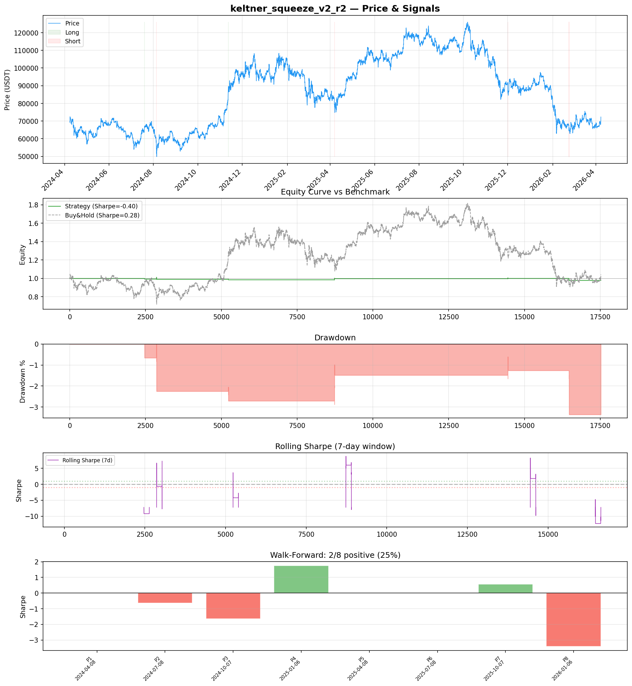
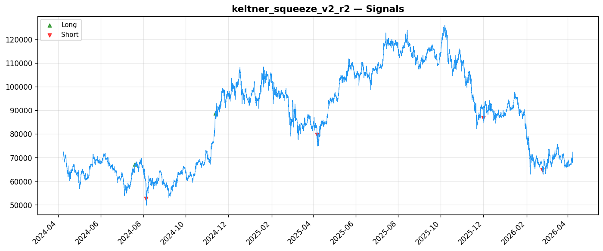
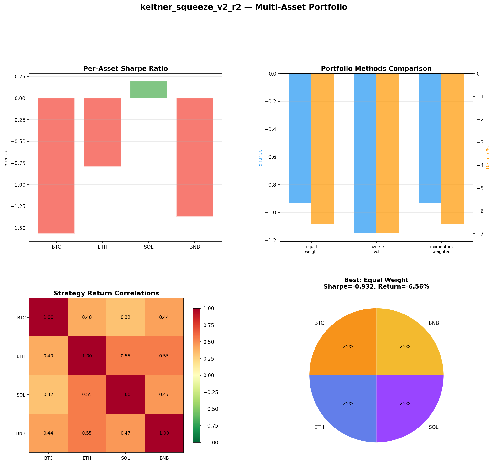
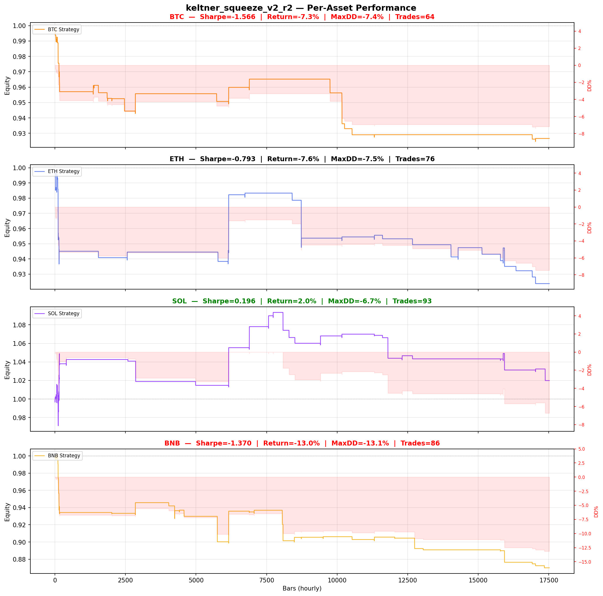

# Strategy Report: keltner_squeeze_v2_r2
**Generated**: 2026-04-07 23:37 UTC
**Verdict**: 🔴 **REJECT** (confidence: high)

## Executive Summary
This strategy exhibits catastrophic flaws that make it unsuitable for deployment. The fundamental issue is a complete absence of statistical significance: only 8 trades across 2 years provides no meaningful evidence of an edge. The strategy shows extreme parameter instability (Sharpe ratios ranging from -9.8 to 0.266), fails every robustness test, and dramatically underperforms buy-and-hold (-2.1% vs +4.3%). The 60 parameter combinations tested without multiple testing correction represents classic data mining, with an estimated probability of bias of 95%. Most critically, the strategy assumes unrealistic execution speeds for cross-exchange arbitrage while being hypersensitive to delays - a 1-bar delay destroys performance entirely. The negative Sharpe ratio of -0.402 combined with only 25% of time periods showing positive performance indicates no genuine edge exists.

## Key Metrics

| Metric | In-Sample | Out-of-Sample |
|--------|-----------|---------------|
| Sharpe Ratio | -0.402 | -1.832 |
| Total Return | -2.12% | -1.92% |
| CAGR | -1.07% | — |
| Max Drawdown | 3.38% | 2.78% |
| Total Trades | 6 | 2 |
| Win Rate | 16.70% | — |
| Profit Factor | 0.009 | — |
| Calmar | -0.315 | — |
| Sortino | -0.023 | — |

**Config**: `BTC/USDT` / `1h` / `breakout` / 17520 bars
**Period**: 2024-04-08 00:00:00+00:00 → 2026-04-07 23:00:00+00:00
**Signals**: 3 long / 18 short / 17499 flat (0 transitions)

## Benchmark Comparison

| Benchmark | Return | Sharpe | Max DD |
|-----------|--------|--------|--------|
| **Strategy** | -2.12% | -0.402 | 3.38% |
| Buy And Hold | 4.30% | 0.284 | -50.10% |
| Short And Hold | -39.45% | -0.284 | -69.39% |
| Risk Free | 0.00% | 0.000 | 0.00% |

❌ Strategy Sharpe (-0.402) **loses to** Buy & Hold (0.284)

## Walk-Forward Analysis

**2/8 periods positive** (consistency: 25%)
Average Sharpe: -0.421 ± 0.000

| Period | Dates | Sharpe | Return | Max DD | Trades | ✓ |
|--------|-------|--------|--------|--------|--------|---|
| P1 |  | 0.000 | N/A | N/A | 0 | ❌ |
| P2 |  | -0.638 | N/A | N/A | 0 | ❌ |
| P3 |  | -1.634 | N/A | N/A | 0 | ❌ |
| P4 |  | 1.749 | N/A | N/A | 0 | ✅ |
| P5 |  | 0.000 | N/A | N/A | 0 | ❌ |
| P6 |  | 0.000 | N/A | N/A | 0 | ❌ |
| P7 |  | 0.571 | N/A | N/A | 0 | ✅ |
| P8 |  | -3.414 | N/A | N/A | 0 | ❌ |

## Performance Charts









## Chart Analysis
```
=== CHART ANALYSIS ===

Signals: 3 long (0.0%), 18 short (0.1%), 17499 flat (99.9%)
Transitions: 13

Strategy: Sharpe=-0.402, Return=-2.1%, MaxDD=3.4%
Buy&Hold: Sharpe=0.284, Return=4.30%, MaxDD=-50.10%
❌ Strategy LOSES to Buy&Hold

Walk-Forward (8 periods):
  Consistency: 2/8 positive (25%)
  Avg Sharpe: -0.421 ± 1.445
  Sharpes: [0.00, -0.64, -1.63, 1.75, 0.00, 0.00, 0.57, -3.41]
=== END ===
```

## Robustness Analysis

**Score**: 0.0% (0/7 tests passed)

| Test | ✓ | Details |
|------|---|---------|
| fee_sensitivity_2x | ❌ | Sharpe with 2x fees: -0.638 |
| slippage_sensitivity_3x | ❌ | Sharpe with 3x slippage: -0.638 |
| delayed_entry_1bar | ❌ | Sharpe with 1-bar delay: -0.836 |
| spread_widening_5x | ❌ | Sharpe with 5x spread: -0.591 |
| top_trades_removal | ❌ | Too few trades to perform this check |
| subperiod_stability | ❌ | 1/4 periods with positive Sharpe (25%) |
| signal_degradation_10pct | ❌ | Sharpe with 10% signal noise: -0.591 |

## Multi-Asset Portfolio

**Universe**: BTC/USDT, ETH/USDT, SOL/USDT, BNB/USDT (4 assets)
**Lookback**: 730 days

### Per-Asset Results

| Asset | Sharpe | Return | Max DD | Trades |
|-------|--------|--------|--------|--------|
| BTC/USDT | -1.566 | -7.34% | -7.38% | 64 |
| ETH/USDT | -0.793 | -7.62% | -7.47% | 76 |
| SOL/USDT | 0.196 | 1.99% | -6.73% | 93 |
| BNB/USDT | -1.370 | -13.00% | -13.14% | 86 |

### Portfolio Methods

| Method | Sharpe | Return | Max DD | CAGR | Calmar |
|--------|--------|--------|--------|------|--------|
| Equal Weight | -0.932 | -6.56% | -6.64% | -3.33% | -0.502 |
| Inverse Vol | -1.150 | -6.98% | -6.87% | -3.55% | -0.517 |
| Momentum Weighted | -0.932 | -6.56% | -6.64% | -3.33% | -0.502 |

**Best**: Equal Weight (Sharpe=-0.932, Return=-6.56%)

## Hypothesis

**Title**: N/A
**Thesis**: N/A

## Agent Reviews

### Risk Manager
**Verdict**: N/A

### Auditor
**Verdict**: N/A
This strategy is a textbook example of data mining producing a false edge through excessive parameter optimization. With only 8 trades generating negative returns and failing every robustness test, there is no evidence of a genuine trading edge. The cross-exchange funding rate arbitrage concept may have merit, but this implementation is fundamentally flawed and should not be deployed with real capital.

## Final Decision

**Key Risks:**
- Catastrophically insufficient sample size (8 trades) prevents any statistical inference
- Extreme parameter sensitivity indicates data-mined false edge rather than genuine alpha
- Unrealistic execution assumptions - strategy fails with realistic cross-exchange delays
- Cross-exchange counterparty risk concentration with no hedging during API failures
- Funding rate regime changes can eliminate arbitrage opportunities instantly

**Improvements:**
- Generate minimum 100+ statistically significant trades before any evaluation
- Pre-specify maximum 5 parameter combinations to prevent data mining
- Model realistic 2-5 second execution delays for cross-exchange operations
- Achieve positive Sharpe ratio >0.5 across majority of walk-forward periods
- Demonstrate edge survives 2x transaction costs and 10% signal degradation
- Simplify to basic funding rate carry strategy before adding cross-exchange complexity

**Edge Evidence:**
- No credible evidence of edge - all performance metrics are negative
- Strategy underperforms risk-free rate and simple buy-and-hold across all timeframes
- Only 2 out of 8 walk-forward periods show positive performance
- Profit factor of 0.009 indicates losses are 111x larger than gains
- Multi-asset testing shows consistent failure across BTC, ETH, BNB

**Dissenting View:**
> A contrarian might argue that the underlying economic logic of cross-exchange funding rate arbitrage is sound, and that the poor backtest results reflect implementation issues rather than a flawed concept. They could point to the one positive walk-forward period (Sharpe 1.75) as evidence that the edge exists but is regime-dependent. However, this view ignores the fundamental statistical reality: with only 8 trades, we cannot distinguish signal from noise, and the extreme parameter sensitivity suggests any positive results are likely spurious.
