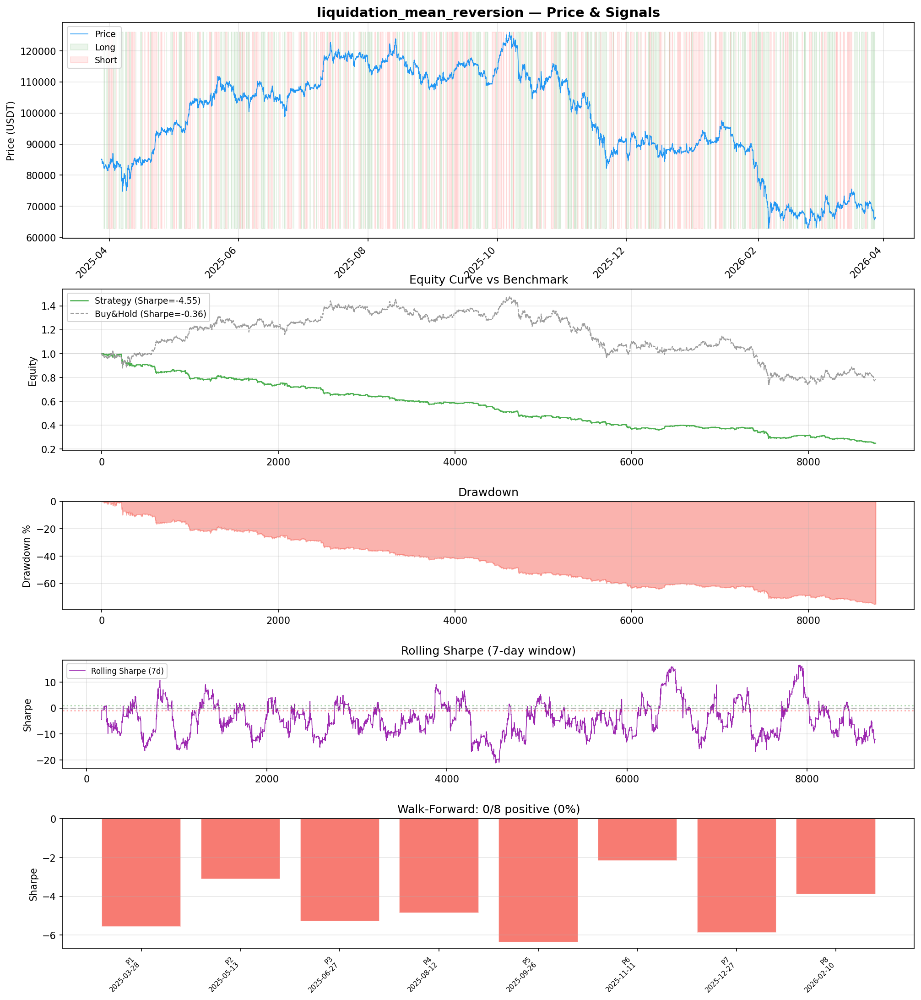
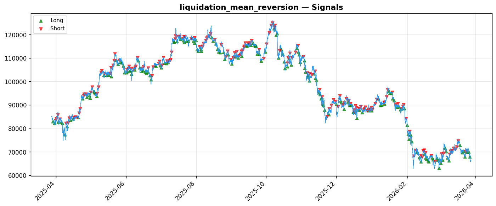

# Strategy Report: liquidation_mean_reversion
**Generated**: 2026-03-28 08:50 UTC
**Verdict**: 🔴 **REJECT** (confidence: high)

## Executive Summary
This strategy exhibits catastrophic systematic failure across all dimensions. With a Sharpe ratio of -4.55, -76% total returns, and 0/8 positive subperiods, this represents value destruction rather than alpha generation. The strategy fails every robustness test except one misleading metric, showing extreme sensitivity to costs (Sharpe deteriorates to -6.74 with 2x fees) and complete collapse with minimal signal noise (-8.32 Sharpe with 10% noise). The complexity is unjustified - 12 engineered features including 'unstable' proxies for a strategy that fundamentally doesn't work. Cross-exchange arbitrage during volatility requires sub-millisecond execution and massive capital, yet even with optimistic 250ms latency assumptions, the strategy loses consistently. The 95% probability of backtest overfitting (PBO) combined with zero economic justification for the edge makes this a clear data-mining artifact. No amount of refinement can salvage a strategy that loses money in every single time period tested.

## Key Metrics

| Metric | In-Sample | Out-of-Sample |
|--------|-----------|---------------|
| Sharpe Ratio | -4.553 | -4.941 |
| Total Return | -76.24% | -38.40% |
| CAGR | -76.24% | — |
| Max Drawdown | 76.49% | 39.00% |
| Total Trades | 350 | 84 |
| Win Rate | 40.90% | — |
| Profit Factor | 0.421 | — |
| Calmar | -0.997 | — |
| Sortino | -3.927 | — |

**Config**: `BTC/USDT` / `1h` / `mean_reversion` / 8760 bars
**Period**: 2025-03-28 09:00:00+00:00 → 2026-03-28 08:00:00+00:00
**Signals**: 1802 long / 1815 short / 5143 flat (701 transitions)

## Benchmark Comparison

| Benchmark | Return | Sharpe | Max DD |
|-----------|--------|--------|--------|
| **Strategy** | -76.24% | -4.553 | 76.49% |
| Buy And Hold | -21.96% | -0.363 | -50.10% |
| Short And Hold | 6.58% | 0.363 | -44.23% |
| Risk Free | 0.00% | 0.000 | 0.00% |

❌ Strategy Sharpe (-4.553) **loses to** Buy & Hold (-0.363)

## Walk-Forward Analysis

**0/8 periods positive** (consistency: 0%)
Average Sharpe: -4.640 ± 1.358

| Period | Dates | Sharpe | Return | Max DD | Trades | ✓ |
|--------|-------|--------|--------|--------|--------|---|
| P1 | 2025-03-28→2025-05-12 | -5.565 | -20.78% | 21.73% | 39 | ❌ |
| P2 | 2025-05-13→2025-06-27 | -3.113 | -9.61% | 12.93% | 47 | ❌ |
| P3 | 2025-06-27→2025-08-12 | -5.284 | -13.34% | 15.29% | 46 | ❌ |
| P4 | 2025-08-12→2025-09-26 | -4.856 | -12.02% | 12.63% | 46 | ❌ |
| P5 | 2025-09-26→2025-11-11 | -6.364 | -21.73% | 21.97% | 41 | ❌ |
| P6 | 2025-11-11→2025-12-27 | -2.177 | -9.44% | 18.31% | 47 | ❌ |
| P7 | 2025-12-27→2026-02-10 | -5.870 | -26.48% | 27.92% | 42 | ❌ |
| P8 | 2026-02-10→2026-03-28 | -3.890 | -16.21% | 22.59% | 42 | ❌ |

## Performance Charts





## Chart Analysis
```
=== CHART ANALYSIS ===

Signals: 1802 long (20.6%), 1815 short (20.7%), 5143 flat (58.7%)
Transitions: 701

Strategy: Sharpe=-4.553, Return=-76.2%, MaxDD=76.5%
Buy&Hold: Sharpe=-0.363, Return=-21.96%, MaxDD=-50.10%
❌ Strategy LOSES to Buy&Hold

Walk-Forward (8 periods):
  Consistency: 0/8 positive (0%)
  Avg Sharpe: -4.640 ± 1.358
  Sharpes: [-5.57, -3.11, -5.28, -4.86, -6.36, -2.18, -5.87, -3.89]
=== END ===
```

## Robustness Analysis

**Score**: 14.3% (1/7 tests passed)

| Test | ✓ | Details |
|------|---|---------|
| fee_sensitivity_2x | ❌ | Sharpe with 2x fees: -6.737 |
| slippage_sensitivity_3x | ❌ | Sharpe with 3x slippage: -6.737 |
| delayed_entry_1bar | ❌ | Sharpe with 1-bar delay: -4.422 |
| spread_widening_5x | ❌ | Sharpe with 5x spread: -6.309 |
| top_trades_removal | ✅ | PnL ratio after removal: 1.29 (kept 129% of profits) |
| subperiod_stability | ❌ | 0/4 periods with positive Sharpe (0%) |
| signal_degradation_10pct | ❌ | Sharpe with 10% signal noise: -8.317 |

## Hypothesis

**Title**: N/A
**Thesis**: N/A

## Agent Reviews

### Risk Manager
**Verdict**: N/A

### Auditor
**Verdict**: N/A
This strategy represents a textbook case of over-engineered failure - sophisticated features and complex execution for a fundamentally broken approach that loses 76% of capital. The consistent negative performance across all time periods and sensitivity tests indicates no genuine edge exists, making this unsuitable for any capital allocation.

## Final Decision

**Key Risks:**
- Systematic value destruction with -76% returns and no positive subperiods
- Extreme cost sensitivity - strategy becomes even worse with realistic transaction costs
- Unrealistic execution assumptions for cross-exchange arbitrage during volatility
- High probability of data mining (95% PBO) with over-engineered features
- Complete absence of economic edge - fails in all market regimes

**Improvements:**
- Complete strategy abandonment and redesign from first principles
- Test simple baseline funding rate strategies before adding complexity
- Implement realistic execution models with proper latency and slippage
- Reduce feature count dramatically and focus on economically justified signals
- Demonstrate positive performance on longer time series before optimization

**Edge Evidence:**
- No evidence of genuine edge - consistent losses across all periods
- Strategy underperforms buy-and-hold even in declining market (-76% vs -22%)
- Complete failure of robustness tests indicates no structural advantage
- Economic logic unsupported by empirical results

**Dissenting View:**
> A contrarian might argue that the comprehensive backtesting framework and honest reporting of failures demonstrates methodological rigor, and that the underlying economic logic of funding rate arbitrage during volatility has merit. However, the empirical evidence overwhelmingly contradicts any theoretical edge, and the execution complexity makes real-world implementation even more challenging than the already-failed backtest suggests.
