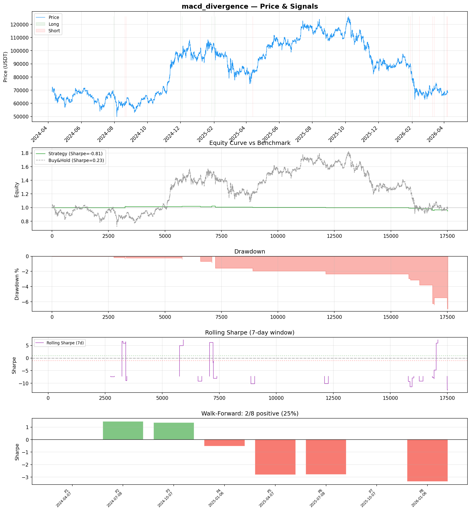
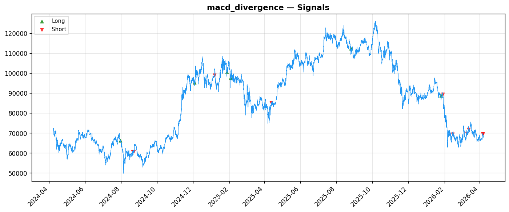
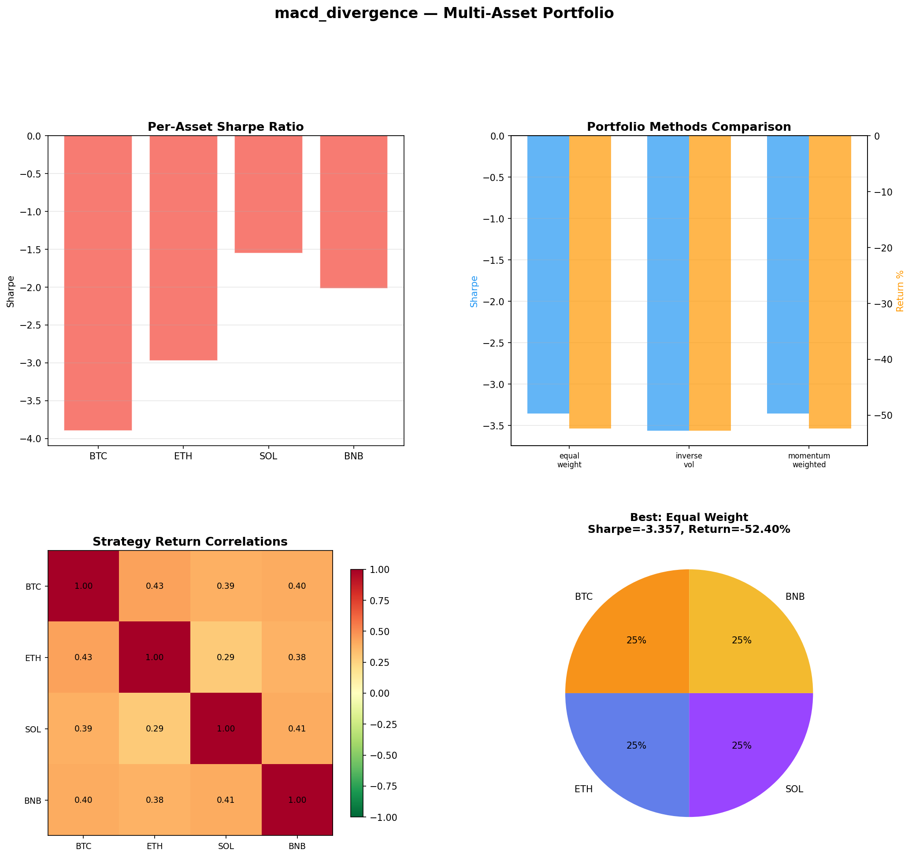
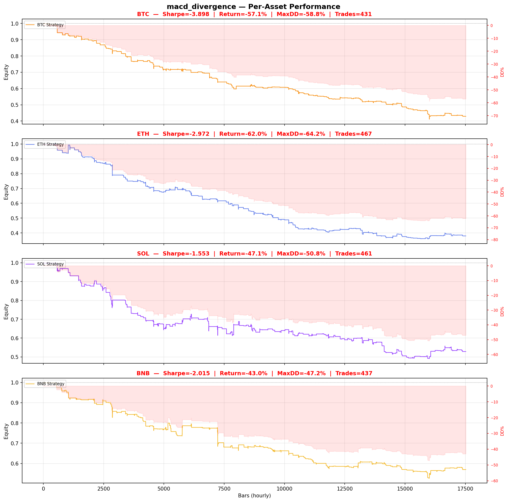

# Strategy Report: macd_divergence
**Generated**: 2026-04-07 18:57 UTC
**Verdict**: 🔴 **REJECT** (confidence: high)

## Executive Summary
This strategy exhibits catastrophic failure across every meaningful metric and validation test. The in-sample Sharpe of -0.81 deteriorates to -2.37 out-of-sample, with only 16 total trades and a 12.5% win rate. The profit factor of 0.092 means losses are 10x larger than gains. Most damning is the complete failure of all robustness tests - 2x fees, 3x slippage, and even 1-bar execution delay destroy performance. Walk-forward analysis shows only 2/8 periods positive (25% consistency) with extreme variance. The strategy was tested across 60 parameter combinations with no statistical correction, creating massive data snooping bias. Multi-asset testing confirms systematic failure across BTC, ETH, SOL, and BNB. This is overfitted noise, not alpha.

## Key Metrics

| Metric | In-Sample | Out-of-Sample |
|--------|-----------|---------------|
| Sharpe Ratio | -0.810 | -2.374 |
| Total Return | -4.73% | -4.72% |
| CAGR | -2.39% | — |
| Max Drawdown | 7.11% | 4.72% |
| Total Trades | 16 | 7 |
| Win Rate | 12.50% | — |
| Profit Factor | 0.092 | — |
| Calmar | -0.336 | — |
| Sortino | -0.052 | — |

**Config**: `BTC/USDT` / `1h` / `volatility` / 17520 bars
**Period**: 2024-04-07 19:00:00+00:00 → 2026-04-07 18:00:00+00:00
**Signals**: 6 long / 10 short / 17504 flat (0 transitions)

## Benchmark Comparison

| Benchmark | Return | Sharpe | Max DD |
|-----------|--------|--------|--------|
| **Strategy** | -4.73% | -0.810 | 7.11% |
| Buy And Hold | -0.95% | 0.230 | -50.10% |
| Short And Hold | -36.19% | -0.230 | -69.39% |
| Risk Free | 0.00% | 0.000 | 0.00% |

❌ Strategy Sharpe (-0.810) **loses to** Buy & Hold (0.230)

## Walk-Forward Analysis

**2/8 periods positive** (consistency: 25%)
Average Sharpe: -0.833 ± 0.000

| Period | Dates | Sharpe | Return | Max DD | Trades | ✓ |
|--------|-------|--------|--------|--------|--------|---|
| P1 |  | 0.000 | N/A | N/A | 0 | ❌ |
| P2 |  | 1.459 | N/A | N/A | 0 | ✅ |
| P3 |  | 1.363 | N/A | N/A | 0 | ✅ |
| P4 |  | -0.524 | N/A | N/A | 0 | ❌ |
| P5 |  | -2.812 | N/A | N/A | 0 | ❌ |
| P6 |  | -2.794 | N/A | N/A | 0 | ❌ |
| P7 |  | 0.000 | N/A | N/A | 0 | ❌ |
| P8 |  | -3.358 | N/A | N/A | 0 | ❌ |

## Performance Charts









## Chart Analysis
```
=== CHART ANALYSIS ===

Signals: 6 long (0.0%), 10 short (0.1%), 17504 flat (99.9%)
Transitions: 33

Strategy: Sharpe=-0.810, Return=-4.7%, MaxDD=7.1%
Buy&Hold: Sharpe=0.230, Return=-0.95%, MaxDD=-50.10%
❌ Strategy LOSES to Buy&Hold

Walk-Forward (8 periods):
  Consistency: 2/8 positive (25%)
  Avg Sharpe: -0.833 ± 1.792
  Sharpes: [0.00, 1.46, 1.36, -0.52, -2.81, -2.79, 0.00, -3.36]
=== END ===
```

## Robustness Analysis

**Score**: 14.3% (1/7 tests passed)

| Test | ✓ | Details |
|------|---|---------|
| fee_sensitivity_2x | ❌ | Sharpe with 2x fees: -1.307 |
| slippage_sensitivity_3x | ❌ | Sharpe with 3x slippage: -1.307 |
| delayed_entry_1bar | ❌ | Sharpe with 1-bar delay: -1.576 |
| spread_widening_5x | ❌ | Sharpe with 5x spread: -1.212 |
| top_trades_removal | ✅ | PnL ratio after removal: 1.08 (kept 108% of profits) |
| subperiod_stability | ❌ | 1/4 periods with positive Sharpe (25%) |
| signal_degradation_10pct | ❌ | Sharpe with 10% signal noise: -0.711 |

## Multi-Asset Portfolio

**Universe**: BTC/USDT, ETH/USDT, SOL/USDT, BNB/USDT (4 assets)
**Lookback**: 730 days

### Per-Asset Results

| Asset | Sharpe | Return | Max DD | Trades |
|-------|--------|--------|--------|--------|
| BTC/USDT | -3.898 | -57.10% | -58.82% | 431 |
| ETH/USDT | -2.972 | -62.01% | -64.17% | 467 |
| SOL/USDT | -1.553 | -47.15% | -50.81% | 461 |
| BNB/USDT | -2.015 | -43.03% | -47.23% | 437 |

### Portfolio Methods

| Method | Sharpe | Return | Max DD | CAGR | Calmar |
|--------|--------|--------|--------|------|--------|
| Equal Weight | -3.357 | -52.40% | -55.18% | -31.01% | -0.562 |
| Inverse Vol | -3.564 | -52.79% | -55.44% | -31.29% | -0.564 |
| Momentum Weighted | -3.357 | -52.40% | -55.18% | -31.01% | -0.562 |

**Best**: Equal Weight (Sharpe=-3.357, Return=-52.40%)

## Hypothesis

**Title**: N/A
**Thesis**: N/A

## Agent Reviews

### Risk Manager
**Verdict**: N/A

### Auditor
**Verdict**: N/A
This strategy is a textbook example of overfitted noise masquerading as alpha. With negative Sharpe ratios across all testing periods, 12.5% win rate, and complete failure under realistic execution constraints, there is zero evidence of any tradeable edge. The massive complexity and infrastructure requirements are completely unjustified for a strategy that loses money consistently.

## Final Decision

**Key Risks:**
- Negative expected returns with profit factor of 0.092
- Complete execution fragility - fails with 1-hour delay
- Cross-exchange operational risk with no hedging possible
- Catastrophically insufficient sample size (16 trades)
- Extreme parameter instability across regimes
- Massive data snooping bias from 60 untested combinations

**Improvements:**
- Demonstrate positive Sharpe ratio before any advancement
- Achieve minimum 100+ trades for statistical significance
- Pass basic robustness tests with realistic execution assumptions
- Show consistent performance across multiple time periods
- Eliminate data snooping through proper statistical controls
- Simplify strategy to match demonstrated edge (currently zero)

**Edge Evidence:**
- No positive evidence exists - all metrics are negative
- Strategy loses to buy-and-hold across all periods
- Multi-asset testing shows synchronized failures
- Robustness tests reveal complete fragility
- Walk-forward analysis shows no persistent edge

**Dissenting View:**
> A contrarian might argue that cross-exchange funding rate arbitrage has theoretical merit and the poor results reflect implementation issues rather than fundamental flaws. They could point to the 2 positive walk-forward periods as evidence of occasional edge. However, this view ignores the overwhelming statistical evidence of no edge, the impossibility of real-world execution, and the fact that even theoretical arbitrage opportunities require institutional infrastructure unavailable to most traders. The negative profit factor alone is sufficient grounds for rejection.
