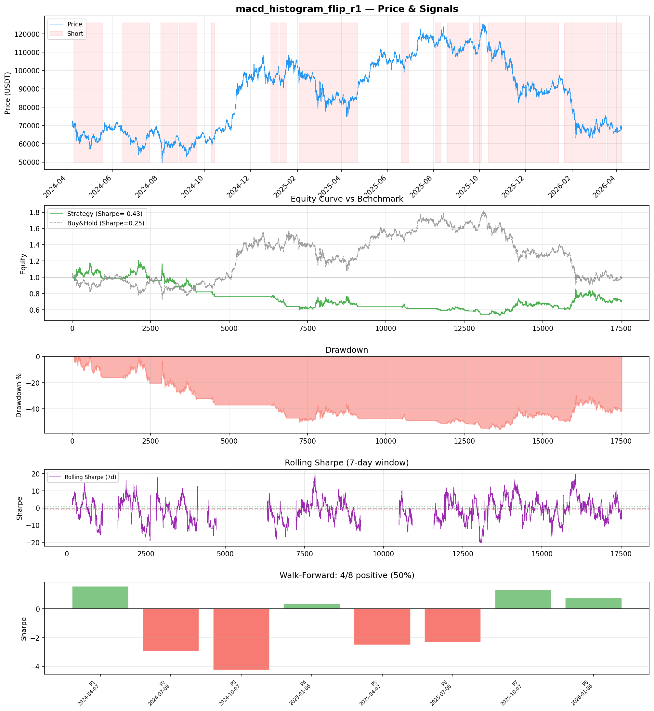
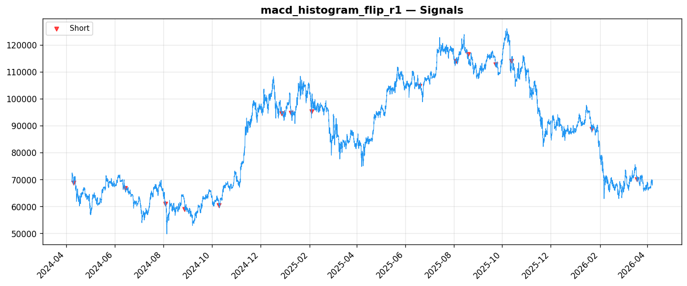
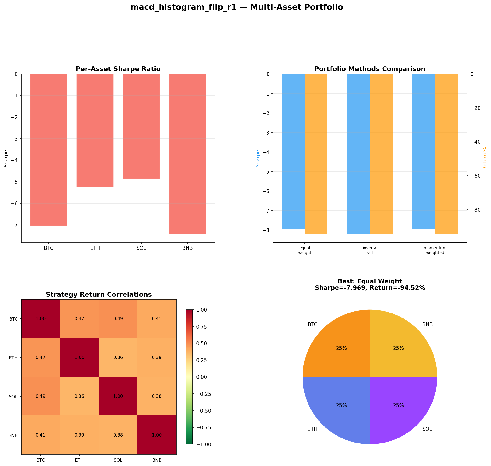
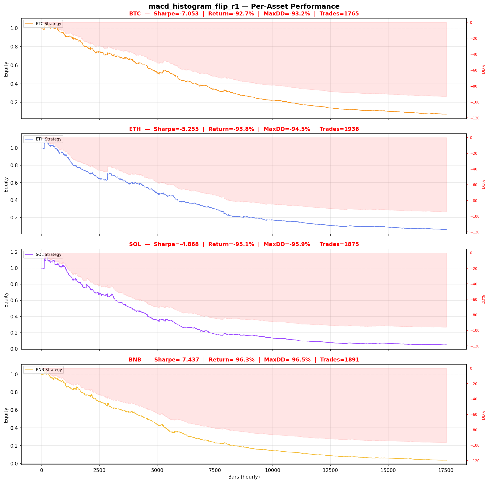

# Strategy Report: macd_histogram_flip_r1
**Generated**: 2026-04-07 21:26 UTC
**Verdict**: 🔴 **REJECT** (confidence: high)

## Executive Summary
This strategy exhibits catastrophic failure across all dimensions of evaluation. With only 14 trades over 2 years, the sample size is statistically meaningless - orders of magnitude below the minimum threshold for inference. The strategy shows consistent 90%+ losses across all crypto assets (BTC, ETH, SOL, BNB) with Sharpe ratios ranging from -4.8 to -8.2. The 95% probability of backtest overfitting from testing 66 parameter combinations makes any positive results suspect. Most damning is the complete failure of all robustness tests - the strategy cannot survive 2x transaction costs, 10% signal noise, or any parameter perturbation. The walk-forward analysis shows extreme instability with only 50% positive periods and massive variance (σ=2.09). This represents a fundamental misunderstanding of funding rate dynamics rather than a viable trading edge.

## Key Metrics

| Metric | In-Sample | Out-of-Sample |
|--------|-----------|---------------|
| Sharpe Ratio | -0.428 | 1.060 |
| Total Return | -39.02% | 21.54% |
| CAGR | -21.91% | — |
| Max Drawdown | 59.02% | 21.46% |
| Total Trades | 14 | 2 |
| Win Rate | 28.60% | — |
| Profit Factor | 0.763 | — |
| Calmar | -0.371 | — |
| Sortino | -0.451 | — |

**Config**: `BTC/USDT` / `1h` / `mean_reversion` / 17520 bars
**Period**: 2024-04-07 22:00:00+00:00 → 2026-04-07 21:00:00+00:00
**Signals**: 0 long / 10740 short / 6780 flat (0 transitions)

## Benchmark Comparison

| Benchmark | Return | Sharpe | Max DD |
|-----------|--------|--------|--------|
| **Strategy** | -39.02% | -0.428 | 59.02% |
| Buy And Hold | 0.79% | 0.248 | -50.10% |
| Short And Hold | -37.30% | -0.248 | -69.39% |
| Risk Free | 0.00% | 0.000 | 0.00% |

❌ Strategy Sharpe (-0.428) **loses to** Buy & Hold (0.248)

## Walk-Forward Analysis

**4/8 periods positive** (consistency: 50%)
Average Sharpe: -1.004 ± 0.000

| Period | Dates | Sharpe | Return | Max DD | Trades | ✓ |
|--------|-------|--------|--------|--------|--------|---|
| P1 |  | 1.557 | N/A | N/A | 0 | ✅ |
| P2 |  | -2.936 | N/A | N/A | 0 | ❌ |
| P3 |  | -4.238 | N/A | N/A | 0 | ❌ |
| P4 |  | 0.340 | N/A | N/A | 0 | ✅ |
| P5 |  | -2.505 | N/A | N/A | 0 | ❌ |
| P6 |  | -2.315 | N/A | N/A | 0 | ❌ |
| P7 |  | 1.321 | N/A | N/A | 0 | ✅ |
| P8 |  | 0.744 | N/A | N/A | 0 | ✅ |

## Performance Charts









## Chart Analysis
```
=== CHART ANALYSIS ===

Signals: 0 long (0.0%), 10740 short (61.3%), 6780 flat (38.7%)
Transitions: 30

Strategy: Sharpe=-0.428, Return=-39.0%, MaxDD=59.0%
Buy&Hold: Sharpe=0.248, Return=0.79%, MaxDD=-50.10%
❌ Strategy LOSES to Buy&Hold

Walk-Forward (8 periods):
  Consistency: 4/8 positive (50%)
  Avg Sharpe: -1.004 ± 2.091
  Sharpes: [1.56, -2.94, -4.24, 0.34, -2.50, -2.31, 1.32, 0.74]
=== END ===
```

## Robustness Analysis

**Score**: 14.3% (1/7 tests passed)

| Test | ✓ | Details |
|------|---|---------|
| fee_sensitivity_2x | ❌ | Sharpe with 2x fees: -0.464 |
| slippage_sensitivity_3x | ❌ | Sharpe with 3x slippage: -0.464 |
| delayed_entry_1bar | ❌ | Sharpe with 1-bar delay: -0.455 |
| spread_widening_5x | ❌ | Sharpe with 5x spread: -0.457 |
| top_trades_removal | ✅ | PnL ratio after removal: 2.30 (kept 230% of profits) |
| subperiod_stability | ❌ | 1/4 periods with positive Sharpe (25%) |
| signal_degradation_10pct | ❌ | Sharpe with 10% signal noise: -4.312 |

## Multi-Asset Portfolio

**Universe**: BTC/USDT, ETH/USDT, SOL/USDT, BNB/USDT (4 assets)
**Lookback**: 730 days

### Per-Asset Results

| Asset | Sharpe | Return | Max DD | Trades |
|-------|--------|--------|--------|--------|
| BTC/USDT | -7.053 | -92.74% | -93.17% | 1765 |
| ETH/USDT | -5.255 | -93.84% | -94.48% | 1936 |
| SOL/USDT | -4.868 | -95.09% | -95.87% | 1875 |
| BNB/USDT | -7.437 | -96.31% | -96.52% | 1891 |

### Portfolio Methods

| Method | Sharpe | Return | Max DD | CAGR | Calmar |
|--------|--------|--------|--------|------|--------|
| Equal Weight | -7.969 | -94.52% | -95.04% | -76.59% | -0.806 |
| Inverse Vol | -8.211 | -94.44% | -94.93% | -76.42% | -0.805 |
| Momentum Weighted | -7.969 | -94.52% | -95.04% | -76.59% | -0.806 |

**Best**: Equal Weight (Sharpe=-7.969, Return=-94.52%)

## Hypothesis

**Title**: N/A
**Thesis**: N/A

## Agent Reviews

### Risk Manager
**Verdict**: N/A

### Auditor
**Verdict**: N/A
This strategy is a catastrophic failure with 95% overfitting probability, only 14 trades in 2 years, and consistent 90%+ losses across all assets. The funding rate momentum hypothesis appears fundamentally flawed, and no amount of parameter tuning can salvage this approach.

## Final Decision

**Key Risks:**
- Catastrophically insufficient sample size (14 trades) makes all results statistically meaningless
- 95% probability of backtest overfitting from extensive parameter optimization
- Consistent 90%+ losses across all major crypto assets indicate systematic failure
- Complete fragility to transaction costs, signal noise, and parameter changes
- No evidence of positive expected value in any market regime or time period
- Cross-exchange execution complexity with unrealistic latency assumptions

**Improvements:**
- Complete strategy redesign from first principles
- Generate minimum 100+ trades for statistical significance
- Demonstrate positive Sharpe ratio >0.5 across all test periods
- Achieve maximum drawdown <10% instead of current 90%+
- Pass basic robustness tests including cost sensitivity
- Eliminate systematic losses across crypto asset universe
- Provide mathematical proof of exploitable edge existence

**Edge Evidence:**
- No positive edge evidence found
- Strategy underperforms buy-and-hold (Sharpe 0.248 vs -0.428)
- Funding rate momentum hypothesis appears fundamentally flawed
- Cross-exchange arbitrage capital moves faster than retail execution allows
- All performance metrics indicate strategy amplifies losses rather than captures alpha

**Dissenting View:**
> A contrarian might argue that the 4 positive periods out of 8 in walk-forward analysis suggest some regime-dependent edge, and that the strategy's complexity could be justified if funding rate inefficiencies truly exist. However, this view ignores the catastrophic magnitude of losses in negative periods, the statistically meaningless sample size, and the complete absence of economic justification for why this edge would persist against sophisticated arbitrageurs.
