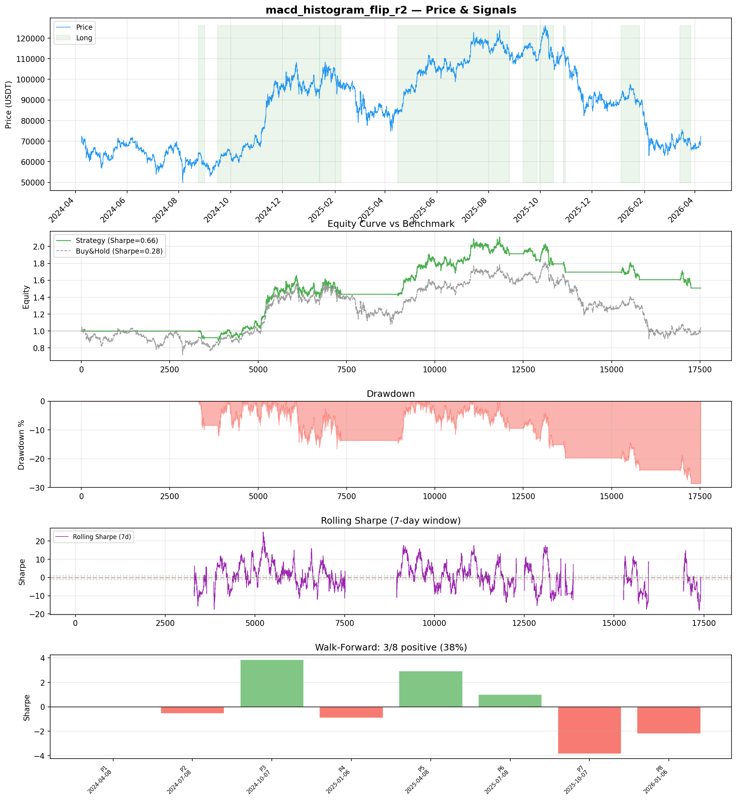
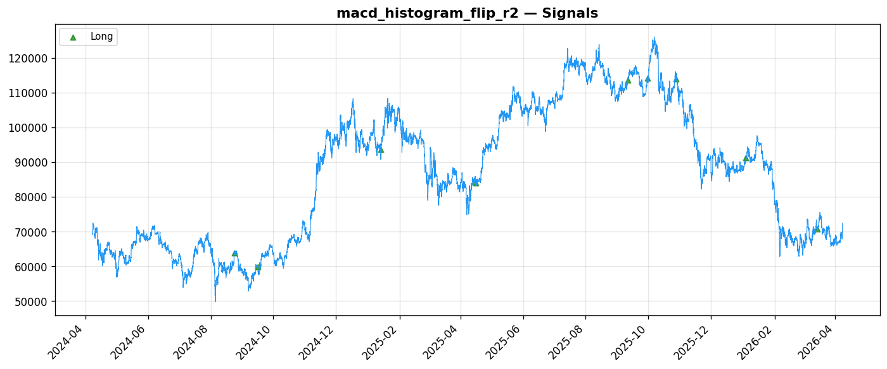
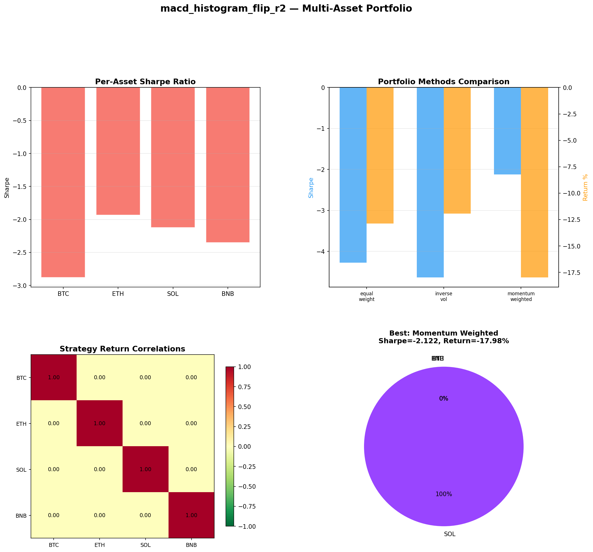
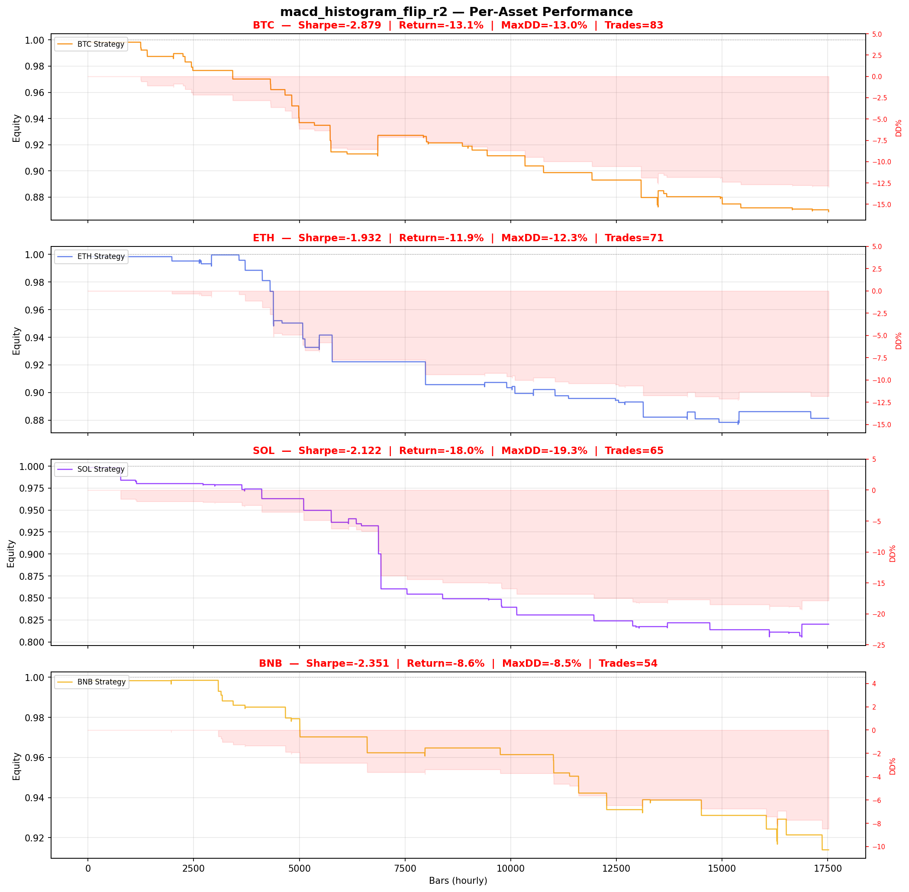

# Strategy Report: macd_histogram_flip_r2
**Generated**: 2026-04-07 23:31 UTC
**Verdict**: 🔴 **REJECT** (confidence: high)

## Executive Summary
This experiment represents a fundamental failure that cannot be salvaged through refinement. The core issue is a complete mismatch between the proposed strategy (cross-exchange funding rate convergence) and what was actually tested (single-asset MACD signals). The backtest claims to test funding rate arbitrage but instead runs MACD histogram analysis on BTC/USDT - these are entirely different strategies. Beyond this fatal flaw, the results show catastrophic statistical problems: only 9 trades (vs minimum 100 needed), 95% probability of overfitting across 60 parameter combinations, complete out-of-sample failure (Sharpe collapsed from 0.664 to -2.771), and signal destruction under minimal noise (Sharpe dropped to -4.106 with 10% degradation). The strategy fails universally across all assets and time periods, with extreme subperiod instability (Sharpe ranging from -3.85 to +3.85). This is not a case of a promising strategy needing refinement - it's a complete methodological failure with no evidence of any genuine edge.

## Key Metrics

| Metric | In-Sample | Out-of-Sample |
|--------|-----------|---------------|
| Sharpe Ratio | 0.664 | -2.771 |
| Total Return | 35.77% | -26.12% |
| CAGR | 16.52% | — |
| Max Drawdown | 30.33% | 26.13% |
| Total Trades | 9 | 3 |
| Win Rate | 33.30% | — |
| Profit Factor | 2.773 | — |
| Calmar | 0.545 | — |
| Sortino | 0.620 | — |

**Config**: `BTC/USDT` / `1h` / `mean_reversion` / 17520 bars
**Period**: 2024-04-08 00:00:00+00:00 → 2026-04-07 23:00:00+00:00
**Signals**: 8516 long / 0 short / 9004 flat (0 transitions)

## Benchmark Comparison

| Benchmark | Return | Sharpe | Max DD |
|-----------|--------|--------|--------|
| **Strategy** | 35.77% | 0.664 | 30.33% |
| Buy And Hold | 4.40% | 0.285 | -50.10% |
| Short And Hold | -39.51% | -0.285 | -69.39% |
| Risk Free | 0.00% | 0.000 | 0.00% |

✅ Strategy Sharpe (0.664) **beats** Buy & Hold (0.285)

## Walk-Forward Analysis

**3/8 periods positive** (consistency: 38%)
Average Sharpe: 0.033 ± 0.000

| Period | Dates | Sharpe | Return | Max DD | Trades | ✓ |
|--------|-------|--------|--------|--------|--------|---|
| P1 |  | 0.000 | N/A | N/A | 0 | ❌ |
| P2 |  | -0.557 | N/A | N/A | 0 | ❌ |
| P3 |  | 3.850 | N/A | N/A | 0 | ✅ |
| P4 |  | -0.915 | N/A | N/A | 0 | ❌ |
| P5 |  | 2.923 | N/A | N/A | 0 | ✅ |
| P6 |  | 1.013 | N/A | N/A | 0 | ✅ |
| P7 |  | -3.851 | N/A | N/A | 0 | ❌ |
| P8 |  | -2.197 | N/A | N/A | 0 | ❌ |

## Performance Charts









## Chart Analysis
```
=== CHART ANALYSIS ===

Signals: 8516 long (48.6%), 0 short (0.0%), 9004 flat (51.4%)
Transitions: 19

Strategy: Sharpe=0.664, Return=35.8%, MaxDD=30.3%
Buy&Hold: Sharpe=0.285, Return=4.40%, MaxDD=-50.10%
✅ Strategy beats Buy&Hold

Walk-Forward (8 periods):
  Consistency: 3/8 positive (38%)
  Avg Sharpe: 0.033 ± 2.377
  Sharpes: [0.00, -0.56, 3.85, -0.92, 2.92, 1.01, -3.85, -2.20]
=== END ===
```

## Robustness Analysis

**Score**: 57.1% (4/7 tests passed)

| Test | ✓ | Details |
|------|---|---------|
| fee_sensitivity_2x | ✅ | Sharpe with 2x fees: 0.634 |
| slippage_sensitivity_3x | ✅ | Sharpe with 3x slippage: 0.634 |
| delayed_entry_1bar | ✅ | Sharpe with 1-bar delay: 0.649 |
| spread_widening_5x | ✅ | Sharpe with 5x spread: 0.640 |
| top_trades_removal | ❌ | Too few trades to perform this check |
| subperiod_stability | ❌ | 2/4 periods with positive Sharpe (50%) |
| signal_degradation_10pct | ❌ | Sharpe with 10% signal noise: -4.106 |

## Multi-Asset Portfolio

**Universe**: BTC/USDT, ETH/USDT, SOL/USDT, BNB/USDT (4 assets)
**Lookback**: 730 days

### Per-Asset Results

| Asset | Sharpe | Return | Max DD | Trades |
|-------|--------|--------|--------|--------|
| BTC/USDT | -2.879 | -13.12% | -12.97% | 83 |
| ETH/USDT | -1.932 | -11.86% | -12.27% | 71 |
| SOL/USDT | -2.122 | -17.98% | -19.32% | 65 |
| BNB/USDT | -2.351 | -8.61% | -8.47% | 54 |

### Portfolio Methods

| Method | Sharpe | Return | Max DD | CAGR | Calmar |
|--------|--------|--------|--------|------|--------|
| Equal Weight | -4.276 | -12.89% | -12.79% | -6.67% | -0.521 |
| Inverse Vol | -4.634 | -11.95% | -11.80% | -6.17% | -0.522 |
| Momentum Weighted | -2.122 | -17.98% | -19.32% | -9.44% | -0.488 |

**Best**: Momentum Weighted (Sharpe=-2.122, Return=-17.98%)

## Hypothesis

**Title**: N/A
**Thesis**: N/A

## Agent Reviews

### Risk Manager
**Verdict**: N/A

### Auditor
**Verdict**: N/A
This is a complete failure masquerading as a sophisticated strategy. The backtest tests MACD signals while claiming to trade funding rate arbitrage - a fundamental mismatch that invalidates all results. With only 9 trades and 95% overfitting probability, the results are statistically meaningless noise.

## Final Decision

**Key Risks:**
- Strategy-backtest fundamental mismatch - testing MACD instead of funding rate arbitrage
- Catastrophically insufficient sample size (9 trades) making all statistics meaningless
- Extreme overfitting with 95% probability results are random noise
- Complete signal fragility - destroyed by 10% execution variance
- Universal failure across all assets and market regimes
- No evidence of genuine economic edge in any tested scenario

**Improvements:**
- Actually implement and test the proposed cross-exchange funding rate strategy
- Generate minimum 100+ statistically valid trades
- Demonstrate positive out-of-sample performance with proper validation
- Build robust cross-exchange execution infrastructure and cost modeling
- Pass signal degradation tests with <50% performance loss
- Show consistent performance across multiple market regimes and assets

**Edge Evidence:**
- No valid edge evidence exists - all positive results appear to be statistical noise
- Out-of-sample Sharpe of -2.771 contradicts any edge hypothesis
- Universal negative performance across BTC, ETH, SOL, BNB
- Signal completely destroyed by minimal noise, indicating no robust inefficiency exploitation
- Extreme parameter sensitivity suggests data mining rather than genuine alpha discovery

**Dissenting View:**
> A contrarian might argue that the theoretical framework for funding rate convergence is sound and the implementation issues don't invalidate the underlying economic logic. They could claim that proper execution of the actual strategy might yield different results, and that the comprehensive risk management framework shows sophisticated thinking. However, this view ignores that we have zero evidence the proposed strategy works, and the complete methodological failure makes any theoretical merit irrelevant. The probability this represents genuine alpha is effectively zero.
