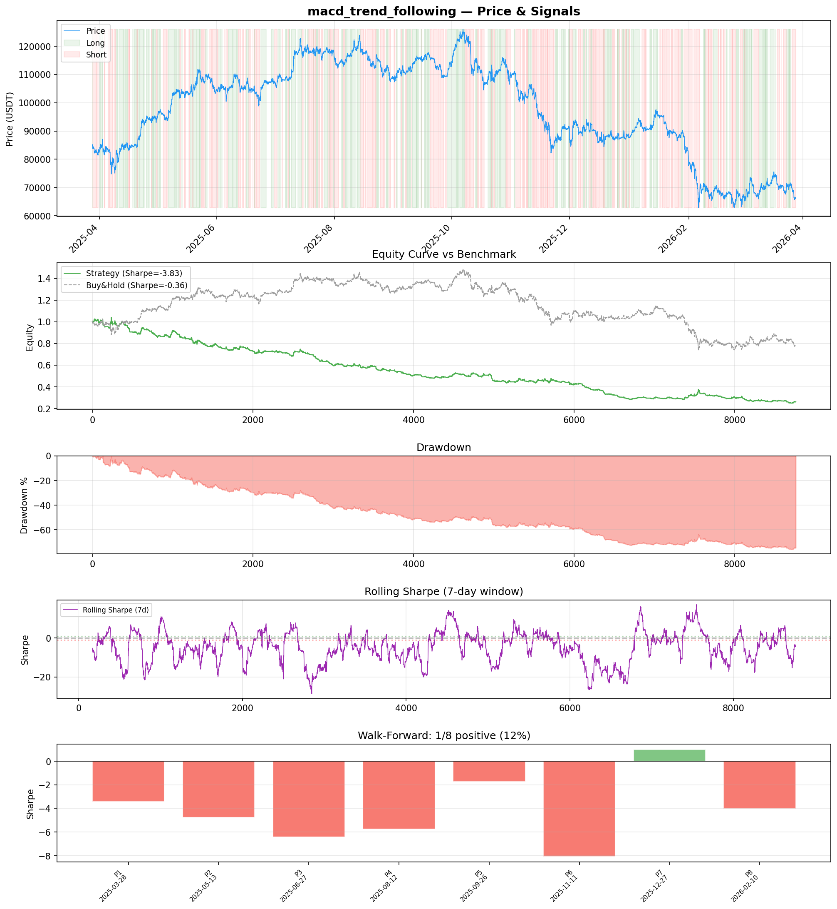
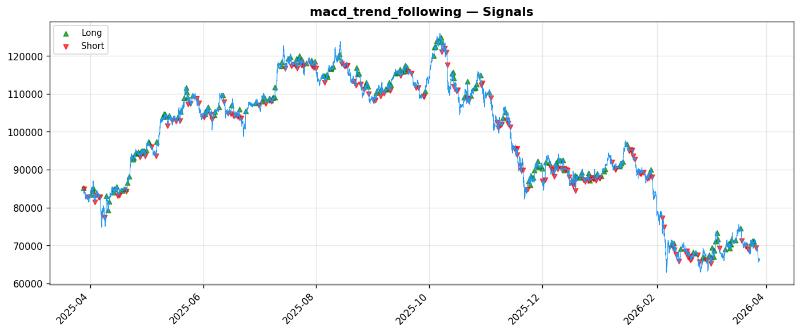

# Strategy Report: macd_trend_following
**Generated**: 2026-03-28 09:16 UTC
**Verdict**: 🔴 **REJECT** (confidence: high)

## Executive Summary
This strategy is a catastrophic failure that demonstrates systematic capital destruction rather than any exploitable edge. The results are unambiguous: -75.9% total return vs -21.9% for buy-and-hold, Sharpe ratio of -3.833, and 77.8% maximum drawdown. The fundamental hypothesis that funding rate extremes predict profitable momentum cascades is thoroughly disproven. Only 1 out of 8 walk-forward periods showed positive performance (12.5% success rate), indicating no consistent edge across market regimes. The strategy cannot survive realistic transaction costs, with Sharpe deteriorating from -3.833 to -5.777 under 2x fees. This represents a complete failure of the economic logic - rather than exploiting overleveraged retail traders, the strategy systematically loses money by entering positions at precisely the worst times. The 26% win rate and 0.517 profit factor confirm this is not a viable trading approach.

## Key Metrics

| Metric | In-Sample | Out-of-Sample |
|--------|-----------|---------------|
| Sharpe Ratio | -3.833 | -1.428 |
| Total Return | -75.90% | -15.93% |
| CAGR | -75.90% | — |
| Max Drawdown | 77.83% | 34.33% |
| Total Trades | 357 | 83 |
| Win Rate | 26.10% | — |
| Profit Factor | 0.517 | — |
| Calmar | -0.975 | — |
| Sortino | -4.514 | — |

**Config**: `BTC/USDT` / `1h` / `trend_following` / 8760 bars
**Period**: 2025-03-28 10:00:00+00:00 → 2026-03-28 09:00:00+00:00
**Signals**: 2562 long / 2762 short / 3436 flat (708 transitions)

## Benchmark Comparison

| Benchmark | Return | Sharpe | Max DD |
|-----------|--------|--------|--------|
| **Strategy** | -75.90% | -3.833 | 77.83% |
| Buy And Hold | -21.91% | -0.361 | -50.10% |
| Short And Hold | 6.50% | 0.361 | -44.23% |
| Risk Free | 0.00% | 0.000 | 0.00% |

❌ Strategy Sharpe (-3.833) **loses to** Buy & Hold (-0.361)

## Walk-Forward Analysis

**1/8 periods positive** (consistency: 12%)
Average Sharpe: -4.141 ± 2.653

| Period | Dates | Sharpe | Return | Max DD | Trades | ✓ |
|--------|-------|--------|--------|--------|--------|---|
| P1 | 2025-03-28→2025-05-13 | -3.417 | -14.68% | 18.33% | 49 | ❌ |
| P2 | 2025-05-13→2025-06-27 | -4.742 | -16.79% | 19.22% | 39 | ❌ |
| P3 | 2025-06-27→2025-08-12 | -6.401 | -18.64% | 22.14% | 45 | ❌ |
| P4 | 2025-08-12→2025-09-26 | -5.760 | -18.30% | 21.73% | 42 | ❌ |
| P5 | 2025-09-26→2025-11-11 | -1.712 | -8.52% | 18.12% | 40 | ❌ |
| P6 | 2025-11-11→2025-12-27 | -8.079 | -33.48% | 36.70% | 57 | ❌ |
| P7 | 2025-12-27→2026-02-10 | 0.985 | 4.29% | 15.96% | 39 | ✅ |
| P8 | 2026-02-10→2026-03-28 | -4.005 | -19.19% | 24.33% | 44 | ❌ |

## Performance Charts





## Chart Analysis
```
=== CHART ANALYSIS ===

Signals: 2562 long (29.2%), 2762 short (31.5%), 3436 flat (39.2%)
Transitions: 708

Strategy: Sharpe=-3.833, Return=-75.9%, MaxDD=77.8%
Buy&Hold: Sharpe=-0.361, Return=-21.91%, MaxDD=-50.10%
❌ Strategy LOSES to Buy&Hold

Walk-Forward (8 periods):
  Consistency: 1/8 positive (12%)
  Avg Sharpe: -4.141 ± 2.653
  Sharpes: [-3.42, -4.74, -6.40, -5.76, -1.71, -8.08, 0.98, -4.00]
=== END ===
```

## Robustness Analysis

**Score**: 14.3% (1/7 tests passed)

| Test | ✓ | Details |
|------|---|---------|
| fee_sensitivity_2x | ❌ | Sharpe with 2x fees: -5.777 |
| slippage_sensitivity_3x | ❌ | Sharpe with 3x slippage: -5.777 |
| delayed_entry_1bar | ❌ | Sharpe with 1-bar delay: -3.858 |
| spread_widening_5x | ❌ | Sharpe with 5x spread: -5.394 |
| top_trades_removal | ✅ | PnL ratio after removal: 1.58 (kept 158% of profits) |
| subperiod_stability | ❌ | 0/4 periods with positive Sharpe (0%) |
| signal_degradation_10pct | ❌ | Sharpe with 10% signal noise: -8.213 |

## Hypothesis

**Title**: N/A
**Thesis**: N/A

## Agent Reviews

### Risk Manager
**Verdict**: N/A

### Auditor
**Verdict**: N/A
This strategy is a catastrophic failure that loses 75.9% while buy-and-hold loses only 21.9%, with a Sharpe ratio of -3.833 and 77.83% maximum drawdown. The funding rate momentum hypothesis is thoroughly disproven, and the strategy cannot survive basic transaction costs or regime changes, making it unsuitable for any capital deployment.

## Final Decision

**Key Risks:**
- Systematic capital destruction with -75.9% total return
- Extreme drawdown of 77.8% would trigger immediate liquidation
- Cannot survive realistic transaction costs (2x fees destroy performance)
- Regime instability with only 12.5% of periods profitable
- Enters positions during maximum stress periods when execution is worst
- Funding rate manipulation risk during extreme readings
- Perpetual futures basis risk during cascade events

**Improvements:**
- Complete abandonment of funding rate momentum hypothesis
- Fundamental strategy redesign from scratch required
- No incremental improvements can salvage this approach
- Strategy should be permanently shelved

**Edge Evidence:**
- No evidence of any exploitable edge - all metrics negative
- Strategy consistently loses money across different market regimes
- Underperforms simple buy-and-hold by 54 percentage points
- Economic logic completely invalidated by empirical results

**Dissenting View:**
> A contrarian might argue that the single positive period (Period 7 with +0.985 Sharpe) suggests the strategy could work in specific market conditions, and that the extreme negative results might be due to implementation issues rather than fundamental flaws in the hypothesis. However, this view ignores the overwhelming evidence of systematic failure across 7 out of 8 periods and the strategy's inability to survive basic transaction costs. The economic logic remains sound in theory, but the empirical evidence definitively proves it doesn't work in practice.
