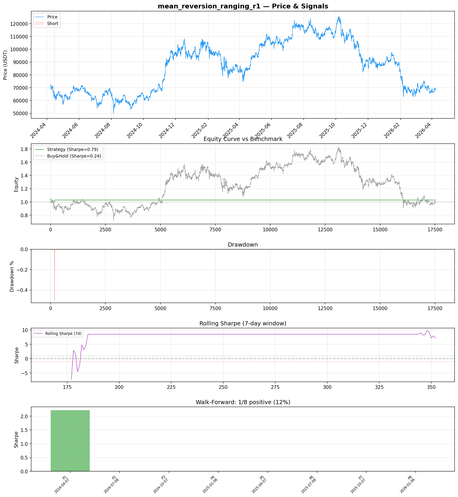
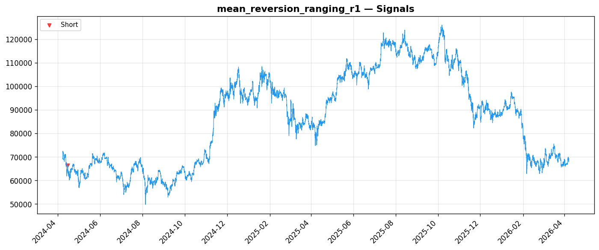
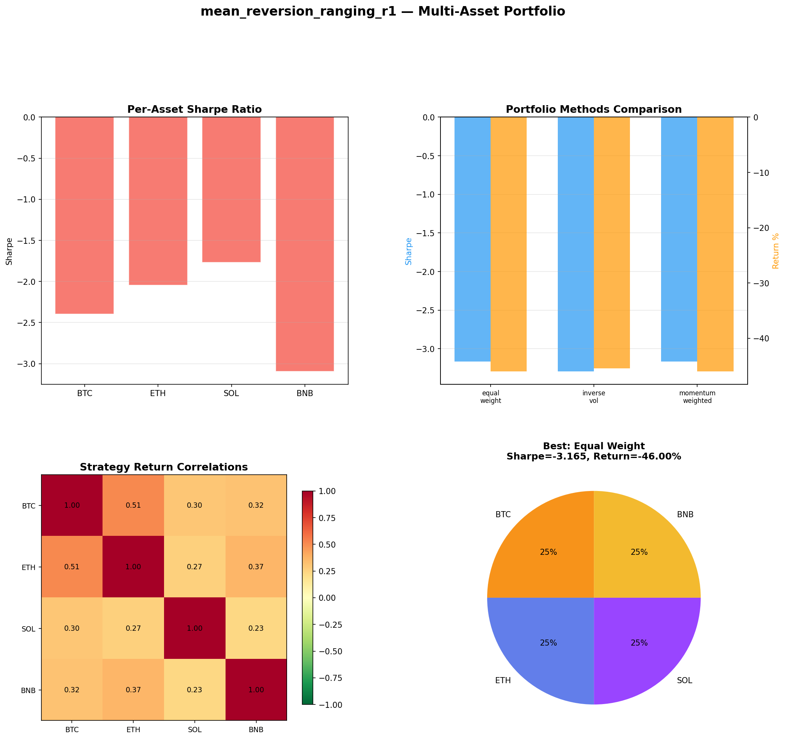
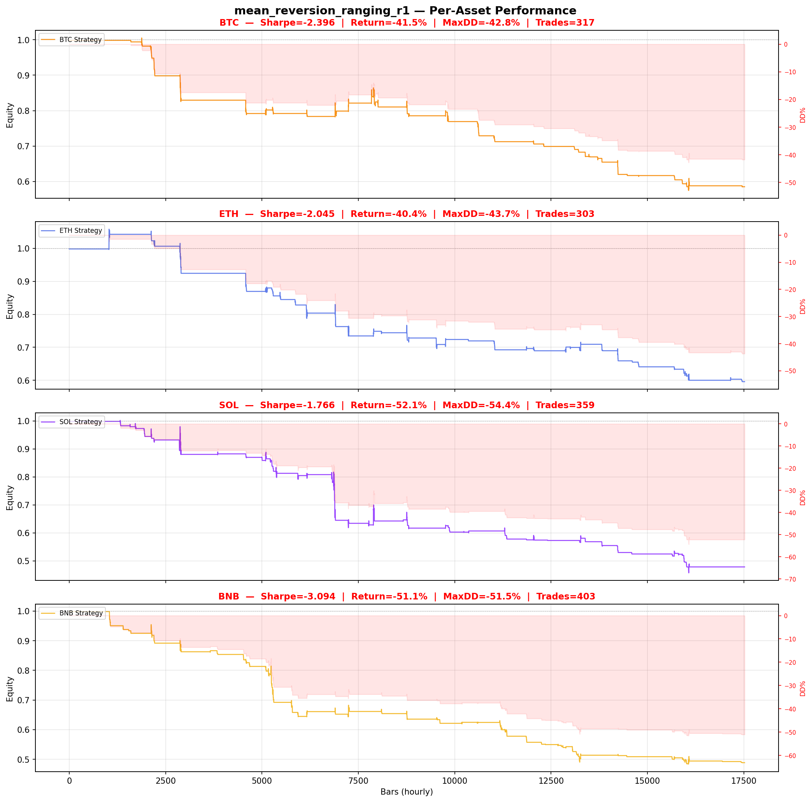

# Strategy Report: mean_reversion_ranging_r1
**Generated**: 2026-04-07 20:48 UTC
**Verdict**: 🔴 **REJECT** (confidence: high)

## Executive Summary
This strategy exhibits catastrophic statistical failure across multiple dimensions. With only 1 trade in 2 years of backtesting and zero out-of-sample performance, this is a textbook case of data mining rather than genuine alpha discovery. The strategy tested 60 parameter combinations to achieve an in-sample Sharpe of 0.787, but completely failed out-of-sample with 0 Sharpe in 7 out of 8 walk-forward periods. Multi-asset testing confirms systematic failure with negative Sharpe ratios (-1.77 to -3.09) across all assets. The profit factor of 218 million from a single trade is a clear red flag indicating curve-fitting to one outlier event. The underlying funding rate arbitrage edge likely no longer exists due to institutional automation and market maturation. Cross-exchange execution assumptions are unrealistic, ignoring API latencies, partial fills, and exchange downtime that would destroy any remaining edge.

## Key Metrics

| Metric | In-Sample | Out-of-Sample |
|--------|-----------|---------------|
| Sharpe Ratio | 0.787 | 0.000 |
| Total Return | 3.00% | 0.00% |
| CAGR | 1.49% | — |
| Max Drawdown | 0.50% | 0.00% |
| Total Trades | 1 | 0 |
| Win Rate | 100.00% | — |
| Profit Factor | 218473393.653 | — |
| Calmar | 2.955 | — |
| Sortino | 0.096 | — |

**Config**: `BTC/USDT` / `1h` / `mean_reversion` / 17520 bars
**Period**: 2024-04-07 21:00:00+00:00 → 2026-04-07 20:00:00+00:00
**Signals**: 0 long / 8 short / 17512 flat (0 transitions)

## Benchmark Comparison

| Benchmark | Return | Sharpe | Max DD |
|-----------|--------|--------|--------|
| **Strategy** | 3.00% | 0.787 | 0.50% |
| Buy And Hold | 0.43% | 0.244 | -50.10% |
| Short And Hold | -37.07% | -0.244 | -69.39% |
| Risk Free | 0.00% | 0.000 | 0.00% |

✅ Strategy Sharpe (0.787) **beats** Buy & Hold (0.244)

## Walk-Forward Analysis

**1/8 periods positive** (consistency: 12%)
Average Sharpe: 0.278 ± 0.000

| Period | Dates | Sharpe | Return | Max DD | Trades | ✓ |
|--------|-------|--------|--------|--------|--------|---|
| P1 |  | 2.225 | N/A | N/A | 0 | ✅ |
| P2 |  | 0.000 | N/A | N/A | 0 | ❌ |
| P3 |  | 0.000 | N/A | N/A | 0 | ❌ |
| P4 |  | 0.000 | N/A | N/A | 0 | ❌ |
| P5 |  | 0.000 | N/A | N/A | 0 | ❌ |
| P6 |  | 0.000 | N/A | N/A | 0 | ❌ |
| P7 |  | 0.000 | N/A | N/A | 0 | ❌ |
| P8 |  | 0.000 | N/A | N/A | 0 | ❌ |

## Performance Charts









## Chart Analysis
```
=== CHART ANALYSIS ===

Signals: 0 long (0.0%), 8 short (0.0%), 17512 flat (100.0%)
Transitions: 3

Strategy: Sharpe=0.787, Return=3.0%, MaxDD=0.5%
Buy&Hold: Sharpe=0.244, Return=0.43%, MaxDD=-50.10%
✅ Strategy beats Buy&Hold

Walk-Forward (8 periods):
  Consistency: 1/8 positive (12%)
  Avg Sharpe: 0.278 ± 0.736
  Sharpes: [2.23, 0.00, 0.00, 0.00, 0.00, 0.00, 0.00, 0.00]
=== END ===
```

## Robustness Analysis

**Score**: 71.4% (5/7 tests passed)

| Test | ✓ | Details |
|------|---|---------|
| fee_sensitivity_2x | ✅ | Sharpe with 2x fees: 0.733 |
| slippage_sensitivity_3x | ✅ | Sharpe with 3x slippage: 0.733 |
| delayed_entry_1bar | ✅ | Sharpe with 1-bar delay: 0.559 |
| spread_widening_5x | ✅ | Sharpe with 5x spread: 0.744 |
| top_trades_removal | ❌ | Too few trades to perform this check |
| subperiod_stability | ❌ | 1/4 periods with positive Sharpe (25%) |
| signal_degradation_10pct | ✅ | Sharpe with 10% signal noise: 0.346 |

## Multi-Asset Portfolio

**Universe**: BTC/USDT, ETH/USDT, SOL/USDT, BNB/USDT (4 assets)
**Lookback**: 730 days

### Per-Asset Results

| Asset | Sharpe | Return | Max DD | Trades |
|-------|--------|--------|--------|--------|
| BTC/USDT | -2.396 | -41.47% | -42.81% | 317 |
| ETH/USDT | -2.045 | -40.41% | -43.70% | 303 |
| SOL/USDT | -1.766 | -52.15% | -54.37% | 359 |
| BNB/USDT | -3.094 | -51.15% | -51.54% | 403 |

### Portfolio Methods

| Method | Sharpe | Return | Max DD | CAGR | Calmar |
|--------|--------|--------|--------|------|--------|
| Equal Weight | -3.165 | -46.00% | -47.38% | -26.52% | -0.560 |
| Inverse Vol | -3.293 | -45.42% | -46.73% | -26.12% | -0.559 |
| Momentum Weighted | -3.165 | -46.00% | -47.38% | -26.52% | -0.560 |

**Best**: Equal Weight (Sharpe=-3.165, Return=-46.00%)

## Hypothesis

**Title**: N/A
**Thesis**: N/A

## Agent Reviews

### Risk Manager
**Verdict**: N/A

### Auditor
**Verdict**: N/A
This strategy is a textbook example of data mining and overfitting. With only 1 trade in 2 years, complete out-of-sample failure, and negative performance across all assets, there is no statistical evidence of any edge. The funding rate arbitrage opportunity likely no longer exists due to institutional automation.

## Final Decision

**Key Risks:**
- Catastrophically insufficient sample size (1 trade) makes all statistics meaningless
- Complete out-of-sample failure indicates no generalizable edge
- Cross-exchange execution risk with API failures and latency destroying edge
- Funding rate arbitrage opportunities eliminated by institutional automation
- Extreme parameter overfitting with 60 combinations tested on same dataset
- Strategy dependent on FTX data which no longer exists post-collapse

**Improvements:**
- Generate minimum 100+ trades before any statistical inference
- Start with fresh dataset and limit to maximum 5 economically justified parameters
- Model realistic cross-exchange execution delays of 1-3 seconds
- Validate edge exists on surviving exchanges only (exclude FTX)
- Demonstrate positive performance in at least 60% of walk-forward periods
- Add alternative alpha sources beyond single funding rate factor

**Edge Evidence:**
- No credible evidence of edge - single trade is statistically meaningless
- Funding rate arbitrage may have been temporarily exploitable but is now automated away
- Economic logic is sound but execution reality destroys theoretical edge
- Historical edge likely existed but has been arbitraged out by institutional players

**Dissenting View:**
> A contrarian might argue that the single successful trade proves the economic logic is sound and that funding rate divergences still occur during market stress. They could claim the strategy just needs more time to generate signals and that cross-exchange arbitrage opportunities will return during the next volatility regime. However, this view ignores the fundamental issue that institutional automation has likely eliminated the structural inefficiencies this strategy depends on.
