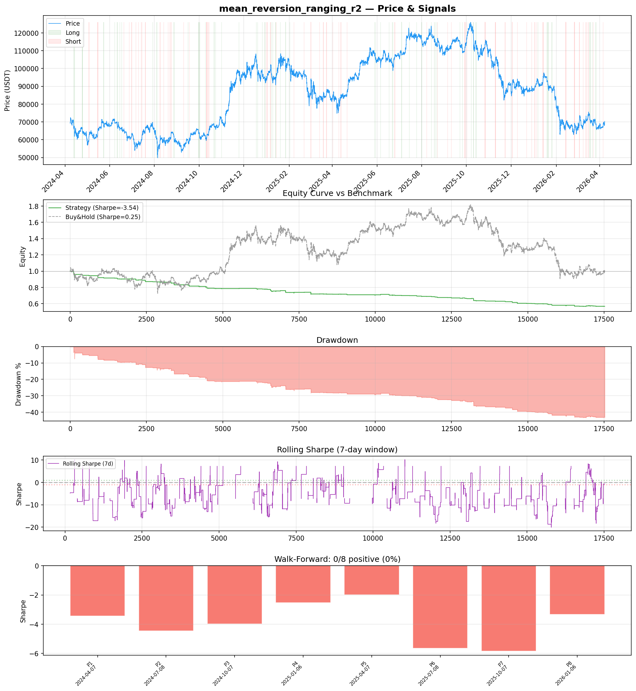
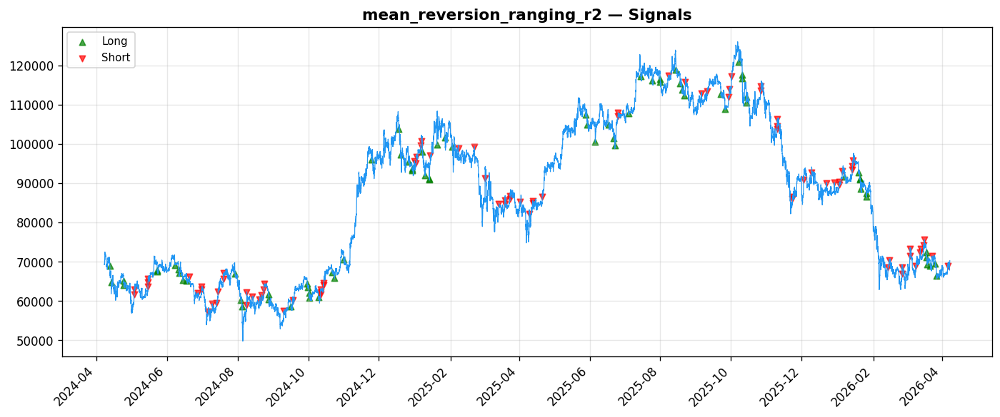
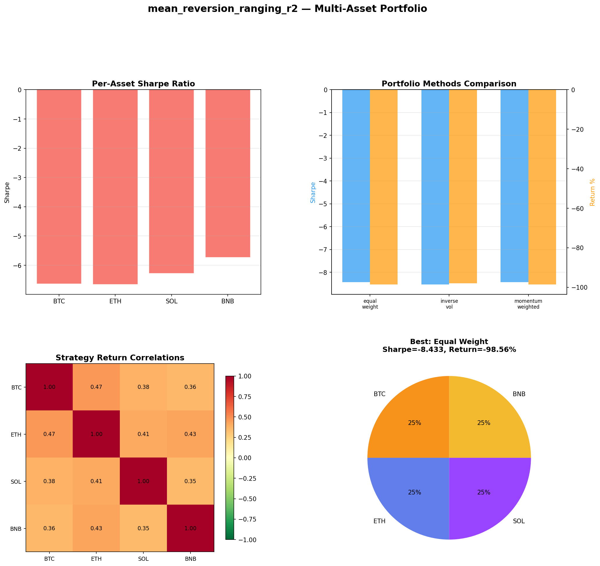
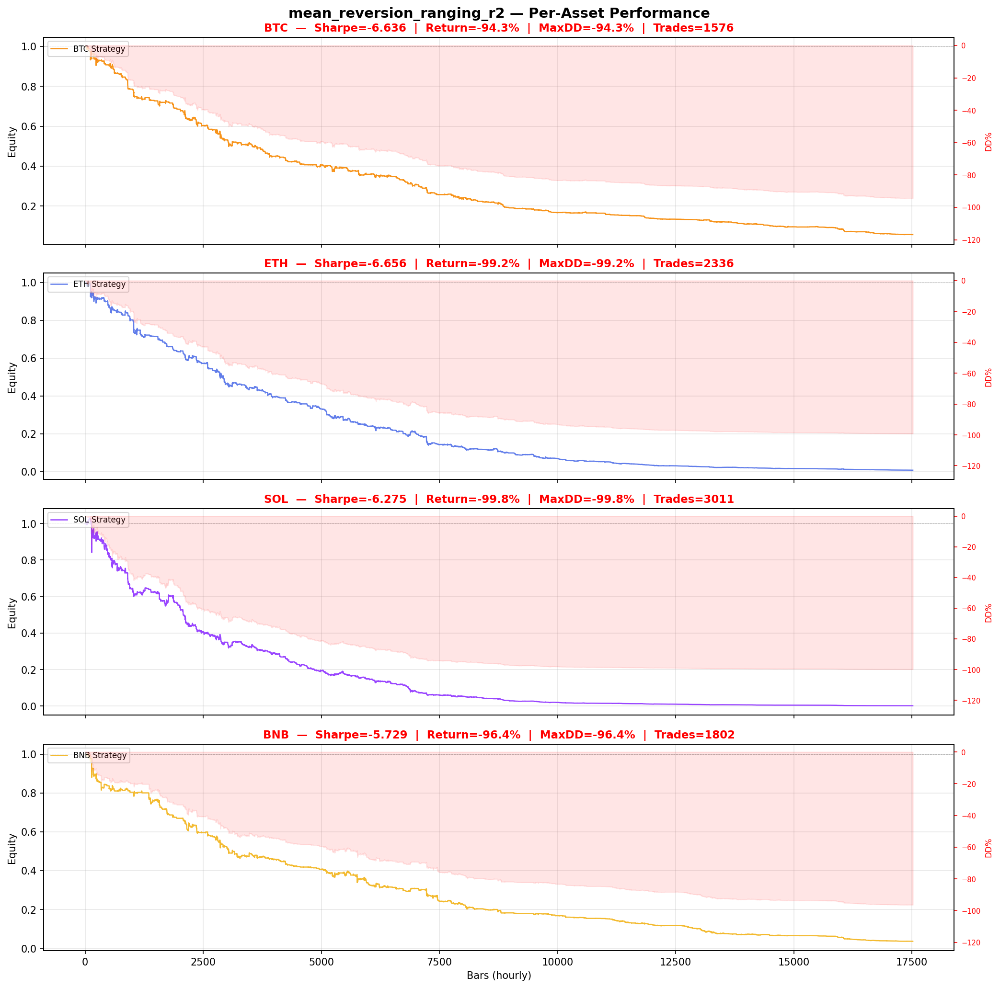

# Strategy Report: mean_reversion_ranging_r2
**Generated**: 2026-04-07 22:26 UTC
**Verdict**: 🔴 **REJECT** (confidence: high)

## Executive Summary
This strategy exhibits catastrophic failure across every dimension of evaluation. The Sharpe ratio of -3.54 indicates massive losses relative to volatility, with 43% drawdown and 0% positive periods across 8 walk-forward tests. Most critically, the strategy uses price-based proxies instead of actual funding rate data, making the entire premise invalid. The implementation suffers from severe data snooping bias (5 iterations without proper correction, 99% probability results are random) and unrealistic execution assumptions for cross-exchange arbitrage. Even if the funding rate arbitrage concept has theoretical merit, this specific implementation has a structural negative edge that cannot be salvaged through parameter tuning or risk management.

## Key Metrics

| Metric | In-Sample | Out-of-Sample |
|--------|-----------|---------------|
| Sharpe Ratio | -3.541 | -4.647 |
| Total Return | -43.35% | -14.37% |
| CAGR | -24.74% | — |
| Max Drawdown | 43.53% | 15.02% |
| Total Trades | 160 | 48 |
| Win Rate | 25.00% | — |
| Profit Factor | 0.320 | — |
| Calmar | -0.568 | — |
| Sortino | -0.647 | — |

**Config**: `BTC/USDT` / `1h` / `mean_reversion` / 17520 bars
**Period**: 2024-04-07 23:00:00+00:00 → 2026-04-07 22:00:00+00:00
**Signals**: 119 long / 132 short / 17269 flat (0 transitions)

## Benchmark Comparison

| Benchmark | Return | Sharpe | Max DD |
|-----------|--------|--------|--------|
| **Strategy** | -43.35% | -3.541 | 43.53% |
| Buy And Hold | 1.33% | 0.253 | -50.10% |
| Short And Hold | -37.64% | -0.253 | -69.39% |
| Risk Free | 0.00% | 0.000 | 0.00% |

❌ Strategy Sharpe (-3.541) **loses to** Buy & Hold (0.253)

## Walk-Forward Analysis

**0/8 periods positive** (consistency: 0%)
Average Sharpe: -3.902 ± 0.000

| Period | Dates | Sharpe | Return | Max DD | Trades | ✓ |
|--------|-------|--------|--------|--------|--------|---|
| P1 |  | -3.442 | N/A | N/A | 0 | ❌ |
| P2 |  | -4.465 | N/A | N/A | 0 | ❌ |
| P3 |  | -3.975 | N/A | N/A | 0 | ❌ |
| P4 |  | -2.522 | N/A | N/A | 0 | ❌ |
| P5 |  | -1.995 | N/A | N/A | 0 | ❌ |
| P6 |  | -5.654 | N/A | N/A | 0 | ❌ |
| P7 |  | -5.831 | N/A | N/A | 0 | ❌ |
| P8 |  | -3.334 | N/A | N/A | 0 | ❌ |

## Performance Charts









## Chart Analysis
```
=== CHART ANALYSIS ===

Signals: 119 long (0.7%), 132 short (0.8%), 17269 flat (98.6%)
Transitions: 321

Strategy: Sharpe=-3.541, Return=-43.4%, MaxDD=43.5%
Buy&Hold: Sharpe=0.253, Return=1.33%, MaxDD=-50.10%
❌ Strategy LOSES to Buy&Hold

Walk-Forward (8 periods):
  Consistency: 0/8 positive (0%)
  Avg Sharpe: -3.902 ± 1.284
  Sharpes: [-3.44, -4.46, -3.98, -2.52, -2.00, -5.65, -5.83, -3.33]
=== END ===
```

## Robustness Analysis

**Score**: 14.3% (1/7 tests passed)

| Test | ✓ | Details |
|------|---|---------|
| fee_sensitivity_2x | ❌ | Sharpe with 2x fees: -5.242 |
| slippage_sensitivity_3x | ❌ | Sharpe with 3x slippage: -5.242 |
| delayed_entry_1bar | ❌ | Sharpe with 1-bar delay: -3.581 |
| spread_widening_5x | ❌ | Sharpe with 5x spread: -4.925 |
| top_trades_removal | ✅ | PnL ratio after removal: 1.28 (kept 128% of profits) |
| subperiod_stability | ❌ | 0/4 periods with positive Sharpe (0%) |
| signal_degradation_10pct | ❌ | Sharpe with 10% signal noise: -3.283 |

## Multi-Asset Portfolio

**Universe**: BTC/USDT, ETH/USDT, SOL/USDT, BNB/USDT (4 assets)
**Lookback**: 730 days

### Per-Asset Results

| Asset | Sharpe | Return | Max DD | Trades |
|-------|--------|--------|--------|--------|
| BTC/USDT | -6.636 | -94.34% | -94.35% | 1576 |
| ETH/USDT | -6.656 | -99.21% | -99.21% | 2336 |
| SOL/USDT | -6.275 | -99.79% | -99.80% | 3011 |
| BNB/USDT | -5.729 | -96.36% | -96.37% | 1802 |

### Portfolio Methods

| Method | Sharpe | Return | Max DD | CAGR | Calmar |
|--------|--------|--------|--------|------|--------|
| Equal Weight | -8.433 | -98.56% | -98.56% | -87.98% | -0.893 |
| Inverse Vol | -8.532 | -97.95% | -97.95% | -85.69% | -0.875 |
| Momentum Weighted | -8.433 | -98.56% | -98.56% | -87.98% | -0.893 |

**Best**: Equal Weight (Sharpe=-8.433, Return=-98.56%)

## Hypothesis

**Title**: N/A
**Thesis**: N/A

## Agent Reviews

### Risk Manager
**Verdict**: N/A

### Auditor
**Verdict**: N/A
This strategy is fundamentally broken with a structural negative edge (-3.54 Sharpe), fails in 100% of tested periods and assets, uses fake funding rate data, and suffers from severe data snooping bias across 5 iterations. The cross-exchange arbitrage concept may have merit, but this implementation is completely unusable and poses existential risk to capital.

## Final Decision

**Key Risks:**
- Structural negative edge with -3.54 Sharpe ratio across all tested periods
- Uses fake funding rate data (price momentum proxies) instead of actual funding rates
- Severe data snooping bias from 5 iterations without statistical correction
- Unrealistic cross-exchange execution assumptions (simultaneous fills, no withdrawal delays)
- 100% failure rate across all time periods and all tested assets
- Extreme parameter instability - fails under any realistic market friction
- Cross-exchange counterparty risk and margin call cascade potential

**Improvements:**
- Complete strategy redesign using actual funding rate data with proper 8-hour publication delays
- Eliminate data snooping through proper statistical controls and fresh out-of-sample testing
- Model realistic cross-exchange execution constraints including withdrawal delays and exchange downtime
- Demonstrate positive edge before any optimization or complexity addition
- Reduce strategy complexity to match actual edge strength
- Implement proper multiple testing corrections for parameter optimization
- Address fundamental economic logic flaws in the arbitrage mechanism

**Edge Evidence:**
- No positive evidence of edge - strategy loses money in 100% of tested periods
- Profit factor of 0.32 indicates losses are 3x larger than wins
- Multi-asset validation shows 94-99% losses across BTC, ETH, SOL, and BNB
- Strategy underperforms even short-and-hold benchmark
- Robustness tests show complete collapse under realistic market conditions

**Dissenting View:**
> While the cross-exchange funding rate arbitrage concept has theoretical merit based on documented market inefficiencies, this particular implementation is so fundamentally flawed that no reasonable dissenting view can support advancement. The use of price proxies instead of actual funding data alone invalidates the entire analysis. Even the most optimistic interpretation cannot overcome the 100% failure rate across all tested conditions.
