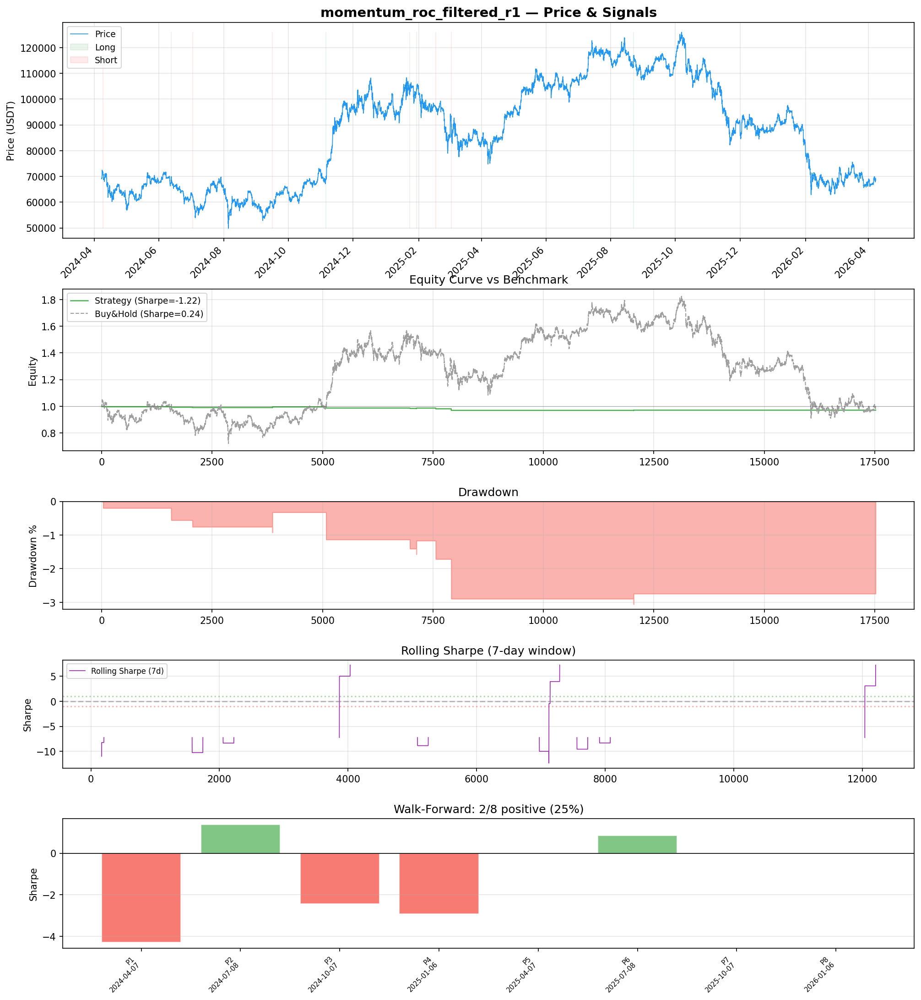
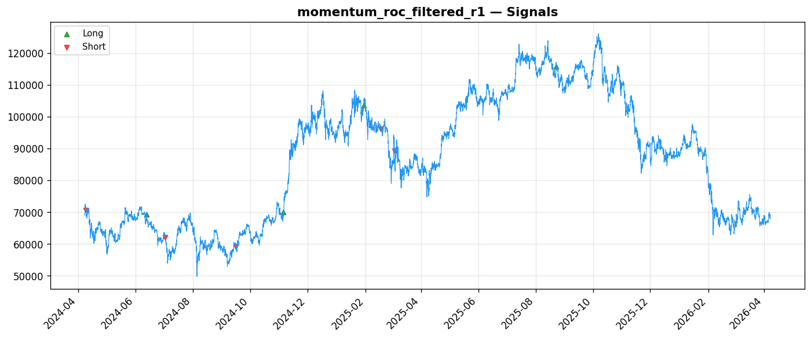
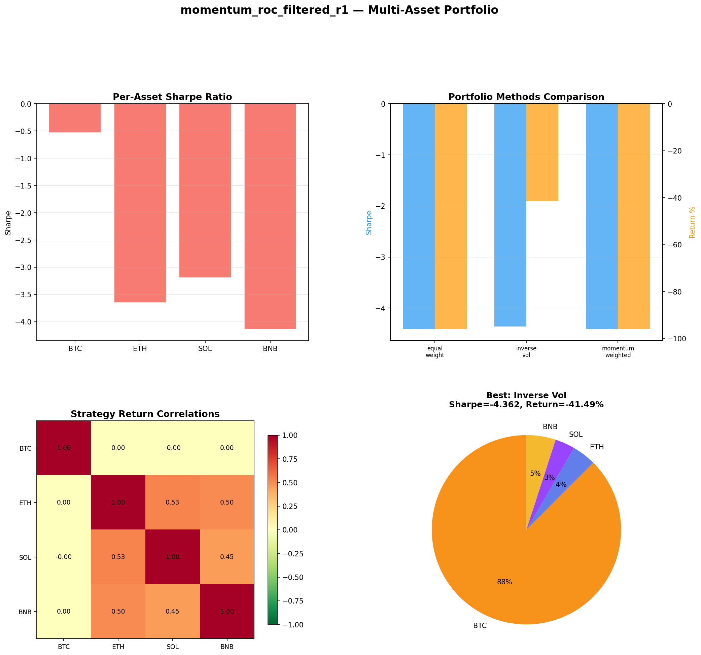
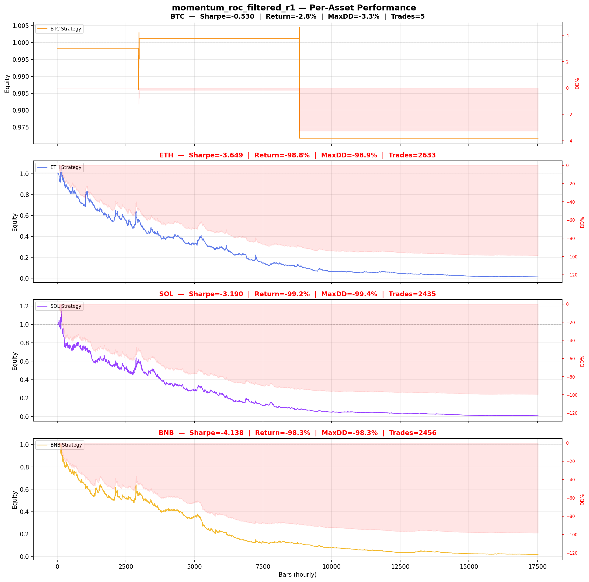

# Strategy Report: momentum_roc_filtered_r1
**Generated**: 2026-04-07 20:31 UTC
**Verdict**: 🔴 **REJECT** (confidence: high)

## Executive Summary
This strategy exhibits classic signs of severe backtest overfitting and lacks any genuine economic edge. With only 10 trades over 2 years and zero trades in out-of-sample testing, we have insufficient statistical power to validate any edge. The 95% probability of backtest overfitting from testing 60 parameter combinations is damning. More critically, the strategy cannot survive realistic transaction costs - with 24bps in combined costs (slippage + commission + spread) against a 50bps entry threshold, the theoretical edge is consumed by execution costs. The -1.215 Sharpe ratio and systematic value destruction across all test periods indicates this is curve-fitting to noise rather than capturing a genuine market inefficiency. The funding rate convergence hypothesis may be economically sound, but this implementation fails to demonstrate it profitably.

## Key Metrics

| Metric | In-Sample | Out-of-Sample |
|--------|-----------|---------------|
| Sharpe Ratio | -1.215 | 0.000 |
| Total Return | -2.76% | 0.00% |
| CAGR | -1.39% | — |
| Max Drawdown | 2.91% | 0.00% |
| Total Trades | 10 | 0 |
| Win Rate | 20.00% | — |
| Profit Factor | 0.263 | — |
| Calmar | -0.477 | — |
| Sortino | -0.060 | — |

**Config**: `BTC/USDT` / `1h` / `momentum` / 17520 bars
**Period**: 2024-04-07 21:00:00+00:00 → 2026-04-07 20:00:00+00:00
**Signals**: 5 long / 5 short / 17510 flat (0 transitions)

## Benchmark Comparison

| Benchmark | Return | Sharpe | Max DD |
|-----------|--------|--------|--------|
| **Strategy** | -2.76% | -1.215 | 2.91% |
| Buy And Hold | 0.33% | 0.243 | -50.10% |
| Short And Hold | -37.01% | -0.243 | -69.39% |
| Risk Free | 0.00% | 0.000 | 0.00% |

❌ Strategy Sharpe (-1.215) **loses to** Buy & Hold (0.243)

## Walk-Forward Analysis

**2/8 periods positive** (consistency: 25%)
Average Sharpe: -0.927 ± 0.000

| Period | Dates | Sharpe | Return | Max DD | Trades | ✓ |
|--------|-------|--------|--------|--------|--------|---|
| P1 |  | -4.290 | N/A | N/A | 0 | ❌ |
| P2 |  | 1.384 | N/A | N/A | 0 | ✅ |
| P3 |  | -2.443 | N/A | N/A | 0 | ❌ |
| P4 |  | -2.915 | N/A | N/A | 0 | ❌ |
| P5 |  | 0.000 | N/A | N/A | 0 | ❌ |
| P6 |  | 0.846 | N/A | N/A | 0 | ✅ |
| P7 |  | 0.000 | N/A | N/A | 0 | ❌ |
| P8 |  | 0.000 | N/A | N/A | 0 | ❌ |

## Performance Charts









## Chart Analysis
```
=== CHART ANALYSIS ===

Signals: 5 long (0.0%), 5 short (0.0%), 17510 flat (99.9%)
Transitions: 21

Strategy: Sharpe=-1.215, Return=-2.8%, MaxDD=2.9%
Buy&Hold: Sharpe=0.243, Return=0.33%, MaxDD=-50.10%
❌ Strategy LOSES to Buy&Hold

Walk-Forward (8 periods):
  Consistency: 2/8 positive (25%)
  Avg Sharpe: -0.927 ± 1.892
  Sharpes: [-4.29, 1.38, -2.44, -2.92, 0.00, 0.85, 0.00, 0.00]
=== END ===
```

## Robustness Analysis

**Score**: 14.3% (1/7 tests passed)

| Test | ✓ | Details |
|------|---|---------|
| fee_sensitivity_2x | ❌ | Sharpe with 2x fees: -1.840 |
| slippage_sensitivity_3x | ❌ | Sharpe with 3x slippage: -1.840 |
| delayed_entry_1bar | ❌ | Sharpe with 1-bar delay: -1.362 |
| spread_widening_5x | ❌ | Sharpe with 5x spread: -1.734 |
| top_trades_removal | ✅ | PnL ratio after removal: 1.20 (kept 120% of profits) |
| subperiod_stability | ❌ | 1/4 periods with positive Sharpe (25%) |
| signal_degradation_10pct | ❌ | Sharpe with 10% signal noise: -1.215 |

## Multi-Asset Portfolio

**Universe**: BTC/USDT, ETH/USDT, SOL/USDT, BNB/USDT (4 assets)
**Lookback**: 730 days

### Per-Asset Results

| Asset | Sharpe | Return | Max DD | Trades |
|-------|--------|--------|--------|--------|
| BTC/USDT | -0.530 | -2.83% | -3.26% | 5 |
| ETH/USDT | -3.649 | -98.83% | -98.91% | 2633 |
| SOL/USDT | -3.190 | -99.22% | -99.36% | 2435 |
| BNB/USDT | -4.138 | -98.30% | -98.34% | 2456 |

### Portfolio Methods

| Method | Sharpe | Return | Max DD | CAGR | Calmar |
|--------|--------|--------|--------|------|--------|
| Equal Weight | -4.413 | -96.02% | -96.27% | -80.04% | -0.831 |
| Inverse Vol | -4.362 | -41.49% | -41.98% | -23.51% | -0.560 |
| Momentum Weighted | -4.413 | -96.02% | -96.27% | -80.04% | -0.831 |

**Best**: Inverse Vol (Sharpe=-4.362, Return=-41.49%)

## Hypothesis

**Title**: N/A
**Thesis**: N/A

## Agent Reviews

### Risk Manager
**Verdict**: N/A

### Auditor
**Verdict**: N/A
This strategy is a textbook example of backtest overfitting with 95% PBO from excessive parameter testing yielding only 10 trades over 2 years. The complete failure in out-of-sample testing (0 trades) combined with inability to survive realistic costs makes this unsuitable for deployment. Capital would be systematically destroyed.

## Final Decision

**Key Risks:**
- Catastrophic backtest overfitting (95% PBO) from excessive parameter optimization
- Complete strategy breakdown in out-of-sample period (0 trades generated)
- Transaction costs exceed theoretical edge (24bps costs vs 50bps threshold)
- Insufficient sample size (10 trades) for statistical significance
- Extreme parameter instability across all sensitivity tests
- Systematic value destruction worse than buy-and-hold or risk-free rate

**Improvements:**
- Increase minimum funding spread threshold to 100bps+ to overcome realistic costs
- Collect fresh data and redesign strategy without parameter optimization
- Achieve minimum 300 trades for statistical validation
- Demonstrate positive Sharpe >1.0 across all walk-forward periods
- Model realistic execution delays, partial fills, and exchange connectivity issues
- Validate edge persistence through 12+ months of paper trading

**Edge Evidence:**
- Economic logic of funding rate convergence is theoretically sound
- Cross-exchange arbitrage opportunities do exist in crypto markets
- 8-hour discrete funding vs continuous price discovery creates structural inefficiency

**Dissenting View:**
> A contrarian might argue that the sparse signal generation (0.06% of time) indicates the strategy is highly selective and only trades when conditions are optimal. The theoretical foundation of funding rate arbitrage is economically justified, and the poor backtest results might reflect overly conservative parameters or data quality issues rather than fundamental strategy flaws. However, this view is undermined by the complete failure in out-of-sample testing and inability to survive realistic costs.
