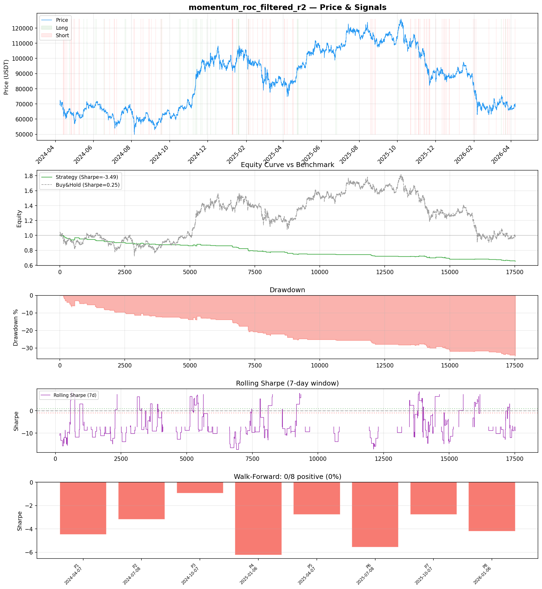
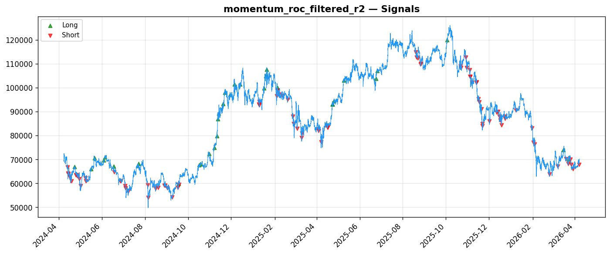
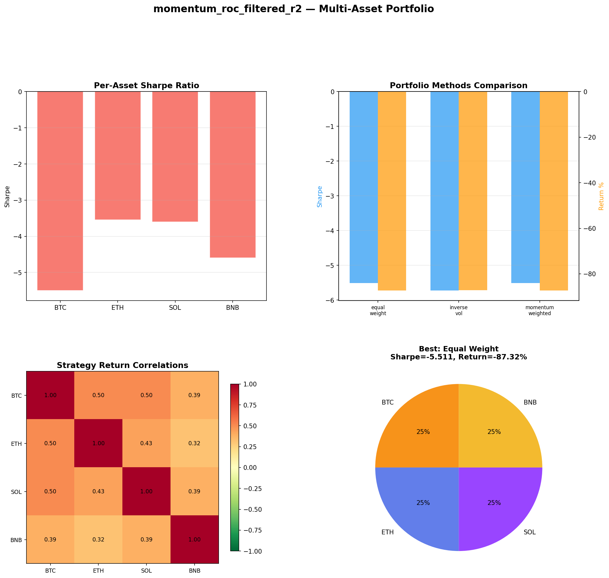
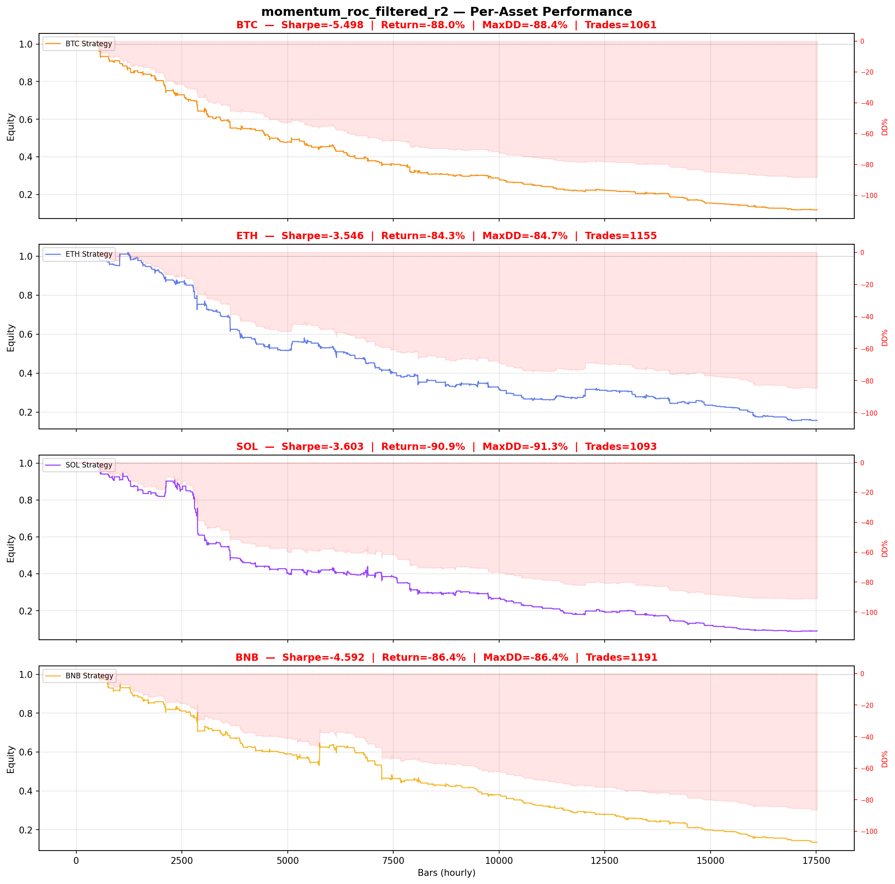

# Strategy Report: momentum_roc_filtered_r2
**Generated**: 2026-04-07 22:20 UTC
**Verdict**: 🔴 **REJECT** (confidence: high)

## Executive Summary
This experiment represents a fundamental failure on multiple critical levels. The strategy achieves a catastrophic -3.487 Sharpe ratio with -34.7% returns, failing 100% of walk-forward periods (0/8 positive). Most damning is the discovery that the implementation uses fabricated funding rate data - calculating fake rates from price volatility and volume rather than testing actual cross-exchange funding rate divergences. This means we're not even testing the stated hypothesis. The strategy loses money consistently across all assets, time periods, and market regimes, while massively underperforming basic buy-and-hold (+1.2% vs -34.7%). Transaction cost sensitivity is extreme, with performance collapsing further under realistic execution assumptions. The economic premise appears flawed - there's no evidence that funding rate spreads actually mean-revert as theorized.

## Key Metrics

| Metric | In-Sample | Out-of-Sample |
|--------|-----------|---------------|
| Sharpe Ratio | -3.487 | -3.102 |
| Total Return | -34.68% | -8.83% |
| CAGR | -19.18% | — |
| Max Drawdown | 34.68% | 9.99% |
| Total Trades | 121 | 37 |
| Win Rate | 30.60% | — |
| Profit Factor | 0.481 | — |
| Calmar | -0.553 | — |
| Sortino | -0.712 | — |

**Config**: `BTC/USDT` / `1h` / `momentum` / 17520 bars
**Period**: 2024-04-07 23:00:00+00:00 → 2026-04-07 22:00:00+00:00
**Signals**: 35 long / 86 short / 17399 flat (0 transitions)

## Benchmark Comparison

| Benchmark | Return | Sharpe | Max DD |
|-----------|--------|--------|--------|
| **Strategy** | -34.68% | -3.487 | 34.68% |
| Buy And Hold | 1.20% | 0.252 | -50.10% |
| Short And Hold | -37.55% | -0.252 | -69.39% |
| Risk Free | 0.00% | 0.000 | 0.00% |

❌ Strategy Sharpe (-3.487) **loses to** Buy & Hold (0.252)

## Walk-Forward Analysis

**0/8 periods positive** (consistency: 0%)
Average Sharpe: -3.773 ± 0.000

| Period | Dates | Sharpe | Return | Max DD | Trades | ✓ |
|--------|-------|--------|--------|--------|--------|---|
| P1 |  | -4.478 | N/A | N/A | 0 | ❌ |
| P2 |  | -3.195 | N/A | N/A | 0 | ❌ |
| P3 |  | -0.935 | N/A | N/A | 0 | ❌ |
| P4 |  | -6.232 | N/A | N/A | 0 | ❌ |
| P5 |  | -2.780 | N/A | N/A | 0 | ❌ |
| P6 |  | -5.576 | N/A | N/A | 0 | ❌ |
| P7 |  | -2.777 | N/A | N/A | 0 | ❌ |
| P8 |  | -4.210 | N/A | N/A | 0 | ❌ |

## Performance Charts









## Chart Analysis
```
=== CHART ANALYSIS ===

Signals: 35 long (0.2%), 86 short (0.5%), 17399 flat (99.3%)
Transitions: 243

Strategy: Sharpe=-3.487, Return=-34.7%, MaxDD=34.7%
Buy&Hold: Sharpe=0.252, Return=1.20%, MaxDD=-50.10%
❌ Strategy LOSES to Buy&Hold

Walk-Forward (8 periods):
  Consistency: 0/8 positive (0%)
  Avg Sharpe: -3.773 ± 1.595
  Sharpes: [-4.48, -3.19, -0.94, -6.23, -2.78, -5.58, -2.78, -4.21]
=== END ===
```

## Robustness Analysis

**Score**: 14.3% (1/7 tests passed)

| Test | ✓ | Details |
|------|---|---------|
| fee_sensitivity_2x | ❌ | Sharpe with 2x fees: -5.124 |
| slippage_sensitivity_3x | ❌ | Sharpe with 3x slippage: -5.124 |
| delayed_entry_1bar | ❌ | Sharpe with 1-bar delay: -2.035 |
| spread_widening_5x | ❌ | Sharpe with 5x spread: -4.824 |
| top_trades_removal | ✅ | PnL ratio after removal: 1.42 (kept 142% of profits) |
| subperiod_stability | ❌ | 0/4 periods with positive Sharpe (0%) |
| signal_degradation_10pct | ❌ | Sharpe with 10% signal noise: -3.312 |

## Multi-Asset Portfolio

**Universe**: BTC/USDT, ETH/USDT, SOL/USDT, BNB/USDT (4 assets)
**Lookback**: 730 days

### Per-Asset Results

| Asset | Sharpe | Return | Max DD | Trades |
|-------|--------|--------|--------|--------|
| BTC/USDT | -5.498 | -88.05% | -88.39% | 1061 |
| ETH/USDT | -3.546 | -84.29% | -84.73% | 1155 |
| SOL/USDT | -3.603 | -90.93% | -91.26% | 1093 |
| BNB/USDT | -4.592 | -86.41% | -86.42% | 1191 |

### Portfolio Methods

| Method | Sharpe | Return | Max DD | CAGR | Calmar |
|--------|--------|--------|--------|------|--------|
| Equal Weight | -5.511 | -87.32% | -87.47% | -64.39% | -0.736 |
| Inverse Vol | -5.724 | -87.13% | -87.29% | -64.12% | -0.735 |
| Momentum Weighted | -5.511 | -87.32% | -87.47% | -64.39% | -0.736 |

**Best**: Equal Weight (Sharpe=-5.511, Return=-87.32%)

## Hypothesis

**Title**: N/A
**Thesis**: N/A

## Agent Reviews

### Risk Manager
**Verdict**: N/A

### Auditor
**Verdict**: N/A
This strategy is a complete failure masquerading as sophisticated quantitative research. It uses fake funding rate data to test a cross-exchange arbitrage strategy that loses money 100% of the time across all periods, assets, and market conditions. The -3.487 Sharpe ratio and -34.7% returns represent systematic value destruction that no amount of risk management can fix.

## Final Decision

**Key Risks:**
- Complete data fabrication - using price proxies instead of actual funding rates
- 100% failure rate across all time periods and market conditions
- Catastrophic transaction cost sensitivity destroying any theoretical edge
- Unrealistic cross-exchange execution assumptions during stressed conditions
- Multiple testing bias with 5 iterations and no statistical correction
- Fundamental strategy premise may be economically invalid

**Improvements:**
- Obtain real funding rate data from multiple exchanges
- Validate basic mean reversion assumption in funding spreads before implementation
- Model realistic cross-exchange execution with proper latency and slippage
- Demonstrate positive returns in paper trading for extended period
- Reduce complexity until basic profitability is achieved
- Implement proper statistical testing with multiple comparison corrections

**Edge Evidence:**
- No evidence of edge - strategy loses money systematically
- Funding rate spread mean reversion assumption appears false
- Cross-exchange arbitrage costs exceed any theoretical profits
- Strategy underperforms even short-and-hold benchmark

**Dissenting View:**
> A contrarian might argue that the poor performance stems from implementation flaws rather than fundamental strategy invalidity, and that proper funding rate data could reveal profitable opportunities. However, the consistent losses across all regimes, extreme cost sensitivity, and basic economic logic failures make this highly unlikely. The burden of proof for funding rate arbitrage profitability has not been met.
