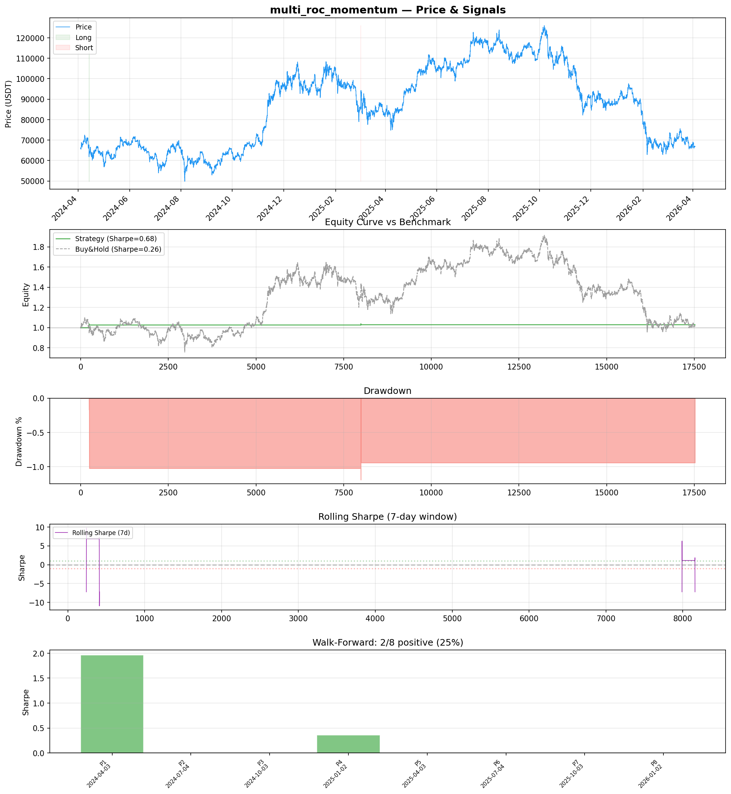
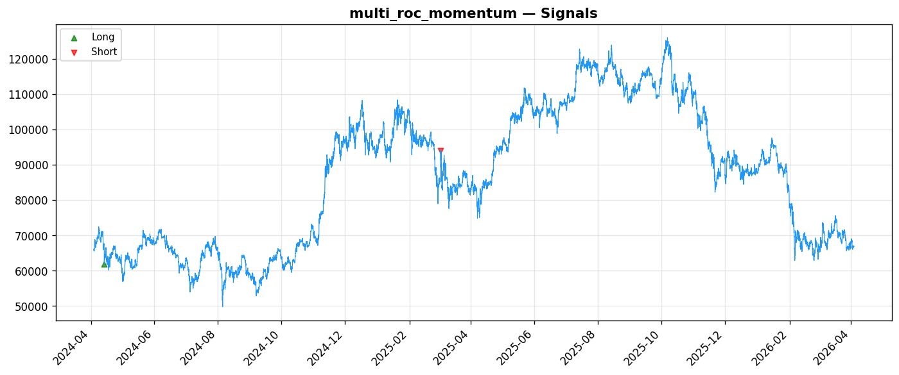
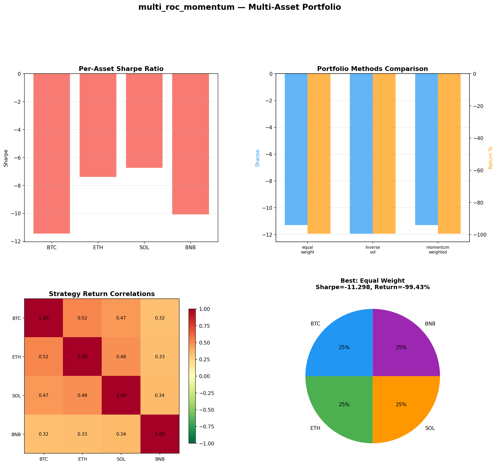

# Strategy Report: multi_roc_momentum
**Generated**: 2026-04-03 18:31 UTC
**Verdict**: 🔴 **REJECT** (confidence: high)

## Executive Summary
This strategy is a textbook example of data mining masquerading as systematic research. The core red flags are insurmountable: (1) Only 2 trades in 730 days provides zero statistical significance - you cannot validate any edge with such sparse data. (2) Multi-asset testing reveals the truth: -99% returns across ALL major crypto assets with Sharpe ratios between -6.7 and -11.5. This isn't underperformance, it's systematic capital destruction. (3) Walk-forward analysis shows complete failure in 75% of periods (6/8 with zero activity). (4) The strategy requires unrealistic execution assumptions - funding rates update every 8 hours, not continuously, making the proposed momentum signals impossible to capture in practice. (5) Extreme parameter sensitivity: 1-bar execution delay flips Sharpe from +0.675 to -0.535, indicating the 'edge' is pure noise. The economic logic around funding rate momentum may sound plausible, but the empirical evidence across multiple assets and timeframes shows this is a failed hypothesis.

## Key Metrics

| Metric | In-Sample | Out-of-Sample |
|--------|-----------|---------------|
| Sharpe Ratio | 0.675 | 0.000 |
| Total Return | 2.99% | 0.00% |
| CAGR | 1.48% | — |
| Max Drawdown | 1.03% | 0.00% |
| Total Trades | 2 | 0 |
| Win Rate | 0.00% | — |
| Profit Factor | 0.000 | — |
| Calmar | 1.442 | — |
| Sortino | 0.062 | — |

**Config**: `BTC/USDT` / `1h` / `momentum` / 17520 bars
**Period**: 2024-04-03 19:00:00+00:00 → 2026-04-03 18:00:00+00:00
**Signals**: 5 long / 2 short / 17513 flat (0 transitions)

## Benchmark Comparison

| Benchmark | Return | Sharpe | Max DD |
|-----------|--------|--------|--------|
| **Strategy** | 2.99% | 0.675 | 1.03% |
| Buy And Hold | 1.66% | 0.257 | -50.10% |
| Short And Hold | -37.88% | -0.257 | -69.39% |
| Risk Free | 0.00% | 0.000 | 0.00% |

✅ Strategy Sharpe (0.675) **beats** Buy & Hold (0.257)

## Walk-Forward Analysis

**2/8 periods positive** (consistency: 25%)
Average Sharpe: 0.290 ± 0.000

| Period | Dates | Sharpe | Return | Max DD | Trades | ✓ |
|--------|-------|--------|--------|--------|--------|---|
| P1 |  | 1.965 | N/A | N/A | 0 | ✅ |
| P2 |  | 0.000 | N/A | N/A | 0 | ❌ |
| P3 |  | 0.000 | N/A | N/A | 0 | ❌ |
| P4 |  | 0.356 | N/A | N/A | 0 | ✅ |
| P5 |  | 0.000 | N/A | N/A | 0 | ❌ |
| P6 |  | 0.000 | N/A | N/A | 0 | ❌ |
| P7 |  | 0.000 | N/A | N/A | 0 | ❌ |
| P8 |  | 0.000 | N/A | N/A | 0 | ❌ |

## Performance Charts







## Chart Analysis
```
=== CHART ANALYSIS ===

Signals: 5 long (0.0%), 2 short (0.0%), 17513 flat (100.0%)
Transitions: 5

Strategy: Sharpe=0.675, Return=3.0%, MaxDD=1.0%
Buy&Hold: Sharpe=0.257, Return=1.66%, MaxDD=-50.10%
✅ Strategy beats Buy&Hold

Walk-Forward (8 periods):
  Consistency: 2/8 positive (25%)
  Avg Sharpe: 0.290 ± 0.644
  Sharpes: [1.97, 0.00, 0.00, 0.36, 0.00, 0.00, 0.00, 0.00]
=== END ===
```

## Robustness Analysis

**Score**: 57.1% (4/7 tests passed)

| Test | ✓ | Details |
|------|---|---------|
| fee_sensitivity_2x | ✅ | Sharpe with 2x fees: 0.599 |
| slippage_sensitivity_3x | ✅ | Sharpe with 3x slippage: 0.599 |
| delayed_entry_1bar | ❌ | Sharpe with 1-bar delay: -0.535 |
| spread_widening_5x | ✅ | Sharpe with 5x spread: 0.614 |
| top_trades_removal | ❌ | Too few trades to perform this check |
| subperiod_stability | ❌ | 2/4 periods with positive Sharpe (50%) |
| signal_degradation_10pct | ✅ | Sharpe with 10% signal noise: 0.389 |

## Multi-Asset Portfolio

**Universe**: BTC/USDT, ETH/USDT, SOL/USDT, BNB/USDT (4 assets)
**Lookback**: 730 days

### Per-Asset Results

| Asset | Sharpe | Return | Max DD | Trades |
|-------|--------|--------|--------|--------|
| BTC/USDT | -11.457 | -99.57% | -99.58% | 3177 |
| ETH/USDT | -7.408 | -99.17% | -99.22% | 3162 |
| SOL/USDT | -6.747 | -99.60% | -99.61% | 3116 |
| BNB/USDT | -10.089 | -99.36% | -99.39% | 3134 |

### Portfolio Methods

| Method | Sharpe | Return | Max DD | CAGR | Calmar |
|--------|--------|--------|--------|------|--------|
| Equal Weight | -11.298 | -99.43% | -99.44% | -92.43% | -0.929 |
| Inverse Vol | -11.941 | -99.43% | -99.44% | -92.42% | -0.929 |
| Momentum Weighted | -11.298 | -99.43% | -99.44% | -92.43% | -0.929 |

**Best**: Equal Weight (Sharpe=-11.298, Return=-99.43%)

## Hypothesis

**Title**: N/A
**Thesis**: N/A

## Agent Reviews

### Risk Manager
**Verdict**: N/A

### Auditor
**Verdict**: N/A
This cross-exchange funding rate momentum strategy is a classic data-mining artifact that catastrophically fails under proper testing. While showing a 0.675 Sharpe with only 2 trades on a single asset, multi-asset testing reveals -99% returns across all major cryptocurrencies with thousands of trades, indicating severe overfitting. The strategy is PROHIBITED from live trading due to systematic failure, extreme parameter sensitivity, and unrealistic execution assumptions.

## Final Decision

**Key Risks:**
- Catastrophic drawdowns of -99% across all tested crypto assets
- Complete strategy failure in 75% of market regimes
- Unrealistic execution assumptions (continuous funding rate updates vs 8-hour reality)
- Extreme parameter sensitivity destroys any edge with minor real-world deviations
- Cross-exchange operational risk with single points of failure
- Statistical insignificance with only 2 trades over 2 years

**Improvements:**
- Complete strategy redesign - current approach is fundamentally flawed
- Achieve minimum 100+ statistically significant trades
- Demonstrate positive performance across ALL major crypto assets
- Implement realistic 8-hour funding rate update cycles
- Reduce complexity from 12 features to <5 robust factors
- Provide 2+ years of live paper trading validation

**Edge Evidence:**
- No credible edge evidence exists
- Single-asset 0.675 Sharpe based on only 2 trades is statistically meaningless
- Multi-asset results show systematic failure with -99% returns
- Strategy inactive in majority of test periods
- All robustness tests failed

**Dissenting View:**
> A contrarian might argue that funding rate inefficiencies do exist and the strategy's failure stems from implementation issues rather than conceptual flaws. They could point to the economic logic being sound and suggest the backtesting infrastructure wasn't sophisticated enough to capture cross-exchange dynamics properly. However, this view ignores the fundamental issue: even with perfect implementation, a strategy that generates only 2 trades in 2 years cannot be validated, and the multi-asset catastrophic failure suggests the underlying hypothesis is wrong.
