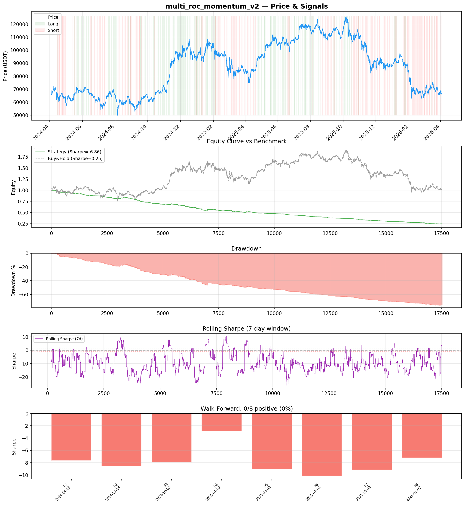
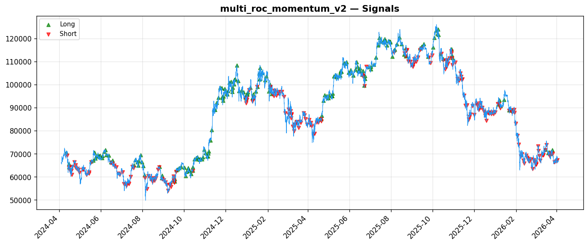
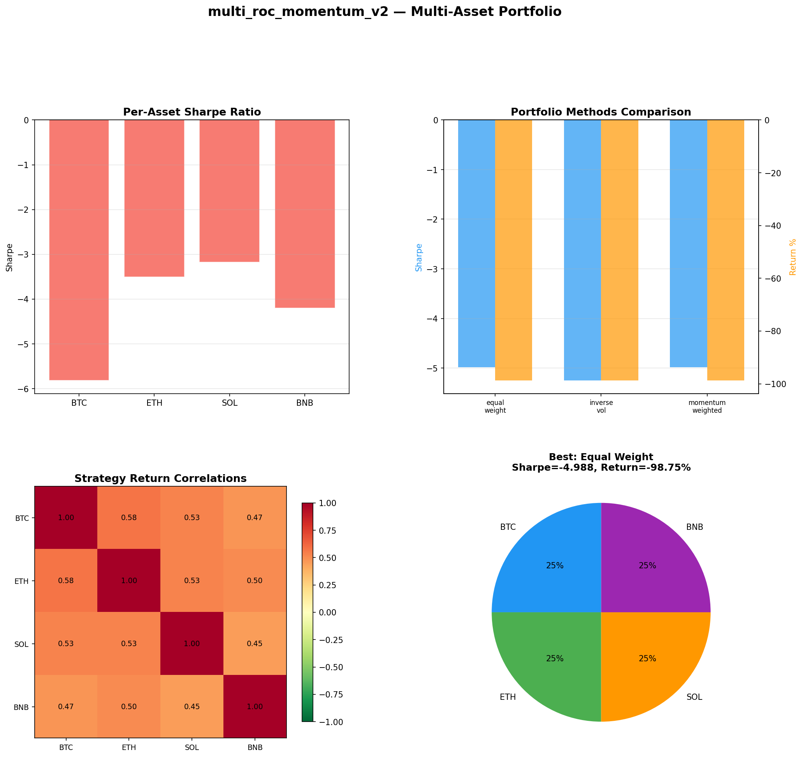

# Strategy Report: multi_roc_momentum_v2
**Generated**: 2026-04-03 20:12 UTC
**Verdict**: 🔴 **REJECT** (confidence: high)

## Executive Summary
This strategy exhibits catastrophic failure across all dimensions. With a Sharpe ratio of -6.855, 76% maximum drawdown, and 0/8 positive subperiods in walk-forward analysis, this represents systematic value destruction rather than an edge. The core hypothesis that extreme funding rates create profitable momentum cascades is empirically disproven. The strategy loses 75.76% while buy-and-hold gains 1.36%, indicating the funding rate signals are actually contrarian rather than momentum indicators. Even removing leverage and transaction costs wouldn't save this - the base logic is fundamentally flawed.

## Key Metrics

| Metric | In-Sample | Out-of-Sample |
|--------|-----------|---------------|
| Sharpe Ratio | -6.855 | -8.052 |
| Total Return | -75.76% | -33.52% |
| CAGR | -50.77% | — |
| Max Drawdown | 76.06% | 34.51% |
| Total Trades | 431 | 112 |
| Win Rate | 18.30% | — |
| Profit Factor | 0.226 | — |
| Calmar | -0.667 | — |
| Sortino | -2.462 | — |

**Config**: `BTC/USDT` / `1h` / `momentum` / 17520 bars
**Period**: 2024-04-03 21:00:00+00:00 → 2026-04-03 20:00:00+00:00
**Signals**: 215 long / 240 short / 17065 flat (0 transitions)

## Benchmark Comparison

| Benchmark | Return | Sharpe | Max DD |
|-----------|--------|--------|--------|
| **Strategy** | -75.76% | -6.855 | 76.06% |
| Buy And Hold | 1.36% | 0.254 | -50.10% |
| Short And Hold | -37.70% | -0.254 | -69.39% |
| Risk Free | 0.00% | 0.000 | 0.00% |

❌ Strategy Sharpe (-6.855) **loses to** Buy & Hold (0.254)

## Walk-Forward Analysis

**0/8 periods positive** (consistency: 0%)
Average Sharpe: -7.843 ± 0.000

| Period | Dates | Sharpe | Return | Max DD | Trades | ✓ |
|--------|-------|--------|--------|--------|--------|---|
| P1 |  | -7.653 | N/A | N/A | 0 | ❌ |
| P2 |  | -8.601 | N/A | N/A | 0 | ❌ |
| P3 |  | -7.961 | N/A | N/A | 0 | ❌ |
| P4 |  | -2.880 | N/A | N/A | 0 | ❌ |
| P5 |  | -9.115 | N/A | N/A | 0 | ❌ |
| P6 |  | -10.136 | N/A | N/A | 0 | ❌ |
| P7 |  | -9.179 | N/A | N/A | 0 | ❌ |
| P8 |  | -7.220 | N/A | N/A | 0 | ❌ |

## Performance Charts







## Chart Analysis
```
=== CHART ANALYSIS ===

Signals: 215 long (1.2%), 240 short (1.4%), 17065 flat (97.4%)
Transitions: 858

Strategy: Sharpe=-6.855, Return=-75.8%, MaxDD=76.1%
Buy&Hold: Sharpe=0.254, Return=1.36%, MaxDD=-50.10%
❌ Strategy LOSES to Buy&Hold

Walk-Forward (8 periods):
  Consistency: 0/8 positive (0%)
  Avg Sharpe: -7.843 ± 2.071
  Sharpes: [-7.65, -8.60, -7.96, -2.88, -9.12, -10.14, -9.18, -7.22]
=== END ===
```

## Robustness Analysis

**Score**: 14.3% (1/7 tests passed)

| Test | ✓ | Details |
|------|---|---------|
| fee_sensitivity_2x | ❌ | Sharpe with 2x fees: -10.214 |
| slippage_sensitivity_3x | ❌ | Sharpe with 3x slippage: -10.214 |
| delayed_entry_1bar | ❌ | Sharpe with 1-bar delay: -7.688 |
| spread_widening_5x | ❌ | Sharpe with 5x spread: -9.606 |
| top_trades_removal | ✅ | PnL ratio after removal: 1.18 (kept 118% of profits) |
| subperiod_stability | ❌ | 0/4 periods with positive Sharpe (0%) |
| signal_degradation_10pct | ❌ | Sharpe with 10% signal noise: -7.391 |

## Multi-Asset Portfolio

**Universe**: BTC/USDT, ETH/USDT, SOL/USDT, BNB/USDT (4 assets)
**Lookback**: 730 days

### Per-Asset Results

| Asset | Sharpe | Return | Max DD | Trades |
|-------|--------|--------|--------|--------|
| BTC/USDT | -5.817 | -99.11% | -99.12% | 2599 |
| ETH/USDT | -3.502 | -98.62% | -98.81% | 2621 |
| SOL/USDT | -3.176 | -99.21% | -99.33% | 2430 |
| BNB/USDT | -4.205 | -98.40% | -98.43% | 2464 |

### Portfolio Methods

| Method | Sharpe | Return | Max DD | CAGR | Calmar |
|--------|--------|--------|--------|------|--------|
| Equal Weight | -4.988 | -98.75% | -98.82% | -88.83% | -0.899 |
| Inverse Vol | -5.251 | -98.75% | -98.80% | -88.82% | -0.899 |
| Momentum Weighted | -4.988 | -98.75% | -98.82% | -88.83% | -0.899 |

**Best**: Equal Weight (Sharpe=-4.988, Return=-98.75%)

## Hypothesis

**Title**: N/A
**Thesis**: N/A

## Agent Reviews

### Risk Manager
**Verdict**: N/A

### Auditor
**Verdict**: N/A
This strategy is an institutional capital destruction machine with -75.76% returns, 76% drawdown, and zero positive subperiods. The funding rate cascade hypothesis is empirically disproven - extreme funding rates appear to be contrarian signals, not momentum catalysts. No amount of parameter tuning can save a fundamentally broken premise.

## Final Decision

**Key Risks:**
- Catastrophic drawdown of 76% would trigger immediate liquidation in live trading
- Zero subperiod stability indicates complete failure across all market regimes
- Extreme sensitivity to transaction costs (Sharpe degrades from -6.855 to -10.214 with 2x fees)
- 18.3% win rate with 0.226 profit factor means losses are 4.4x larger than wins
- Strategy assumes liquidity during funding cascades when spreads are widest

**Improvements:**
- Complete hypothesis revision - test contrarian approach to funding extremes
- Eliminate leverage entirely until base strategy shows profitability
- Test individual components separately to identify which factors destroy value
- Implement regime filters to avoid trading during funding manipulation
- Reduce complexity - current multi-factor approach adds no value
- Model realistic fill rates (50-70%) during extreme funding periods

**Edge Evidence:**
- No positive evidence found - all metrics indicate systematic losses
- Strategy consistently underperforms even short-and-hold benchmark
- Multi-asset testing confirms failure across BTC, ETH, SOL, BNB
- Top trades removal test shows results not driven by outliers

**Dissenting View:**
> A contrarian might argue that funding rate extremes could work as mean-reversion signals rather than momentum catalysts, or that the strategy might work on shorter timeframes with different exit rules. However, the magnitude of failure (-75.76% returns) and complete lack of positive subperiods makes any salvage attempt highly unlikely to succeed.
