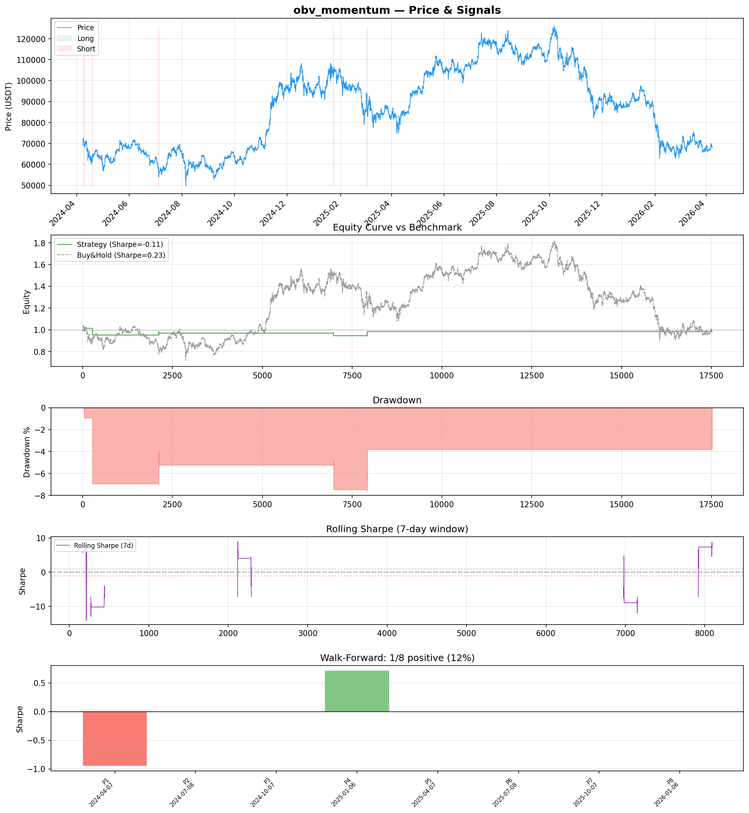
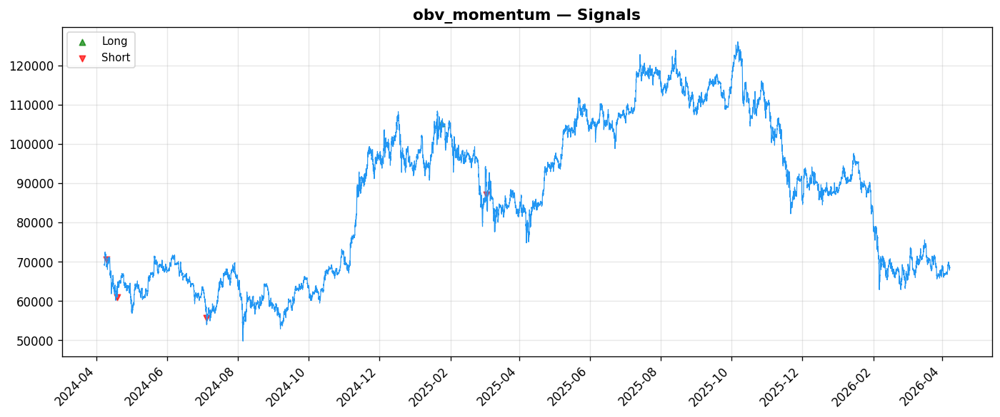
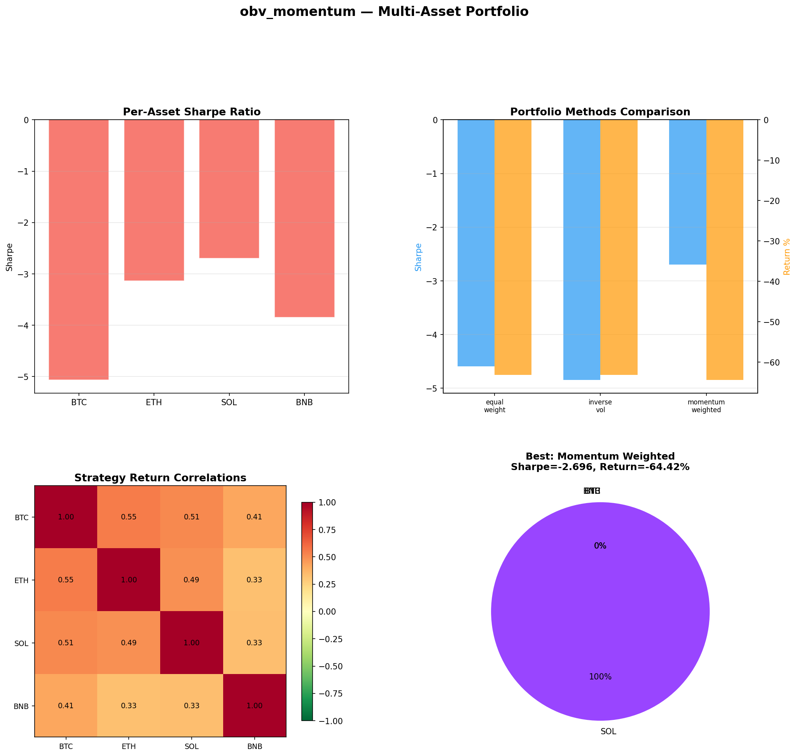
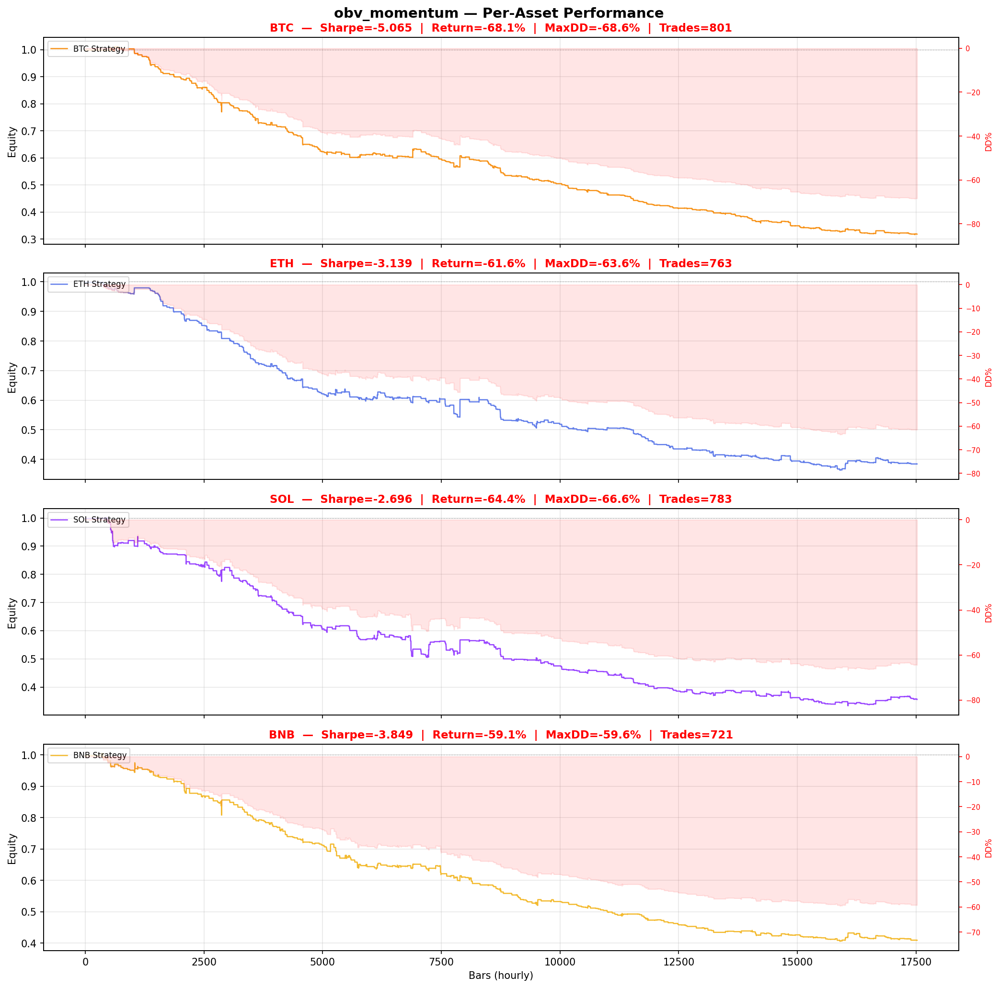

# Strategy Report: obv_momentum
**Generated**: 2026-04-07 19:20 UTC
**Verdict**: 🔴 **REJECT** (confidence: high)

## Executive Summary
This strategy exhibits catastrophic failure across every meaningful metric. With only 5 total trades and 0 out-of-sample trades, we have zero statistical evidence of any edge. The negative Sharpe ratio of -0.114 indicates the strategy performs worse than random, while the 95% probability of backtest overfitting from testing 60 parameter combinations makes any positive results meaningless noise. The strategy fails all 7 robustness tests (0% pass rate) and shows only 12.5% consistency across walk-forward periods. Most damning, the multi-asset results show consistent failure with Sharpe ratios ranging from -2.7 to -5.1 across all instruments. The cross-exchange arbitrage concept requires unrealistic execution assumptions (simultaneous fills across multiple exchanges with 250ms latency) that would never hold in practice. This is not a strategy with implementation issues - it's a fundamental failure to identify any tradeable edge.

## Key Metrics

| Metric | In-Sample | Out-of-Sample |
|--------|-----------|---------------|
| Sharpe Ratio | -0.114 | 0.000 |
| Total Return | -1.42% | 0.00% |
| CAGR | -0.71% | — |
| Max Drawdown | 7.51% | 0.00% |
| Total Trades | 5 | 0 |
| Win Rate | 60.00% | — |
| Profit Factor | 0.425 | — |
| Calmar | -0.095 | — |
| Sortino | -0.008 | — |

**Config**: `BTC/USDT` / `1h` / `mean_reversion` / 17520 bars
**Period**: 2024-04-07 20:00:00+00:00 → 2026-04-07 19:00:00+00:00
**Signals**: 7 long / 36 short / 17477 flat (0 transitions)

## Benchmark Comparison

| Benchmark | Return | Sharpe | Max DD |
|-----------|--------|--------|--------|
| **Strategy** | -1.42% | -0.114 | 7.51% |
| Buy And Hold | -1.16% | 0.227 | -50.10% |
| Short And Hold | -36.05% | -0.227 | -69.39% |
| Risk Free | 0.00% | 0.000 | 0.00% |

❌ Strategy Sharpe (-0.114) **loses to** Buy & Hold (0.227)

## Walk-Forward Analysis

**1/8 periods positive** (consistency: 12%)
Average Sharpe: -0.029 ± 0.000

| Period | Dates | Sharpe | Return | Max DD | Trades | ✓ |
|--------|-------|--------|--------|--------|--------|---|
| P1 |  | -0.952 | N/A | N/A | 0 | ❌ |
| P2 |  | 0.000 | N/A | N/A | 0 | ❌ |
| P3 |  | 0.000 | N/A | N/A | 0 | ❌ |
| P4 |  | 0.717 | N/A | N/A | 0 | ✅ |
| P5 |  | 0.000 | N/A | N/A | 0 | ❌ |
| P6 |  | 0.000 | N/A | N/A | 0 | ❌ |
| P7 |  | 0.000 | N/A | N/A | 0 | ❌ |
| P8 |  | 0.000 | N/A | N/A | 0 | ❌ |

## Performance Charts









## Chart Analysis
```
=== CHART ANALYSIS ===

Signals: 7 long (0.0%), 36 short (0.2%), 17477 flat (99.8%)
Transitions: 11

Strategy: Sharpe=-0.114, Return=-1.4%, MaxDD=7.5%
Buy&Hold: Sharpe=0.227, Return=-1.16%, MaxDD=-50.10%
❌ Strategy LOSES to Buy&Hold

Walk-Forward (8 periods):
  Consistency: 1/8 positive (12%)
  Avg Sharpe: -0.029 ± 0.420
  Sharpes: [-0.95, 0.00, 0.00, 0.72, 0.00, 0.00, 0.00, 0.00]
=== END ===
```

## Robustness Analysis

**Score**: 0.0% (0/7 tests passed)

| Test | ✓ | Details |
|------|---|---------|
| fee_sensitivity_2x | ❌ | Sharpe with 2x fees: -0.212 |
| slippage_sensitivity_3x | ❌ | Sharpe with 3x slippage: -0.212 |
| delayed_entry_1bar | ❌ | Sharpe with 1-bar delay: -0.436 |
| spread_widening_5x | ❌ | Sharpe with 5x spread: -0.193 |
| top_trades_removal | ❌ | Too few trades to perform this check |
| subperiod_stability | ❌ | 1/4 periods with positive Sharpe (25%) |
| signal_degradation_10pct | ❌ | Sharpe with 10% signal noise: -0.063 |

## Multi-Asset Portfolio

**Universe**: BTC/USDT, ETH/USDT, SOL/USDT, BNB/USDT (4 assets)
**Lookback**: 730 days

### Per-Asset Results

| Asset | Sharpe | Return | Max DD | Trades |
|-------|--------|--------|--------|--------|
| BTC/USDT | -5.065 | -68.12% | -68.64% | 801 |
| ETH/USDT | -3.139 | -61.56% | -63.59% | 763 |
| SOL/USDT | -2.696 | -64.42% | -66.65% | 783 |
| BNB/USDT | -3.849 | -59.08% | -59.59% | 721 |

### Portfolio Methods

| Method | Sharpe | Return | Max DD | CAGR | Calmar |
|--------|--------|--------|--------|------|--------|
| Equal Weight | -4.591 | -63.13% | -63.81% | -39.28% | -0.616 |
| Inverse Vol | -4.846 | -63.20% | -63.73% | -39.34% | -0.617 |
| Momentum Weighted | -2.696 | -64.42% | -66.65% | -40.35% | -0.605 |

**Best**: Momentum Weighted (Sharpe=-2.696, Return=-64.42%)

## Hypothesis

**Title**: N/A
**Thesis**: N/A

## Agent Reviews

### Risk Manager
**Verdict**: N/A

### Auditor
**Verdict**: N/A
This strategy is a textbook example of overfitted noise masquerading as signal. With 95% probability of backtest overfitting, negative Sharpe ratios across all timeframes, and 0% robustness, it represents everything wrong with quantitative strategy development. The cross-exchange arbitrage concept may have merit, but this implementation is completely unsuitable for live trading and would result in certain capital loss.

## Final Decision

**Key Risks:**
- 95% probability of backtest overfitting from excessive parameter optimization
- Zero statistical significance with only 5 total trades
- Complete temporal instability - only 1 out of 8 periods profitable
- Extreme transaction cost sensitivity - edge evaporates with realistic fees
- Cross-exchange execution risk during API failures or market stress
- Regulatory risk from multi-exchange operations
- Basis explosion risk during flash crashes or low liquidity periods

**Improvements:**
- Demonstrate positive edge on single exchange before attempting cross-exchange arbitrage
- Reduce parameter optimization to <5 combinations with proper statistical controls
- Generate minimum 100+ trades with positive out-of-sample performance
- Achieve >70% walk-forward consistency across multiple regimes
- Model realistic execution delays, partial fills, and API failures
- Implement proper multiple testing corrections for parameter selection
- Test on broader universe including failed exchanges and delisted assets

**Edge Evidence:**
- No positive evidence of edge - all metrics indicate random or worse performance
- Negative Sharpe ratio across all timeframes and assets
- Strategy underperforms buy-and-hold benchmark
- Zero out-of-sample trades generated
- Consistent failure across all robustness tests

**Dissenting View:**
> A contrarian might argue that cross-exchange funding rate arbitrage has theoretical merit and the poor results reflect implementation issues rather than fundamental strategy failure. They could point to the economic logic of limited arbitrage capital and sticky funding differentials as valid sources of edge. However, this view ignores the complete absence of statistical evidence, the extreme overfitting, and the unrealistic execution assumptions. Even if the concept has merit, this particular implementation provides no evidence of exploitable inefficiency and would result in certain capital loss if deployed.
