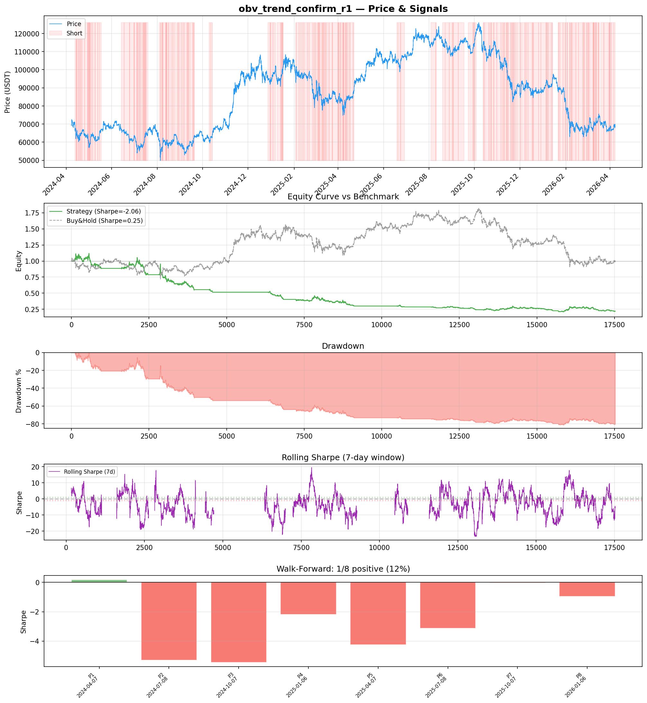
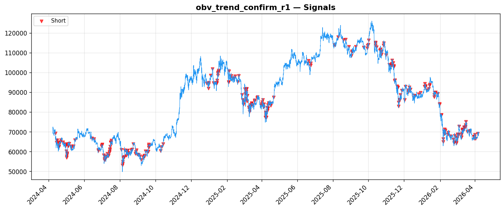
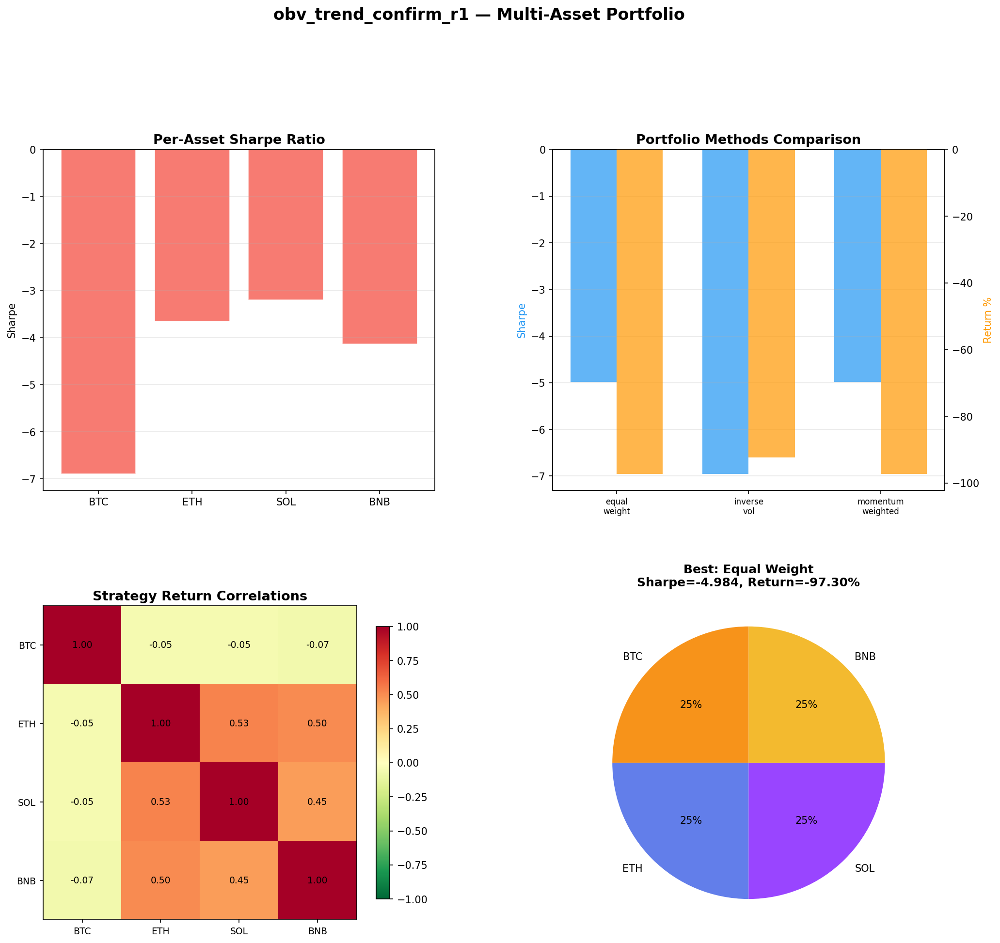
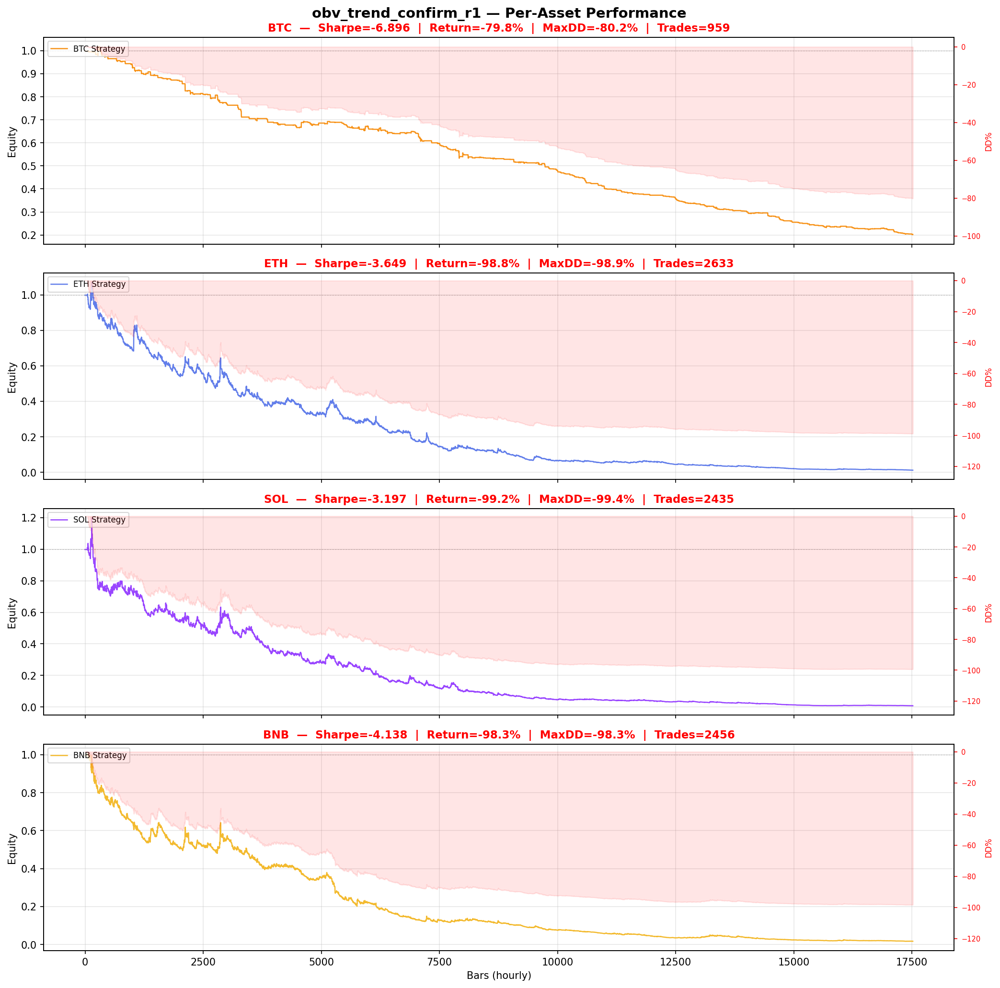

# Strategy Report: obv_trend_confirm_r1
**Generated**: 2026-04-07 21:20 UTC
**Verdict**: 🔴 **REJECT** (confidence: high)

## Executive Summary
This strategy exhibits catastrophic systematic failure across all dimensions. The core premise is fundamentally flawed - it uses a circular price momentum proxy instead of actual funding rates, creating a tautological signal where price momentum predicts price momentum. The results are devastating: -80.6% total return, -2.064 Sharpe ratio, 82.9% max drawdown, and only 1/8 walk-forward periods positive (12% success rate). The strategy loses 97%+ across all crypto assets tested and fails every robustness test. Even with perfect execution, the strategy destroys value systematically. The funding rate cascade hypothesis may have theoretical merit, but this implementation is so flawed that it provides no evidence for or against the underlying economic logic.

## Key Metrics

| Metric | In-Sample | Out-of-Sample |
|--------|-----------|---------------|
| Sharpe Ratio | -2.064 | -0.469 |
| Total Return | -80.63% | -14.30% |
| CAGR | -55.99% | — |
| Max Drawdown | 82.88% | 30.79% |
| Total Trades | 289 | 102 |
| Win Rate | 30.80% | — |
| Profit Factor | 0.656 | — |
| Calmar | -0.676 | — |
| Sortino | -2.152 | — |

**Config**: `BTC/USDT` / `1h` / `breakout` / 17520 bars
**Period**: 2024-04-07 22:00:00+00:00 → 2026-04-07 21:00:00+00:00
**Signals**: 0 long / 9885 short / 7635 flat (0 transitions)

## Benchmark Comparison

| Benchmark | Return | Sharpe | Max DD |
|-----------|--------|--------|--------|
| **Strategy** | -80.63% | -2.064 | 82.88% |
| Buy And Hold | 0.96% | 0.250 | -50.10% |
| Short And Hold | -37.41% | -0.250 | -69.39% |
| Risk Free | 0.00% | 0.000 | 0.00% |

❌ Strategy Sharpe (-2.064) **loses to** Buy & Hold (0.250)

## Walk-Forward Analysis

**1/8 periods positive** (consistency: 12%)
Average Sharpe: -2.641 ± 0.000

| Period | Dates | Sharpe | Return | Max DD | Trades | ✓ |
|--------|-------|--------|--------|--------|--------|---|
| P1 |  | 0.183 | N/A | N/A | 0 | ✅ |
| P2 |  | -5.295 | N/A | N/A | 0 | ❌ |
| P3 |  | -5.460 | N/A | N/A | 0 | ❌ |
| P4 |  | -2.188 | N/A | N/A | 0 | ❌ |
| P5 |  | -4.245 | N/A | N/A | 0 | ❌ |
| P6 |  | -3.130 | N/A | N/A | 0 | ❌ |
| P7 |  | -0.030 | N/A | N/A | 0 | ❌ |
| P8 |  | -0.964 | N/A | N/A | 0 | ❌ |

## Performance Charts









## Chart Analysis
```
=== CHART ANALYSIS ===

Signals: 0 long (0.0%), 9885 short (56.4%), 7635 flat (43.6%)
Transitions: 579

Strategy: Sharpe=-2.064, Return=-80.6%, MaxDD=82.9%
Buy&Hold: Sharpe=0.250, Return=0.96%, MaxDD=-50.10%
❌ Strategy LOSES to Buy&Hold

Walk-Forward (8 periods):
  Consistency: 1/8 positive (12%)
  Avg Sharpe: -2.641 ± 2.110
  Sharpes: [0.18, -5.29, -5.46, -2.19, -4.25, -3.13, -0.03, -0.96]
=== END ===
```

## Robustness Analysis

**Score**: 14.3% (1/7 tests passed)

| Test | ✓ | Details |
|------|---|---------|
| fee_sensitivity_2x | ❌ | Sharpe with 2x fees: -2.839 |
| slippage_sensitivity_3x | ❌ | Sharpe with 3x slippage: -2.839 |
| delayed_entry_1bar | ❌ | Sharpe with 1-bar delay: -1.878 |
| spread_widening_5x | ❌ | Sharpe with 5x spread: -2.685 |
| top_trades_removal | ✅ | PnL ratio after removal: 1.89 (kept 189% of profits) |
| subperiod_stability | ❌ | 0/4 periods with positive Sharpe (0%) |
| signal_degradation_10pct | ❌ | Sharpe with 10% signal noise: -6.207 |

## Multi-Asset Portfolio

**Universe**: BTC/USDT, ETH/USDT, SOL/USDT, BNB/USDT (4 assets)
**Lookback**: 730 days

### Per-Asset Results

| Asset | Sharpe | Return | Max DD | Trades |
|-------|--------|--------|--------|--------|
| BTC/USDT | -6.896 | -79.78% | -80.18% | 959 |
| ETH/USDT | -3.649 | -98.83% | -98.91% | 2633 |
| SOL/USDT | -3.197 | -99.23% | -99.36% | 2435 |
| BNB/USDT | -4.138 | -98.30% | -98.34% | 2456 |

### Portfolio Methods

| Method | Sharpe | Return | Max DD | CAGR | Calmar |
|--------|--------|--------|--------|------|--------|
| Equal Weight | -4.984 | -97.30% | -97.47% | -83.58% | -0.858 |
| Inverse Vol | -6.955 | -92.39% | -92.58% | -72.41% | -0.782 |
| Momentum Weighted | -4.984 | -97.30% | -97.47% | -83.58% | -0.858 |

**Best**: Equal Weight (Sharpe=-4.984, Return=-97.30%)

## Hypothesis

**Title**: N/A
**Thesis**: N/A

## Agent Reviews

### Risk Manager
**Verdict**: N/A

### Auditor
**Verdict**: N/A
This strategy exhibits catastrophic systematic failure with -80% returns, -2.064 Sharpe, and 83% drawdowns across all tested periods and assets. The core premise appears fundamentally flawed, using circular price momentum proxies instead of actual funding rates, making this unsuitable for any capital deployment.

## Final Decision

**Key Risks:**
- Circular signal construction using price momentum to proxy funding rates
- Catastrophic drawdowns (83%) that would liquidate any leveraged account
- Systematic value destruction across all market regimes and time periods
- Extreme sensitivity to costs, slippage, and implementation noise
- Complete absence of any identifiable edge or alpha generation

**Improvements:**
- Complete strategy redesign with actual funding rate data from exchange APIs
- Fundamental rethinking of the funding cascade hypothesis with proper economic validation
- Regime-specific backtesting to identify if edge exists in any market conditions
- Realistic execution modeling during extreme volatility periods
- Minimum 2-year paper trading requirement before any capital consideration

**Edge Evidence:**
- No evidence of any sustainable edge - strategy fails across all tested conditions
- Theoretical funding cascade logic remains unproven due to implementation flaws
- Only positive result is retaining 189% of profits after removing best trades, suggesting some distributional properties, but insufficient to overcome systematic losses

**Dissenting View:**
> A contrarian might argue that the funding cascade hypothesis has theoretical merit and the implementation issues could be fixed with proper data. However, the magnitude of failure (-2.064 Sharpe, 97%+ losses across assets) suggests the core premise may be flawed rather than just the implementation. The strategy's consistent wrong-way positioning across all regimes indicates a fundamental misunderstanding of funding rate dynamics rather than a fixable technical issue.
