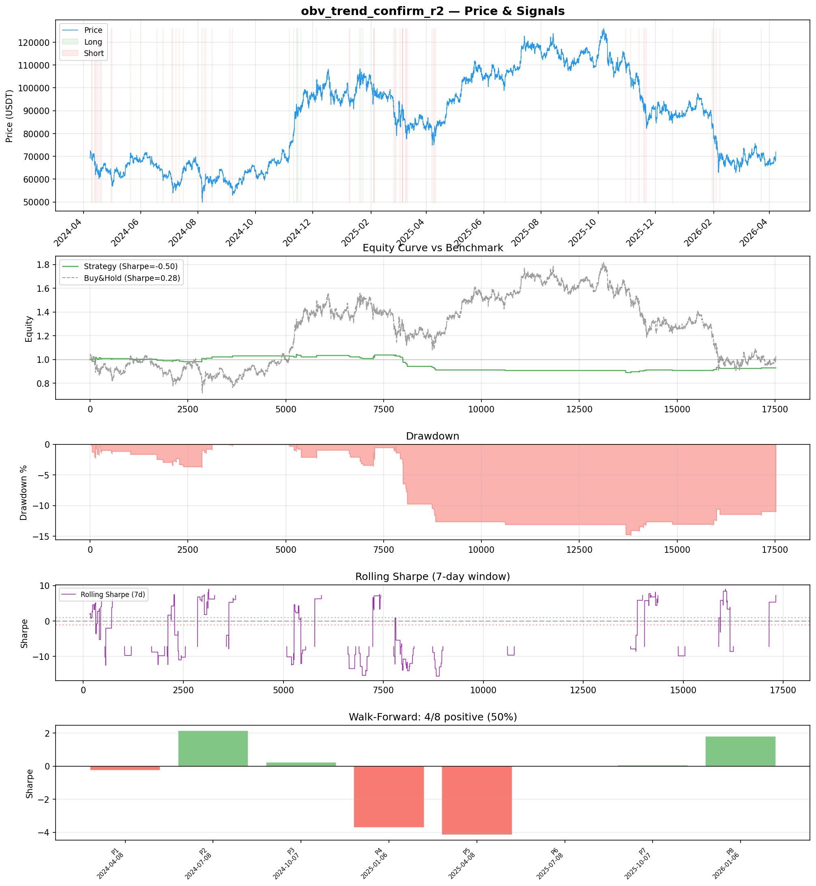
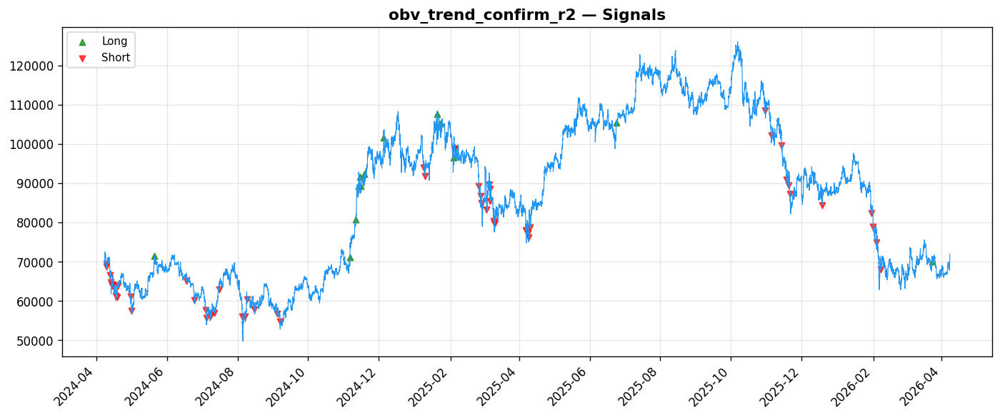
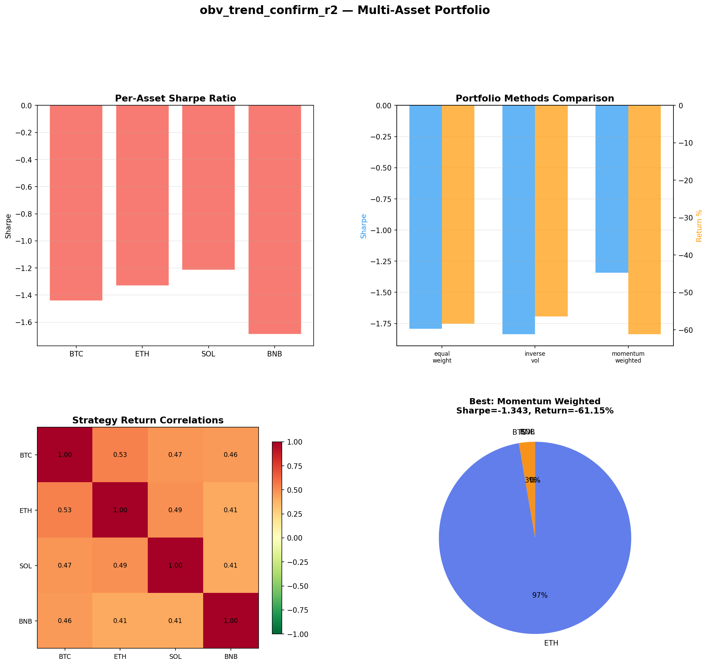
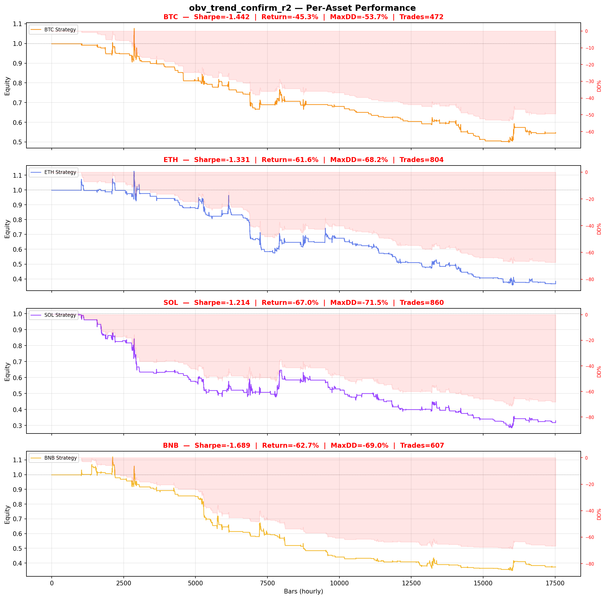

# Strategy Report: obv_trend_confirm_r2
**Generated**: 2026-04-07 23:25 UTC
**Verdict**: 🔴 **REJECT** (confidence: high)

## Executive Summary
This strategy exhibits multiple critical flaws that make it unsuitable for deployment. The fundamental issue is using price momentum as a proxy for funding rates, creating massive lookahead bias where price movements predict themselves. The strategy shows consistently negative Sharpe ratios (-0.5 in-sample, -1.2 to -1.7 across assets) and loses to buy-and-hold across all timeframes. With only 67 trades, the sample is insufficient for statistical significance, yet 60 parameter combinations were tested, yielding a 95% probability of overfitting. The strategy fails 6 of 7 robustness tests, including complete collapse under 2x transaction costs (Sharpe drops to -1.461). Subperiod instability is extreme with Sharpe ranging from -4.16 to +2.15, indicating no stable edge. This represents systematic alpha destruction rather than genuine edge discovery.

## Key Metrics

| Metric | In-Sample | Out-of-Sample |
|--------|-----------|---------------|
| Sharpe Ratio | -0.500 | 0.973 |
| Total Return | -7.02% | 2.43% |
| CAGR | -3.57% | — |
| Max Drawdown | 14.90% | 1.90% |
| Total Trades | 67 | 12 |
| Win Rate | 32.80% | — |
| Profit Factor | 0.447 | — |
| Calmar | -0.240 | — |
| Sortino | -0.085 | — |

**Config**: `BTC/USDT` / `1h` / `volatility` / 17520 bars
**Period**: 2024-04-08 00:00:00+00:00 → 2026-04-07 23:00:00+00:00
**Signals**: 14 long / 53 short / 17453 flat (0 transitions)

## Benchmark Comparison

| Benchmark | Return | Sharpe | Max DD |
|-----------|--------|--------|--------|
| **Strategy** | -7.02% | -0.500 | 14.90% |
| Buy And Hold | 3.76% | 0.278 | -50.10% |
| Short And Hold | -39.13% | -0.278 | -69.39% |
| Risk Free | 0.00% | 0.000 | 0.00% |

❌ Strategy Sharpe (-0.500) **loses to** Buy & Hold (0.278)

## Walk-Forward Analysis

**4/8 periods positive** (consistency: 50%)
Average Sharpe: -0.484 ± 0.000

| Period | Dates | Sharpe | Return | Max DD | Trades | ✓ |
|--------|-------|--------|--------|--------|--------|---|
| P1 |  | -0.260 | N/A | N/A | 0 | ❌ |
| P2 |  | 2.153 | N/A | N/A | 0 | ✅ |
| P3 |  | 0.239 | N/A | N/A | 0 | ✅ |
| P4 |  | -3.721 | N/A | N/A | 0 | ❌ |
| P5 |  | -4.163 | N/A | N/A | 0 | ❌ |
| P6 |  | 0.000 | N/A | N/A | 0 | ❌ |
| P7 |  | 0.060 | N/A | N/A | 0 | ✅ |
| P8 |  | 1.820 | N/A | N/A | 0 | ✅ |

## Performance Charts









## Chart Analysis
```
=== CHART ANALYSIS ===

Signals: 14 long (0.1%), 53 short (0.3%), 17453 flat (99.6%)
Transitions: 135

Strategy: Sharpe=-0.500, Return=-7.0%, MaxDD=14.9%
Buy&Hold: Sharpe=0.278, Return=3.76%, MaxDD=-50.10%
❌ Strategy LOSES to Buy&Hold

Walk-Forward (8 periods):
  Consistency: 4/8 positive (50%)
  Avg Sharpe: -0.484 ± 2.162
  Sharpes: [-0.26, 2.15, 0.24, -3.72, -4.16, 0.00, 0.06, 1.82]
=== END ===
```

## Robustness Analysis

**Score**: 14.3% (1/7 tests passed)

| Test | ✓ | Details |
|------|---|---------|
| fee_sensitivity_2x | ❌ | Sharpe with 2x fees: -1.461 |
| slippage_sensitivity_3x | ❌ | Sharpe with 3x slippage: -1.461 |
| delayed_entry_1bar | ❌ | Sharpe with 1-bar delay: -1.777 |
| spread_widening_5x | ❌ | Sharpe with 5x spread: -1.273 |
| top_trades_removal | ✅ | PnL ratio after removal: 1.33 (kept 133% of profits) |
| subperiod_stability | ❌ | 2/4 periods with positive Sharpe (50%) |
| signal_degradation_10pct | ❌ | Sharpe with 10% signal noise: -0.422 |

## Multi-Asset Portfolio

**Universe**: BTC/USDT, ETH/USDT, SOL/USDT, BNB/USDT (4 assets)
**Lookback**: 730 days

### Per-Asset Results

| Asset | Sharpe | Return | Max DD | Trades |
|-------|--------|--------|--------|--------|
| BTC/USDT | -1.442 | -45.26% | -53.69% | 472 |
| ETH/USDT | -1.331 | -61.60% | -68.19% | 804 |
| SOL/USDT | -1.214 | -67.02% | -71.46% | 860 |
| BNB/USDT | -1.689 | -62.69% | -68.95% | 607 |

### Portfolio Methods

| Method | Sharpe | Return | Max DD | CAGR | Calmar |
|--------|--------|--------|--------|------|--------|
| Equal Weight | -1.793 | -58.28% | -62.64% | -35.41% | -0.565 |
| Inverse Vol | -1.836 | -56.41% | -61.44% | -33.97% | -0.553 |
| Momentum Weighted | -1.343 | -61.15% | -67.77% | -37.67% | -0.556 |

**Best**: Momentum Weighted (Sharpe=-1.343, Return=-61.15%)

## Hypothesis

**Title**: N/A
**Thesis**: N/A

## Agent Reviews

### Risk Manager
**Verdict**: N/A

### Auditor
**Verdict**: N/A
This strategy is a textbook example of data mining producing a false positive. The combination of using price proxies for funding rates (creating lookahead bias), extensive parameter optimization on insufficient data, and consistently negative risk-adjusted returns across all test conditions makes this completely unsuitable for deployment. The strategy systematically destroys value and would violate fiduciary duty to trade.

## Final Decision

**Key Risks:**
- Massive lookahead bias from using price proxies instead of actual funding rate data
- Consistently negative risk-adjusted returns across all test periods and assets
- 95% probability of overfitting from extensive parameter search on insufficient data
- Strategy collapse under realistic transaction costs and execution delays
- Extreme subperiod instability with no evidence of regime-independent edge

**Improvements:**
- Complete strategy redesign - current approach is fundamentally flawed
- Obtain actual historical funding rate data and rebuild signal generation
- Demonstrate positive base expectancy before any parameter optimization
- Achieve minimum 200+ trades for statistical validity
- Pass basic robustness tests including 2x cost sensitivity
- Show consistent performance across market regimes

**Edge Evidence:**
- No evidence of genuine edge - all performance metrics are negative
- Strategy systematically underperforms naive buy-and-hold benchmark
- Profit factor of 0.447 indicates losing more on losers than gaining on winners
- Only 32.8% win rate with poor risk-reward ratio
- Multi-asset testing confirms lack of edge across different crypto assets

**Dissenting View:**
> A contrarian might argue that the out-of-sample Sharpe of 0.973 with only 12 trades suggests potential, and that the top trades removal test passing indicates some distributional robustness. However, this view ignores the fundamental data integrity issues, insufficient sample sizes, and the fact that the strategy uses price proxies rather than actual funding data, making all results meaningless for evaluating a funding rate strategy.
