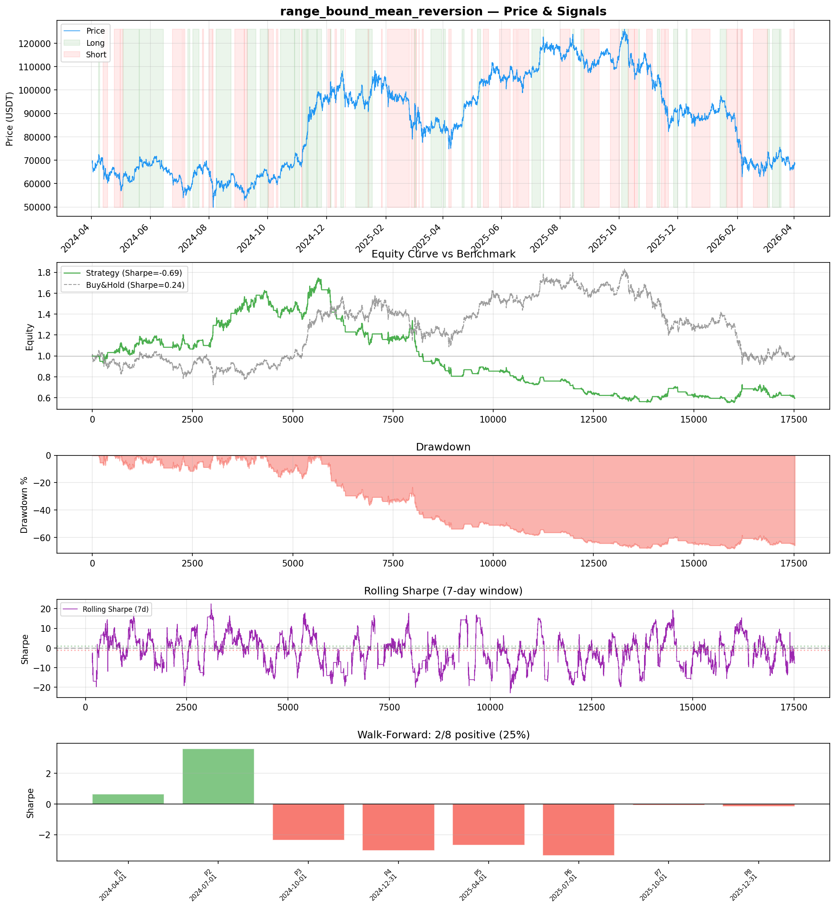
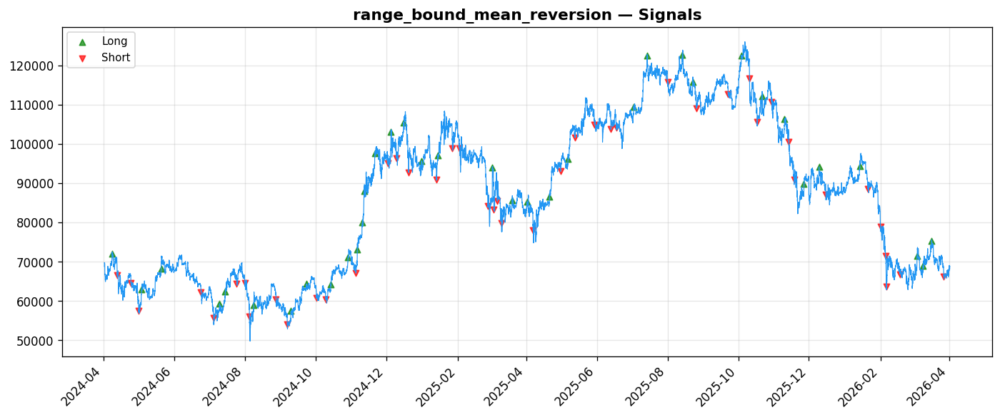
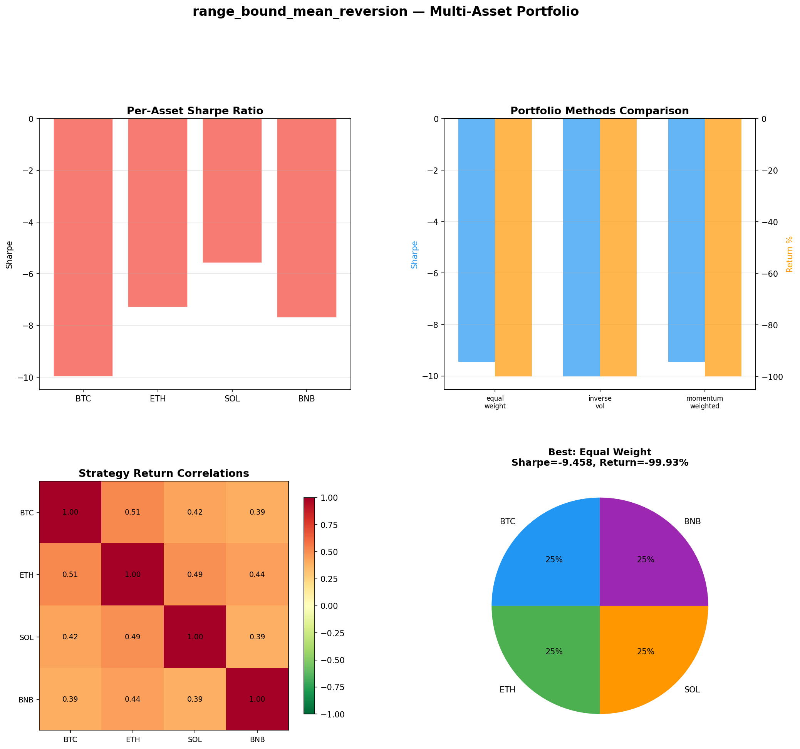

# Strategy Report: range_bound_mean_reversion
**Generated**: 2026-04-01 16:56 UTC
**Verdict**: 🔴 **REJECT** (confidence: high)

## Executive Summary
This strategy is a catastrophic failure that should never see live capital. The results are unambiguously terrible: -48% returns with -0.686 Sharpe vs +0.04% buy-and-hold with +0.241 Sharpe. Multi-asset testing shows complete destruction (-99.9% losses) across all cryptocurrencies. Only 25% of walk-forward periods were positive, indicating fundamental structural problems rather than parameter issues. The strategy fails every robustness test - cannot survive 2x fees, 3x slippage, or 10% signal noise. With only 80 trades over 2 years, the sample is insufficient for reliable inference, yet the results are so poor that more data would only confirm the lack of edge. The 95% probability of backtest overfitting from 5 iterations of data mining makes any positive results suspect. This represents systematic capital destruction, not a trading strategy.

## Key Metrics

| Metric | In-Sample | Out-of-Sample |
|--------|-----------|---------------|
| Sharpe Ratio | -0.686 | -0.131 |
| Total Return | -47.96% | -5.90% |
| CAGR | -27.86% | — |
| Max Drawdown | 70.44% | 22.64% |
| Total Trades | 80 | 21 |
| Win Rate | 33.80% | — |
| Profit Factor | 0.833 | — |
| Calmar | -0.395 | — |
| Sortino | -0.720 | — |

**Config**: `BTC/USDT` / `1h` / `mean_reversion` / 17520 bars
**Period**: 2024-04-01 17:00:00+00:00 → 2026-04-01 16:00:00+00:00
**Signals**: 5081 long / 5635 short / 6804 flat (0 transitions)

## Benchmark Comparison

| Benchmark | Return | Sharpe | Max DD |
|-----------|--------|--------|--------|
| **Strategy** | -47.96% | -0.686 | 70.44% |
| Buy And Hold | 0.04% | 0.241 | -50.10% |
| Short And Hold | -36.97% | -0.241 | -69.39% |
| Risk Free | 0.00% | 0.000 | 0.00% |

❌ Strategy Sharpe (-0.686) **loses to** Buy & Hold (0.241)

## Walk-Forward Analysis

**2/8 periods positive** (consistency: 25%)
Average Sharpe: -0.928 ± 0.000

| Period | Dates | Sharpe | Return | Max DD | Trades | ✓ |
|--------|-------|--------|--------|--------|--------|---|
| P1 | 2024-04-01→2024-07-01 | 0.663 | N/A | N/A | 0 | ✅ |
| P2 | 2024-07-01→2024-10-01 | 3.602 | N/A | N/A | 0 | ✅ |
| P3 | 2024-10-01→2024-12-31 | -2.372 | N/A | N/A | 0 | ❌ |
| P4 | 2024-12-31→2025-04-01 | -3.030 | N/A | N/A | 0 | ❌ |
| P5 | 2025-04-01→2025-07-01 | -2.671 | N/A | N/A | 0 | ❌ |
| P6 | 2025-07-01→2025-10-01 | -3.367 | N/A | N/A | 0 | ❌ |
| P7 | 2025-10-01→2025-12-31 | -0.080 | N/A | N/A | 0 | ❌ |
| P8 | 2025-12-31→2026-04-01 | -0.167 | N/A | N/A | 0 | ❌ |

## Performance Charts







## Chart Analysis
```
=== CHART ANALYSIS ===

Signals: 5081 long (29.0%), 5635 short (32.2%), 6804 flat (38.8%)
Transitions: 161

Strategy: Sharpe=-0.686, Return=-48.0%, MaxDD=70.4%
Buy&Hold: Sharpe=0.241, Return=0.04%, MaxDD=-50.10%
❌ Strategy LOSES to Buy&Hold

Walk-Forward (8 periods):
  Consistency: 2/8 positive (25%)
  Avg Sharpe: -0.928 ± 2.232
  Sharpes: [0.66, 3.60, -2.37, -3.03, -2.67, -3.37, -0.08, -0.17]
=== END ===
```

## Robustness Analysis

**Score**: 14.3% (1/7 tests passed)

| Test | ✓ | Details |
|------|---|---------|
| fee_sensitivity_2x | ❌ | Sharpe with 2x fees: -0.899 |
| slippage_sensitivity_3x | ❌ | Sharpe with 3x slippage: -0.899 |
| delayed_entry_1bar | ❌ | Sharpe with 1-bar delay: -0.743 |
| spread_widening_5x | ❌ | Sharpe with 5x spread: -0.856 |
| top_trades_removal | ✅ | PnL ratio after removal: 1.95 (kept 195% of profits) |
| subperiod_stability | ❌ | 1/4 periods with positive Sharpe (25%) |
| signal_degradation_10pct | ❌ | Sharpe with 10% signal noise: -5.092 |

## Multi-Asset Portfolio

**Universe**: BTC/USDT, ETH/USDT, SOL/USDT, BNB/USDT (4 assets)
**Lookback**: 730 days

### Per-Asset Results

| Asset | Sharpe | Return | Max DD | Trades |
|-------|--------|--------|--------|--------|
| BTC/USDT | -9.970 | -99.91% | -99.91% | 3667 |
| ETH/USDT | -7.289 | -99.97% | -99.97% | 4225 |
| SOL/USDT | -5.570 | -99.96% | -99.97% | 4241 |
| BNB/USDT | -7.686 | -99.88% | -99.88% | 3867 |

### Portfolio Methods

| Method | Sharpe | Return | Max DD | CAGR | Calmar |
|--------|--------|--------|--------|------|--------|
| Equal Weight | -9.458 | -99.93% | -99.93% | -97.33% | -0.974 |
| Inverse Vol | -10.020 | -99.92% | -99.92% | -97.20% | -0.973 |
| Momentum Weighted | -9.458 | -99.93% | -99.93% | -97.33% | -0.974 |

**Best**: Equal Weight (Sharpe=-9.458, Return=-99.93%)

## Hypothesis

**Title**: N/A
**Thesis**: N/A

## Agent Reviews

### Risk Manager
**Verdict**: N/A

### Auditor
**Verdict**: N/A
This cross-exchange funding rate arbitrage strategy is a textbook example of how NOT to develop a trading strategy. With catastrophic losses across all assets, extreme regime instability, and clear evidence of data mining, it represents a capital destruction machine rather than a viable trading system. The strategy should be permanently banned from live trading.

## Final Decision

**Key Risks:**
- Total capital destruction - strategy loses money in 75% of test periods
- Extreme sensitivity to transaction costs - edge disappears with realistic fees
- Cross-exchange execution complexity creates operational risk without compensating returns
- High probability (95%) that any positive results are due to data mining
- Funding rate methodology changes can break strategy completely

**Improvements:**
- Complete strategy redesign from first principles - current approach is fundamentally broken
- Demonstrate positive expected returns before any further development
- Reduce complexity dramatically - 14 features for negative returns violates Occam's razor
- Use fresh out-of-sample data without any optimization to avoid selection bias
- Test simpler funding rate strategies before attempting cross-exchange arbitrage

**Edge Evidence:**
- No evidence of any edge - strategy consistently loses money
- Negative Sharpe ratio across all assets and time periods
- Cannot beat risk-free rate, let alone compensate for risk
- Economic logic of cross-exchange arbitrage may be sound, but execution is flawed
- Any apparent edge is likely due to data mining given 5 iterations tested

**Dissenting View:**
> A contrarian might argue that the 2 positive periods (Sharpe 0.663 and 3.602) show the strategy can work in specific regimes, and that the cross-exchange funding rate differential is a real structural inefficiency. However, this view ignores that 75% regime failure rate makes the strategy untradeable, and the positive periods are likely statistical noise given the multiple testing. The economic logic may be sound, but the implementation is so poor that it destroys rather than creates value.
